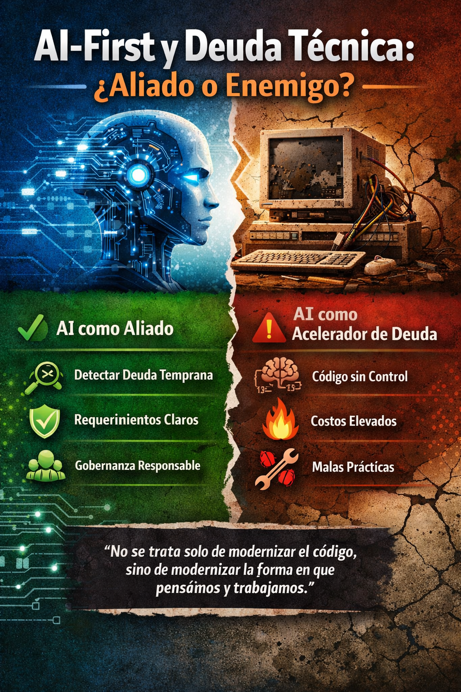
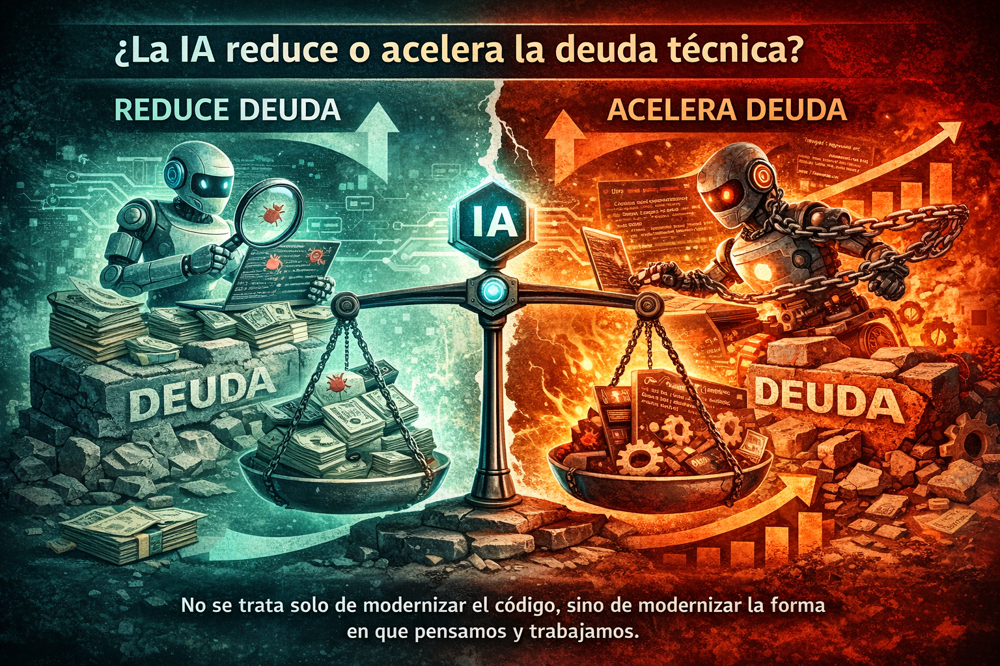
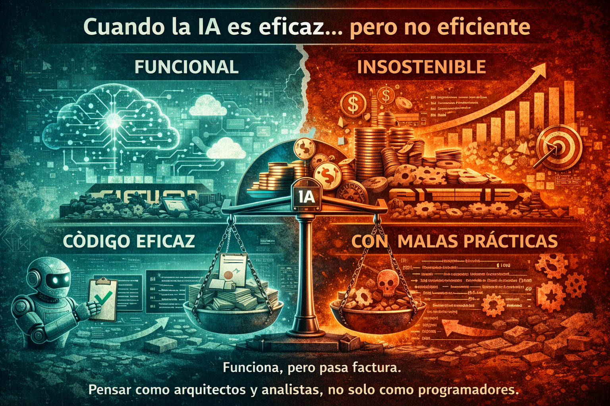
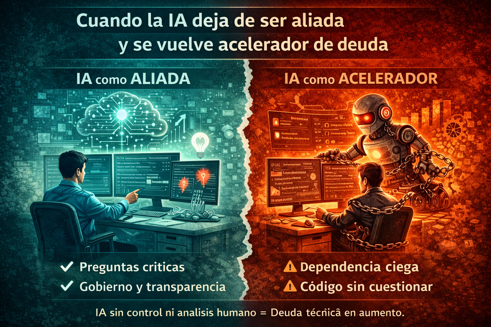

# AI-First and technical debt: ally or enemy?

> *AI does not eliminate technical debt.*
> *It only decides how quickly you make it visible… or how quickly you accumulate it.*

## Introduction – Beyond the enthusiasm for AI

When people talk about **AI-First** today, the focus is often placed on speed, productivity, and code generation. However, from a more technical and realistic perspective, the first thing that comes to my mind is not enthusiasm, but **caution**.

Artificial intelligence, as we use it today, is not infallible. There are well-known scenarios *such as hallucinations or solutions that are effective but not necessarily efficient* that, far from being minor details, can turn into **real technical debt**.

And here is a key point: AI no longer enters at the end of the process, it enters **from moment zero**. This means that these problems do not appear later, but can **be born at the design stage**, accelerating the accumulation of technical debt from very early phases of the software life cycle.

Paradoxically, that same early presence of AI can work in our favor. When it is used appropriately —improving the quality of requirements, refining user stories, and bringing greater clarity to analysis— AI can help us **identify and reduce technical debt even before the system goes into production**.

The real challenge is not in the technology itself, but in **how we work with it** and how we integrate it into our software development life cycle processes.

<figure>

<figcaption>Fig 1. AI-First as an ally and not an enemy when it comes to technical debt.</figcaption>
</figure>

## Does AI reduce or accelerate technical debt?

The short answer is: **it depends on how it is used**. That is, the presence of AI can be an ally or an enemy depending on how we use it. In some cases, AI can be a powerful ally in solving technical problems, while in others, it can be an accelerator of technical debt.

AI can be a powerful ally when it is used to analyze, question, and improve. But it can also become a debt accelerator when it is used solely to produce code faster, without solid technical judgment behind it. For example, if an AI is in charge of generating code but is not given solid technical judgment behind it, it can generate code that is hard to maintain and scale.

The problem is not that AI generates code, but that we often **normalize as correct anything that simply works**.

<figure>

<figcaption>Fig 2. AI-First can reduce or accelerate technical debt.</figcaption>
</figure>

## When AI is effective… but not efficient

One of the most complex things about working with artificial intelligence in software development is that many of its failures are not obvious at first glance. They are subtle details, but for someone with experience in enterprise systems and architecture, they are practically impossible to ignore.

One of the first signs usually appears in the **architecture**. Today AI is capable of proposing cloud designs that are technically correct, even aligned with modern best practices. The problem is that, in many cases, these proposals do not consider **costs, resource consumption, or licensing**.

The result can be a perfectly functional architecture, but one that is **financially unsustainable in production**. In cloud environments, especially with SaaS services, this type of decision translates into technical debt from the design stage, even if the system "*works*."

Another clear sign appears in the code. I have seen how AI can generate implementations that meet the objective but incorporate bad practices: hardcoded values, forbidden characters, incorrect patterns, or solutions that violate internal standards. Here, human review remains key.

Perhaps one of the most worrying scenarios is when some AI assistants **force the code to satisfy a test case or an acceptance criterion**, distorting the logic to always guarantee a successful result.

<figure>

<figcaption>Fig 3. AI-First can be effective but not always efficient.</figcaption>
</figure>

## When AI stops being an ally and becomes a debt accelerator

The line that separates artificial intelligence as an ally or as an enemy of technical debt does not run through the model or the tool. **It all comes down to governance and the responsible use of AI**.

When teams allow AI to operate without control, without clear rules, and without human supervision, it stops being a support and quickly becomes a **technical-debt accelerator**.

One of the most common risks is excessive dependence. Teams that stop questioning the results and simply accept what the AI proposes, implicitly transferring technical responsibility to the tool.

<figure>

<figcaption>Fig 3. AI-First can be effective but not always efficient.</figcaption>
</figure>

## Responsible AI-First: reduce debt, don't hide it

An *AI-First* approach that genuinely aims to reduce technical debt must be grounded in the principles of **Responsible AI**.

**Transparency** is key: developers must understand why the AI proposes certain code or a particular architecture.  
**Governance** defines clear limits, constant human reviews, and sustainability over time.

AI-First does not mean delegating technical thinking, but **elevating it**.

## Conclusion

Technical debt does not disappear with artificial intelligence; an inadequate implementation of AI can accelerate the generation of technical debt. An *AI-First* approach that genuinely aims to reduce technical debt must be grounded in the principles of **Responsible AI**. Transparency and governance are key for AI to propose appropriate solutions.

AI can help make it visible earlier… or it can accelerate its accumulation if it is not governed properly.

Because in the end:

> **It's not just about modernizing the code, but about modernizing the way we think and work.**
