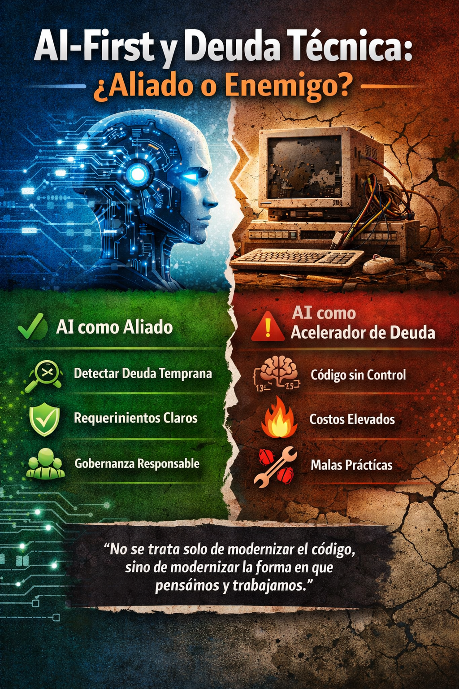
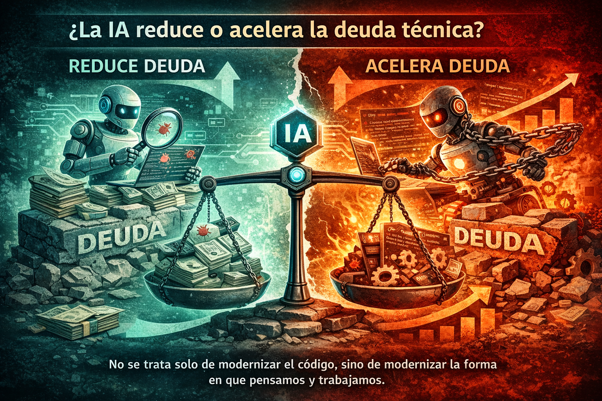
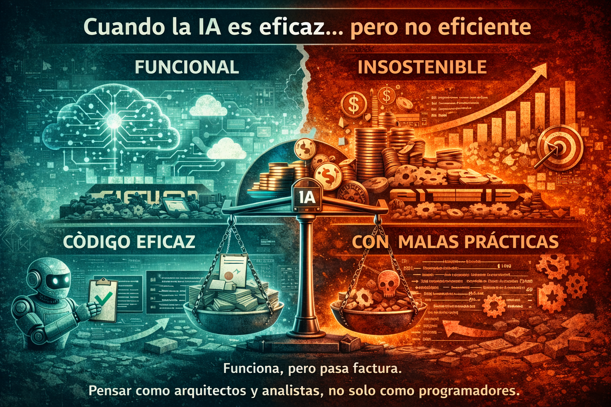
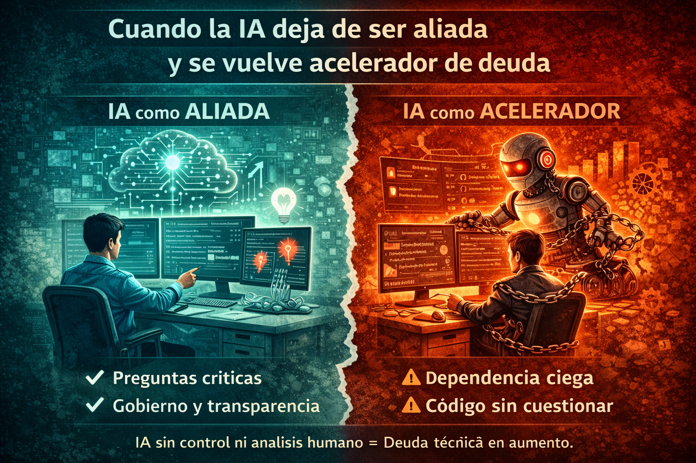

# AI-First y deuda técnica: ¿aliado o enemigo?

> *La IA no elimina la deuda técnica.*
> *Solo decide qué tan rápido la haces visible… o qué tan rápido la acumulas.*

## Introducción – Más allá del entusiasmo por la IA

Cuando hoy se habla de **AI-First**, muchas veces el foco se pone en velocidad, productividad y generación de código. Sin embargo, desde una perspectiva más técnica y realista, lo primero que viene a mi mente no es el entusiasmo, sino la **precaución**.

La inteligencia artificial, tal como la usamos hoy, no es infalible. Existen escenarios bien conocidos *como las alucinaciones o las soluciones que son eficaces pero no necesariamente eficientes* que, lejos de ser detalles menores, pueden convertirse en **deuda técnica real**.

Y aquí hay un punto clave: la IA ya no entra al final del proceso, entra **desde el momento cero**. Esto significa que estos problemas no aparecen después, sino que pueden **nacer desde el diseño**, acelerando la acumulación de deuda técnica desde etapas muy tempranas del ciclo de vida del software.

Paradójicamente, esa misma presencia temprana de la IA puede jugar a favor. Cuando se utiliza de forma adecuada —mejorando la calidad de los requerimientos, afinando las historias de usuario y aportando mayor claridad al análisis— la IA puede ayudarnos a **identificar y reducir deuda técnica incluso antes de que el sistema entre en producción**.

El verdadero desafío no está en la tecnología en sí, sino en **cómo trabajamos con ella** y cómo la integramos dentro de nuestros procesos del ciclo de vida del desarrollo de software.

<figure>

<figcaption>Fig 1. AI-First como un aliado y no como un enemigo en la deuda técnica.</figcaption>
</figure>

## ¿La IA reduce o acelera la deuda técnica?

La respuesta corta es: **depende del uso**. Es decir, la presencia de la IA puede ser un aliado o un enemigo en función del uso que le damos. En algunos casos, la IA puede ser un aliado poderoso en la resolución de problemas técnicos, mientras que en otros, puede ser un acelerador de deuda técnica.

La IA puede ser una aliada poderosa cuando se utiliza para analizar, cuestionar y mejorar. Pero también puede convertirse en un acelerador de deuda cuando se usa únicamente para producir código más rápido, sin un criterio técnico sólido detrás. Por ejemplo, si una IA se encarga de generar código, pero no se le da un criterio técnico sólido detrás, puede generar código que es difícil de mantener y escalar.

El problema no es que la IA genere código, sino que muchas veces **normalizamos como correcto aquello que simplemente funciona**.

<figure>

<figcaption>Fig 2. AI-First puede reducir o acelerar la deuda técnica.</figcaption>
</figure>

## Cuando la IA es eficaz… pero no eficiente

Una de las cosas más complejas al trabajar con inteligencia artificial en el desarrollo de software es que muchas de sus fallas no son evidentes a simple vista. Son detalles sutiles, pero para alguien con experiencia en sistemas enterprise y arquitectura, resultan prácticamente imposibles de ignorar.

Una de las primeras señales suele aparecer en la **arquitectura**. Hoy la IA es capaz de proponer diseños cloud técnicamente correctos, incluso alineados con buenas prácticas modernas. El problema es que, en muchos casos, estas propuestas no consideran **costos, consumo de recursos ni licenciamientos**.

El resultado puede ser una arquitectura perfectamente funcional, pero **financieramente insostenible en producción**. En entornos cloud, especialmente con servicios SaaS, este tipo de decisiones se traduce en deuda técnica desde el diseño, aunque el sistema “*funcione*”.

Otra señal clara aparece en el código. He visto cómo la IA puede generar implementaciones que cumplen con el objetivo, pero incorporan malas prácticas: valores quemados, caracteres prohibidos, patrones incorrectos o soluciones que violan estándares internos. Aquí, la revisión humana sigue siendo clave.

Quizá uno de los escenarios más preocupantes es cuando algunos asistentes de IA **fuerzan el código para cumplir un caso de prueba o un criterio de aceptación**, distorsionando la lógica para garantizar siempre un resultado exitoso.

<figure>

<figcaption>Fig 3. AI-First puede ser eficaz pero no siempre eficiente.</figcaption>
</figure>

## Cuando la IA deja de ser aliada y se vuelve acelerador de deuda

La línea que separa a la inteligencia artificial como aliada o como enemiga de la deuda técnica no pasa por el modelo ni por la herramienta. **Todo recae en la gobernanza y en el uso responsable de la IA**.

Cuando en los equipos de trabajo se permite que la IA opere sin control, sin reglas claras y sin acompañamiento humano, deja de ser un apoyo y se convierte rápidamente en un **acelerador de deuda técnica**.

Uno de los riesgos más comunes es la dependencia excesiva. Equipos que dejan de cuestionar los resultados y se limitan a aceptar lo que la IA propone, transfiriendo implícitamente la responsabilidad técnica a la herramienta.

<figure>

<figcaption>Fig 3. AI-First puede ser eficaz pero no siempre eficiente.</figcaption>
</figure>

## AI-First responsable: reducir deuda, no esconderla

Un enfoque *AI-First* que realmente busque reducir la deuda técnica debe estar sustentado en los principios de la **IA Responsable**.

La **transparencia** es clave: los desarrolladores deben entender por qué la IA propone cierto código o determinada arquitectura.  
La **gobernanza** define límites claros, revisiones humanas constantes y sostenibilidad en el tiempo.

AI-First no significa delegar el pensamiento técnico, sino **elevarlo**.

## Conclusión

La deuda técnica no desaparece con la inteligencia artificial, una inadecuada implementación de IA puede acelerar la generación de deuda técnica. Un enfoque *AI-First* que realmente busque reducir la deuda técnica debe estar sustentado en los principios de la **IA Responsable**. La transparencia y la gobernanza son claves para que la IA proponga soluciones adecuadas.

La IA puede ayudar a hacerla visible más temprano… o puede acelerar su acumulación si no se gobierna adecuadamente.

Porque al final:

> **No se trata solo de modernizar el código, sino de modernizar la forma en que pensamos y trabajamos.**
