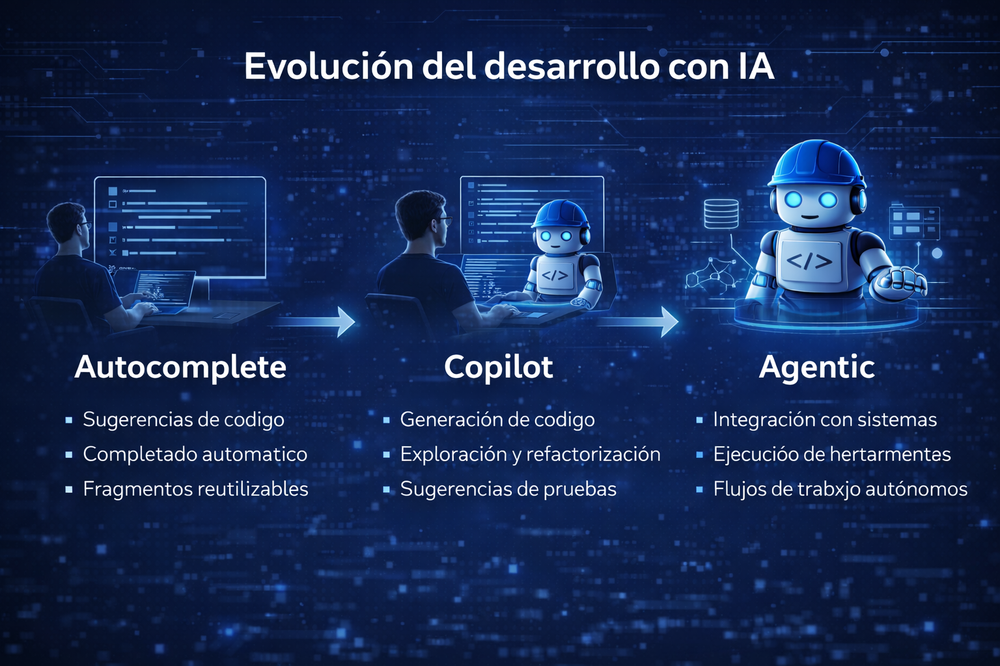
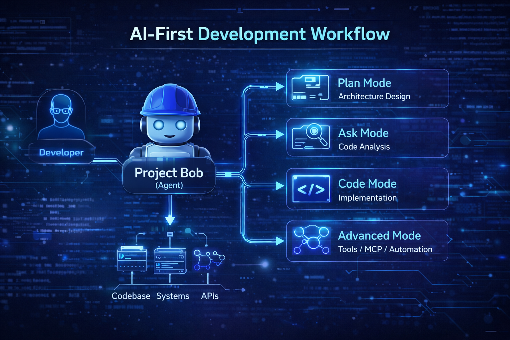

# AI-First Development: cómo convertir Project Bob en tu arquitecto de código
Durante años, los asistentes de programación han evolucionado desde simples herramientas de autocompletado hasta sofisticados copilotos capaces de generar código completo. Sin embargo, el verdadero desafío del desarrollo moderno nunca ha sido solo escribir código.

El verdadero desafío es **comprender sistemas complejos, diseñar arquitecturas sostenibles y mantener software que evoluciona durante años**.

Aquí es donde comienza a surgir un nuevo paradigma: **AI-First Development**.

En este nuevo enfoque, la inteligencia artificial no se limita a sugerir líneas de código. En cambio, se convierte en un **agente capaz de comprender el contexto del sistema, analizar arquitecturas y proponer mejoras estructurales**.

Una de las herramientas que está impulsando esta transición es **Project Bob**, un asistente de desarrollo diseñado para trabajar directamente dentro del entorno de desarrollo y colaborar con el programador en tareas que van mucho más allá de la generación de código.

## El cambio de paradigma: de asistentes a agentes
La mayoría de los asistentes de desarrollo actuales se basan en un modelo reactivo.

El flujo típico es simple:

Desarrollador → solicita código\IA → genera una respuesta

Este modelo es útil, pero limitado. La IA responde a instrucciones puntuales sin comprender completamente el sistema en el que está trabajando.

Project Bob introduce una aproximación diferente.

En lugar de comportarse únicamente como un generador de código, Bob actúa como un **agente de desarrollo que puede comprender el contexto del proyecto, analizar el código existente y colaborar activamente en el proceso de construcción del software**.

Esto cambia completamente la forma en que interactuamos con la IA dentro del desarrollo.

En lugar de pedir código aislado, podemos pedirle a la IA que **analice el sistema, identifique problemas y proponga soluciones arquitectónicas**.

<figure>

<figcaption>Fig 1. Evolución del desarrollo de software con AI.</figcaption>
</figure>

## Pensar en Bob como un arquitecto de software
Uno de los errores más comunes al utilizar asistentes de desarrollo es tratarlos como simples generadores de código.

Por ejemplo, muchos desarrolladores utilizan prompts como:

``` text
Genera una función que valide un correo electrónico
```

Este tipo de interacción es útil, pero no aprovecha realmente el potencial de un agente como Bob.

Una interacción más poderosa sería:

``` text
Analiza este módulo del sistema de autenticación identifica posibles problemas de diseño y propone mejoras en la arquitectura
```

En este escenario, Bob deja de ser un generador de código y pasa a comportarse como **un arquitecto técnico virtual**.

Puede:
- Analizar módulos existentes.
- Explicar decisiones de diseño.
- Identificar deuda técnica.
- Sugerir refactorizaciones.
- Proponer mejoras de arquitectura.

Este cambio en la forma de trabajar es uno de los pilares del desarrollo **AI-First**.


## Cómo Project Bob organiza su forma de razonar
Una de las características más interesantes de Bob es que no utiliza un único modo de operación.

En su lugar, utiliza **modos especializados**, cada uno optimizado para diferentes tipos de tareas dentro del ciclo de desarrollo.

Entre los principales modos se encuentran:
- **Plan mode**, orientado a la planificación y diseño de soluciones.
- **Code mode**, enfocado en la escritura y modificación de código.
- **Ask mode**, utilizado para análisis y comprensión del sistema.
- **Advanced mode**, que permite acceso a herramientas y capacidades extendidas.

Este enfoque permite que el agente adapte su forma de razonar según el tipo de tarea que se esté realizando.

Por ejemplo:
- Cuando se diseña una arquitectura → Plan mode.
- Cuando se implementa código → Code mode.
- Cuando se analiza el sistema → Ask mode.

Este modelo se asemeja mucho más a cómo trabajan los equipos de desarrollo humanos.

Primero **se diseña**, luego **se implementa**. Para estos lo mejor es utilizar **modos especializados**, cada uno optimizado para diferentes tipos de tareas dentro del ciclo de desarrollo. En resumen, Project Bob es un modelo de desarrollo de software que utiliza **modos especializados** para diferentes tareas dentro del ciclo de desarrollo.

<figure>

<figcaption>Fig 2. Diagrama AI-First Development Workflow.</figcaption>
</figure>

## El modelo mental correcto para trabajar con agentes de desarrollo
Para sacar el máximo provecho de herramientas como Project Bob es necesario cambiar ligeramente nuestra forma de trabajar. En lugar de pensar en la IA como una herramienta de generación de código, debemos empezar a verla como **un colaborador técnico dentro del proceso de desarrollo**.

Esto implica utilizar la IA para tareas como:
- Análisis de sistemas existentes.
- Diseño de nuevas funcionalidades.
- Revisión de código.
- Identificación de deuda técnica.
- Generación de documentación técnica.

En este modelo, el desarrollador deja de interactuar con la IA únicamente a nivel de código y comienza a interactuar con ella **a nivel de arquitectura y diseño**.

## AI-First Development
El concepto de **AI-First Development** no significa reemplazar desarrolladores con inteligencia artificial. Significa algo mucho más interesante. Significa diseñar procesos de desarrollo donde **la inteligencia artificial participa activamente en la comprensión, construcción y evolución del software**.

En este enfoque, el rol del desarrollador también evoluciona. Los desarrolladores pasan de ser únicamente **constructores de código** a convertirse en **arquitectos de sistemas que colaboran con agentes inteligentes**.

## Reflexión final
A medida que las herramientas de inteligencia artificial evolucionan, también debe evolucionar la forma en que las utilizamos.

Project Bob representa un paso importante en esta dirección, al permitir que los desarrolladores trabajen con agentes capaces de comprender sistemas complejos y colaborar en el diseño del software. Pero el verdadero cambio no está en la herramienta. Está en la mentalidad.

> **No se trata solo de modernizar el código, sino de modernizar la forma en que pensamos y trabajamos.**

## En el próximo artículo
En el siguiente artículo de esta serie exploraremos **técnicas prácticas para sacar el máximo provecho de Project Bob**, incluyendo:
- Cómo definir reglas de desarrollo para que Bob siga los estándares del equipo.
- Cómo crear modos personalizados para tareas específicas.
- Cómo mejorar la calidad de las interacciones con prompts más estructurados.

Todo esto nos permitirá transformar a Project Bob en algo mucho más poderoso que un asistente de código.

En otras palabras: **un verdadero arquitecto de desarrollo impulsado por IA.**