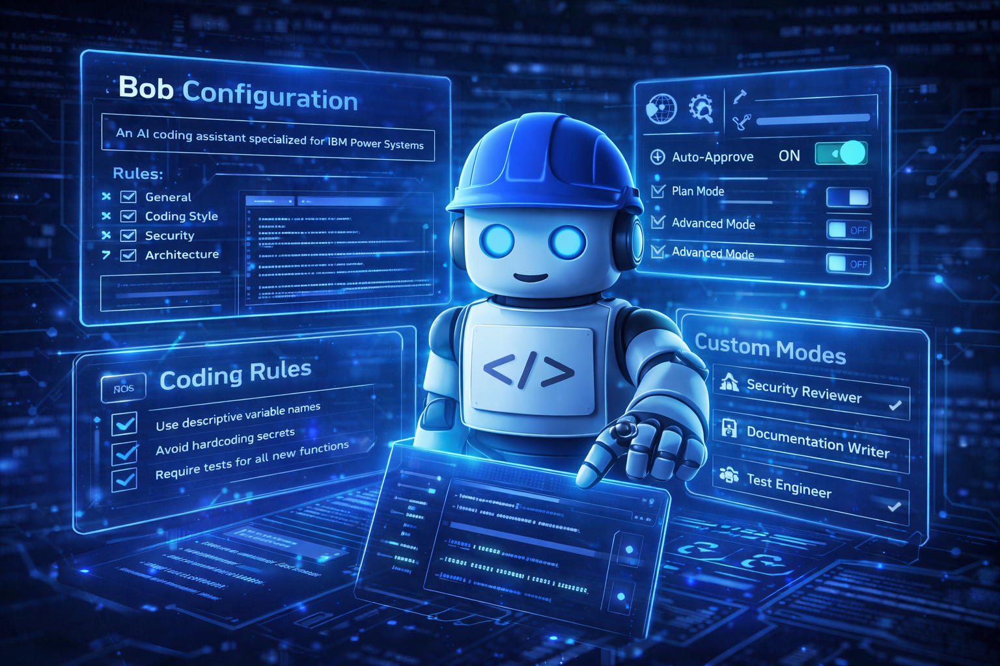
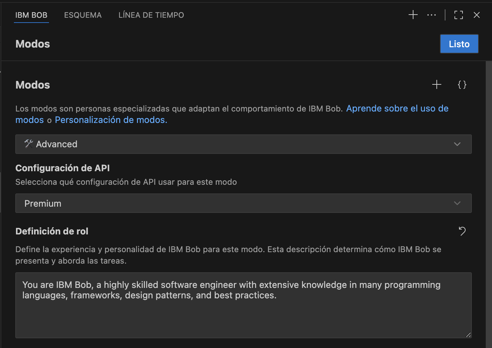
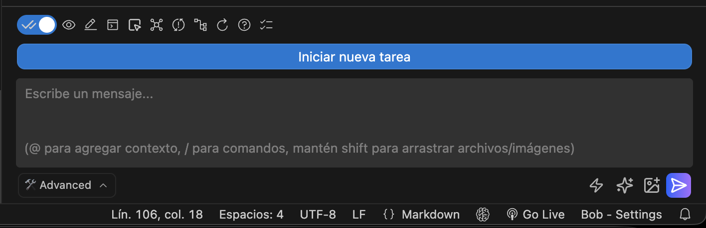

# Técnicas avanzadas para trabajar con Project Bob
En el artículo anterior hablé sobre una idea central: **Project Bob no debe verse únicamente como un generador de código, sino como un agente capaz de colaborar en el diseño, análisis e implementación de software**. Ese cambio de perspectiva es fundamental. Entender a Bob como un agente de desarrollo abre la puerta a nuevas formas de trabajo donde la inteligencia artificial deja de ser solo una herramienta de productividad y comienza a convertirse en un **colaborador técnico dentro del proceso de desarrollo**.

En este segundo artículo de la serie exploraremos **técnicas avanzadas que permiten sacar verdadero provecho de Project Bob**.

<figure>

<figcaption>Fig 1. Ecosistema de Herramientas de Bob.</figcaption>
</figure>

## 1. El error más común: usar Bob como una simple caja de prompts
Uno de los errores más frecuentes cuando se empieza a trabajar con herramientas de IA es tratarlas como una simple caja de texto donde se escriben instrucciones aisladas. Este enfoque funciona, pero solo aprovecha una pequeña parte del potencial de herramientas y usos que tenemos a disposición con Project Bob.

Bob puede:
- Leer archivos.
- Modificar código.
- Ejecutar comandos.
- Interactuar con herramientas externas.
- Analizar el contexto completo del proyecto.

Cuando entendemos esto, la interacción con la herramienta cambia completamente.
En lugar de pedir código aislado, comenzamos a pedirle al agente que:
- Analice sistemas existentes.
- Evalúe decisiones de diseño.
- Identifique deuda técnica.
- Proponga refactorizaciones.
- Sugiera mejoras arquitectónicas.


## 2. Bob Rules: enseñar a Bob cómo trabaja tu equipo
Una de las capacidades más poderosas de Project Bob es la posibilidad de definir **reglas de ingeniería**. Estas reglas permiten establecer estándares que el agente debe seguir cuando trabaja en un proyecto. En lugar de depender de prompts repetidos, puedes definir lineamientos como:
- Convenciones de nombres.
- Estándares de arquitectura.
- Políticas de seguridad.
- Requisitos de pruebas.
- Reglas de documentación.

Ejemplo de estructura de reglas:
``` text
.bob/rules/
  01-general.md
  02-coding-style.md
  03-security.md
  04-testing.md
  05-architecture.md
```

Estas reglas transforman a Bob de una herramienta genérica a un agente alineado con la disciplina de ingeniería del equipo.


## 3. Instrucciones globales vs instrucciones por proyecto
Project Bob permite manejar dos tipos de instrucciones:

### Instrucciones globales
Se aplican a todos los proyectos. Ejemplos:
- Preferencia por código limpio.
- Énfasis en seguridad.
- Estilo de documentación.
- Convenciones personales.

### Instrucciones por proyecto
Se aplican únicamente al workspace actual. Ejemplos:
- Stack tecnológico específico.
- Librerías permitidas.
- Arquitectura obligatoria.
- Reglas de naming del repositorio.

Separar estos niveles permite mantener una base consistente mientras se respetan las particularidades de cada proyecto.


## 4. Custom Modes: crear agentes especializados
Bob permite crear **modos personalizados**, lo que en la práctica significa crear agentes especializados para tareas específicas. Ejemplos:
-   Security Reviewer.
-   DevOps Engineer.
-   Documentation Writer.
-   Performance Analyst.

Ejemplo conceptual de un modo personalizado:

``` yaml
customModes:
  - slug: security-review
    name: Security Reviewer
    roleDefinition: You are a security specialist reviewing code for vulnerabilities
```

Esto permite que el agente adopte diferentes roles según el tipo de tarea que se esté realizando.

<figure>

<figcaption>Fig 2. Custom Modes Bob.</figcaption>
</figure>

## 5. Enhance Prompt: mejorar la calidad de las solicitudes
Muchos problemas al trabajar con IA no provienen de la capacidad del modelo, sino de la calidad del prompt. Project Bob incluye una función llamada **Enhance Prompt**, que permite transformar una instrucción simple en una solicitud más estructurada. Por ejemplo:

Prompt simple:
``` text
Analiza este programa RPG
```

Prompt enriquecido:
- Estructura del programa.
- Uso de archivos.
- Lógica de negocio.
- SQL embebido.
- Manejo de errores.
- Cumplimiento de estándares.

Este tipo de expansión mejora significativamente la calidad del análisis.


## 6. Context Mentions y Tagging
Otra técnica fundamental es el uso de **context mentions**, que permiten agregar contexto real del proyecto a la conversación. Esto se logra utilizando el símbolo `@`. Ejemplos:
``` text
@/src/auth/login.ts
@problems
@terminal
```

Esto permite que Bob trabaje con:
- Archivos específicos.
- Errores del proyecto.
- Salida del terminal.
- Commits recientes.

El resultado es un análisis mucho más preciso.

<figure>

<figcaption>Fig 3. Context, Metions & Tagging.</figcaption>
</figure>

## 7. Checkpoints: experimentar sin riesgo
Los **checkpoints** permiten guardar el estado del workspace antes de realizar cambios importantes. Esto habilita un flujo de trabajo exploratorio:
1. Crear checkpoint.
2. Experimentar con cambios.
3. Evaluar resultado.
4. Restaurar si es necesario.

Esta funcionalidad es especialmente útil cuando se realizan:
- Refactorizaciones grandes.
- Reorganización de módulos.
- Experimentos arquitectónicos.


## 8. Auto-Approve: productividad con responsabilidad
La función **Auto-Approve** permite que Bob realice acciones sin pedir confirmación cada vez. Esto puede acelerar significativamente el flujo de trabajo. Sin embargo, debe utilizarse con cuidado. Recomendación práctica:
-   bajo riesgo → auto approve
-   riesgo medio → revisión humana
-   alto riesgo → confirmación obligatoria


## 9. Literate Coding: escribir intención dentro del código
Literate Coding permite escribir instrucciones en lenguaje natural directamente dentro del archivo fuente. Ejemplo:
```Java
    // crear función que calcule el total de la orden
    // aplicar descuentos por volumen
```
Bob analiza el contexto del archivo y genera la implementación correspondiente. Esto reduce fricción entre la intención y el código.


## 10. Security Scans
Project Bob también incluye funciones de seguridad integradas:
- Vulnerability Scan.
- Secrets Scan.

Estas herramientas permiten detectar:
- Credenciales expuestas.
- API keys.
- Tokens.
- Vulnerabilidades comunes.

Esto introduce un enfoque de **shift-left security** dentro del desarrollo.


## 11. MCP: el punto donde Bob se convierte en plataforma
El Model Context Protocol (MCP) permite conectar Bob con herramientas externas. Esto habilita integraciones con:
- APIs.
- Bases de datos.
- Herramientas internas.
- Sistemas legacy.

Por ejemplo, un programa RPG existente podría exponerse como una herramienta MCP y ser consumido por el agente. Esto abre la puerta a arquitecturas **agentic** donde la IA interactúa directamente con sistemas empresariales.


## Reflexión final
Cuando se observan todas estas capacidades juntas --- reglas, modos personalizados, prompts enriquecidos, checkpoints, literate coding, seguridad integrada y MCP --- queda claro que Project Bob no es simplemente un asistente de código.

Es una **plataforma de colaboración técnica impulsada por inteligencia artificial**. La diferencia no está solo en generar código más rápido. La diferencia está en **cómo empezamos a integrar agentes inteligentes dentro del proceso real de desarrollo de software**.


## Próximo artículo
En el tercer artículo de esta serie exploraremos: **Project Bob, MCP y el futuro del desarrollo Agentic**. Veremos cómo los agentes pueden interactuar con herramientas, sistemas empresariales y plataformas completas para transformar la forma en que construimos software.