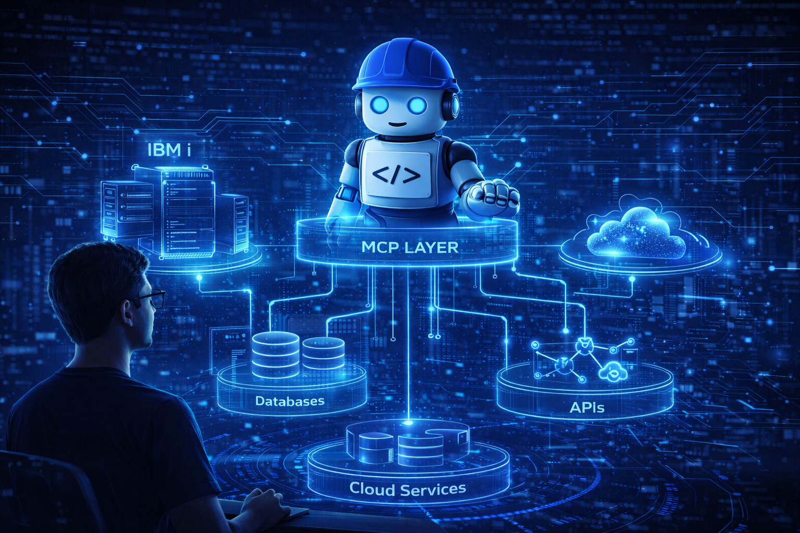

# Project Bob, MCP y el futuro del desarrollo Agentic

Durante los últimos años, los asistentes de desarrollo han evolucionado desde simples herramientas de autocompletado hasta sistemas capaces de generar código completo a partir de instrucciones en lenguaje natural.

Sin embargo, el verdadero cambio no está únicamente en generar código más rápido.

El cambio más profundo ocurre cuando la inteligencia artificial deja de limitarse al código y comienza a **interactuar con herramientas, datos y sistemas reales dentro del entorno empresarial**.

Ahí es donde entran conceptos como **Model Context Protocol (MCP)** y el desarrollo **agentic**.

<figure>

<figcaption>Fig 1. Bob y su Model Context Protocol (MCP).</figcaption>
</figure>

## De copilots a agentes

La evolución de la IA en desarrollo ha pasado por varias etapas:

### 1. Autocompletado
Herramientas que sugerían fragmentos de código y completaban líneas.

### 2. Copilots
Herramientas capaces de generar funciones completas, explicar código y proponer refactorizaciones.

### 3. Agentes de desarrollo
Sistemas que pueden:
- analizar repositorios completos
- ejecutar herramientas
- interactuar con APIs
- consultar bases de datos
- automatizar flujos de trabajo

Aquí es donde aparece **Project Bob**.

<figure>

<figcaption>Fig 1. Evolución del desarrollo con IA.</figcaption>
</figure>

## El problema del contexto

Los modelos de lenguaje pueden generar código excelente, pero sin acceso al entorno real del proyecto su capacidad sigue siendo limitada. Por ejemplo, normalmente no pueden:
- Consultar datos reales.
- Interactuar con sistemas internos.
- Descubrir funcionalidades existentes.
- Ejecutar herramientas del ecosistema empresarial.

Aquí aparece **Model Context Protocol**.

## ¿Qué es MCP?

El **Model Context Protocol (MCP)** es un estándar que permite que los agentes de IA interactúen con herramientas externas. Esto permite acceder a capacidades como:
- APIs empresariales.
- Bases de datos.
- Herramientas internas.
- Servicios cloud.
- Sistemas legacy.

MCP convierte a los modelos de lenguaje en **consumidores de herramientas dentro de un ecosistema digital**, lo que les permite integrarse en un ecosistema digital y acceder a una amplia variedad de capacidades.


## Arquitectura MCP

Una arquitectura típica incluye tres componentes principales:

### El agente
En este caso **Project Bob**.

### El servidor MCP
Expone herramientas que el agente puede utilizar.

### Las herramientas
Representan capacidades concretas.

Ejemplo:
```
GET_CUSTOMER_PRICING  
GET_ORDER_HISTORY  
CALCULATE_DISCOUNT
```

Las herramientas suelen devolver información estructurada en JSON.


## MCP y sistemas legacy
Uno de los aspectos más interesantes de MCP es la integración con sistemas existentes. Muchas organizaciones poseen lógica crítica en:
- RPG.
- COBOL.
- Java legacy.
- PL/SQL.
- C#.
- IBM i.

Reescribir estos sistemas es costoso. Con MCP podemos **exponer esa lógica como herramientas consumibles por agentes**.

Por ejemplo:
```
GET_CUSTOMER_PRICING
```

Esto permite reutilizar lógica empresarial existente dentro de arquitecturas AI‑First.


## Arquitectura agentic
Cuando combinamos agentes con herramientas aparece una arquitectura agentic. Conceptualmente:

```
Developer
   │
   ▼
AI Agent (Project Bob)
   │
   ▼
MCP Layer
   │
   ├ API Tools
   ├ Database Tools
   ├ Legacy Tools
   ├ Cloud Services
   │
   ▼
Enterprise Systems
```

Estos sistemas pueden incluir:
- IBM i
- bases de datos
- APIs
- cloud services
- plataformas internas


## Qué cambia para los desarrolladores
El rol del desarrollador evoluciona.
Antes:
- Escribir código.
- Crear servicios.
- Integrar APIs.

Ahora:
- Diseñar herramientas.
- Definir capacidades reutilizables.
- Gobernar interacciones entre agentes.
- Construir ecosistemas de automatización inteligente.


## AI‑First Development en acción
Project Bob permite:
- Analizar sistemas.
- Generar código.
- Aplicar reglas de ingeniería.
- Colaborar en diseño técnico.

MCP permite:
- Conectar IA con herramientas reales.
- Integrar sistemas empresariales.
- Crear arquitecturas agentic.

La combinación de ambos habilita **AI‑First Development en entornos empresariales reales**.


## Reflexión final

El futuro del desarrollo probablemente no estará definido solo por lenguajes o frameworks. Estará definido por **cómo interactúan desarrolladores, agentes y herramientas dentro de un mismo ecosistema**. Project Bob representa una señal clara de esa dirección. No porque escriba código automáticamente. Sino porque nos obliga a empezar a pensar el desarrollo de software de una forma diferente.

> **No se trata solo de modernizar el código. Se trata de modernizar la forma en que pensamos y trabajamos.**