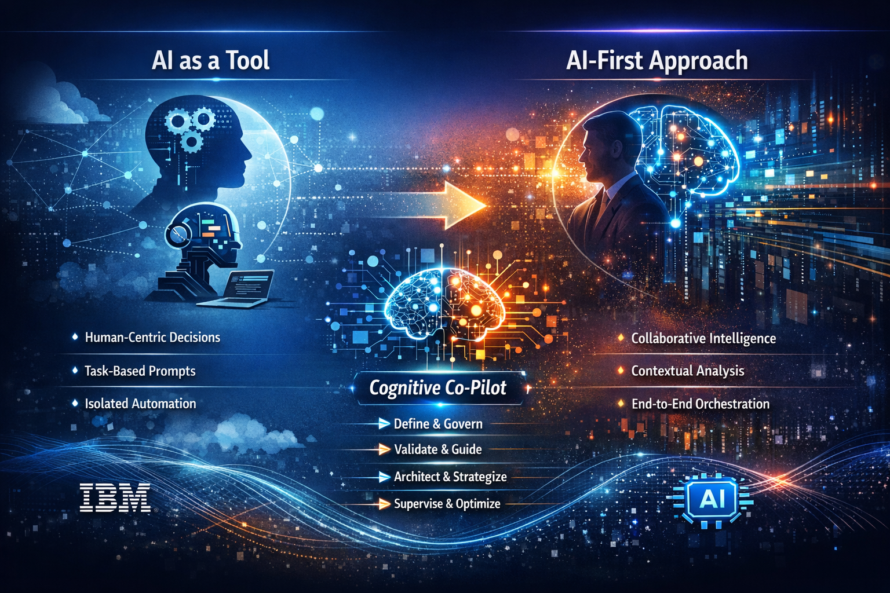
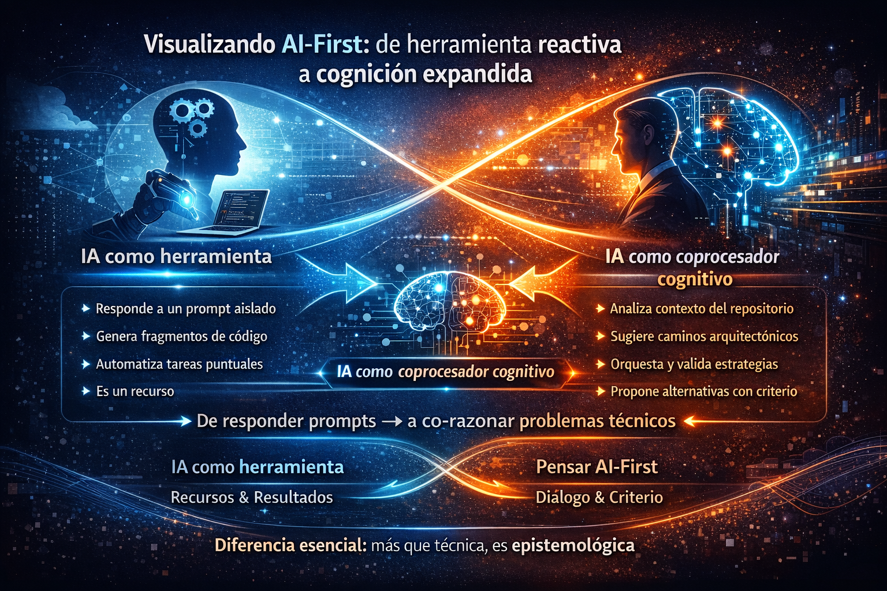
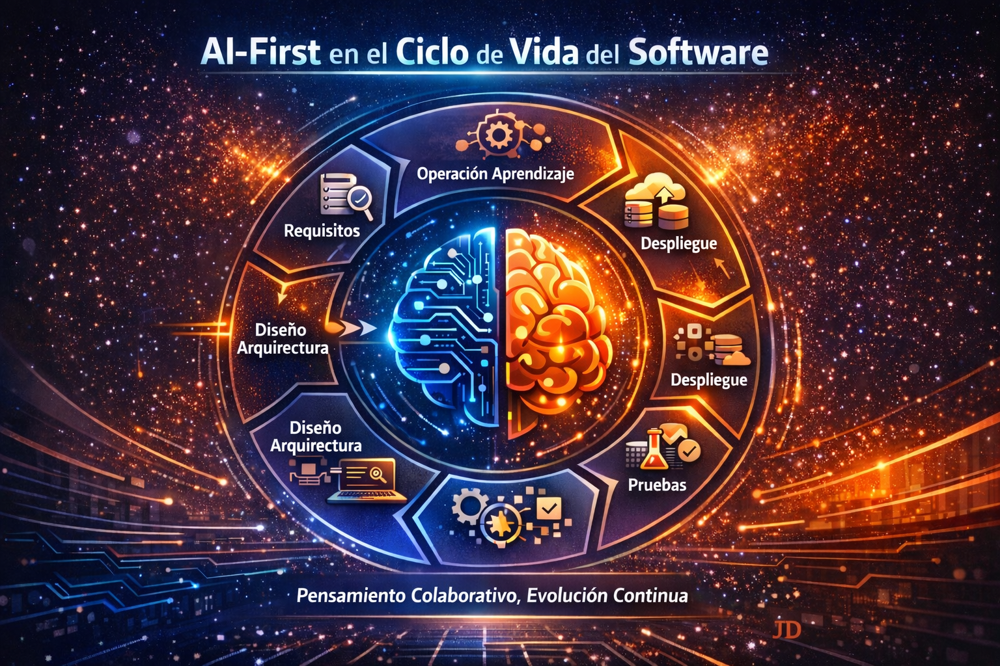
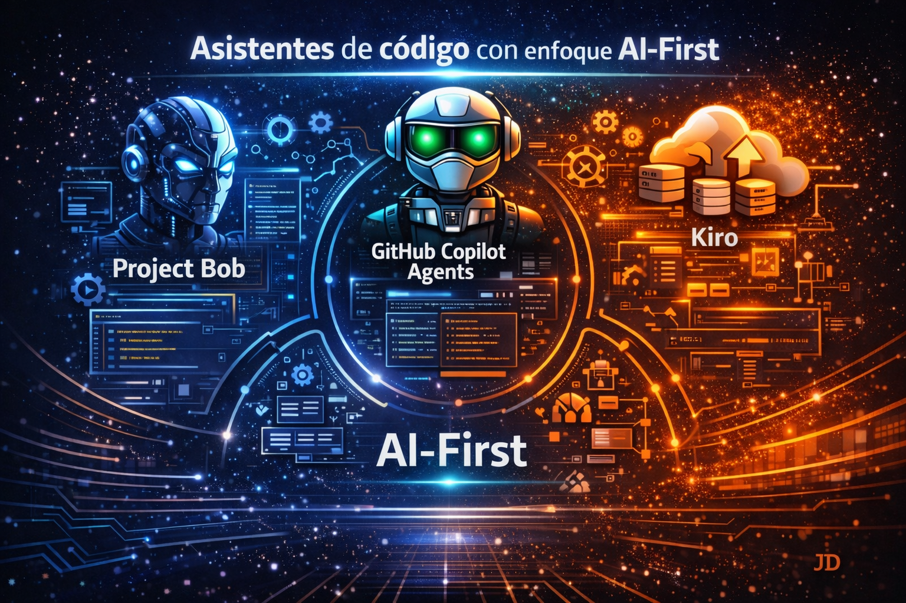
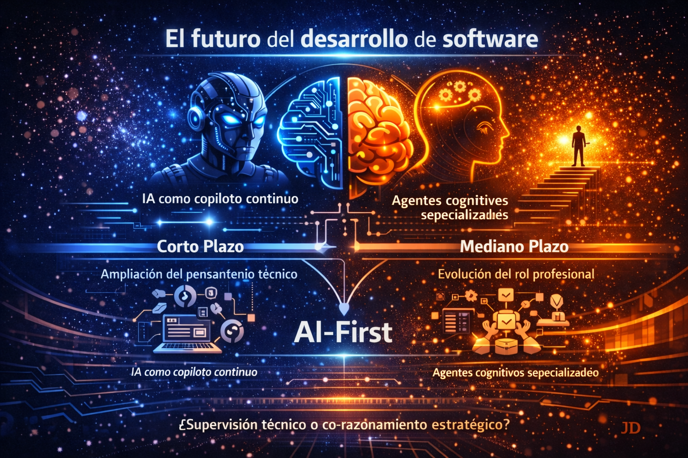

# AI-First: the future of software development has already begun

## Introduction

For a long time, the evolution of software development has been marked by changes in approach rather than changes in tools. **API-First, Cloud-First, DevOps-First…** all of these paradigms redefined priorities, but kept one constant: **the human being remained the only real cognitive entity in the process**. Tools assisted, automated, or accelerated, but they did not reason or actively participate in decision-making. That assumption is no longer valid.

Today, talking about **AI-First** means accepting that artificial intelligence is no longer a peripheral component, nor a "productivity plugin," but rather **a technical actor with the capacity for analysis, proposal, and execution, integrated directly into the software engineering flow**. It is not about writing code faster; it is about how technical thinking is built when a second intelligence participates in the process.

From my experience working with advanced assistants —especially in enterprise environments, systems modernization, and complex architectures— I have reached a clear conclusion:
**AI-First is not a technological decision, it is an epistemological one**. It changes the way we understand technical knowledge, the developer's responsibility, and the role of human experience.

When AI is capable of:
	•	Analyzing complete repositories,
	•	Proposing architectures,
	•	Refactoring legacy systems,
	•	Generating tests, documentation, and workflows,
	•	And learning from the organizational context,

**The real challenge stops being what AI can do and becomes how we govern its participation within the engineering process.**

This blog does not intend to idealize artificial intelligence nor present it as an automatic solution. On the contrary, it seeks to place **the AI-First approach in its proper technical dimension**, analyzing how it is **transforming software development, which assistants truly embody this paradigm, and why the developer's role —far from disappearing— becomes more strategic, more architectural, and more responsible than ever**.

## 🧠 What does AI-First really mean?

When I talk about AI-First, I am not talking about integrating artificial intelligence as an additional layer to the development process, nor about adding an assistant that "helps write code." From my experience, **AI-First is a shift in the way we structure technical thinking**.

Traditionally, software development has been a linear and human-centric process: the developer analyzes, decides, designs, and executes; the tools merely accompany. Even with advanced automation, the reasoning always resided in a single mind. That model no longer describes today's reality.

In an AI-First approach, **artificial intelligence actively participates in the cognitive process**, not as a substitute for the engineer, but as a second reasoning system, capable of analyzing context, proposing alternatives, and executing tasks under supervision.

This implies consciously assuming that:
- AI is not invoked only when "needed," but is present from the conception of the problem.
- Development ceases to be an individual activity and becomes a human-AI collaboration.
- The developer's value shifts from writing code to defining criteria, validating decisions, and governing the use of AI.

AI-First is not about using AI to program, but about **programming knowing that an artificial intelligence is part of the engineering process**.

The difference is subtle, but profound. While the traditional use of AI responds to:

> **"How do I write this code?"**

AI-First forces us to rethink structural questions:
- What decisions can AI propose?
- Which must remain exclusively human?
- How is a solution partially generated by AI validated?
- Where does technical responsibility begin and end?

In that sense, AI-First is not a productivity practice, **it is an engineering discipline**.

<figure>

<figcaption>Fig 1. AI-First infographic.</figcaption>
</figure>

## 🧩 Visualizing AI-First: from reactive tool to expanded cognition

When we try to draw AI-First, the challenge is not to show arrows or boxes, but to convey a **cognitive idea**: the transition from a model where AI responds to our requests, to one where AI actively influences how we think about technical problems.

In traditional approaches, **AI operates as a reactive instrument**: it executes tasks on demand, with isolated prompts and without global understanding. But in an AI-First approach, AI ceases to be an accessory and becomes a cognitive extension of the engineer.

This section proposes a mental visualization that not only compares models, but helps to feel the transformation.

### 🧠 1. From AI as a productivity spring…

Imagine AI as a tool in your toolbox:
- It is available when you need it
- It responds to what you ask it
- It speeds up isolated tasks
- It depends on your local context

In this model:
- You think first, AI responds afterward
- The technical process remains —almost— the same

#### 📌 Visual:
A tool in your hand, waiting for a prompt to act.

### 🧠 2. …Toward AI as a structural cognitive layer
Now imagine AI as a second technical mind that:
- Understands the complete project
- Analyzes patterns, dependencies, and trade-offs
- Contextualizes decisions with technical memory of the system
- Proposes alternatives, not just answers

In this new model:
- Thinking is no longer isolated
- A continuous dialogue is generated between engineer and AI
- The solution emerges from a cognitive symbiosis

#### 📌 Visual:
Two "mental engines" —one human, one artificial— interconnected by flows of data, interpretations, and shared context.

### 🧠 3. From answering prompts → to co-reasoning technical problems
In practice, this leap looks like this:

| AI as a tool | AI as a cognitive coprocessor |
|--------------------|--------------------------------|
| Responds to an isolated prompt | Analyzes repository context |
| Generates code fragments | Suggests architectural paths |
| Automates specific tasks | Proposes and validates strategies |
| Depends on your intent | Proposes alternatives with judgment |
| Is a resource | Is a reasoning agent |

#### 📌 Visual:
A continuum, not a rupture. An axis from prompt-AI toward cognitive-AI.

### 🧠 4. How it "feels" to work AI-First

Beyond diagrams, AI-First is perceived as:
- Less struggle with repetitive details
- More time to think about structures and trade-offs
- Less noise, more judgment
- More co-creation, less manual execution

It is like moving from:

> "Asking AI for answers"

Toward

> "Dialoguing with AI to build decisions". 

### 💡 What is the essential difference?

The difference is not technical: it is epistemological.
- Using AI is obtaining results.
- Thinking AI-First is rethinking how we arrive at those results, what criteria we use, and how we govern AI's intervention.

<figure>

<figcaption>Fig 2. Evolution of AI through AI-First.</figcaption>
</figure>

## 🔄 AI-First in the software life cycle (SDLC)

When we think about the software life cycle *requirements, design, development, testing, deployment, operation* we tend to see it as a **sequence of discrete phases**.

AI-First forces us to break down that separation, because **if AI affects how we legitimize a decision, then it modifies the nature of the transition between each stage**.

In a traditional SDLC, each phase is governed by a set of human assumptions:

1. **What must be solved**
2. **How to solve it**
3. **What is acceptable**
4. **How to measure it**
5. **Who is responsible**

AI-First does not eliminate these assumptions, but **distributes them between two reasoning systems**: human and AI. 
This produces a qualitative transformation of the engineering process:

### 🧠 Redefining **understanding the problem**

Traditionally:

> The developer captures business intentions and translates them into requirements.

AI-First:

> AI collaborates in the formulation of the problem, detects ambiguities, suggests non-explicit limitations, and exposes tacit dependencies.

AI does not replace human understanding, but **expands its reach** and reveals assumptions that would otherwise go unnoticed.
We are not just **capturing requirements**, we are **conferring upon them a shared cognitive structure**.

### 🧠 Architecture and design as dialogue

Software design has traditionally been a human activity with AI acting as a support tool (diagrams, sketches, autocompletion).

AI-First transforms design into an **active dialogue**:
* AI articulates constraints and trade-offs across multiple dimensions
* Anticipates friction points before they exist
* Builds design variants simultaneously
* Maintains coherence between discrete decisions

Design ceases to be a solitary art and becomes **a space for co-reasoning**, where each decision is examined under different optimization vectors.

### 🧠 Development: not just generating code, but constructive consistency

When AI participates from the implementation phase, development ceases to be a simple translation of design into code.

AI-First injects:

* Coherence of style and architecture
* Validation of technical assumptions in real time
* Detectors of technical debt before it crystallizes
* Suggestions that respect prior patterns and contexts

AI does not produce perfect code; **it makes the code's decisions more explicit and justified**.

### 🧠 Testing as a **conversation with the software**

Testing has traditionally been a verification activity: we confirm that something behaves as we expect.

AI-First turns testing into **an intuitive way of exploring unconsidered inconsistencies**. It not only generates tests, but:

* Probes non-obvious edge cases
* Discovers contradictions between implicit assumptions
* Proposes adversarial scenarios based on learned patterns

Testing ceases to be **confirmations** and becomes **explorations of epistemological robustness**.

### 🧠 Integration and deployment: cognitive orchestration

AI-First amplifies the visibility of each change:

* Anticipates deployment impacts across connected services
* Simulates production states based on real data
* Warns of conflicts before they reach execution

It is no longer "integrate and deploy," it is **orchestrating with awareness of risk and benefit**.

### 🧠 Operation and evolution: continuous learning

In an AI-First world, **operating is not collecting metrics, it is interpreting them** with the help of AI:

* Detecting emerging patterns
* Correlating events with previous design decisions
* Feeding the engineering process back with accumulated knowledge

This turns the SDLC into a **continuous thinking circuit**, not a line with discrete phases.

## 🧠 What is really happening

AI-First does not transform the SDLC by adding more automation.
**It reconfigures the nature of reasoning at each stage**:

Before:

> AI responded to what the human asked.

Now:

> AI participates in the construction of the problem, the solution, and the evaluation.

In other words:

> **AI-First transforms the SDLC from a set of chained steps into a network of interdependent and co-reasoned decisions.**

<figure>

<figcaption>Fig 3. AI at the center of the SDLC.</figcaption>
</figure>

## 🤖 Code assistants with an AI-First approach

When we talk about code assistants under the AI-First paradigm, we are not enumerating what each tool can generate, but rather what kind of technical thinking each one enables or limits. The difference between assistants that "speed up tasks" and true **AI-First agents** is not in how much code they generate, but in how they transform the act of **designing, reasoning, and deciding about a complex system**.

### 🧠 1. Project Bob — expanded thinking, not just suggestions

Project Bob is the assistant that comes closest to the metaphor of AI as a cognitive extension.

It does not limit itself to autocompleting or responding to prompts. Its key technical value lies in that:
- It has access to the complete context of the project and the business
- It allows reasoning about architectural trade-offs
- It not only generates code, it proposes lines of thought
- It integrates with regulations, policies, compliance, and technical governance
- It acts as a design partner, not as a snippet generator

In the continuum I proposed *from AI as a reactive tool toward AI as a cognitive coprocessor*, Project Bob is clearly at the end of structured and contextual reasoning. If technical thinking were a conversation, Bob does not just answer: it poses new questions. Bob does not just suggest solutions, it exposes technical hypotheses.

### 🧠 2. GitHub Copilot Agents — agents as amplifiers of intent

GitHub Copilot was the first tool to popularize AI "at the code level," but its **evolution toward Agents** implies a conceptual transition:
from being an **input-output extension to being configured as intelligent automation layers over established flows**.

Copilot Agents does not replace your judgment, but:
- Interprets complete parts of the system
- Can generate tests, documentation, and solution proposals
- Acts over broader contexts than simple functions

From the AI-First perspective, Copilot Agents is not yet a complete cognitive coprocessor, but it is an accelerator of technical intent: it converts explicit decisions into contextualized executions. If AI were a second mind, Copilot Agents would be the first operational thinking assistant: it works while you decide which path to take. Copilot Agents accelerates your intent, it does not replace or generate it.

### 🧠 3. **Kiro** — the aspiration toward autonomous cloud-native agents

Kiro (and similar tools oriented toward autonomous agents) points toward an interesting technical idea: **AI that not only helps conclude tasks, but can anticipate complete solution paths**.

Unlike a reactive model, Kiro:
	•	Seeks to close complete loops of tasks
	•	Can make flow decisions (under defined rules and objectives)
	•	Integrates with cloud services and pipelines as a contextual automation agent

At the level of technical thinking, it is situated closer to a provider of proposals than to a simple reactive assistant, although it does not yet have the degree of deep co-reasoning of an AI that maintains complete domain memory.
In terms of the continuum:
> **Kiro is at the frontier of autonomous agents that propose paths and not just answers.**

### 🧩 4. What really defines an AI-First assistant?

Technically, a code assistant can be considered AI-First if it meets at least these qualities:
1.	Deep context understanding. Not only of the active file, but of the domain, architecture, and constraints of the project.
2.	Active participation in reasoning. It goes beyond autocompleting: it proposes alternatives, explains trade-offs, and suggests paths.
3.	Capacity to execute flows, not just tasks. For example: testing, design validation, security review.
4.	Technical supervision and governance. Its output is auditable, explainable, and aligned with internal policies.
5.	Human-AI co-reasoning. It is not a replacement. It is an expansion of structured thinking.

### 🧠 Final analysis of code assistants

Not all assistants embody AI-First. Many are powerful from the productivity standpoint, but cognitively limited: they operate on prompts, not on context. The true AI-First revolution is not that AI generates code faster —that is already a commodity—, but that it can be an active part of the construction of the technical thinking behind a solution. And this is not achieved by generating code **It is achieved by generating criteria**.

<figure>

<figcaption>Fig 4. Code assistants with an AI-First approach.</figcaption>
</figure>

## 🚀 The future of software development

Looking at the future of software development from an AI-First perspective is not about describing new tools or cataloging functions. It is, above all, **recognizing how the act of thinking software changes** when artificial intelligence ceases to be an accessory and becomes **an integral part of the cognitive process**.

### 🔹 Short term: co-reasoning and expansion of technical capacity

In the next **1 to 2 years**, we will see an accelerated transition from assisted development to **co-reasoned** development:

- **AI as a continuous copilot:** AI will cease to be invoked by isolated commands and will begin to be part of the **flow of thinking**, influencing:
    - Choice of architectural patterns.
    - Real-time trade-off suggestions.
    - Proactive detection of technical debt.
- **Contextual domain memory:** It will no longer be enough for AI to know code fragments: it must understand **the problem domain, business constraints, and the team's past decisions** to make valuable contributions.
- **Reasoning about technical intent:** AI's input will have to transcend the "what" to ask the "why": What is the business objective behind a requirement? What is the **implied context** behind a design choice?
- **AI as an auditor of criteria:** Beyond generating code, AI will begin to:
    - Evaluate consistency between assumptions.
    - Anticipate design contradictions.
    - Propose alternative paths with **logical justification**.

This will imply a profound change for teams: **not only will less code be written, but the very act of writing it will be questioned more**.

### 🔹 Medium term: cognitive agents and the evolution of the professional role

On the horizon of **3 to 5 years**, the AI-First vision will mature in forms that today seem conceptual, but will be practical and ubiquitous.

#### 🧠 1. Agents specialized by role

We will not just talk about AI that generates code, but about **cognitive agents with technical identity**:

- **Architect Agent:** Proposes and evaluates architecture schemes.
- **Analyst Agent:** Detects inconsistencies, risks, and non-explicit dependencies.
- **Quality Agent:** Generates and adjusts test suites based on business objectives and risks.

These agents will not be replacements, but **specialized extensions** of human capabilities.

#### 🧠 2. Persistent project memory

Knowledge will not be only in documentation or in the minds of engineers, but **in AI models that maintain a technical memory of the project**, which will allow:
- Continuous review of past decisions,
- Contextualization of new requirements,
- Suggestions aligned with the complete history of the system.

#### 🧠 3. Technical co-governance

AI will not only suggest; it will participate in **technical governance processes**, supporting discussions about:
- Quality criteria,
- Security policies,
- Architecture decisions,
- Regulatory compliance.

### 🔹 And the human role in this future?

Contrary to the simplistic narrative of "*AI replaces the developer*," the AI-First future will demand:
- **Superior critical reasoning:** AI can propose multiple solutions; the human must **choose which is the most aligned with context, risks, and real objectives**.
- **Designing criteria, not just code:** Productivity will no longer be measured in *lines generated*, but in **defined criteria, justified decisions, and robust solutions**.
- **Integrated supervision and ethics:** The responsibility of ensuring that AI operates in a **safe, explainable, and ethical** way rests on the team, not on the tool.

### 💡 A pragmatic change: from "doing" to "thinking"

If today the challenge is to integrate AI to produce incremental value, tomorrow the challenge will be:

> **How do we structure engineering thinking so that it can coexist, collaborate, and evolve with another reasoning system?**

The answer is not in listing tools, but in **rethinking the engineering process**:

- Less noise in repetitive decisions.
- More energy on criteria and reasons.
- Less manual execution.
- More strategic supervision.

<figure>

<figcaption>Fig 5. The future of development with AI-First code assistants.</figcaption>
</figure>

### 🌐 Conclusion: smarter software development

We are not projecting **more code generated by AI**, but rather an **engineering ecosystem based on co-reasoning**:

- **The short term** brings an expansion of technical thinking: AI as a constant copilot.
- **The medium term** brings specialized agents, shared memory, and co-governance.
- And in that future, **the developer will not be displaced**, but **will indeed be redefined as a strategic thinker**, an articulator of criteria, and a supervisor of reasoning.

Software development will cease to be:

> "how do we make the software work"

To become:

> "how do we make the software technically sustainable, cognitively robust, and strategically aligned"

## 🧠 Closing: AI-First as a discipline, not a shortcut

Adopting an AI-First approach does not consist of integrating code assistants nor accumulating tools powered by artificial intelligence. It implies redefining the discipline of software development under a new reality: **the coexistence between human intelligence and artificial intelligence within the same cognitive process**.

The most advanced AI-First assistants —such as Project Bob, GitHub Copilot Agents, or emerging initiatives like Kiro— evidence a clear transition:
software development ceases to be a purely reactive and manual activity, and becomes an exercise in orchestration, supervision, and informed decision-making.

In this context, the developer's role evolves.
They are no longer solely the one who implements solutions, but the one who:
- Defines technical limits and criteria,
- Evaluates proposals generated by AI,
- Governs the responsible use of models,
- Guarantees quality, security, and alignment with the business.

The true competitive advantage will not lie in who uses more AI, but in who knows how to integrate it with judgment, experience, and responsibility. AI-First does not replace the engineer; it demands a more conscious, more architectural, and more strategic engineer.

And it is here where the most important change occurs not in the code, but in the mindset. In the end:

> **It is not just about modernizing the code, but about modernizing the way we think and work.**
