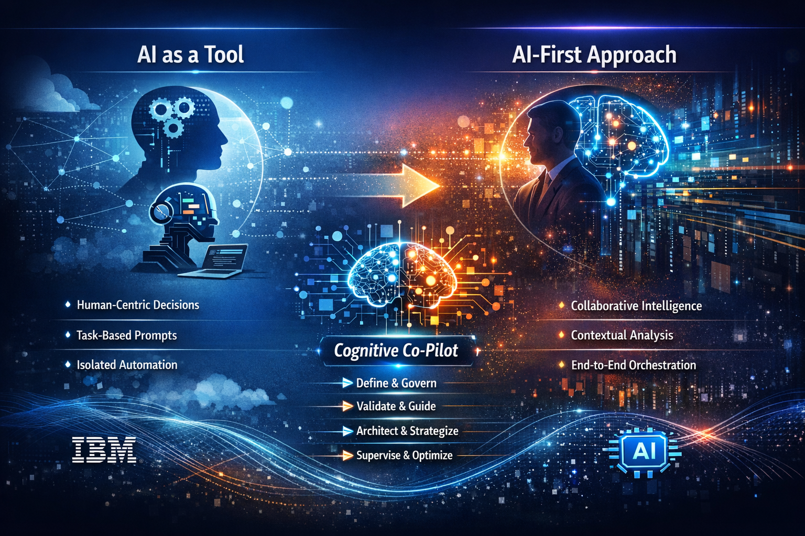
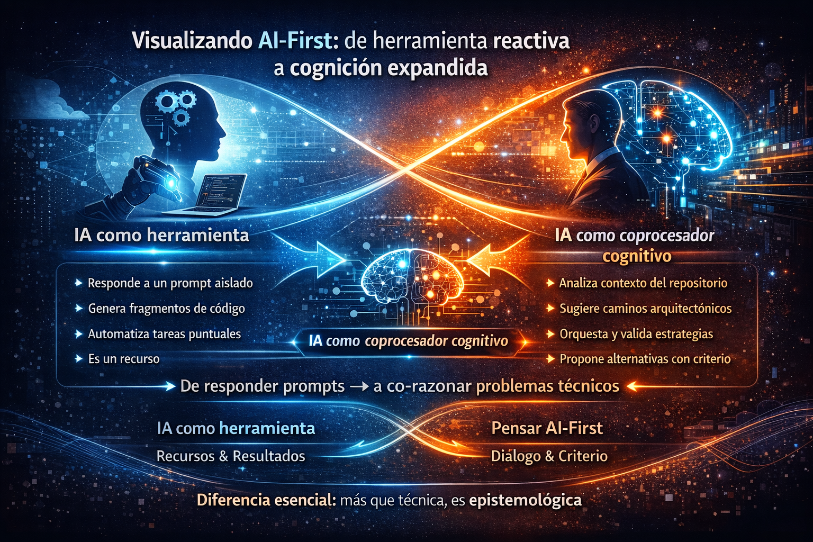
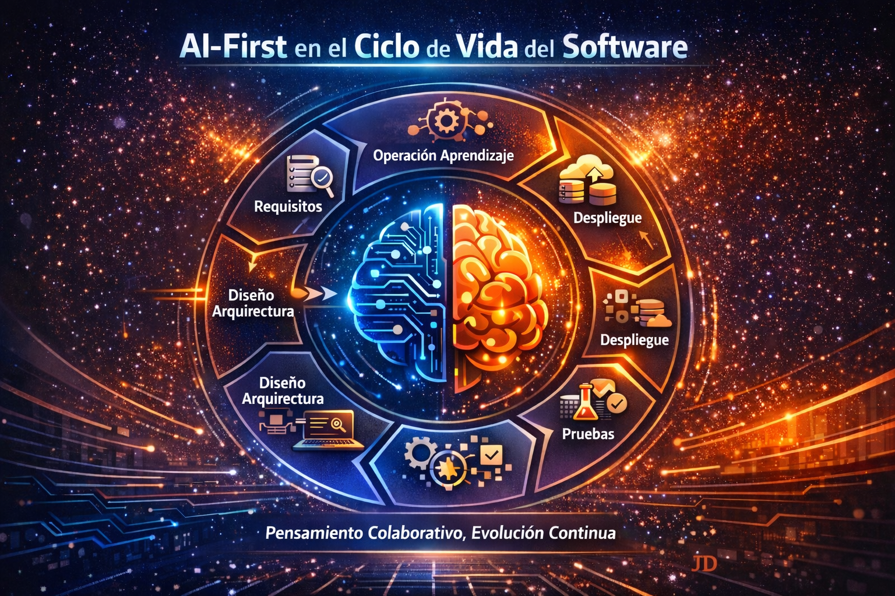
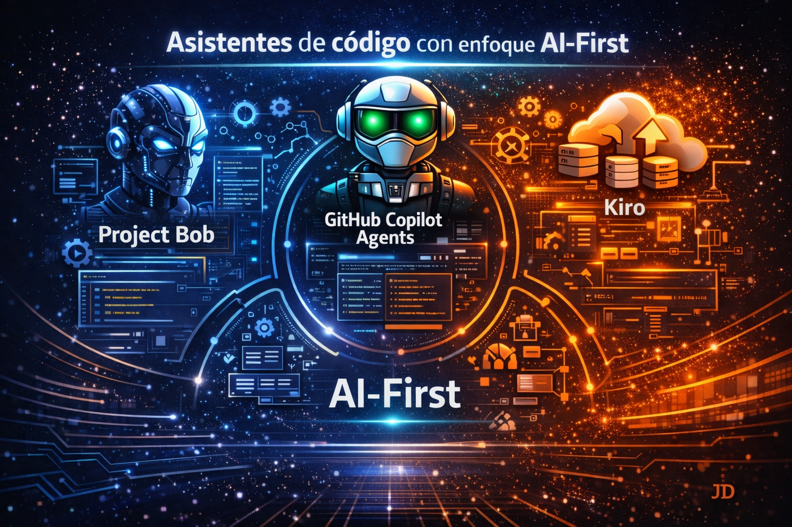
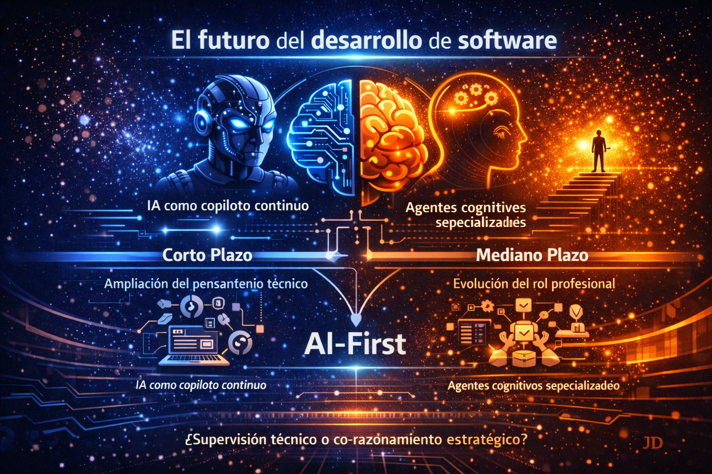

# AI-First: el futuro del desarrollo de software ya comenzó

## Introducción

Durante mucho tiempo, la evolución del desarrollo de software ha estado marcada por cambios de enfoque más que por cambios de herramientas. **API-First, Cloud-First, DevOps-First…** todos estos paradigmas redefinieron prioridades, pero mantuvieron una constante: **el ser humano seguía siendo el único ente cognitivo real en el proceso**. Las herramientas asistían, automatizaban o aceleraban, pero no razonaban ni participaban activamente en la toma de decisiones. Ese supuesto ya no es válido.

Hoy, hablar de **AI-First** implica aceptar que la inteligencia artificial ya no es un componente periférico, ni un “plugin de productividad”, sino **un actor técnico con capacidad de análisis, propuesta y ejecución, integrado directamente en el flujo de ingeniería de software**. No se trata de escribir código más rápido; se trata de cómo se construye el pensamiento técnico cuando una segunda inteligencia participa en el proceso.

Desde mi experiencia trabajando con asistentes avanzados —especialmente en entornos empresariales, modernización de sistemas y arquitecturas complejas— he llegado a una conclusión clara:
**AI-First no es una decisión tecnológica, es una decisión epistemológica**. Cambia la forma en que entendemos el conocimiento técnico, la responsabilidad del desarrollador y el rol de la experiencia humana.

Cuando la IA es capaz de:
	•	Analizar repositorios completos,
	•	Proponer arquitecturas,
	•	Refactorizar sistemas heredados,
	•	Generar pruebas, documentación y flujos de trabajo,
	•	Y aprender del contexto organizacional,

**El verdadero desafío deja de ser qué puede hacer la IA y pasa a ser cómo gobernamos su participación dentro del proceso de ingeniería.**

Este blog no pretende idealizar la inteligencia artificial ni presentarla como una solución automática. Por el contrario, busca poner **el enfoque AI-First en su justa dimensión técnica**, analizando cómo está **transformando el desarrollo de software, qué asistentes realmente encarnan este paradigma y por qué el rol del desarrollador —lejos de desaparecer— se vuelve más estratégico, más arquitectónico y más responsable que nunca**.

## 🧠 ¿Qué significa realmente AI-First?

Cuando hablo de AI-First, no hablo de integrar inteligencia artificial como una capa adicional al proceso de desarrollo, ni de sumar un asistente que “ayude a escribir código”. Desde mi experiencia, **AI-First es un cambio en la forma en que estructuramos el pensamiento técnico**.

Tradicionalmente, el desarrollo de software ha sido un proceso lineal y humano-céntrico: el desarrollador analiza, decide, diseña y ejecuta; las herramientas solo acompañan. Incluso con automatización avanzada, el razonamiento siempre residía en una sola mente. Ese modelo ya no describe la realidad actual.

En un enfoque AI-First, **la inteligencia artificial participa activamente en el proceso cognitivo**, no como sustituto del ingeniero, sino como un segundo sistema de razonamiento, capaz de analizar contexto, proponer alternativas y ejecutar tareas bajo supervisión.

Esto implica asumir conscientemente que:
- La IA no se invoca solo cuando “hace falta”, sino que está presente desde la concepción del problema.
- El desarrollo deja de ser una actividad individual para convertirse en una colaboración humano-IA.
- El valor del desarrollador se desplaza de escribir código a definir criterios, validar decisiones y gobernar el uso de la IA.

AI-First no consiste en usar IA para programar, sino en **programar sabiendo que una inteligencia artificial forma parte del proceso de ingeniería**.

La diferencia es sutil, pero profunda. Mientras el uso tradicional de IA responde a:

> **“¿Cómo escribo este código?”**

AI-First obliga a replantear preguntas estructurales:
- ¿Qué decisiones puede proponer la IA?
- ¿Cuáles deben permanecer exclusivamente humanas?
- ¿Cómo se valida una solución generada parcialmente por IA?
- ¿Dónde empieza y termina la responsabilidad técnica?

En ese sentido, AI-First no es una práctica de productividad, **es una disciplina de ingeniería**.

<figure>

<figcaption>Fig 1. Infografía de AI-First.</figcaption>
</figure>

## 🧩 Visualizando AI-First: de herramienta reactiva a cognición expandida

Cuando intentamos dibujar AI-First, el reto no es mostrar flechas o cajas, sino transmitir una **idea cognitiva**: la transición de un modelo donde la IA responde a nuestras solicitudes, a uno donde la IA influye activamente en cómo pensamos sobre los problemas técnicos.

En los enfoques tradicionales, **la IA opera como un instrumento reactivo**: ejecuta tareas bajo demanda, con prompts sueltos y sin comprensión global. Pero en un enfoque AI-First, la IA deja de ser un accesorio y se convierte en una extensión cognitiva del ingeniero.

Esta sección propone una visualización mental que no solo compara modelos, sino que ayuda a sentir la transformación.

### 🧠 1. Desde IA como resorte de productividad…

Imagina IA como una herramienta en tu caja:
- Está disponible cuando la necesitas
- Responde a lo que le preguntas
- Acelera tareas aisladas
- Depende de tu contexto local

En este modelo:
- Tú piensas primero, IA responde después
- El proceso técnico sigue siendo —casi— el mismo

#### 📌 Visual:
Una herramienta en tu mano, esperando un prompt para accionar.

### 🧠 2. …Hacia IA como capa cognitiva estructural
Ahora imagina IA como una segunda mente técnica que:
- Comprende el proyecto completo
- Analiza patrones, dependencias y trade-offs
- Contextualiza decisiones con memoria técnica del sistema
- Propone alternativas, no solo respuestas

En este nuevo modelo:
- El pensamiento ya no está aislado
- Se genera un diálogo continuo entre ingeniero e IA
- La solución emerge de una simbiosis cognitiva

#### 📌 Visual:
Dos “motores mentales” —uno humano, otro artificial— interconectados por flujos de datos, interpretaciones y contexto compartido.

### 🧠 3. De responder prompts → a co-razonar problemas técnicos
En la práctica, este salto se ve así:

| IA como herramienta | IA como coprocesador cognitivo |
|--------------------|--------------------------------|
| Responde a un prompt aislado | Analiza contexto del repositorio |
| Genera fragmentos de código | Sugiere caminos arquitectónicos |
| Automatiza tareas puntuales | Propone y valida estrategias |
| Depende de tu intención | Propone alternativas con criterio |
| Es un recurso | Es un agente de razonamiento |

#### 📌 Visual:
Un continuo, no una ruptura. Un eje desde la IA-prompt hacia la IA-cognitiva.

### 🧠 4. Cómo “se siente” trabajar AI-First

Más allá de diagramas, AI-First se percibe como:
- Menos lucha con detalles repetitivos
- Más tiempo para pensar estructuras y trade-offs
- Menos ruido, más criterio
- Más co-creación, menos ejecución manual

Es como avanzar desde:

> “Pedirle respuestas a la IA”

Hacia

> “Dialogar con la IA para construir decisiones”. 

### 💡 ¿Cuál es la diferencia esencial?

La diferencia no es técnica: es epistemológica.
- Usar IA es obtener resultados.
- Pensar AI-First es replantear cómo llegamos a esos resultados, qué criterios usamos y cómo gobernamos la intervención de la IA.

<figure>

<figcaption>Fig 2. Evolución de la AI por medio de la AI-First.</figcaption>
</figure>

## 🔄 AI-First en el ciclo de vida del software (SDLC)

Cuando pensamos en el ciclo de vida del software *requerimientos, diseño, desarrollo, pruebas, despliegue, operación* tendemos a verlo como una **secuencia de fases discretas**.

AI-First nos obliga a derribar esa separación, porque **si la IA afecta cómo legitimamos una decisión, entonces modifica la naturaleza de la transición entre cada etapa**.

En un SDLC tradicional, cada fase está gobernada por un conjunto de supuestos humanos:

1. **Qué se debe resolver**
2. **Cómo resolverlo**
3. **Qué es aceptable**
4. **Cómo medirlo**
5. **Quién es responsable**

AI-First no elimina estos supuestos, pero **los distribuye entre dos sistemas de razonamiento**: humano e IA. 
Esto produce una transformación cualitativa del proceso de ingeniería:

### 🧠 Redefiniendo **entender el problema**

Tradicionalmente:

> El desarrollador capta intenciones del negocio y las traduce a requerimientos.

AI-First:

> La IA colabora en la formulación del problema, detecta ambigüedades, sugiere limitaciones no explícitas y expone dependencias tácitas.

La IA no sustituye la comprensión humana, pero **amplía su alcance** y revela supuestos que de otro modo pasarían desapercibidos.
No estamos solo **capturando requerimientos**, estamos **confiriéndoles estructura cognitiva compartida**.

### 🧠 Arquitectura y diseño como diálogo

El diseño de software ha sido tradicionalmente una actividad humana con IA actuando como herramienta de apoyo (diagramas, bocetos, autocompletados).

AI-First transforma el diseño en un **diálogo activo**:
* La IA articula restricciones y trade-offs entre múltiples dimensiones
* Anticipa puntos de fricción antes de que existan
* Construye variantes de diseño simultáneamente
* Sostiene coherencia entre decisiones discretas

El diseño deja de ser un arte solitario y se convierte en **un espacio de co-razonamiento**, donde cada decisión se examina bajo distintos vectores de optimización.

### 🧠 Desarrollo: no solo generar código, sino consistencia constructiva

Cuando la IA participa desde la fase de implementación, el desarrollo deja de ser una simple traducción de diseño a código.

AI-First inyecta:

* Coherencia de estilo y arquitectura
* Validación de supuestos técnicos en tiempo real
* Detectores de deuda técnica antes de que se cristalice
* Sugerencias que respetan patrones y contextos previos

La IA no produce código perfecto; **hace que las decisiones del código sean más explícitas y justificadas**.

### 🧠 Pruebas como **conversación con el software**

Las pruebas han sido tradicionalmente una actividad de verificación: confirmamos que algo se comporta como esperamos.

AI-First convierte pruebas en **una forma intuitiva de explorar incongruencias no consideradas**. No solo genera tests, sino que:

* Sondéa casos límites no obvios
* Descubre contradicciones entre supuestos implícitos
* Propone escenarios adversos basados en patrones aprendidos

Las pruebas dejan de ser **confirmaciones** y se convierten en **exploraciones de robustez epistemológica**.

### 🧠 Integración y despliegue: orquestación cognitiva

AI-First amplifica la visibilidad de cada cambio:

* Anticipa impactos de despliegue entre servicios conectados
* Simula estados de producción basados en datos reales
* Advierte conflictos antes de que lleguen a ejecución

Ya no es “integrar y desplegar”, es **orquestar con conciencia de riesgo y beneficio**.

### 🧠 Operación y evolución: aprendizaje continuo

En un mundo AI-First, **operar no es recolectar métricas, es interpretarlas** con ayuda de la IA:

* Detectar patrones emergentes
* Correlacionar eventos con decisiones de diseño previas
* Retroalimentar el proceso de ingeniería con conocimiento acumulado

Esto convierte al SDLC en un **circuito de pensamiento continuo**, no una línea con fases discretas.

## 🧠 Lo que realmente está pasando

AI-First no transforma el SDLC agregando más automatización.
**Reconfigura la naturaleza del razonamiento en cada etapa**:

Antes:

> La IA respondía a lo que el humano pedía.

Ahora:

> La IA participa en la construcción del problema, la solución y la evaluación.

En otras palabras:

> **AI-First transforma el SDLC de un conjunto de pasos encadenados en una red de decisiones interdependientes y co-razonadas.**

<figure>

<figcaption>Fig 3. La AI en el centro del SDLC.</figcaption>
</figure>

## 🤖 Asistentes de código con enfoque AI-First

Cuando hablamos de asistentes de código bajo el paradigma AI-First no estamos enumerando qué puede generar cada herramienta, sino qué tipo de pensamiento técnico habilita o limita cada una. La diferencia entre asistentes que “aceleran tareas” y verdaderos **agentes AI-First** no está en cuánto código generan, sino en cómo transforman el acto de **diseñar, razonar y decidir sobre un sistema complejo**.

### 🧠 1. Project Bob — pensamiento expandido, no solo sugerencias

Project Bob es el asistente que más se aproxima a la metáfora de la IA como una extensión cognitiva.

No se limita a autocompletar o responder prompts. Su valor técnico clave radica en que:
- Tiene acceso al contexto completo del proyecto y del negocio
- Permite razonar sobre trade-offs arquitectónicos
- No solo genera código, propone líneas de pensamiento
- Se integra con normativas, políticas, cumplimiento y gobernanza técnica
- Actúa como un socio de diseño, no como un generador de snippets

En el continuum que propuse *de IA como herramienta reactiva hacia IA como coprocesador cognitivo*, Project Bob está claramente en el extremo del razonamiento estructurado y contextual. Si el pensamiento técnico fuera una conversación, Bob no sólo contesta: plantea nuevas preguntas. Bob no solo sugiere soluciones, expone hipótesis técnicas.

### 🧠 2. GitHub Copilot Agents — agentes como amplificadores de intención

GitHub Copilot fue la primera herramienta en popularizar la IA “al nivel del código”, pero su **evolución hacia Agents** implica una transición conceptual:
de ser una **extensión de entrada-salida a configurarse como capas de automatización inteligente sobre flujos establecidos**.

Copilot Agents no reemplaza tu criterio, pero:
- Interpreta partes completas del sistema
- Puede generar pruebas, documentación y propuestas de solución
- Actúa sobre contextos más amplios que simples funciones

Desde la óptica AI-First, Copilot Agents no es todavía un coprocesador cognitivo completo, pero es un acelerador de intención técnica: convierte decisiones explícitas en ejecuciones contextualizadas. Si la IA fuera una segunda mente, Copilot Agents sería el primer asistente de pensamiento operativo: funciona mientras tú decides qué camino tomar. Copilot Agents acelera tu intención, no la reemplaza ni la genera.

### 🧠 3. **Kiro** — la aspiración hacia agentes autónomos cloud-native

Kiro (y herramientas similares orientadas a agentes autónomos) apunta hacia una idea técnica interesante: **IA que no sólo ayuda a concluir tareas, sino que puede anticipar rutas de solución completa**.

A diferencia de un modelo reactivo, Kiro:
	•	Busca cerrar loops completos de tareas
	•	Puede tomar decisiones de flujo (bajo reglas y objetivos definidos)
	•	Se integra con servicios cloud y pipelines como un agente de automatización contextual

A nivel de pensamiento técnico, se sitúa más cerca de un proveedor de propuestas que de un simple asistente reactivo, aunque no tiene aún el grado de co-razonamiento profundo de una IA que mantenga memoria de dominio completo.
En términos del continuum:
> **Kiro está en la frontera de los agentes autónomos que propongan rutas y no solo respuestas.**

### 🧩 4. ¿Qué define realmente un asistente AI-First?

Técnicamente, un asistente de código puede considerarse AI-First si cumple al menos estas cualidades:
1.	Comprensión de contexto profundo. No sólo del archivo activo, sino del dominio, arquitectura y restricciones del proyecto.
2.	Participación activa en el razonamiento. Va más allá de autocompletar: propone alternativas, explica trade-offs y sugiere rutas.
3.	Capacidad de ejecutar flujos, no solo tareas. Por ejemplo: pruebas, validación de diseño, revisión de seguridad.
4.	Supervisión y gobernanza técnica. Su output es auditable, explicable y alineado con políticas internas.
5.	Co-razonamiento humano-IA. No es reemplazo. Es ampliación del pensamiento estructurado.

### 🧠 Análisis finales de los asistentes de código

No todos los asistentes encarnan AI-First. Muchos son potentes desde el punto de vista de productividad, pero limitados cognitivamente: operan sobre prompts, no sobre contexto. La verdadera revolución AI-First no es que la IA genere código más rápido —eso ya es commodity—, sino que puede formar parte activa de la construcción del pensamiento técnico detrás de una solución. Y esto no se logra generando código **Se logra generando criterios**.

<figure>

<figcaption>Fig 4. Asistentes de código con enfoque AI-First.</figcaption>
</figure>

## 🚀 El futuro del desarrollo de software

Mirar al futuro del desarrollo de software desde una perspectiva AI-First no es describir nuevas herramientas ni catalogar funciones. Es, sobre todo, **reconocer cómo cambia el acto de pensar software** cuando la inteligencia artificial deja de ser un accesorio y pasa a ser **parte integral del proceso cognitivo**.

### 🔹 Corto plazo: co-razonamiento y ampliación de la capacidad técnica

En los próximos **1 a 2 años**, veremos una transición acelerada del desarrollo asistido a un desarrollo **co-razonado**:

- **IA como copiloto continuo:** La IA dejará de ser invocada por comandos aislados y empezará a formar parte del **pensamiento de flujo**, influyendo en:
    - Elección de patrones arquitectónicos.
    - Sugerencias de trade-offs en tiempo real.
    - Detección proactiva de deuda técnica.
- **Memoria de dominio contextual:** Ya no será suficiente que la IA conozca fragmentos de código: deberá comprender **el dominio del problema, las restricciones del negocio y las decisiones pasadas del equipo** para hacer aportes valiosos.
- **Razonamiento de intención técnica:** La entrada de la IA tendrá que trascender el “qué” para preguntarse el “por qué”: ¿Cuál es el objetivo de negocio detrás de un requisito? ¿Cuál es el **contexto implicado** detrás de una elección de diseño?
- **IA como auditor de criterios:** Más allá de generar código, la IA empezará a:
    - Evaluar consistencia entre supuestos.
    - Anticipar contradicciones de diseño.
    - Proponer caminos alternativos con **justificación lógica**.

Esto implicará un cambio profundo para los equipos: **no solo se escribirá menos código, sino que se cuestionará más el propio acto de escribirlo**.

### 🔹 Mediano plazo: agentes cognitivos y evolución del rol profesional

En el horizonte de **3 a 5 años**, la visión AI-First madurará en formas que hoy parecen conceptuales, pero serán prácticas y ubicuas.

#### 🧠 1. Agentes especializados por rol

No hablaremos solo de IA que genera código, sino de **agentes cognitivos con identidad técnica**:

- **Arquitecto Agente:** Propone y evalúa esquemas de arquitectura.
- **Analista Agente:** Detecta inconsistencias, riesgos y dependencias no explícitas.
- **Calidad Agente:** Genera y ajusta suites de pruebas basadas en objetivos de negocio y riesgos.

Estos agentes no serán reemplazos, sino **extensiones especializadas** de capacidades humanas.

#### 🧠 2. Memoria de proyecto persistente

El conocimiento no estará solamente en la documentación o en la mente de los ingenieros, sino **en modelos de IA que mantienen una memoria técnica del proyecto**, lo cual permitirá:
- Revisión continua de decisiones pasadas,
- Contextualización de nuevos requisitos,
- Sugerencias alineadas con la historia completa del sistema.

#### 🧠 3. Co-gobernanza técnica

La IA no solo sugerirá; participará en **procesos de gobernanza técnica**, apoyando discusiones sobre:
- Criterios de calidad,
- Políticas de seguridad,
- Decisiones de arquitectura,
- Cumplimiento normativo.

### 🔹 ¿Y el rol humano en este futuro?

Contrario a la narrativa simplista de “*la IA reemplaza al desarrollador*”, el futuro AI-First exigirá:
- **Razonamiento crítico superior:** La IA puede proponer múltiples soluciones; el humano debe **elegir cuál es la más alineada con contexto, riesgos y objetivos reales**.
- **Diseño de criterios, no solo código:** La productividad ya no se medirá en *líneas generadas*, sino en **criterios definidos, decisiones justificadas y soluciones robustas**.
- **Supervisión y ética integrada:** La responsabilidad de asegurar que la IA opera de forma **segura, explicable y ética** recae en el equipo, no en la herramienta.

### 💡 Un cambio pragmático: del “hacer” al “pensar”

Si hoy el desafío es integrar IA para producir valor incremental, mañana el desafío será:

> **¿Cómo estructuramos el pensamiento de ingeniería para que pueda coexistir, colaborar y evolucionar con otro sistema de razonamiento?**

La respuesta no está en listar herramientas, sino en **repensar el proceso de ingeniería**:

- Menos ruido en decisiones repetitivas.
- Más energía en criterios y razones.
- Menos ejecución manual.
- Más supervisión estratégica.

<figure>

<figcaption>Fig 5. Futuro del desarrollo con asistentes de código AI-First.</figcaption>
</figure>

### 🌐 Conclusión: un desarrollo de software más inteligente

No estamos proyectando **más código generado por IA**, sino un **ecosistema de ingeniería basado en co-razonamiento**:

- **El corto plazo** trae ampliación del pensamiento técnico: IA como copiloto constante.
- **El mediano plazo** trae agentes especializados, memoria compartida y co-gobernanza.
- Y en ese futuro, **el desarrollador no será desplazado**, pero **sí será redefinido como un pensador estratégico**, un articulador de criterios y un supervisor de razonamientos.

El desarrollo de software dejará de ser:

> “cómo hacemos que el software funcione”

Para convertirse en:

> “cómo hacemos que el software sea técnicamente sostenible, cognitivamente robusto y estratégicamente alineado”

## 🧠 Cierre: AI-First como disciplina, no como atajo

Adoptar un enfoque AI-First no consiste en integrar asistentes de código ni en acumular herramientas impulsadas por inteligencia artificial. Implica redefinir la disciplina del desarrollo de software bajo una nueva realidad: **la coexistencia entre inteligencia humana e inteligencia artificial dentro del mismo proceso cognitivo**.

Los asistentes AI-First más avanzados —como Project Bob, GitHub Copilot Agents o iniciativas emergentes como Kiro— evidencian una transición clara:
el desarrollo de software deja de ser una actividad puramente reactiva y manual, y se convierte en un ejercicio de orquestación, supervisión y toma de decisiones informadas.

En este contexto, el rol del desarrollador evoluciona.
Ya no es únicamente quien implementa soluciones, sino quien:
- Define límites y criterios técnicos,
- Evalúa propuestas generadas por IA,
- Gobierna el uso responsable de modelos,
- Garantiza calidad, seguridad y alineación con el negocio.

La verdadera ventaja competitiva no estará en quién use más IA, sino en quién sepa integrarla con criterio, experiencia y responsabilidad. AI-First no reemplaza al ingeniero; exige un ingeniero más consciente, más arquitecto y más estratégico.

Y es aquí donde el cambio más importante ocurre no en el código, sino en la mentalidad. Al final:

> **No se trata solo de modernizar el código, sino de modernizar la forma en que pensamos y trabajamos.**
