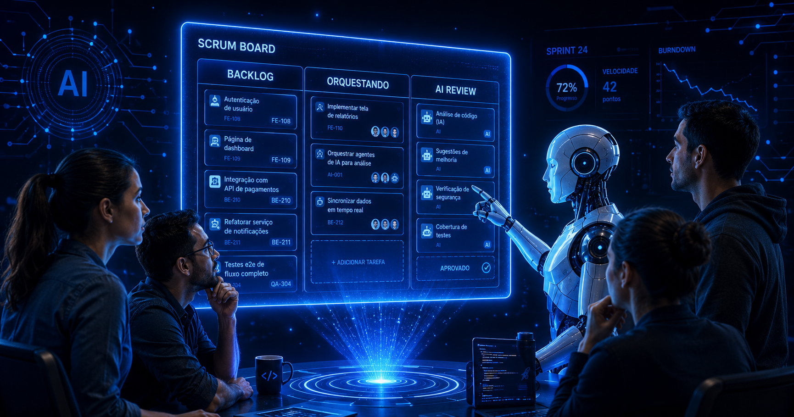

# 🧠 AI-First en la Gestión de Proyectos: cuando la IA se sienta en el equipo

Cuando hablamos de gestión de proyectos con IA, la conversación suele desviarse hacia un lugar equivocado. Hacia los proyectos **de** inteligencia artificial. Hacia modelos, datasets, pipelines de ML. Pero eso no es de lo que trata este artículo.

Hoy quiero hablar de algo más cotidiano y más disruptivo al mismo tiempo:

> **¿Qué pasa cuando tenés un proyecto normal — módulos SQLRPGLE, servicios Java, scripts Python — y de repente tenés un agente de IA sentado en tu equipo?**

Porque eso ya está pasando. Y ni Cascada ni Agilismo clásico tienen respuesta para eso.

<figure>

<figcaption>Fig 1. Un Agente de IA como un miembro más del equipo de desarrollo.</figcaption>
</figure>

## ⚙️ El problema real: la velocidad colapsó

En Scrum clásico, el sprint de dos semanas tiene sentido porque el cuello de botella es escribir código. Un módulo que antes tomaba tres días, hoy lo genera IBM Bob o algún otro agente de IA en dos horas.

Entonces surge la pregunta incómoda:

👉 **¿Para qué planificamos dos semanas si entregamos en dos días?**

Y la respuesta no es "hacemos más en el mismo sprint". La respuesta es que **el modelo de gestión entero necesita repensarse**. Porque el tiempo no desapareció. Se redistribuyó.

Antes: **80% construir, 20% revisar.**  
Ahora: **20% orquestar, 80% validar, contextualizar y decidir.**

## 🧩 Lo que cambia no son las fases — son las actividades

Las fases del SDLC siguen siendo las mismas:
- Análisis.
- Diseño.
- Desarrollo.
- Testing.
- Deploy.

Pero lo que ocurre **dentro** de cada fase es completamente distinto cuando hay un agente en el equipo. Y esto aplica sin importar el lenguaje, la plataforma o la arquitectura. Esa es una de las transformaciones más profundas que trae la IA al desarrollo:

> **Por primera vez, un equipo verdaderamente multitecnológico es posible.**

Ya no necesitás al experto en RPGLE, al experto en Java y al experto en Python como silos separados. El agente baja la barrera de entrada técnica. Lo que une al equipo ahora es el dominio de negocio — no el stack.

## 👨‍💻 El nuevo rol: del que escribe al que orquesta

El desarrollador no desaparece. Se transforma. Deja de ser quien produce el código y pasa a ser quien tiene el criterio para juzgarlo. Pero aquí hay una paradoja que vale la pena nombrar:

> **Para orquestar bien necesitás saber suficiente de cada tecnología para detectar errores, pero no tanto que caigas en la trampa de hacer tú mismo lo que el agente puede hacer.**

El orquestador AI-First tiene cinco competencias que no existían como perfil unificado antes:
- **Prompt Engineering** — sabe construir instrucciones precisas con contexto de negocio real.
- **Critical Output Review** — valida que el código sea correcto en lógica, no solo en sintaxis.
- **Domain Knowledge** — porta el contexto que la IA no tiene y nunca tendrá por sí sola.
- **Architectural Awareness** — detecta cuando el output rompe la coherencia global del sistema.
- **AI Accountability** — firma el código aunque no lo haya escrito. No hay "la IA lo generó" como excusa.

## 🔄 Las ceremonias que cambian

Scrum no muere. Se adapta. Las ceremonias siguen existiendo, pero el objeto de conversación cambia completamente.

**Antes el equipo hablaba de qué iban a construir.**  
**Ahora habla de qué validó, qué rechazó y qué decisión no puede delegar al agente.**

### Daily Sync — las nuevas tres preguntas

| Antes | Ahora |
|---|---|
| ¿Qué hice ayer? | ¿Qué aprobé / rechacé del agente? |
| ¿Qué haré hoy? | ¿Qué voy a orquestar hoy? |
| ¿Tengo bloqueos? | ¿Qué decisión necesita un humano? |

### La ceremonia nueva: AI Code Review

Esta no existía en Scrum clásico. Y es la que más cambia la dinámica del equipo. En el modelo tradicional, el code review era privado — entre el autor y un revisor técnico. Aquí el output del agente pertenece al equipo completo, porque nadie lo escribió.

Eso crea algo poderoso:
👉 El PO puede señalar un error de lógica de negocio sin saber leer el código.  
👉 El arquitecto puede detectar un patrón roto sin conocer el dominio.  
👉 El QA puede identificar casos no cubiertos antes de que se escriba un solo test manual.

El código generado por IA se convierte en el lenguaje común del equipo.

### Retrospectiva — nuevas preguntas, nuevo artefacto

La retro AI-First no solo produce acuerdos de proceso. Produce algo tangible:

> **La biblioteca de prompts del equipo.**

Prompts validados. Contextos que funcionaron. Patrones de instrucción probados en producción. Esa biblioteca es el equivalente al conocimiento acumulado del equipo — y es lo que hace que cada micro-sprint sea más rápido que el anterior.

Las preguntas clave de la retro cambian:
- ¿Qué prompts funcionaron? → se incorporan a la biblioteca del equipo.
- ¿Dónde la IA nos falló? → ¿fue el prompt, el contexto o un límite real del agente?
- ¿Qué decisión tomamos que la IA no podría haber tomado sola?
- ¿El micro-sprint debería ser más corto o más largo para el siguiente módulo?

## ⏱️ El micro-sprint: 3 días, no 2 semanas

Cuando la velocidad de generación colapsa, la cadencia natural de entrega también cambia.

Un micro-sprint AI-First tiene tres momentos claros:

### Día 1 — Planificación y arranque

La IA propone la descomposición técnica. El equipo decide quién orquesta qué. No por especialidad de lenguaje — por conocimiento del dominio. El Sprint Planning no termina con tareas asignadas a personas por su stack. Termina con un **mapa de orquestación**: quién le da contexto al agente en cada módulo y con qué criterio valida el output.

### Día 2 — Validación y refinamiento

El Daily reporta outputs aprobados y rechazados — no tareas completadas. El AI Code Review reúne al equipo sobre el mismo output generado por el agente. Se re-orquesta lo que no pasó la revisión. 

Aquí ocurre algo que no tenía equivalente en Scrum clásico:

> **El rechazo de un output no es un bloqueo — es parte del proceso.**

Re-orquestar con un prompt mejor es más rápido que corregir código a mano.

### Día 3 — Cierre y retrospectiva

Demo al stakeholder. Lo que importa es que el incremento cumple los criterios de aceptación — no cómo se generó. La retro extrae los prompts que funcionaron y los incorpora a la biblioteca del equipo.

## 📊 Lo que se mide ahora

La velocidad ya no se mide en story points. Se mide en **módulos validados y entregados**. Y aparecen métricas nuevas que dicen mucho más sobre la madurez del equipo:

- **AI acceptance rate** — el porcentaje de outputs aprobados sin re-orquestación. Demasiado alto significa revisión superficial. Demasiado bajo significa que el contexto dado al agente es insuficiente.
- **Ciclo de revisión** — el tiempo entre que el agente genera y el humano aprueba. Ahí vive el trabajo real del equipo.
- **Crecimiento de la biblioteca de prompts** — el indicador de aprendizaje colectivo más honesto que existe en este modelo.

## 🔥 Conclusión

La IA no reemplaza al equipo. Cambia lo que el equipo hace.

Y ese cambio no es menor: pasamos de ejecutar tareas técnicas a tomar decisiones sobre outputs generados por inteligencia que no tiene contexto de negocio, que no conoce la historia del sistema, y que no es responsable de lo que genera.

Esa responsabilidad sigue siendo humana.

> **El orquestador no es el developer de antes con Copilot encima. Es un perfil nuevo, con un criterio más exigente, que porta lo que la IA nunca podrá tener por sí sola: el contexto.**

Y la gestión de proyectos que acompaña a ese perfil no es ni Cascada ni Agilismo puro.

Es **Agilismo Orquestado** — la misma estructura de Scrum, con actividades completamente distintas dentro.

👉 No se trata de gestionar proyectos con IA.  
👉 Se trata de gestionar proyectos donde la IA es un miembro más del equipo.

> **No se trata solo de modernizar el código, sino de modernizar la forma en que pensamos y trabajamos.**
