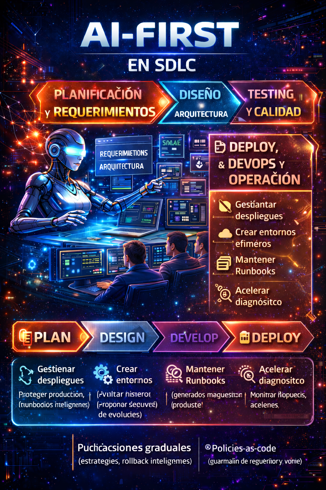
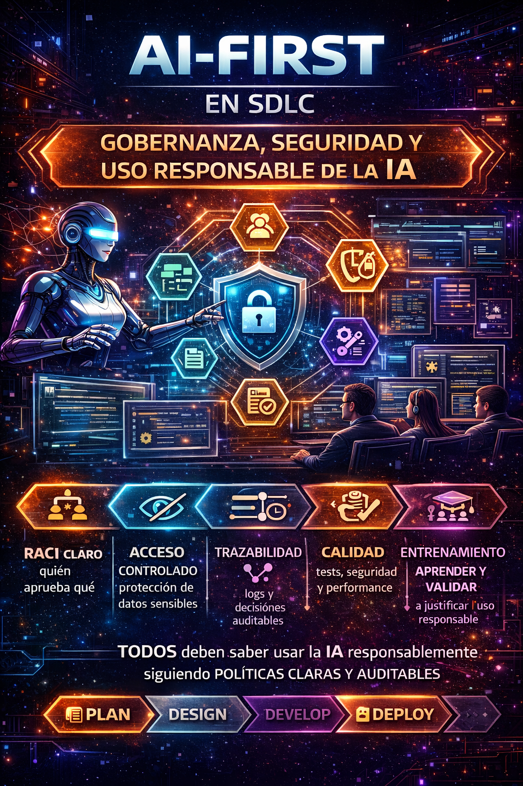

# AI-First en el SDLC: Una reforma silenciosa en el desarrollo de software (Parte III)

En las partes anteriores de esta serie, exploramos cómo la integración de la **inteligencia artificial (IA) en el ciclo de vida del desarrollo de software (SDLC)** está transformando la forma en que los desarrolladores crean, prueban y mantienen aplicaciones. En esta tercera parte, profundizaremos en las fases de **despliegue, DevOps y Operación**, también daremos un repaso en temas criticos como gobernanza, seguridad y ética en el uso de IA en el desarrollo de software.

## SDLC – Deploy, DevOps y Operación  
### Cuando la IA acompaña al software hasta producción

Si hay una etapa donde el enfoque AI-First encaja de forma natural, es en **Deploy, DevOps y Operación**. Aquí, la inteligencia artificial no solo acelera procesos, sino que **reduce fricción, errores humanos y retrabajos**, impactando directamente en la estabilidad del producto.

Desde mi experiencia, la integración de IA en esta fase es prácticamente perfecta. En particular, el soporte en **Infraestructura como Código (IaC)** marca una diferencia clara. Con herramientas como **Project Bob**, la generación de pipelines CI/CD se vuelve un proceso sorprendentemente sencillo y estructurado.

Bob no se limita a crear un pipeline básico. Su dominio sobre tecnologías como Terraform le permite:

- Generar IaC completa  
- Definir variables por entorno  
- Establecer planes de validación  
- Automatizar procesos de construcción y destrucción  
- Integrar pruebas dentro del flujo de despliegue  

Todo esto se construye de forma coherente, considerando el ciclo completo de vida de la infraestructura, no solo el momento del deploy.

### Pipelines que se analizan, no solo se ejecutan

Otro punto clave es la capacidad de la IA para **revisar y analizar pipelines existentes**. En varios escenarios, he utilizado agentes de IA para inspeccionar flujos de CI/CD, identificar fallos recurrentes y proponer optimizaciones.  
El resultado no es solo un pipeline que funciona, sino un pipeline **más estable, predecible y eficiente**.

Este tipo de análisis continuo permite corregir problemas antes de que se conviertan en incidentes productivos.

### IA en operación: observabilidad con contexto

En la fase de operación, el papel de la IA se vuelve aún más relevante. Los agentes de IA pueden **automatizar procesos de monitoreo y observabilidad**, detectando comportamientos anómalos en los sistemas y clasificándolos de forma inteligente.

Más allá de generar alertas, la IA aporta contexto: identifica patrones, agrupa eventos relacionados y propone **planes de atención**. Esto acelera significativamente la respuesta ante incidentes y reduce el ruido operativo que suele afectar a los equipos.

### Decidir sigue siendo humano

Aun con todos estos avances, hay un principio que se mantiene intacto: **la responsabilidad final siempre es humana**.

La IA puede participar en procesos como rollbacks, mitigación de incidentes o ajustes operativos, pero la decisión debe recaer siempre en las personas responsables del sistema. Los insumos, análisis y resúmenes que genera la IA son valiosos y enriquecen la toma de decisiones, pero **no sustituyen el criterio humano**.

El enfoque AI-First en DevOps no busca automatizar la responsabilidad, sino **potenciar la capacidad de decisión**, apoyándose en información más completa y mejor procesada.

#### Uso AI-First en IaC y operación sin “romper producción”
Aplicar un enfoque AI-First en **Infraestructura como Código (IaC)** y en la **operación de sistemas productivos** requiere un principio clave: **automatizar sin perder control**. La IA puede acelerar y optimizar enormemente estos procesos, pero solo si se implementa con límites claros, validaciones estrictas y responsabilidad humana explícita.

Las siguientes prácticas permiten aprovechar la IA en entornos críticos **sin comprometer estabilidad, seguridad ni continuidad operativa**.
- **Entornos efímeros** para validar IaC (plan/apply/destroy automatizados)
    Antes de tocar producción, toda definición de infraestructura debe validarse en entornos efímeros, creados y destruidos automáticamente.
    La IA puede apoyar generando y revisando:
    - Planes de ejecución (terraform plan).
    - Validaciones de dependencias y orden de despliegue.
    - Pruebas de creación y destrucción completas del entorno.
    
    Este enfoque permite detectar errores de configuración, dependencias implícitas o costos inesperados antes de que impacten ambientes productivos, reduciendo drásticamente el riesgo operativo.
- **Policy-as-code** (guardrails) para evitar recursos inseguros
    En un modelo AI-First, la IA no debe tener libertad absoluta para definir infraestructura. 
    El uso de policy-as-code establece guardrails claros que la IA y los equipos deben respetar, como:
    - Restricciones de redes públicas.
    - Encriptación obligatoria.
    - Límites de tamaño, regiones o tipos de recursos.
    - Cumplimiento normativo y de seguridad.
    
    Estas políticas actúan como un contrato técnico que protege la organización incluso cuando la generación de IaC está altamente automatizada.
- **Postmortems asistidos**: IA resume timeline, hipótesis, y acciones
    En operación, la IA puede jugar un papel clave después de un incidente.
    En lugar de depender únicamente de reconstrucciones manuales, la IA puede:
    - Analizar logs, métricas y eventos.
    - Reconstruir una línea de tiempo del incidente.
    - Proponer hipótesis técnicas basadas en patrones.
    - Sugerir acciones correctivas y preventivas.
    
    El postmortem deja de ser un documento reactivo y se convierte en una **herramienta de aprendizaje continuo**, siempre validada y enriquecida por el equipo humano.
- **Runbooks generados y mantenidos por IA, validados por humanos**
    Los runbooks suelen quedar obsoletos rápidamente. En un enfoque AI-First, la IA puede:
    - Generar runbooks iniciales a partir de arquitectura, código y eventos operativos.
    - Actualizarlos conforme cambian los sistemas.
    - Sugerir pasos de mitigación ante incidentes comunes.
    
    Sin embargo, la validación final debe ser siempre humana. Los runbooks se convierten así en artefactos vivos, confiables y alineados con la realidad operativa del sistema.

##### Automatización con criterio: la clave del AI-First en operación
El verdadero valor del enfoque AI-First en IaC y operación no está en automatizar todo, sino en **automatizar con criterio**. La IA acelera validaciones, análisis y documentación; el equipo humano **define límites, valida decisiones y asume la responsabilidad final**. Usada correctamente, la IA no “*rompe producción*”. La protege, la hace más observable y la vuelve más resiliente.

<figure>

<figcaption>Fig 1. AI-First SDLC Deploy, DevOps y Operación.</figcaption>
</figure>

## SDLC – Gobernanza, Seguridad y Uso Responsable de la IA  
### Productividad sin control no es progreso

A medida que la inteligencia artificial se integra de forma transversal en el SDLC, la conversación deja de ser únicamente técnica y se vuelve **estratégica y organizacional**. Adoptar IA sin un marco de gobernanza claro no solo es riesgoso, sino contraproducente.

Desde mi experiencia, el principal riesgo de una adopción descontrolada de IA es el **deterioro progresivo de la calidad del software**. La IA puede generar soluciones eficaces en el corto plazo, pero no necesariamente eficientes a largo plazo. Este desbalance impacta directamente en la mantenibilidad, el crecimiento del sistema y, en escenarios más críticos, en la **seguridad** de las plataformas productivas.

Una arquitectura o un código que “funciona” hoy, pero que no está pensado para escalar, mantenerse o auditarse, se convierte rápidamente en un pasivo tecnológico.

### Principios fundamentales: Transparencia y Ética

Si tuviera que priorizar principios para una adopción responsable de la IA, comenzaría por dos: **transparencia y ética**.

La transparencia implica que la IA sea capaz de **explicar cómo llegó a una conclusión o resultado**. No se trata solo de obtener una respuesta, sino de entender el razonamiento detrás de ella. Esta capacidad es clave para validar decisiones, auditar procesos y generar confianza técnica.

La ética, por su parte, no es un concepto abstracto. Está directamente relacionada con **cómo y para qué usamos la IA**. Un uso ético implica responsabilidad, trazabilidad y respeto por los límites del sistema y de las personas que lo operan.

Curiosamente, cuando estos dos principios están bien establecidos, el resto —seguridad, cumplimiento, calidad— tiende a alinearse de forma natural.

### Productividad, seguridad y cumplimiento: un equilibrio necesario

Existe una falsa percepción de que la productividad se ve afectada cuando se introducen controles de seguridad y cumplimiento. Desde mi experiencia, ocurre exactamente lo contrario.

Cuando una organización define **marcos claros de trabajo**, procedimientos sólidos y reglas bien establecidas para el consumo de IA, la productividad no se frena: **se ordena y se potencia**. La IA deja de ser una herramienta puntual y se convierte en un **aliado estratégico organizacional**, capaz de impulsar el crecimiento de forma sostenida y controlada.

El verdadero reto no es elegir entre productividad o seguridad, sino **diseñar procesos donde ambas evolucionen juntas**.

### La desconfianza como punto de partida, no como barrera

La desconfianza hacia la IA es natural, especialmente en entornos empresariales y sistemas críticos. Sin embargo, esa desconfianza no debería llevar al rechazo, sino a la **documentación, el análisis y la definición de marcos de uso responsables**.

En cierto grado, la desconfianza es incluso saludable. Nos obliga a cuestionar, validar y construir entornos más seguros y estables. Bien gestionada, se convierte en el motor que impulsa una adopción consciente, informada y profesional de la inteligencia artificial.

#### Marco mínimo de gobernanza AI-First para SDLC 
Adoptar IA dentro del SDLC sin un marco de gobernanza claro no es innovación, es riesgo.
Un enfoque AI-First sostenible **requiere reglas explícitas, responsabilidades bien definidas y procesos auditables** que permitan aprovechar la IA sin comprometer calidad, seguridad ni control organizacional. Este marco mínimo no busca burocratizar el uso de IA, sino **ordenarlo y hacerlo confiable**.
- **RACI claro**: quién aprueba requerimientos, arquitectura, merges, despliegues.
    En un entorno AI-First, las decisiones se aceleran, pero la responsabilidad no se diluye.
    Es fundamental definir explícitamente:
    - Quién aprueba requerimientos finales.
    - Quién valida y decide arquitectura.
    - Quién autoriza merges a ramas principales.
    - Quién habilita despliegues a producción.
    
    La IA puede proponer, analizar y asistir, pero el RACI garantiza que siempre exista un responsable humano claramente identificado. Sin esto, la gobernanza se rompe desde el primer día.
- **Datos y contexto**: qué puede ver la IA (código, tickets, secretos jamás).
    No toda la información debe estar disponible para la IA. Un marco AI-First serio define límites claros de visibilidad. 
    Es válido que la IA tenga acceso a:
    - Código fuente.
    - Historias de usuario y tickets.
    - Documentación técnica.
    
    Pero debe existir una política estricta que impida el acceso a:
    - Secretos, credenciales y llaves.
    - Información sensible de clientes.
    - Datos regulados o confidenciales.
    
    La gobernanza comienza por controlar el contexto que consume la IA.
- **Trazabilidad**: prompts, decisiones y outputs versionados (auditoría).
    En un entorno AI-First, los prompts y outputs se convierten en artefactos técnicos.
    Por ello, es indispensable:
    - Versionar prompts relevantes.
    - Documentar decisiones asistidas por IA.
    - Mantener trazabilidad entre requerimientos, código y resultados generados.
    
    Esta trazabilidad no solo facilita auditorías, sino que permite entender por qué se tomó una decisión, algo crítico en entornos regulados y sistemas de larga vida.
- **Calidad**: gates obligatorios (tests, seguridad, performance).
    La velocidad que aporta la IA debe estar siempre contenida por quality gates claros y no negociables.
    Esto incluye:
    - Pruebas automáticas obligatorias.
    - Análisis de seguridad (SAST, dependencias).
    - Validaciones de performance.
    - Cumplimiento de estándares de codificación y arquitectura.
    
    La IA puede ayudar a ejecutar y analizar estos controles, pero no puede saltarlos.
- **Capacitación**: el equipo aprende a preguntar, validar y justificar.
    AI-First no es solo tecnología, es habilidad humana.
    Los equipos deben ser capacitados para:
    - Formular buenos prompts.
    - Cuestionar respuestas de la IA.
    - Validar resultados con criterio técnico.
    - Justificar decisiones tomadas con apoyo de IA.

    Un equipo que no sabe preguntar ni validar convierte a la IA en un riesgo. Un equipo entrenado la convierte en una ventaja competitiva.

<figure>

<figcaption>Fig 2. AI-First Gobernanza, Seguridad y Uso Responsable.</figcaption>
</figure>

## Conclusiones  
### AI-First no cambia el SDLC, cambia la forma en que trabajamos

La adopción de un enfoque AI-First transforma por completo el rol del desarrollador. Ya no somos el único cerebro dentro del proceso de desarrollo de software. Hoy compartimos el espacio con un **segundo cerebro**, artificial, capaz de asumir tareas manuales, repetitivas y operativas.

Este cambio no nos desplaza; **nos eleva**. Al delegar ese tipo de actividades, el rol del desarrollador evoluciona hacia uno más **analítico, estratégico y consciente**, enfocado en la toma de decisiones mejor argumentadas y con mayor impacto en el producto final.

En este nuevo contexto, dejamos de ser simples digitadores de código para convertirnos en **analistas de sistemas**. Nuestro valor no está en escribir líneas de código, sino en **entender procesos, interpretar contextos y validar decisiones**. Tenemos un rol fundamental: asegurarnos de que la inteligencia artificial opere dentro de un **marco seguro, estable y confiable**, que permita construir sistemas robustos, sostenibles y alineados con las necesidades del negocio.

Más que una nueva etapa dentro del SDLC, estamos frente a una **reforma profunda de la forma de trabajar**. Las fases del ciclo de vida del desarrollo de software seguirán existiendo, pero la manera en que las ejecutamos se reestructura y se potencia. La IA no reemplaza estas etapas; las amplifica, las acelera y las obliga a madurar.

El enfoque AI-First no se trata de adoptar herramientas por moda, ni de delegar el pensamiento crítico. Se trata de **repensar cómo diseñamos, desarrollamos, probamos, desplegamos y operamos software**, integrando de forma responsable una inteligencia artificial que complemente nuestras capacidades humanas.

Y como siempre, cierro con la frase que resume mi visión sobre este cambio:

> **“No se trata solo de modernizar el código, sino de modernizar la forma en que pensamos y trabajamos.”**