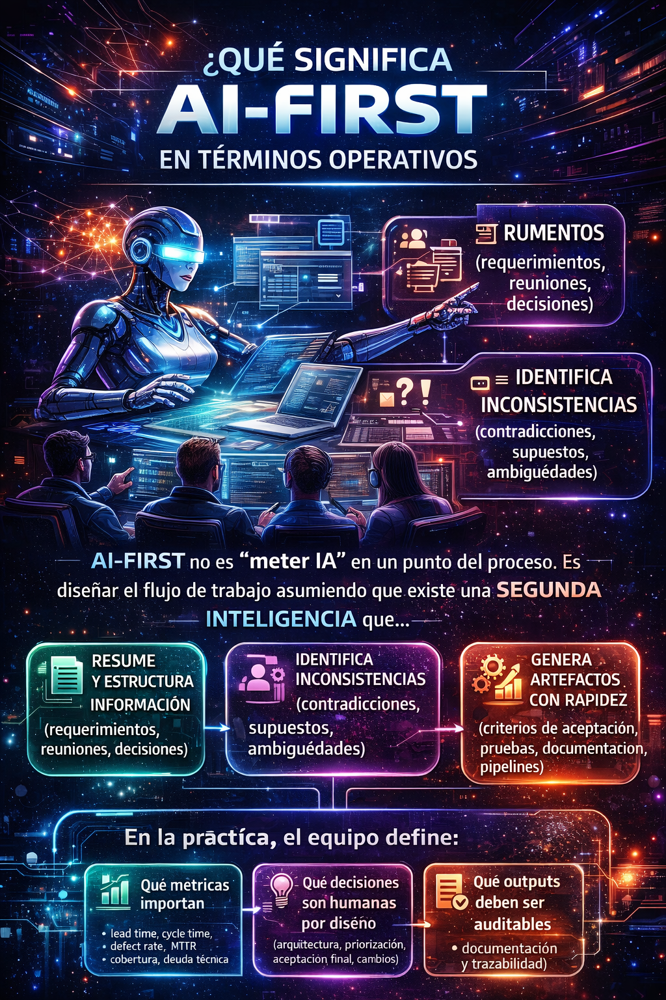
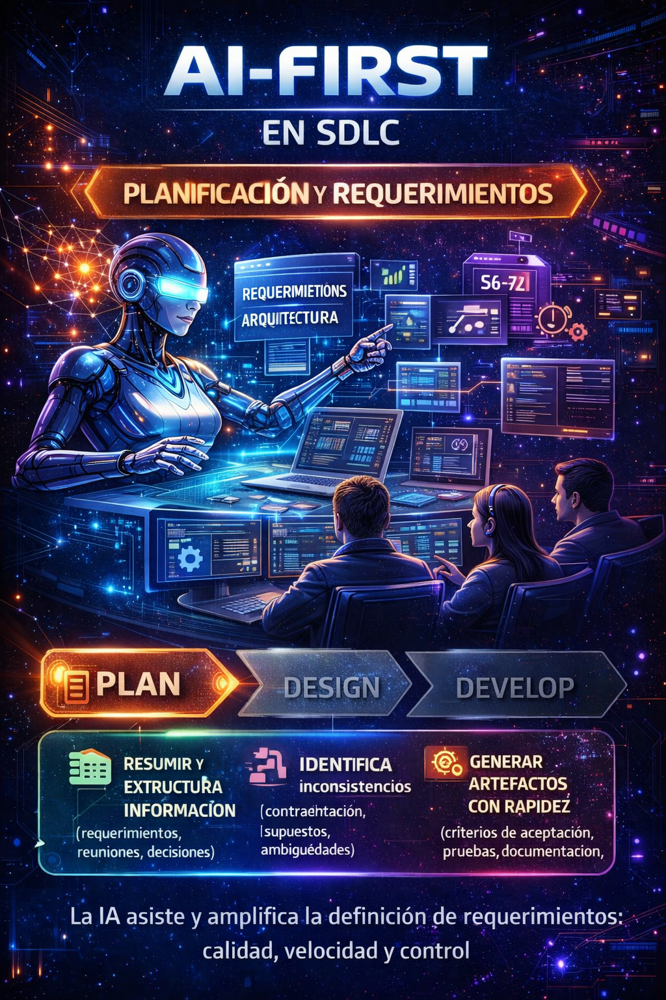
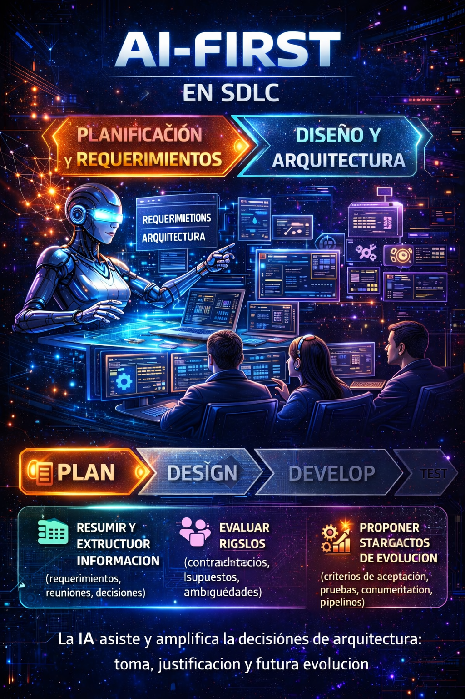

# AI-First in the SDLC: A silent reform in software development

## Introduction  
### AI-First in the SDLC: beyond the hype, toward a conscious adoption

One of the main mistakes I have observed in organizations when trying to incorporate artificial intelligence into software development is not technological, but strategic. The problem is not in the tool, but in **the approach with which it is adopted**.

When an organization is not clear about **how it measures its productivity**, it will hardly be able to identify **in which stages of the development life cycle AI can add real value**. This gap usually leads to complex scenarios: silos between teams, diffuse governance, technological over-dependence, and, in the worst cases, systems that are difficult to maintain due to an uncontrolled use of AI, without a clear vision of its true capabilities and limits.

It is precisely for this reason that I speak of **AI-First** and not simply of “use of AI”. The AI-First approach is not about writing code faster or generating more lines of code. From my experience, artificial intelligence can —and should— be integrated **into each of the stages of the SDLC**, from the gathering and analysis of requirements, through design, development, and testing, all the way to observability and operation in production environments.

The real turning point for me came with the appearance of **Agent modes**. It was at that moment that AI stopped feeling like a reactive tool and began behaving like a **cognitive assistant**: a second artificial brain that accompanies human thinking throughout the entire development process.

I clearly remember a recent experience, about four months ago, during the definition of requirements for a project on **cybersecurity and data governance in production systems**. In that context, the interaction with AI agents made it possible to significantly reduce analysis times, establish much more solid acceptance criteria, identify early development risks, and detect opportunities for improvement at the architectural level. The result was not only operational efficiency, but a more robust final requirement and, above all, a product with greater value for the end user.

Within this context, I have decided to focus this analysis on two assistants that clearly represent this evolution: **Project Bob** and **GitHub Copilot Agents**.

In particular, Project Bob embodies the AI-First approach very clearly. I have had the opportunity to work directly with it and experience how it is capable of taking a high-level requirement, breaking it down into concrete tasks, generating an execution plan, and accompanying each activity until its complete resolution. It is not just about generating code, but about **understanding the problem, planning the work, and executing with context**.

For its part, GitHub Copilot Agents allowed me to delegate development tasks asynchronously: make a request, let the agent work in the background, apply the necessary changes, and then enter a review and validation phase myself. This dynamic transformed the way I work, optimizing times and allowing me to focus my attention on higher-value decisions while development continued without interruptions.

This blog is born precisely from that experience: not from theory, but from practice. From the real experience of how an AI-First approach, correctly applied, can redefine the way we conceive the software development life cycle.

#### What “AI-First” means in operational terms
AI-First is not simply “putting AI” into an isolated point of the process nor adding one more tool to the stack. AI-First means designing the complete workflow assuming that there is a second intelligence, artificial, that actively collaborates with human thinking throughout the entire SDLC.

This approach starts from a key premise: AI is not a replacement for the engineer, but an amplifier of reasoning, capable of absorbing operational load, reducing cognitive friction, and accelerating the generation of artifacts, allowing the human team to focus on analysis, validation, and decision-making.

From an operational perspective, this second intelligence is capable of:
- Summarizing and structuring information coming from multiple sources such as requirements, technical meetings, architectural decisions, and functional discussions. This reduces the loss of context and prevents critical knowledge from being scattered or depending exclusively on people's memory.
- Identifying inconsistencies in early stages of the process: contradictions between requirements, unstated assumptions, ambiguities in language, or decisions that are not aligned with the technical or business context.
- Generating artifacts with speed and coherence, such as acceptance criteria, technical documentation, test cases, CI/CD pipelines, and infrastructure as code. Speed here is not the final objective, but a means to free up time and cognitive focus.
- Supporting decision-making by proposing alternatives, pointing out technical, operational, or maintainability risks, and exposing potential impacts, without replacing the person ultimately responsible for the decision.

AI-First does not eliminate human responsibility; it makes it more explicit.

##### AI-First demands clear definitions from the team and the organization
For this approach to work in a healthy and sustainable way, adopting tools is not enough. It is necessary for the team —and the organization— to explicitly define certain operational principles.

In practice, this requires clearly agreeing on:
- Which metrics really matter. Not only speed metrics, but indicators that reflect quality and sustainability, such as lead time, cycle time, defect rate, MTTR, test coverage, and level of technical debt. AI must align with these metrics, not distort them.
- Which decisions are human by design. Architecture, prioritization, final acceptance criteria, change approval, and releases must remain under human control. AI can propose, analyze, and question, but not decide.
- Which outputs must be auditable and traceable. Documentation, technical decisions, acceptance criteria, relevant changes, and justifications must be reviewable, versionable, and explainable. Traceability is key for governance, quality, and trust.

##### AI-First as a cultural change, not just a technical one
Adopting AI-First also implies a profound cultural change. The developer stops being a reactive executor and becomes an orchestrator of the process, responsible for validating, interpreting, and deciding on the results generated by AI. In this model, value is not in who writes the most code, but in who formulates better questions, detects risks earlier, and makes more conscious decisions. AI-First, in operational terms, is not automation without control. It is structured collaboration between human and artificial intelligence, with clear rules, explicit responsibilities, and a common goal: building software that is more robust, sustainable, and aligned with the business.

<figure>

<figcaption>Fig 1. AI-First infographic.</figcaption>
</figure>

To better understand how AI-First can be integrated into each stage of the SDLC, in the following sections I will analyze in more detail its practical application in the phases of: Requirements, Design, Development, Testing, and Observability/Operation.

## SDLC – Planning and Requirements  
### Where a project really starts (or breaks)

From my experience, many of the problems that appear during software development **are not born in the code**, but much earlier: in a **deficient definition of requirements**. It is at this stage where the foundations are laid for everything that comes next, and where errors can have a disproportionate impact in terms of time, cost, and quality of the final product.

One of the most common mistakes is **ambiguity**. Requirements written in a subjective way, open to interpretation, cause each team member to build a different vision of the same problem. The result is an early fragmentation of understanding that later translates into rework, friction, and constant deviations.

To this is added a deeply rooted practice in many organizations: **extensive sessions to gather requirements**, long meetings that end up generating distraction, fatigue, and loss of focus. Paradoxically, the longer these sessions are, the less clear the final understanding of the requirement usually is. The team attends, but does not always internalize.

Another critical point is the **time factor**. In many cases, there is a considerable gap between the moment a requirement is defined and the moment it is actually developed. In that interval, agreements, nuances, and important decisions are lost. The details —which are usually the most valuable— get diluted when there are no precise notes, structured documentation, or a “living artifact” that guides the development.

### AI-First as a catalyst for clarity

It is precisely at this point where an **AI-First** approach begins to make a real difference. Instead of seeing AI as just another tool to “write requirements”, AI-First adoption means **rethinking the entire requirements definition process**, integrating artificial intelligence as an active collaborator from the start.

When artificial intelligence is properly incorporated in the planning phase, the advances are significant. AI makes it possible to **substantially improve the wording of requirements**, helping to express ideas in a clearer, more structured, and more objective way. By reducing ambiguity in language, subjectivity in interpretation is also reduced.

This has a direct effect on team dynamics: by **speeding up the writing processes**, time stops being invested in “*how to write*” and concentrates on **analyzing the problem**, questioning it, and validating it. AI does not replace analysis, it enhances it.

In my experience, tools like **Project Bob** go far beyond documenting. Bob is capable of:

- Writing clear and well-structured requirements  
- Proposing concrete and verifiable acceptance criteria  
- Explaining and documenting the functional and technical context  
- Relating the requirement directly to the existing code  

It does all of this with a speed and depth that a single team member could hardly achieve in the same amount of time.

### From the requirement to the tasks, before they exist

A particularly relevant point is AI's ability to **identify work before it is tangible**. By analyzing the need, the system context, and the existing code, Project Bob can anticipate tasks, dependencies, and impact areas even before the team has formalized them.

In addition, the detection of ambiguous requirements is practically reduced to a minimum. By having a comprehensive view of the project, AI identifies vague phrases, implicit assumptions, or contradictions, helping to refine them from the start.

### Real risks and necessary limits

That said, adopting AI at this stage is not without risks.

The first is well known: **hallucinations**. AI can generate incorrect, incomplete, or simply inaccurate information. This is where **human technical judgment** becomes irreplaceable. No output generated by AI should be considered an absolute truth without going through a conscious validation process.

The second risk is more subtle: AI can propose solutions that are **effective**, but not necessarily **efficient**. A solution can work and still compromise maintainability, scalability, or long-term quality. Evaluating this difference requires experience, context, and architectural vision; deeply human attributes.

That is why the limit is clear: AI **assists**, but **does not decide**. Critical analysis and decision-making remain the team's responsibility. It is not about replacing human thinking, but about accepting that we now work with **two complementary forms of thinking**: the human and the artificial.

#### Practical techniques to do “AI-First requirements” without losing control
Adopting an AI-First approach in the definition of requirements does not mean ceding control of the process to artificial intelligence. On the contrary, it demands more discipline, more clarity, and better practices to ensure that AI's outputs are useful, verifiable, and sustainable over time.

The following techniques have proven to be key to achieving that balance:
- **Standardization**:
    The first step to reduce ambiguity is to standardize the way requirements are expressed. Using user story templates with a clear structure (Who / What / Why) forces you to make explicit the business value and the functional scope. Complementing this with a shared definition of Done and acceptance criteria in Given / When / Then format allows AI to generate more precise requirements and, at the same time, facilitates their validation by the human team. Standardization does not limit creativity; it reduces subjective interpretation and creates a common language between business, development, and QA.
- **Structured prompting**:
    The quality of the requirements generated by AI directly depends on the quality of the prompt. In an AI-First approach, prompting stops being improvised and becomes a structured practice. Explicit requests such as “remove ambiguity”, “list assumptions”, “list open questions”, or “propose verifiable criteria” force AI to reason about the text, not just rewrite it. This kind of prompt turns AI into a critical reviewer of the requirement, helping to detect gaps before they become problems during development.
- **Traceability**: 
    An AI-First requirement must be fully traceable. Each acceptance criterion must be clearly mapped to: 
    - Test cases (unit, integration, or functional). 
    - Specific changes in the code.
    
    This traceability makes it possible to validate that what was built responds exactly to what was defined and prevents requirements from remaining isolated documents without real impact. In addition, it facilitates audits, technical reviews, and impact analysis in the face of future changes.
- **Living artifacts**:
    AI's output should not remain in chats, loose documents, or temporary notes. Turning those outputs into living artifacts, versioned within a repository, is fundamental to preserving context over time. Documentation, acceptance criteria, and relevant decisions must evolve along with the code. This way, when development is resumed weeks or months later, the team does not depend on individual memory or late interpretations, but on a single, updated, and reliable source.

<figure>

<figcaption>Fig 2. AI-First in the planning and requirements stage.</figcaption>
</figure>

## SDLC – Design and Architecture  
### When AI stops drawing for us and starts making us think better

The design and architecture stage is usually one of the most complex of the SDLC. Not because there is a lack of ideas, but because **translating a conceptual vision into a clear and well-structured technical proposal** consumes an enormous amount of time and energy.

On many occasions, the challenge is not in defining the solution, but in **translating it into documents, diagrams, mockups, and artifacts** that allow it to be analyzed, communicated, and validated. With the arrival of AI, this effort changes radically. The tasks of writing, diagramming, and building mockups are sped up significantly, reducing the time invested in “drawing” the solution and allowing us to focus on what really adds value: **analyzing, questioning, and improving the design**.

This change is key. When we stop investing hours in mechanical activities, we gain mental space to review critical points, adjust architectural decisions, and evaluate alternatives with greater depth.

### AI as a catalyst for architectural thinking

From my experience, AI adds value at this stage in multiple ways. First, it **helps to structure ideas**. Many times we have the design clear in our head, but not necessarily organized. AI allows us to order that thinking, identify gaps, propose improvements, and, very importantly, **force us to justify decisions** that we previously took for granted.

It is especially interesting to observe how a second intelligence —in this case artificial— **questions our own approaches**. By proposing patterns, evaluating designs, or contrasting approaches, AI generates a kind of “assisted self-questioning” that ends up strengthening the final architecture. Not because it is absolutely right, but because it forces us to think better.

This is where tools like **Project Bob** show a clear advantage. By having full context of the project —requirements, code, dependencies— Bob can identify **technical risks that are not always evident at first glance**. In one of my projects, for example, it detected a possible data growth problem related to JWT handling, where the key was at risk of overflow. That finding was critical: had it not been identified in time, it would have caused truncations and serious problems in production.

This kind of contribution does not replace the architect, but it does **expand their field of vision**.

### From the requirement to the tasks, before they exist
A point that becomes powerful in architecture is that, if AI has already “understood” requirements and code, it can **anticipate impacts**: affected modules, contracts to modify, integration points, and performance or security risks. This changes the way of planning: instead of discovering impact late, you discuss it early.

### Risks and limits
One of the most common mistakes is falling into architectures that are **effective but not efficient**, or generating an excessive dependence where the team does not understand the product. That is why AI can suggest and observe, but the decision must be human.

#### AI-First checklist for architecture decisions
Adopting an AI-First approach in architecture does not mean delegating the design to artificial intelligence. It means using AI as a mechanism to contrast, validate, and expand architectural thinking, always keeping the architect as the person ultimately responsible for the decision.

This checklist serves as a practical guide for incorporating AI into architecture decisions **without losing control or technical judgment**.
- **Compared alternatives** (at least 2):
    In an AI-First approach, AI should be used to propose and contrast multiple architectural alternatives, not to impose a single solution. Explicitly asking the agent to put forward at least two options forces an analysis of different approaches, patterns, and trade-offs. AI can describe the advantages, disadvantages, and assumptions of each alternative, but the final choice always corresponds to the architect, who must evaluate these options based on the organizational, technical, and business context.
- **Risks**:
    Every architectural decision must be evaluated from a comprehensive risk perspective. AI can help identify and classify risks in areas such as:
    - Performance: bottlenecks, latency, scalability.
    - Security: data exposure, attack surfaces, regulatory compliance.
    - Cost: over-provisioning, unnecessary resource consumption, licensing.
    - Lock-in: excessive dependence on specific vendors, frameworks, or services.
    - Operation: support complexity, monitoring, recovery from failures.
    
    AI can point out these risks, but it is up to the architect to prioritize, accept, or mitigate them in accordance with the organization's strategy.
- **Evolution**:
    An AI-First architecture must be designed with change in mind. AI can help define evolution strategies, answering key questions such as:
    - How are APIs versioned without breaking consumers?
    - How are gradual migrations managed?
    - What level of backward compatibility is necessary?
    
    Designing for evolution avoids rigid architectures and reduces the cost of change in the medium and long term, a critical aspect in enterprise environments.
- **Observability by design**:
    Observability should not be a later add-on. In an AI-First approach, the architecture must incorporate from the design stage:
    - Structured and traceable logs.
    - Key metrics aligned with business and technical objectives.
    - Distributed traces to understand complete flows.
    - Clear SLOs that define service expectations.
    
    AI can help define what to observe, how to correlate events, and which thresholds are relevant, but it is the architect who decides what information is critical to operate and evolve the system.

<figure>

<figcaption>Fig 3. AI-First in the Design stage of the SDLC.</figcaption>
</figure>

## Summary and upcoming blogs
In this blog I have shared my vision of how an **AI-First approach can transform the Planning, Requirements, and Design stages within the SDLC**. I have emphasized the importance of adopting AI not as an isolated tool, but as an **active collaborator that enhances human thinking**, helping to structure ideas, identify risks, and generate artifacts more efficiently. However, I have also underlined the associated risks and the need to always maintain **human control over critical decisions**. In the **next blog**, I will dive deeper into how **AI-First transforms the Development, Testing, and Observability/Operation stages**, exploring practical cases, key tools, and best practices to maximize the value of artificial intelligence in each phase of the SDLC. **Don't miss it!**

As you saw in this blog, adopting an AI-First approach is not simply a technological matter, but a strategic and cultural one, starting from the very foundations of the software development life cycle, in the end:

> **It is not just about modernizing the code, but about modernizing the way we think and work.**