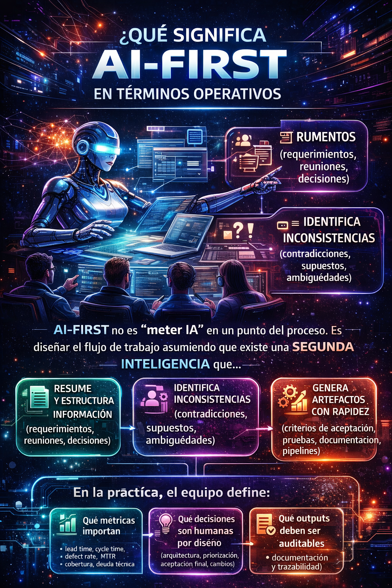
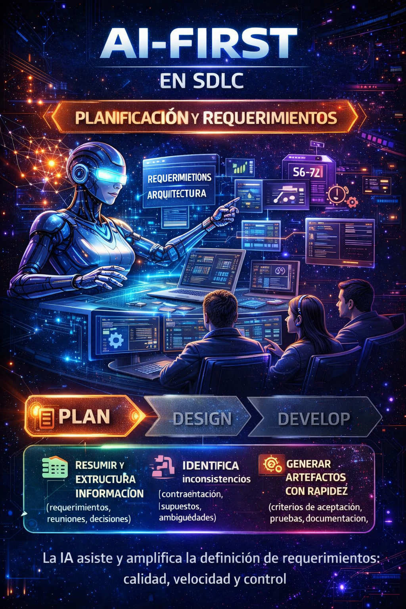
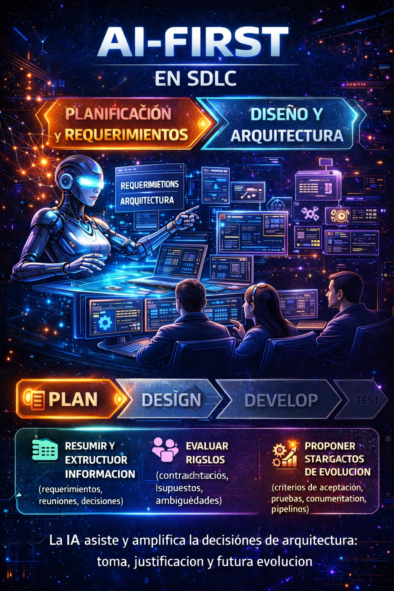

# AI-First en el SDLC: Una reforma silenciosa en el desarrollo de software

## Introducción  
### AI-First en el SDLC: más allá del hype, hacia una adopción consciente

Uno de los principales errores que he observado en las organizaciones al intentar incorporar inteligencia artificial en el desarrollo de software no es tecnológico, sino estratégico. El problema no está en la herramienta, sino en **el enfoque con el que se adopta**.

Cuando una organización no tiene claro **cómo mide su productividad**, difícilmente podrá identificar **en qué etapas del ciclo de vida del desarrollo la IA puede aportar valor real**. Este vacío suele derivar en escenarios complejos: silos entre equipos, una gobernanza difusa, sobredependencia tecnológica y, en el peor de los casos, sistemas difíciles de mantener debido a un uso descontrolado de la IA, sin una visión clara de sus verdaderas capacidades y límites.

Es precisamente por esto que hablo de **AI-First** y no simplemente de “uso de IA”. El enfoque AI-First no se trata de escribir código más rápido o generar más líneas de código. Desde mi experiencia, la inteligencia artificial puede —y debe— integrarse **en cada una de las etapas del SDLC**, desde la obtención y análisis de requerimientos, pasando por el diseño, desarrollo y pruebas, hasta llegar a la observabilidad y operación en ambientes productivos.

El verdadero punto de inflexión para mí ocurrió con la aparición de los **modos Agent**. Fue en ese momento cuando la IA dejó de sentirse como una herramienta reactiva y comenzó a comportarse como un **asistente cognitivo**: un segundo cerebro artificial que acompaña al pensamiento humano durante todo el proceso de desarrollo.

Recuerdo claramente una experiencia reciente, hace aproximadamente cuatro meses, durante la definición de requerimientos para un proyecto de **ciberseguridad y gobernanza de datos en sistemas productivos**. En ese contexto, la interacción con agentes de IA permitió reducir significativamente los tiempos de análisis, establecer criterios de aceptación mucho más sólidos, identificar riesgos tempranos de desarrollo y detectar oportunidades de mejora a nivel arquitectónico. El resultado no fue solo eficiencia operativa, sino un requerimiento final más robusto y, sobre todo, un producto con mayor valor para el usuario final.

Dentro de este contexto, he decidido centrar este análisis en dos asistentes que representan claramente esta evolución: **Project Bob** y **GitHub Copilot Agents**.

En particular, Project Bob encarna de forma muy clara el enfoque AI-First. He tenido la oportunidad de trabajar directamente con él y experimentar cómo es capaz de tomar un requerimiento de alto nivel, descomponerlo en tareas concretas, generar un plan de ejecución y acompañar cada actividad hasta su resolución completa. No se trata solo de generar código, sino de **entender el problema, planificar el trabajo y ejecutar con contexto**.

Por su parte, GitHub Copilot Agents me permitió delegar tareas de desarrollo de forma asíncrona: realizar una solicitud, permitir que el agente trabajara en segundo plano, aplicar los cambios necesarios y luego entrar yo en una fase de revisión y validación. Esta dinámica transformó mi forma de trabajar, optimizando tiempos y permitiéndome enfocar mi atención en decisiones de mayor valor mientras el desarrollo continuaba sin interrupciones.

Este blog nace precisamente de esa experiencia: no desde la teoría, sino desde la práctica. Desde la vivencia real de cómo un enfoque AI-First, correctamente aplicado, puede redefinir la forma en que concebimos el ciclo de vida del desarrollo de software.

#### Qué significa “AI-First” en términos operativos
AI-First no es simplemente “meter IA” en un punto aislado del proceso ni agregar una herramienta más al stack. AI-First implica diseñar el flujo de trabajo completo asumiendo que existe una segunda inteligencia, artificial, que colabora activamente con el pensamiento humano a lo largo de todo el SDLC.

Este enfoque parte de una premisa clave: la IA no es un reemplazo del ingeniero, sino un amplificador del razonamiento, capaz de absorber carga operativa, reducir fricción cognitiva y acelerar la generación de artefactos, permitiendo que el equipo humano se concentre en análisis, validación y toma de decisiones.

Desde una perspectiva operativa, esta segunda inteligencia es capaz de:
- Resumir y estructurar información proveniente de múltiples fuentes como requerimientos, reuniones técnicas, decisiones arquitectónicas y discusiones funcionales. Esto reduce la pérdida de contexto y evita que el conocimiento crítico quede disperso o dependa exclusivamente de la memoria de las personas.
- Identificar inconsistencias en etapas tempranas del proceso: contradicciones entre requerimientos, supuestos no explícitos, ambigüedades en el lenguaje o decisiones que no están alineadas con el contexto técnico o del negocio.
- Generar artefactos con rapidez y coherencia, como criterios de aceptación, documentación técnica, casos de prueba, pipelines CI/CD e infraestructura como código. La velocidad aquí no es el objetivo final, sino un medio para liberar tiempo y foco cognitivo.
- Apoyar la toma de decisiones proponiendo alternativas, señalando riesgos técnicos, operativos o de mantenibilidad, y exponiendo impactos potenciales, sin reemplazar al responsable final de la decisión.

AI-First no elimina la responsabilidad humana; la hace más explícita.

##### AI-First exige definiciones claras desde el equipo y la organización
Para que este enfoque funcione de forma sana y sostenible, no basta con adoptar herramientas. Es necesario que el equipo —y la organización— definan explícitamente ciertos principios operativos.

En la práctica, esto exige acordar con claridad:
- Qué métricas importan realmente. No solo métricas de velocidad, sino indicadores que reflejen calidad y sostenibilidad, como lead time, cycle time, defect rate, MTTR, cobertura de pruebas y nivel de deuda técnica. La IA debe alinearse a estas métricas, no distorsionarlas.
- Qué decisiones son humanas por diseño. Arquitectura, priorización, criterios de aceptación finales, aprobación de cambios y liberaciones deben permanecer bajo control humano. La IA puede proponer, analizar y cuestionar, pero no decidir.
- Qué outputs deben ser auditables y trazables. Documentación, decisiones técnicas, criterios de aceptación, cambios relevantes y justificaciones deben poder revisarse, versionarse y explicarse. La trazabilidad es clave para gobernanza, calidad y confianza.

##### AI-First como cambio cultural, no solo técnico
Adoptar AI-First implica también un cambio cultural profundo. El desarrollador deja de ser un ejecutor reactivo y pasa a ser un orquestador del proceso, responsable de validar, interpretar y decidir sobre los resultados generados por la IA. En este modelo, el valor no está en quién escribe más código, sino en quién formula mejores preguntas, detecta riesgos antes y toma decisiones más conscientes. AI-First, en términos operativos, no es automatización sin control. Es colaboración estructurada entre inteligencia humana y artificial, con reglas claras, responsabilidades explícitas y un objetivo común: construir software más robusto, sostenible y alineado con el negocio.

<figure>

<figcaption>Fig 1. Infografía de AI-First.</figcaption>
</figure>

Para entender mejor cómo AI-First puede integrarse en cada etapa del SDLC, en las siguientes secciones analizaré con más detalle su aplicación práctica en las fases de: Requerimientos, Diseño, Desarrollo, Pruebas y Observabilidad/Operación.

## SDLC – Planificación y Requerimientos  
### Donde realmente empieza (o se rompe) un proyecto

Desde mi experiencia, muchos de los problemas que aparecen durante el desarrollo de software **no nacen en el código**, sino mucho antes: en una **definición deficiente de requerimientos**. Es en esta etapa donde se sientan las bases para todo lo que vendrá después, y donde los errores pueden tener un impacto desproporcionado en términos de tiempo, costo y calidad del producto final.

Uno de los errores más comunes es la **ambigüedad**. Requerimientos redactados de forma subjetiva, abiertos a interpretación, provocan que cada miembro del equipo construya una visión distinta del mismo problema. El resultado es una fragmentación temprana del entendimiento que luego se traduce en retrabajo, fricción y desviaciones constantes.

A esto se suma una práctica muy arraigada en muchas organizaciones: **sesiones extensas para levantar requerimientos**, largas reuniones que terminan generando distracción, cansancio y pérdida de foco. Paradójicamente, mientras más largas son estas sesiones, menos clara suele ser la comprensión final del requerimiento. El equipo asiste, pero no siempre internaliza.

Otro punto crítico es el **factor tiempo**. Existe, en muchos casos, una brecha considerable entre el momento en que se define un requerimiento y el instante en que realmente se desarrolla. En ese intervalo se pierden acuerdos, matices y decisiones importantes. Los detalles —que suelen ser los más valiosos— se diluyen cuando no existen notas precisas, documentación estructurada o un “artefacto vivo” que guíe el desarrollo.

### AI-First como catalizador de claridad

Es precisamente en este punto donde un enfoque **AI-First** empieza a marcar una diferencia real. En lugar de ver la IA como una herramienta más para “escribir requisitos”, la adopción AI-First implica **replantear todo el proceso de definición de requerimientos**, integrando la inteligencia artificial como un colaborador activo desde el inicio.

Cuando la inteligencia artificial se incorpora correctamente en la fase de planificación, los avances son significativos. La IA permite **mejorar sustancialmente la redacción de los requerimientos**, ayudando a expresar ideas de forma más clara, estructurada y objetiva. Al reducir la ambigüedad en el lenguaje, se disminuye también la subjetividad en la interpretación.

Esto tiene un efecto directo en la dinámica del equipo: al **agilizar los procesos de redacción**, el tiempo deja de invertirse en “*cómo escribir*” y se concentra en **analizar el problema**, cuestionarlo y validarlo. La IA no reemplaza el análisis, lo potencia.

En mi experiencia, herramientas como **Project Bob** van mucho más allá de documentar. Bob es capaz de:

- Redactar requerimientos claros y bien estructurados  
- Proponer criterios de aceptación concretos y verificables  
- Explicar y documentar el contexto funcional y técnico  
- Relacionar el requerimiento directamente con el código existente  

Todo esto lo hace con una velocidad y profundidad que difícilmente podría alcanzar un solo miembro del equipo en el mismo tiempo.

### Del requerimiento a las tareas, antes de que existan

Un punto especialmente relevante es la capacidad de la IA para **identificar trabajo antes de que sea tangible**. Al analizar la necesidad, el contexto del sistema y el código existente, Project Bob puede anticipar tareas, dependencias y áreas de impacto incluso antes de que el equipo las haya formalizado.

Además, la detección de requerimientos ambiguos prácticamente se reduce al mínimo. Al tener una visión integral del proyecto, la IA identifica frases vagas, supuestos implícitos o contradicciones, ayudando a depurarlas desde el inicio.

### Riesgos reales y límites necesarios

Ahora bien, adoptar IA en esta etapa no está exento de riesgos.

El primero es conocido: **las alucinaciones**. La IA puede generar información incorrecta, incompleta o simplemente inexacta. Aquí es donde el **criterio técnico humano** se vuelve irremplazable. Ningún output generado por IA debería considerarse una verdad absoluta sin pasar por un proceso de validación consciente.

El segundo riesgo es más sutil: la IA puede proponer soluciones **eficaces**, pero no necesariamente **eficientes**. Una solución puede funcionar y aun así comprometer la mantenibilidad, la escalabilidad o la calidad a largo plazo. Evaluar esta diferencia requiere experiencia, contexto y visión arquitectónica; atributos profundamente humanos.

Por eso, el límite es claro: la IA **asiste**, pero **no decide**. El análisis crítico y la toma de decisiones siguen siendo responsabilidad del equipo. No se trata de reemplazar el pensamiento humano, sino de aceptar que ahora trabajamos con **dos formas de pensamiento complementarias**: el humano y el artificial.

#### Técnicas prácticas para hacer “requerimientos AI-First” sin perder control
Adoptar un enfoque AI-First en la definición de requerimientos no significa ceder el control del proceso a la inteligencia artificial. Por el contrario, exige más disciplina, más claridad y mejores prácticas para garantizar que los outputs de la IA sean útiles, verificables y sostenibles en el tiempo.

Las siguientes técnicas han demostrado ser clave para lograr ese equilibrio:
- **Estandarización**:
    El primer paso para reducir ambigüedad es estandarizar la forma en que se expresan los requerimientos. Utilizar plantillas de historias de usuario con estructura clara (Quién / Qué / Por qué) obliga a explicitar el valor de negocio y el alcance funcional. Complementar esto con una definición de Done compartida y criterios de aceptación en formato Given / When / Then permite que la IA genere requerimientos más precisos y, al mismo tiempo, facilita su validación por parte del equipo humano. La estandarización no limita la creatividad; reduce la interpretación subjetiva y crea un lenguaje común entre negocio, desarrollo y QA.
- **Prompting estructurado**:
    La calidad de los requerimientos generados por la IA depende directamente de la calidad del prompt. En un enfoque AI-First, el prompting deja de ser improvisado y se convierte en una práctica estructurada. Solicitudes explícitas como “elimina ambigüedad”, “lista supuestos”, “lista preguntas abiertas” o “propón criterios verificables” obligan a la IA a razonar sobre el texto, no solo a reescribirlo. Este tipo de prompts convierte a la IA en un revisor crítico del requerimiento, ayudando a detectar vacíos antes de que se conviertan en problemas durante el desarrollo.
- **Trazabilidad**: 
    Un requerimiento AI-First debe ser completamente trazable. Cada criterio de aceptación debe mapearse claramente a: 
    - Casos de prueba (unitarios, de integración o funcionales). 
    - Cambios específicos en el código.
    
    Esta trazabilidad permite validar que lo que se construyó responde exactamente a lo que se definió y evita que los requerimientos se queden como documentos aislados sin impacto real. Además, facilita auditorías, revisiones técnicas y análisis de impacto ante cambios futuros.
- **Artefactos vivos**:
    La salida de la IA no debe quedarse en chats, documentos sueltos o notas temporales. Convertir esos outputs en artefactos vivos, versionados dentro de un repositorio, es fundamental para preservar el contexto a lo largo del tiempo. Documentación, criterios de aceptación y decisiones relevantes deben evolucionar junto con el código. De esta forma, cuando el desarrollo se retoma semanas o meses después, el equipo no depende de la memoria individual ni de interpretaciones tardías, sino de una fuente única, actualizada y confiable.

<figure>

<figcaption>Fig 2. AI-First en etapa de planificación y requerimientos.</figcaption>
</figure>

## SDLC – Diseño y Arquitectura  
### Cuando la IA deja de dibujar por nosotros y empieza a hacernos pensar mejor

La etapa de diseño y arquitectura suele ser una de las más complejas del SDLC. No porque falten ideas, sino porque **plasmar una visión conceptual en una propuesta técnica clara y bien estructurada** consume una enorme cantidad de tiempo y energía.

En muchas ocasiones, el reto no está en definir la solución, sino en **traducirla a documentos, diagramas, mockups y artefactos** que permitan analizarla, comunicarla y validarla. Con la llegada de la IA, este esfuerzo cambia radicalmente. Las tareas de redacción, diagramación y construcción de mockups se agilizan de forma significativa, reduciendo el tiempo invertido en “dibujar” la solución y permitiendo enfocarnos en lo que realmente aporta valor: **analizar, cuestionar y mejorar el diseño**.

Este cambio es clave. Cuando dejamos de invertir horas en actividades mecánicas, ganamos espacio mental para revisar puntos críticos, ajustar decisiones arquitectónicas y evaluar alternativas con mayor profundidad.

### La IA como catalizador del pensamiento arquitectónico

Desde mi experiencia, la IA aporta valor en esta etapa de múltiples formas. En primer lugar, **ayuda a estructurar ideas**. Muchas veces tenemos el diseño claro en la cabeza, pero no necesariamente organizado. La IA permite ordenar ese pensamiento, identificar huecos, proponer mejoras y, algo muy importante, **forzarnos a justificar decisiones** que antes dábamos por sentadas.

Es especialmente interesante observar cómo una segunda inteligencia —en este caso artificial— **cuestiona nuestros propios planteamientos**. Al proponer patrones, evaluar diseños o contrastar enfoques, la IA genera una especie de “auto-cuestionamiento asistido” que termina fortaleciendo la arquitectura final. No porque tenga la razón absoluta, sino porque nos obliga a pensar mejor.

Aquí es donde herramientas como **Project Bob** muestran una ventaja clara. Al tener contexto completo del proyecto —requerimientos, código, dependencias— Bob puede identificar **riesgos técnicos que no siempre son evidentes a simple vista**. En uno de mis proyectos, por ejemplo, detectó un posible problema de crecimiento de datos relacionado con el manejo de JWT, donde la llave tenía riesgo de desbordamiento. Ese hallazgo fue crítico: de no haberse identificado a tiempo, habría provocado truncamientos y problemas serios en producción.

Este tipo de aportes no sustituyen al arquitecto, pero sí **amplían su campo de visión**.

### Del requerimiento a las tareas, antes de que existan
Un punto que se vuelve poderoso en arquitectura es que, si la IA ya “entendió” requerimientos y código, puede **anticipar impactos**: módulos afectados, contratos a modificar, puntos de integración, y riesgos de performance o seguridad. Esto cambia la forma de planear: en lugar de descubrir impacto tarde, lo discutes temprano.

### Riesgos y límites
Uno de los errores más comunes es caer en arquitecturas **eficaces pero no eficientes**, o generar una dependencia excesiva donde el equipo no comprende el producto. Por eso la IA puede sugerir y observar, pero la decisión debe ser humana.

#### Checklist AI-First para decisiones de arquitectura
Adoptar un enfoque AI-First en arquitectura no significa delegar el diseño a la inteligencia artificial. Significa usar la IA como un mecanismo de contraste, validación y ampliación del pensamiento arquitectónico, manteniendo siempre al arquitecto como responsable final de la decisión.

Este checklist sirve como guía práctica para incorporar la IA en decisiones de arquitectura **sin perder control ni criterio técnico**.
- **Alternativas comparadas** (mínimo 2):
    En un enfoque AI-First, la IA debe ser utilizada para proponer y contrastar múltiples alternativas arquitectónicas, no para imponer una única solución. Solicitar explícitamente al agente que plantee al menos dos opciones obliga a analizar distintos enfoques, patrones y trade-offs. La IA puede describir ventajas, desventajas y supuestos de cada alternativa, pero la elección final corresponde siempre al arquitecto, quien debe evaluar estas opciones en función del contexto organizacional, técnico y de negocio.
- **Riesgos**:
    Toda decisión arquitectónica debe evaluarse desde una perspectiva de riesgo integral. La IA puede ayudar a identificar y clasificar riesgos en áreas como:
    - Performance: cuellos de botella, latencia, escalabilidad.
    - Seguridad: exposición de datos, superficies de ataque, cumplimiento normativo.
    - Costo: sobreaprovisionamiento, consumo innecesario de recursos, licenciamiento.
    - Lock-in: dependencia excesiva de proveedores, frameworks o servicios específicos.
    - Operación: complejidad de soporte, monitoreo, recuperación ante fallos.
    
    La IA puede señalar estos riesgos, pero corresponde al arquitecto priorizarlos, aceptarlos o mitigarlos de acuerdo con la estrategia de la organización.
- **Evolución**:
    Una arquitectura AI-First debe diseñarse pensando en el cambio. La IA puede apoyar en la definición de estrategias de evolución, respondiendo preguntas clave como:
    - ¿Cómo se versionan las APIs sin romper consumidores?
    - ¿Cómo se gestionan migraciones graduales?
    - ¿Qué nivel de compatibilidad hacia atrás es necesario?
    
    Diseñar para la evolución evita arquitecturas rígidas y reduce el costo de cambio a mediano y largo plazo, un aspecto crítico en entornos enterprise.
- **Observabilidad by design**:
    La observabilidad no debe ser un añadido posterior. En un enfoque AI-First, la arquitectura debe incorporar desde el diseño:
    - Logs estructurados y trazables.
    - Métricas clave alineadas a objetivos de negocio y técnicos.
    - Trazas distribuidas para entender flujos completos.
    - SLOs claros que definan expectativas de servicio.
    
    La IA puede ayudar a definir qué observar, cómo correlacionar eventos y qué umbrales son relevantes, pero es el arquitecto quien decide qué información es crítica para operar y evolucionar el sistema.

<figure>

<figcaption>Fig 3. AI-First en etapa de Diseño del SDLC.</figcaption>
</figure>

## Resumen y próximos blogs
En este blog he compartido mi visión sobre cómo un enfoque **AI-First puede transformar las etapas de Planificación, Requerimientos y Diseño dentro del SDLC**. He enfatizado la importancia de adoptar la IA no como una herramienta aislada, sino como un **colaborador activo que potencia el pensamiento humano**, ayudando a estructurar ideas, identificar riesgos y generar artefactos de forma más eficiente. Sin embargo, también he subrayado los riesgos asociados y la necesidad de mantener siempre el **control humano sobre las decisiones críticas**. En el **próximo blog**, profundizaré en cómo **AI-First transforma las etapas de Desarrollo, Pruebas y Observabilidad/Operación**, explorando casos prácticos, herramientas clave y mejores prácticas para maximizar el valor de la inteligencia artificial en cada fase del SDLC. **¡No te lo pierdas!**

Como viste en este blog, adoptar un enfoque AI-First no es simplemente una cuestión tecnológica, sino estratégica y cultural, esto desde las bases mismas del ciclo de vida del desarrollo de software, al final:

> **No se trata solo de modernizar el código, sino de modernizar la forma en que pensamos y trabajamos.**