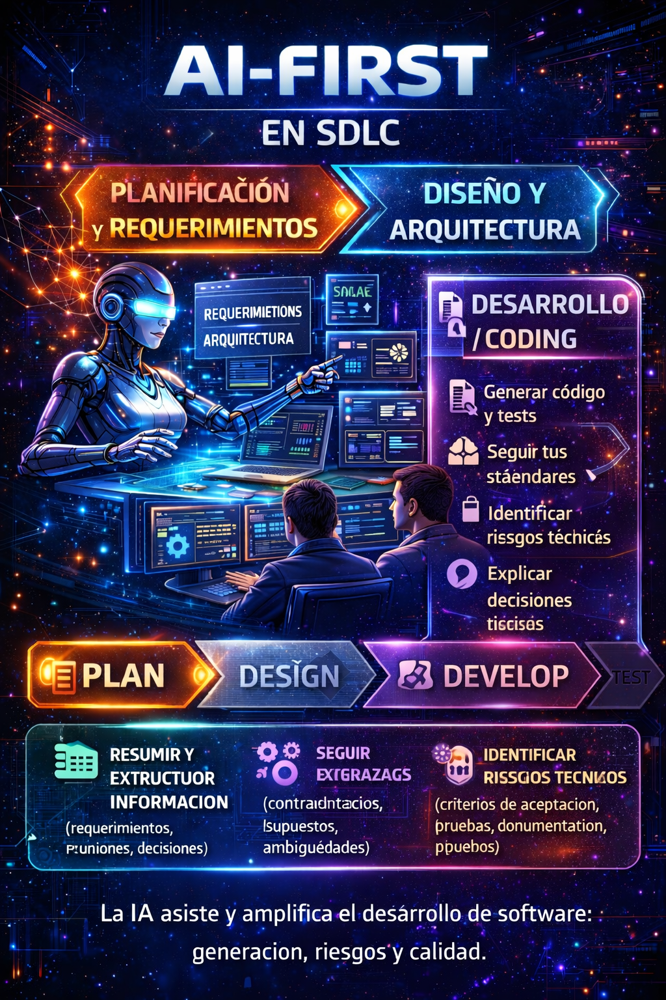
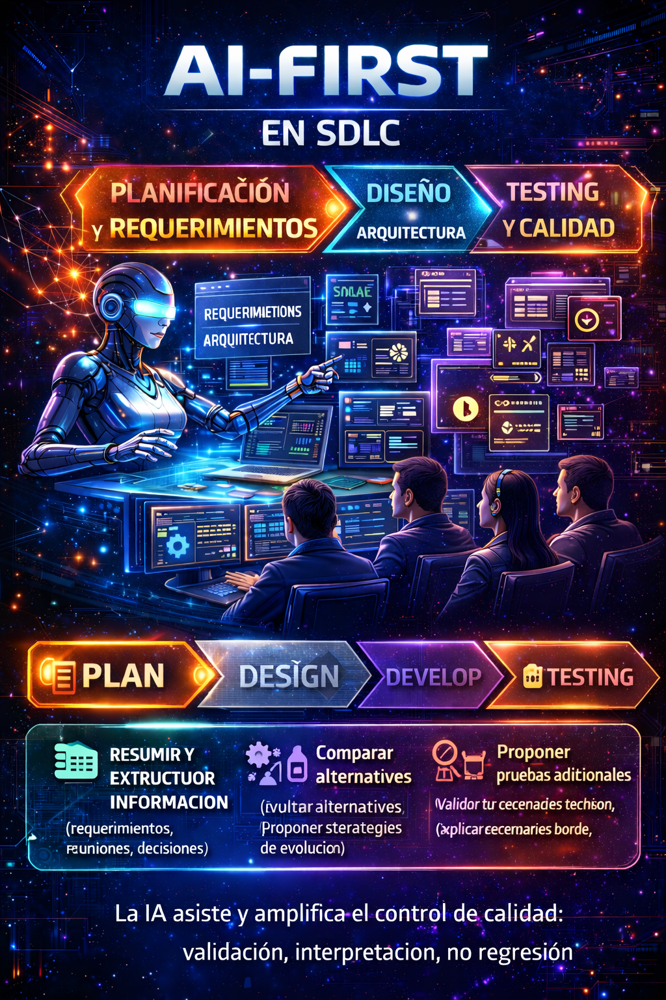

# AI-First in the SDLC: A silent reform in software development (Part II)

Continuing our exploration of the AI-First approach in the software development life cycle (SDLC), in this second part we dive into the critical phases of **Development and Testing**. These stages are fundamental, since they are where ideas materialize and the quality of the final product is ensured. Integrating artificial intelligence (AI) tools into these phases not only optimizes processes, but also redefines the way developers work and collaborate.

## SDLC – Development / Coding  
### Programming with AI is not about writing faster, it's about understanding better

The impact of the AI-First approach in the development stage has been, from my experience, **profound and transformative**. It is not just about speed, but about **how it changes the way we understand the problem before writing a single line of code**.

When we work with well-structured user stories —like the ones **Project Bob** generates and standardizes— the pre-development analysis becomes much more agile. Understanding the scope, the acceptance criteria, and the business rules stops being a fuzzy process and becomes a clear starting point shared by the whole team.

In many projects, we developers end up "specializing" in very specific business particularities. Sometimes, it is even assumed that we must fully master the technical or operational language of the functional area. With the help of AI agents, this process is greatly facilitated: the assistants not only explain the context, but **translate business language into technical logic**, and even propose base code for complex algorithms.  
This frees up valuable time, which can be invested in higher-level analysis and in decisions that truly add value.

### From writing code to solving problems with context

The differences between using traditional assistants and AI-First agents are notable.

With Project Bob, we are not talking about a simple coding assistant, but about **an artificial brain integrated into the team**. Bob does not merely execute instructions; it analyzes requirements, proposes solutions, contextualizes the problem, and accompanies the development process from start to finish.

For its part, **GitHub Copilot Agents** brings a different but complementary dynamic: the ability to **delegate development tasks**. You can assign an activity, let the agent work in the background, and then come back to review and validate the changes. This asynchrony completely changes time management for the developer and the technical lead.

Both approaches elevate the developer's role: we stop focusing solely on writing code and move on to **orchestrating solutions**.

### AI applied to the entire code cycle

In practice, I have used AI in practically all the key development activities:

- Initial code generation  
- Refactoring  
- Explanation of legacy code  
- Modernization of applications in IBM i, .NET, and Java  

These processes become significantly more agile, but there is a critical point that marks the difference between success and failure: **the quality of the prompt**.  
Defining clear, detailed prompts with good context is fundamental. AI is only as good as the information it receives; without context, the results lose value.

### Speed or quality? The false dichotomy

The question is often raised: does AI increase the speed or the quality of development?  
From my experience, this is a **false dichotomy**.

Both concepts are deeply related. Higher-quality code reduces technical debt, decreases attention to incidents, vulnerabilities, and rework, and that, inevitably, translates into **less time consumption** in the long run. Speed is not just about writing fast, it's about **delivering sustained value over time**.

With AI, I have observed increases on both fronts: we produce more in less time, but —more importantly— we produce **better code**. AI reinforces compliance with standards, organizational guidelines, best practices, documentation, and tests (unit, integration, and coverage). All of this considerably raises the quality of the final product.

### The non-negotiable principle: human validation

However, there is a principle that must not be broken: **every AI proposal must go through human review**.

Reviews, approvals, and conscious analysis remain indispensable. Not only to validate that the code works, but to **understand it**, maintain it, and be able to evolve it in the future. AI accelerates development, but the final responsibility still belongs to the human team.

The true value of the AI-First approach in development is not in delegating thinking, but in **expanding it**, always with judgment, context, and responsibility.

#### Concrete practices to avoid technical debt with AI
Using artificial intelligence in software development can accelerate value delivery, but without technical discipline it can become a massive generator of technical debt. In an AI-First approach, technical debt does not disappear: it is amplified if there is no control.

The following practices help leverage AI without compromising the maintainability, quality, and evolution of the software.
- **Mandatory Pull Requests** with a checklist (security, performance, tests, standards)
    All AI-generated or AI-assisted code must go through a formal Pull Request process. This is not optional in an AI-First environment. 
    The checklist must include, at a minimum:
    - Security validation (injections, secrets, vulnerable dependencies).
    - Performance considerations (algorithmic complexity, resource usage, latency).
    - Evidence of tests (unit, integration, coverage).
    - Compliance with coding and architecture standards.
    
    AI can generate code quickly, but the PR ensures that the team consciously understands, validates, and accepts that code.
- **Prompt review**: document "good" prompts by task type
    In an AI-First environment, prompts become reusable technical assets. Documenting effective prompts for tasks such as refactoring, test generation, legacy analysis, or technical documentation allows you to:
    - Reduce variability in results.
    - Ensure consistency across teams.
    - Create an organizational "prompting library".

    Prompting stops being individual improvisation and becomes part of the engineering process.
- **Style rules and linters**: have AI produce within your standards
    AI must adapt to the team, not the other way around. Integrating linters, formatters, and style rules into the pipeline ensures that the generated code:
    - Respects naming conventions.
    - Follows defined architectural patterns.
    - Complies with internal security and quality guides.

    In an AI-First model, linters act as automatic guardrails for AI and developers.
- **Tests first**: ask AI for tests before or alongside the code
    A powerful practice is to require AI to generate the test cases first or to deliver them together with the implementation.
    This:
    - Forces you to define the expected behavior before coding.
    - Reduces regressions.
    - Turns AI into a generator of executable specifications.
    
    In an AI-First approach, tests are not an afterthought, but a primary development artifact.
- **Explainability**: require "explain why you did it this way" as part of the PR
    AI must justify its technical decisions. Explicitly asking for an explanation of the design, algorithms, and trade-offs allows you to:
    - Detect conceptual errors early.
    - Transfer knowledge to the team.
    - Avoid "magic" code that nobody understands.
    
    In an enterprise environment, unexplained code is future technical debt.
##### AI-First does not eliminate technical debt, it changes how we manage it
Technical debt will always exist, but in an AI-First context its origin changes. It no longer comes only from rushed human decisions, but also from **unsupervised automation**. These practices turn AI into a **controlled accelerator**, not a factory of accidental complexity. The goal is not to slow down productivity, but to **ensure that speed does not compromise the future of the system**.

<figure>

<figcaption>Fig 1. AI-First SDLC Development / Coding.</figcaption>
</figure>

## SDLC – Testing and Quality  
### When AI stops "testing" and starts elevating the culture of quality

For a long time, testing has been seen as a necessary stage, but frequently postponed or minimized within the SDLC. With the adoption of an AI-First approach, this perception changes significantly.

From my experience, the current maturity of AI in the testing field is **satisfactory and functional**. We are not talking only about test generation, but about much more complete support throughout the process. In the case of **Project Bob**, the support ranges from the initial configuration of the test environments and the creation of scenarios, to their **automatic execution and validation**.

One of the most valuable points is Bob's ability to **validate code against the defined test cases**, run the scenarios, and analyze the results, generating **complete and detailed reports** of the execution. This considerably reduces manual effort and, at the same time, increases the reliability of the process.

### Coverage, business rules, and forgotten scenarios

In practice, AI adds value on all the key fronts of testing:

- Test case generation  
- Detection of uncovered scenarios  
- Business rule validation  

In each of these stages, Project Bob has proven to be a solid and consistent tool. By analyzing the code and the system context, it is able to identify logical paths that would normally go unnoticed during a manual review, thus raising coverage and reducing risks.

### Quality as a habit, not an exception

One of the most interesting impacts of the AI-First approach is the **cultural change** it promotes within teams.

Project Bob, for example, **automatically includes the generation of unit tests** as a natural part of development. In addition, when a commit is made, Bob can review the introduced changes, run the associated test cases, and validate the results. This constant feedback turns quality into a **continuous habit**, not a reactive activity at the end of the cycle.

This kind of dynamic encourages teams to adopt quality practices organically, without needing to impose them as an additional burden.

### The new human role in testing

Even so, human judgment remains indispensable.

The role of the developer —and of the quality engineer— evolves. We go from being manual test executors to **analysts and interpreters of results**. The value is no longer in running a script, but in **understanding the execution reports**, interpreting the findings, and making informed decisions about the quality of the product.

AI can execute, measure, and report; the human being validates, contextualizes, and decides.  
That balance is what truly allows quality to scale without losing control.

#### How to integrate AI into the "Quality Gate"
Integrating artificial intelligence into the Quality Gate does not mean relaxing quality controls; it means **making them smarter, faster, and more consistent**. In an AI-First approach, AI acts as an **automatic quality analyst**, while the validation and final decision remain human.

These practices allow you to incorporate AI into the quality process **without compromising standards or governance**.
- Define a **minimum threshold** (coverage, linters, SAST, tests)
    Every Quality Gate must begin with clear, non-negotiable limits. Before introducing AI, the team must explicitly define:
    - Minimum test coverage percentage.
    - Mandatory linter and formatter rules.
    - Static security scans (SAST) and dependency analysis.
    - Successful execution of unit and integration tests.
    
    AI does not decide whether the threshold is acceptable; it only verifies and reports. These limits act as guardrails that protect product quality against excessive automation.
- Require an **automatic report** that AI interprets and summarizes
    Beyond generating technical results, AI must be able to interpret and synthesize them. 
    Instead of delivering only extensive logs or isolated metrics, AI can:
    - Summarize the general state of the Quality Gate.
    - Identify critical failures versus warnings.
    - Prioritize risks according to technical and functional impact.
    - Point out recurring quality trends.
    
    This summary allows developers, QA, and technical leads to make quick decisions with context, without manually reviewing large volumes of information.
- Review **edge cases**: AI proposes, QA/Dev validates
    One of AI's greatest contributions is its ability to identify edge cases that are not always obvious during test design. AI can propose extreme cases, unusual combinations, or infrequent flows, but the final validation must rest with QA and development. This model reinforces quality without replacing human judgment, combining automatic exploration capability with domain experience.
- Ensure **no regression**: regression tests per PR
    In an AI-First environment, every Pull Request must trigger automatic regression tests. 
    AI can:
    - Detect which areas of the code are affected by a change.
    - Select or generate relevant regression tests.
    - Verify that existing functionality does not break.

    This approach reduces the risk of silent regressions and turns the Quality Gate into a **continuous protection mechanism**, not just a one-time control.

<figure>

<figcaption>Fig 1. AI-First SDLC Testing / Quality.</figcaption>
</figure>

## Summary and upcoming blogs
In this second part of our series on AI-First in the SDLC, we have explored how artificial intelligence is transforming the **Development and Testing** phases. From code generation to automatic quality validation, AI not only accelerates processes, but also raises standards and changes the development culture. The human role evolves toward supervision, analysis, and informed decision-making, always maintaining control over the quality and responsibility of the final product. In the **next blog**, we will dive into the **Deployment and Maintenance** phases, where we will see how AI continues to revolutionize the software life cycle, ensuring safer deployments and proactive management of system performance and stability. **Don't miss it!**

We have seen how AI is transforming the Development and Testing phases within the SDLC, not as an isolated tool, but as a **strategic partner** that enhances human capability. The key to success lies in **combining the speed and efficiency of AI with the judgment and responsibility of the human team**, thus ensuring that software quality and sustainability are not compromised. In the end:

> **It's not just about modernizing the code, but about modernizing the way we think and work.**
