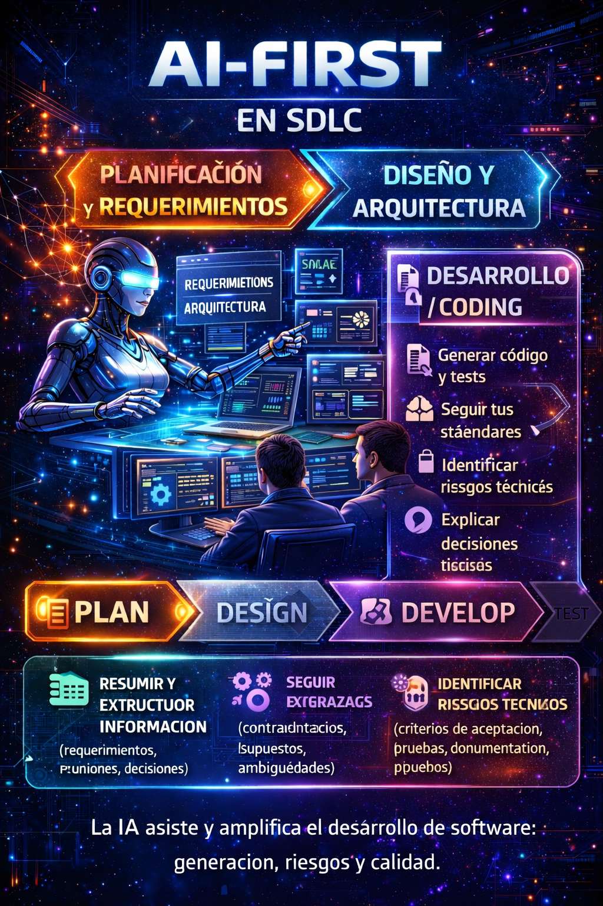
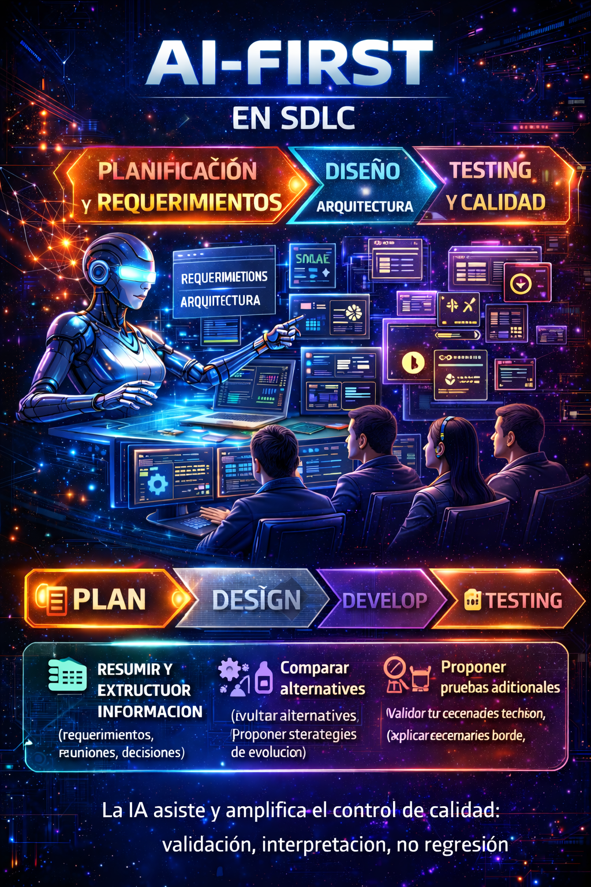

# AI-First en el SDLC: Una reforma silenciosa en el desarrollo de software (Parte II)

Continuando con nuestra exploración del enfoque AI-First en el ciclo de vida del desarrollo de software (SDLC), en esta segunda parte nos adentramos en las fases críticas de **Desarrollo y Pruebas**. Estas etapas son fundamentales, ya que es donde se materializan las ideas y se asegura la calidad del producto final. La integración de herramientas de inteligencia artificial (IA) en estas fases no solo optimiza los procesos, sino que también redefine la manera en que los desarrolladores trabajan y colaboran.

## SDLC – Desarrollo / Coding  
### Programar con IA no es escribir más rápido, es entender mejor

El impacto del enfoque AI-First en la etapa de desarrollo ha sido, desde mi experiencia, **profundo y transformador**. No se trata únicamente de velocidad, sino de **cómo cambia la forma en que entendemos el problema antes de escribir una sola línea de código**.

Cuando trabajamos con historias de usuario bien estructuradas —como las que genera y estandariza **Project Bob**— el análisis previo al desarrollo se vuelve mucho más ágil. El entendimiento del alcance, los criterios de aceptación y las reglas del negocio deja de ser un proceso difuso y pasa a ser un punto de partida claro y compartido por todo el equipo.

En muchos proyectos, los desarrolladores terminamos “especializándonos” en particularidades muy específicas del negocio. En ocasiones, incluso, se asume que debemos dominar completamente el lenguaje técnico u operativo del área funcional. Con la ayuda de agentes de IA, este proceso se facilita enormemente: los asistentes no solo explican el contexto, sino que **traducen el lenguaje del negocio a lógica técnica**, e incluso proponen código base para algoritmos complejos.  
Esto libera tiempo valioso, que puede invertirse en análisis de mayor nivel y en decisiones que realmente aportan valor.

### De escribir código a resolver problemas con contexto

Las diferencias entre usar asistentes tradicionales y agentes AI-First son notables.

Con Project Bob, no hablamos simplemente de un asistente de codificación, sino de **un cerebro artificial integrado al equipo**. Bob no se limita a ejecutar instrucciones; analiza requerimientos, propone soluciones, contextualiza el problema y acompaña el proceso de desarrollo de principio a fin.

Por su parte, **GitHub Copilot Agents** aporta una dinámica distinta pero complementaria: la posibilidad de **delegar tareas de desarrollo**. Puedes asignar una actividad, permitir que el agente trabaje en segundo plano y luego regresar a revisar y validar los cambios. Esta asincronía cambia por completo la gestión del tiempo del desarrollador y del líder técnico.

Ambos enfoques elevan el rol del desarrollador: dejamos de estar concentrados únicamente en escribir código y pasamos a **orquestar soluciones**.

### IA aplicada a todo el ciclo del código

En la práctica, he utilizado la IA en prácticamente todas las actividades clave del desarrollo:

- Generación de código inicial  
- Refactorización  
- Explicación de código legacy  
- Modernización de aplicaciones en IBM i, .NET y Java  

Estos procesos se vuelven significativamente más ágiles, pero hay un punto crítico que marca la diferencia entre el éxito y el fracaso: **la calidad del prompt**.  
Definir prompts claros, detallados y con buen contexto es fundamental. La IA es tan buena como la información que recibe; sin contexto, los resultados pierden valor.

### ¿Velocidad o calidad? La falsa dicotomía

A menudo se plantea la pregunta: ¿la IA aumenta la velocidad o la calidad del desarrollo?  
Desde mi experiencia, esta es una **falsa dicotomía**.

Ambos conceptos están profundamente relacionados. Un código de mayor calidad reduce la deuda técnica, disminuye la atención a incidentes, vulnerabilidades y retrabajos, y eso, inevitablemente, se traduce en **menor consumo de tiempo** a largo plazo. La velocidad no es solo escribir rápido, es **entregar valor sostenido en el tiempo**.

Con IA, he observado incrementos en ambos frentes: producimos más en menos tiempo, pero —más importante aún— producimos **mejor código**. La IA refuerza el cumplimiento de estándares, lineamientos organizacionales, buenas prácticas, documentación y pruebas (unitarias, de integración y de cobertura). Todo esto eleva considerablemente la calidad del producto final.

### El principio irrenunciable: validación humana

Sin embargo, hay un principio que no debe romperse: **toda propuesta de la IA debe pasar por revisión humana**.

Revisiones, aprobaciones y análisis conscientes siguen siendo indispensables. No solo para validar que el código funcione, sino para **entenderlo**, mantenerlo y poder evolucionarlo en el futuro. La IA acelera el desarrollo, pero la responsabilidad final sigue siendo del equipo humano.

El verdadero valor del enfoque AI-First en desarrollo no está en delegar el pensamiento, sino en **ampliarlo**, siempre con criterio, contexto y responsabilidad.

#### Prácticas concretas para evitar deuda técnica con IA
El uso de inteligencia artificial en el desarrollo de software puede acelerar la entrega de valor, pero sin disciplina técnica puede convertirse en un generador masivo de deuda técnica. En un enfoque AI-First, la deuda técnica no desaparece: se amplifica si no existe control.

Las siguientes prácticas ayudan a aprovechar la IA sin comprometer la mantenibilidad, la calidad y la evolución del software.
- **Pull Requests obligatorios** con checklist (seguridad, performance, pruebas, estándares)
    Todo código generado o asistido por IA debe pasar por un proceso formal de Pull Request. Esto no es opcional en un entorno AI-First. 
    El checklist debe incluir, como mínimo:
    - Validación de seguridad (inyecciones, secretos, dependencias vulnerables).
    - Consideraciones de performance (complejidad algorítmica, uso de recursos, latencia).
    - Evidencia de pruebas (unitarias, integración, cobertura).
    - Cumplimiento de estándares de codificación y arquitectura.
    
    La IA puede generar código rápidamente, pero el PR garantiza que el equipo comprenda, valide y acepte conscientemente ese código.
- **Revisión de prompts**: documentar prompts “buenos” por tipo de tarea
    En un entorno AI-First, los prompts se convierten en activos técnicos reutilizables. Documentar prompts efectivos para tareas como refactorización, generación de tests, análisis de legacy o documentación técnica permite:
    - Reducir variabilidad en resultados.
    - Asegurar consistencia entre equipos.
    - Crear una “biblioteca de prompting” organizacional.

    El prompting deja de ser improvisación individual y pasa a ser parte del proceso de ingeniería.
- **Reglas de estilo y linters**: que la IA produzca dentro de tus estándares
    La IA debe adaptarse al equipo, no al revés. Integrar linters, formateadores y reglas de estilo en el pipeline asegura que el código generado:
    - Respete convenciones de naming.
    - Siga patrones arquitectónicos definidos.
    - Cumpla guías de seguridad y calidad internas.

    En un modelo AI-First, los linters actúan como guardrails automáticos para la IA y los desarrolladores.
- **Pruebas primero**: pedir a la IA tests antes o junto con el código
    Una práctica poderosa es exigir que la IA genere primero los casos de prueba o que los entregue junto con la implementación.
    Esto:
    - Obliga a definir el comportamiento esperado antes de codificar.
    - Reduce regresiones.
    - Convierte la IA en un generador de especificaciones ejecutables.
    
    En un enfoque AI-First, los tests no son un afterthought, sino un artefacto primario del desarrollo.
- **Explicabilidad**: exigir “explica por qué lo hiciste así” como parte del PR
    La IA debe justificar sus decisiones técnicas. Pedir explícitamente una explicación del diseño, algoritmos y trade-offs permite:
    - Detectar errores conceptuales tempranos.
    - Transferir conocimiento al equipo.
    - Evitar código “mágico” que nadie entiende.
    
    En un entorno enterprise, código sin explicación es deuda técnica futura.
##### AI-First no elimina deuda técnica, cambia cómo la gestionamos
La deuda técnica siempre existirá, pero en un contexto AI-First su origen cambia. Ya no solo proviene de decisiones humanas apresuradas, sino también de **automatización sin supervisión**. Estas prácticas convierten a la IA en un **acelerador controlado**, no en una fábrica de complejidad accidental. El objetivo no es frenar la productividad, sino **garantizar que la velocidad no comprometa el futuro del sistema**.

<figure>

<figcaption>Fig 1. AI-First SDLC Desarrollo / Coding.</figcaption>
</figure>

## SDLC – Testing y Calidad  
### Cuando la IA deja de “probar” y empieza a elevar la cultura de calidad

Durante mucho tiempo, las pruebas han sido vistas como una etapa necesaria, pero frecuentemente postergada o minimizada dentro del SDLC. Con la adopción de un enfoque AI-First, esta percepción cambia de forma significativa.

Desde mi experiencia, la madurez actual de la IA en el ámbito de testing es **satisfactoria y funcional**. No hablamos únicamente de generación de pruebas, sino de un acompañamiento mucho más completo a lo largo del proceso. En el caso de **Project Bob**, el soporte va desde la configuración inicial de los entornos de prueba, la creación de escenarios, hasta la **ejecución y validación automática** de los mismos.

Uno de los puntos más valiosos es la capacidad de Bob para **validar el código contra los casos de prueba definidos**, ejecutar los escenarios y analizar los resultados, generando **informes completos y detallados** de la ejecución. Esto reduce considerablemente el esfuerzo manual y, al mismo tiempo, aumenta la confiabilidad del proceso.

### Cobertura, reglas de negocio y escenarios olvidados

En la práctica, la IA aporta valor en todos los frentes clave del testing:

- Generación de casos de prueba  
- Detección de escenarios no cubiertos  
- Validación de reglas de negocio  

En cada una de estas etapas, Project Bob ha demostrado ser una herramienta sólida y consistente. Al analizar el código y el contexto del sistema, es capaz de identificar caminos lógicos que normalmente podrían pasar desapercibidos durante una revisión manual, elevando así la cobertura y reduciendo riesgos.

### Calidad como hábito, no como excepción

Uno de los impactos más interesantes del enfoque AI-First es el **cambio cultural** que promueve dentro de los equipos.

Project Bob, por ejemplo, **incluye de forma automática la generación de pruebas unitarias** como parte natural del desarrollo. Además, cuando se realiza un commit, Bob puede revisar los cambios introducidos, ejecutar los casos de prueba asociados y validar los resultados. Esta retroalimentación constante convierte la calidad en un **hábito continuo**, no en una actividad reactiva al final del ciclo.

Este tipo de dinámicas fomenta que los equipos adopten prácticas de calidad de manera orgánica, sin necesidad de imponerlas como una carga adicional.

### El nuevo rol humano en testing

Aun así, el criterio humano sigue siendo indispensable.

El rol del desarrollador —y del ingeniero de calidad— evoluciona. Pasamos de ser ejecutores manuales de pruebas a **analistas e intérpretes de resultados**. El valor ya no está en correr un script, sino en **entender los informes de ejecución**, interpretar los hallazgos y tomar decisiones informadas sobre la calidad del producto.

La IA puede ejecutar, medir y reportar; el ser humano valida, contextualiza y decide.  
Ese equilibrio es lo que realmente permite que la calidad escale sin perder control.

#### Cómo integrar IA al “Quality Gate”
Integrar inteligencia artificial al Quality Gate no significa relajar los controles de calidad; significa **hacerlos más inteligentes, más rápidos y más consistentes**. En un enfoque AI-First, la IA actúa como un **analista automático de calidad**, mientras que la validación y la decisión final siguen siendo humanas.

Estas prácticas permiten incorporar IA al proceso de calidad **sin comprometer estándares ni gobernanza**.
- Definir un **umbral mínimo** (coverage, linters, SAST, tests)
    Todo Quality Gate debe comenzar con límites claros y no negociables. Antes de introducir IA, el equipo debe definir explícitamente:
    - Porcentaje mínimo de cobertura de pruebas.
    - Reglas de linters y formateadores obligatorios.
    - Escaneos de seguridad estática (SAST) y análisis de dependencias.
    - Ejecución exitosa de pruebas unitarias y de integración.
    
    La IA no decide si el umbral es aceptable; solo verifica y reporta. Estos límites actúan como guardrails que protegen la calidad del producto frente a automatizaciones excesivas.
- Exigir un **reporte automático** que la IA interprete y resuma
    Más allá de generar resultados técnicos, la IA debe ser capaz de interpretarlos y sintetizarlos. 
    En lugar de entregar únicamente logs extensos o métricas aisladas, la IA puede:
    - Resumir el estado general del Quality Gate.
    - Identificar fallos críticos versus advertencias.
    - Priorizar riesgos según impacto técnico y funcional.
    - Señalar tendencias recurrentes de calidad.
    
    Este resumen permite que desarrolladores, QA y líderes técnicos tomen decisiones rápidas con contexto, sin revisar manualmente grandes volúmenes de información.
- Revisar **escenarios borde**: la IA propone, el QA/Dev valida
    Uno de los mayores aportes de la IA es su capacidad para identificar escenarios borde que no siempre son evidentes durante el diseño de pruebas. La IA puede proponer casos extremos, combinaciones inusuales o flujos poco frecuentes, pero la validación final debe recaer en QA y desarrollo. Este modelo refuerza la calidad sin sustituir el criterio humano, combinando capacidad de exploración automática con experiencia de dominio.
- Asegurar **no regresión**: tests de regresión por PR
    En un entorno AI-First, cada Pull Request debe activar pruebas de regresión automáticas. 
    La IA puede:
    - Detectar qué áreas del código se ven afectadas por un cambio.
    - Seleccionar o generar tests de regresión relevantes.
    - Verificar que funcionalidades existentes no se rompan.

    Este enfoque reduce el riesgo de regresiones silenciosas y convierte el Quality Gate en un **mecanismo de protección continua**, no solo en un control puntual.

<figure>

<figcaption>Fig 1. AI-First SDLC Testing / Calidad.</figcaption>
</figure>

## Resumen y próximos blogs
En esta segunda parte de nuestra serie sobre AI-First en el SDLC, hemos explorado cómo la inteligencia artificial está transformando las fases de **Desarrollo y Pruebas**. Desde la generación de código hasta la validación automática de calidad, la IA no solo acelera los procesos, sino que también eleva los estándares y cambia la cultura del desarrollo. El rol humano evoluciona hacia la supervisión, el análisis y la toma de decisiones informadas, manteniendo siempre el control sobre la calidad y la responsabilidad del producto final. En el **próximo blog**, nos adentraremos en las fases de **Implementación y Mantenimiento**, donde veremos cómo la IA continúa revolucionando el ciclo de vida del software, asegurando despliegues más seguros y una gestión proactiva del rendimiento y la estabilidad del sistema. **¡No te lo pierdas!**

Hemos visto cómo la IA está transformando las fases de Desarrollo y Pruebas dentro del SDLC, no como una herramienta aislada, sino como un **socio estratégico** que potencia la capacidad humana. La clave del éxito radica en **combinar la velocidad y eficiencia de la IA con el criterio y responsabilidad del equipo humano**, asegurando así que la calidad y sostenibilidad del software no se vean comprometidas, al final:

> **No se trata solo de modernizar el código, sino de modernizar la forma en que pensamos y trabajamos.**