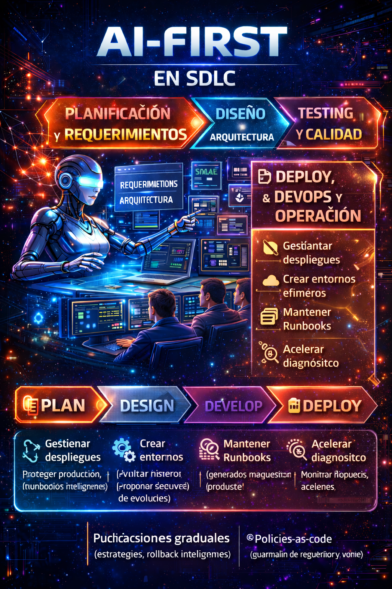
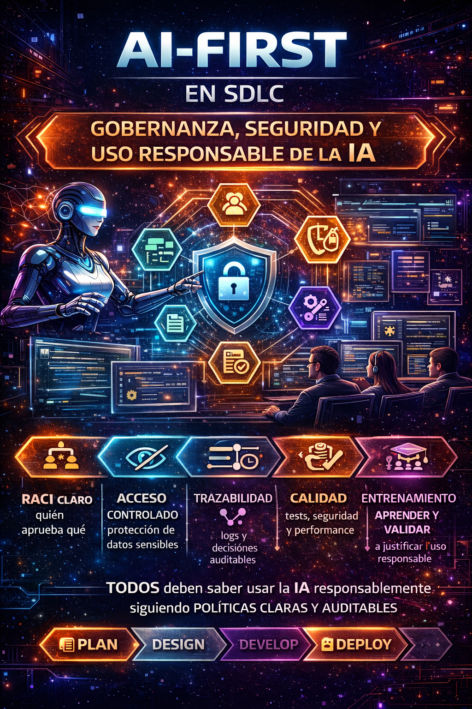

# AI-First in the SDLC: A silent reform in software development (Part III)

In the previous parts of this series, we explored how integrating **artificial intelligence (AI) into the software development life cycle (SDLC)** is transforming the way developers build, test, and maintain applications. In this third part, we will dive deeper into the **Deploy, DevOps, and Operations** phases, and we will also review critical topics such as governance, security, and ethics in the use of AI in software development.

## SDLC – Deploy, DevOps, and Operations  
### When AI accompanies software all the way to production

If there is a stage where the AI-First approach fits naturally, it is in **Deploy, DevOps, and Operations**. Here, artificial intelligence not only accelerates processes, but also **reduces friction, human errors, and rework**, directly impacting the stability of the product.

From my experience, integrating AI in this phase is practically perfect. In particular, support for **Infrastructure as Code (IaC)** makes a clear difference. With tools like **Project Bob**, generating CI/CD pipelines becomes a surprisingly simple and structured process.

Bob does not limit itself to creating a basic pipeline. Its command of technologies such as Terraform allows it to:

- Generate complete IaC  
- Define variables per environment  
- Establish validation plans  
- Automate build and teardown processes  
- Integrate tests within the deployment flow  

All of this is built coherently, considering the full life cycle of the infrastructure, not just the moment of deployment.

### Pipelines that are analyzed, not just executed

Another key point is AI's ability to **review and analyze existing pipelines**. In several scenarios, I have used AI agents to inspect CI/CD flows, identify recurring failures, and propose optimizations.  
The result is not just a pipeline that works, but a pipeline that is **more stable, predictable, and efficient**.

This kind of continuous analysis allows problems to be corrected before they turn into production incidents.

### AI in operations: observability with context

In the operations phase, the role of AI becomes even more relevant. AI agents can **automate monitoring and observability processes**, detecting anomalous behaviors in systems and classifying them intelligently.

Beyond generating alerts, AI provides context: it identifies patterns, groups related events, and proposes **response plans**. This significantly accelerates incident response and reduces the operational noise that usually affects teams.

### Deciding is still human

Even with all these advances, there is one principle that remains intact: **the final responsibility is always human**.

AI can take part in processes such as rollbacks, incident mitigation, or operational adjustments, but the decision must always rest with the people responsible for the system. The inputs, analyses, and summaries that AI generates are valuable and enrich decision-making, but **they do not replace human judgment**.

The AI-First approach in DevOps does not seek to automate responsibility, but to **enhance decision-making capacity**, relying on more complete and better-processed information.

#### AI-First use in IaC and operations without “breaking production”
Applying an AI-First approach in **Infrastructure as Code (IaC)** and in the **operation of production systems** requires a key principle: **automate without losing control**. AI can greatly accelerate and optimize these processes, but only if it is implemented with clear limits, strict validations, and explicit human responsibility.

The following practices make it possible to leverage AI in critical environments **without compromising stability, security, or operational continuity**.
- **Ephemeral environments** to validate IaC (automated plan/apply/destroy)
    Before touching production, every infrastructure definition must be validated in ephemeral environments, created and destroyed automatically.
    AI can help by generating and reviewing:
    - Execution plans (terraform plan).
    - Validations of dependencies and deployment order.
    - Full creation and teardown tests of the environment.
    
    This approach makes it possible to detect configuration errors, implicit dependencies, or unexpected costs before they impact production environments, drastically reducing operational risk.
- **Policy-as-code** (guardrails) to avoid insecure resources
    In an AI-First model, AI should not have absolute freedom to define infrastructure. 
    The use of policy-as-code establishes clear guardrails that both AI and teams must respect, such as:
    - Public network restrictions.
    - Mandatory encryption.
    - Limits on size, regions, or resource types.
    - Regulatory and security compliance.
    
    These policies act as a technical contract that protects the organization even when IaC generation is highly automated.
- **Assisted postmortems**: AI summarizes the timeline, hypotheses, and actions
    In operations, AI can play a key role after an incident.
    Instead of relying solely on manual reconstructions, AI can:
    - Analyze logs, metrics, and events.
    - Reconstruct a timeline of the incident.
    - Propose technical hypotheses based on patterns.
    - Suggest corrective and preventive actions.
    
    The postmortem stops being a reactive document and becomes a **continuous learning tool**, always validated and enriched by the human team.
- **Runbooks generated and maintained by AI, validated by humans**
    Runbooks tend to become obsolete quickly. In an AI-First approach, AI can:
    - Generate initial runbooks from architecture, code, and operational events.
    - Update them as systems change.
    - Suggest mitigation steps for common incidents.
    
    However, the final validation must always be human. Runbooks thus become living, reliable artifacts aligned with the operational reality of the system.

##### Automation with judgment: the key to AI-First in operations
The true value of the AI-First approach in IaC and operations is not in automating everything, but in **automating with judgment**. AI accelerates validations, analysis, and documentation; the human team **defines limits, validates decisions, and assumes final responsibility**. Used correctly, AI does not “*break production*”. It protects it, makes it more observable, and makes it more resilient.

<figure>

<figcaption>Fig 1. AI-First SDLC Deploy, DevOps and Operations.</figcaption>
</figure>

## SDLC – Governance, Security, and Responsible Use of AI  
### Productivity without control is not progress

As artificial intelligence becomes integrated across the SDLC, the conversation stops being purely technical and becomes **strategic and organizational**. Adopting AI without a clear governance framework is not only risky, but counterproductive.

From my experience, the main risk of an uncontrolled adoption of AI is the **progressive deterioration of software quality**. AI can generate effective solutions in the short term, but not necessarily efficient ones in the long term. This imbalance directly impacts maintainability, system growth, and, in more critical scenarios, the **security** of production platforms.

An architecture or code that “works” today, but is not designed to scale, be maintained, or be audited, quickly becomes a technological liability.

### Fundamental principles: Transparency and Ethics

If I had to prioritize principles for a responsible adoption of AI, I would start with two: **transparency and ethics**.

Transparency means that AI is able to **explain how it arrived at a conclusion or result**. It is not just about getting an answer, but about understanding the reasoning behind it. This capability is key to validating decisions, auditing processes, and building technical trust.

Ethics, for its part, is not an abstract concept. It is directly related to **how and for what purpose we use AI**. An ethical use implies responsibility, traceability, and respect for the limits of the system and of the people who operate it.

Curiously, when these two principles are well established, the rest —security, compliance, quality— tends to align naturally.

### Productivity, security, and compliance: a necessary balance

There is a false perception that productivity is affected when security and compliance controls are introduced. From my experience, exactly the opposite happens.

When an organization defines **clear working frameworks**, solid procedures, and well-established rules for the consumption of AI, productivity is not slowed down: **it becomes orderly and is enhanced**. AI stops being a one-off tool and becomes a **strategic organizational ally**, capable of driving growth in a sustained and controlled way.

The real challenge is not choosing between productivity or security, but **designing processes where both evolve together**.

### Distrust as a starting point, not as a barrier

Distrust toward AI is natural, especially in business environments and critical systems. However, that distrust should not lead to rejection, but to the **documentation, analysis, and definition of responsible usage frameworks**.

To some degree, distrust is even healthy. It forces us to question, validate, and build more secure and stable environments. When well managed, it becomes the engine that drives a conscious, informed, and professional adoption of artificial intelligence.

#### Minimum AI-First governance framework for the SDLC 
Adopting AI within the SDLC without a clear governance framework is not innovation, it is risk.
A sustainable AI-First approach **requires explicit rules, well-defined responsibilities, and auditable processes** that make it possible to leverage AI without compromising quality, security, or organizational control. This minimum framework does not seek to bureaucratize the use of AI, but to **organize it and make it reliable**.
- **Clear RACI**: who approves requirements, architecture, merges, deployments.
    In an AI-First environment, decisions are accelerated, but responsibility is not diluted.
    It is essential to explicitly define:
    - Who approves final requirements.
    - Who validates and decides architecture.
    - Who authorizes merges to main branches.
    - Who enables deployments to production.
    
    AI can propose, analyze, and assist, but the RACI guarantees that there is always a clearly identified human responsible. Without this, governance breaks down from day one.
- **Data and context**: what AI can see (code, tickets, never secrets).
    Not all information should be available to AI. A serious AI-First framework defines clear limits of visibility. 
    It is valid for AI to have access to:
    - Source code.
    - User stories and tickets.
    - Technical documentation.
    
    But there must be a strict policy that prevents access to:
    - Secrets, credentials, and keys.
    - Sensitive customer information.
    - Regulated or confidential data.
    
    Governance begins by controlling the context that AI consumes.
- **Traceability**: versioned prompts, decisions, and outputs (auditing).
    In an AI-First environment, prompts and outputs become technical artifacts.
    For this reason, it is indispensable to:
    - Version relevant prompts.
    - Document AI-assisted decisions.
    - Maintain traceability between requirements, code, and generated results.
    
    This traceability not only facilitates audits, but also makes it possible to understand why a decision was made, something critical in regulated environments and long-lived systems.
- **Quality**: mandatory gates (tests, security, performance).
    The speed that AI provides must always be contained by clear and non-negotiable quality gates.
    This includes:
    - Mandatory automated tests.
    - Security analysis (SAST, dependencies).
    - Performance validations.
    - Compliance with coding and architecture standards.
    
    AI can help execute and analyze these controls, but it cannot skip them.
- **Training**: the team learns to ask, validate, and justify.
    AI-First is not just technology, it is a human skill.
    Teams must be trained to:
    - Formulate good prompts.
    - Question AI's answers.
    - Validate results with technical judgment.
    - Justify decisions made with AI support.

    A team that does not know how to ask or validate turns AI into a risk. A trained team turns it into a competitive advantage.

<figure>

<figcaption>Fig 2. AI-First Governance, Security and Responsible Use.</figcaption>
</figure>

## Conclusions  
### AI-First does not change the SDLC, it changes the way we work

Adopting an AI-First approach completely transforms the role of the developer. We are no longer the only brain within the software development process. Today we share the space with a **second brain**, artificial, capable of taking on manual, repetitive, and operational tasks.

This change does not displace us; **it elevates us**. By delegating those kinds of activities, the developer's role evolves toward one that is more **analytical, strategic, and conscious**, focused on making better-argued decisions with greater impact on the final product.

In this new context, we stop being mere code typists and become **systems analysts**. Our value is not in writing lines of code, but in **understanding processes, interpreting contexts, and validating decisions**. We have a fundamental role: ensuring that artificial intelligence operates within a **secure, stable, and reliable framework**, one that makes it possible to build robust, sustainable systems aligned with business needs.

More than a new stage within the SDLC, we are facing a **profound reform of the way we work**. The phases of the software development life cycle will continue to exist, but the way we execute them is restructured and enhanced. AI does not replace these stages; it amplifies them, accelerates them, and forces them to mature.

The AI-First approach is not about adopting tools because they are trendy, nor about delegating critical thinking. It is about **rethinking how we design, develop, test, deploy, and operate software**, responsibly integrating an artificial intelligence that complements our human capabilities.

And as always, I close with the phrase that summarizes my vision of this change:

> **“It is not just about modernizing the code, but about modernizing the way we think and work.”**