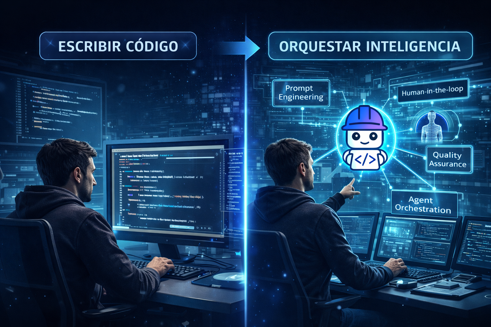

# 🧠 AI-First SDLC: from code to orchestration and from operation to organizational evolution

When we talk about artificial intelligence in software development, the conversation usually stays on productivity.

On writing code faster.
On automating tasks.
On "doing more with less".

But that is only the surface.

Today we are facing a much deeper change:

> **The transition toward an AI-driven SDLC is not just a technological change... it is an operational and organizational change.**

And understanding this is key to avoid falling into the most common mistake:

👉 adopting AI without a clear strategy for how to integrate and govern it.

<figure>

<figcaption>Fig 1. Bob across the entire SDLC.</figcaption>
</figure>

## 🧠 AI-First is not just speed... it is responsibility

When we analyze models like AI-Native SDLC or the maturity models
for AI adoption, something becomes evident:

> **AI without proper governance is not a competitive advantage... it is an accelerator of risks and technical debt.**

And this completely changes the conversation.

We are not just talking about tools, we are talking about how we redesign the way we build
software.

## ⚙️ The change is not technical... it is organizational

This is not a change exclusive to the development team, it is an organizational change because the impact is not in the SDLC phases, the phases still exist:
-   Analysis.
-   Design.
-   Development.
-   Testing.
-   Deploy.

But what radically changes are the activities within each phase. We move from:
-   Linear processes.
-   Manual execution.
-   Human-centered development.

To:
-   Continuous iterations.
-   Automated processes.
-   Development driven by AI agents.
-   Developer-led orchestration.

## 👨‍💻 The developer's new role

The developer stops being primarily the one who writes code and becomes the one who:
-   Validates AI-generated solutions.
-   Analyzes architectural decisions.
-   Orchestrates agents.
-   Approves changes.

It is a much more strategic role.

And this is not the future...

👉 this is already happening.

## ⚙️ Operating Model: from writing code to orchestrating intelligence

This is where many conversations fall short. Because when AI in development is discussed, there are still those who
see it as a "copilot that helps write code faster". But that is already behind us.

> **The real change is not writing code faster... it is no longer being the one who writes code, to become the one who orchestrates the intelligence that generates it.**

**This is not a future projection. We are talking about a change that has already begun to impact the way we build software.**

### 👨‍💻 The developer's evolution: from executor to orchestrator

Today AI is not just another tool within the stack.

👉 It is an **additional member of the development team**.

But here there is a critical point we cannot ignore:

> **AI being part of the team does not mean it operates without control.**

Quite the opposite. This raises the developer's responsibility to another level:
-   Defining how the AI interacts.
-   Validating its results.
-   Supervising its behavior.
-   Ensuring it complies with standards.
-   And, above all, **governing it**.

Because the success of AI in an organization does not depend on how good the tool is, it depends on how well it is **orchestrated**.

<figure>

<figcaption>Fig 2. Orchestration Operating Model.</figcaption>
</figure>

### 🧩 They are not new phases... they are new activities

We are not creating a new SDLC. The phases remain the same. But within them new activities appear that completely change the dynamics of the process:
-   Prompt Engineering.
-   Agent Orchestration.
-   Human-in-the-loop.
-   AI-driven QA.

### 🔄 An interconnected system (not a checklist)

Proper Prompt Engineering:

👉 Allows the AI to propose more accurate solutions.

👉 Improves the quality of generated code

But those results:

👉 must be constantly validated by the human factor (Human-in-the-loop)

That validation:

👉 is, in essence, AI governance

That governance:

👉 takes shape through agent orchestration (Agent Orchestration)

And all of this:

👉 is enhanced through automated quality processes (AI-driven QA)

### ⚖️ The critical piece is not one... it is the balance

There is no single most important piece. Because:
-   Without a good Prompt → the AI loses precision.
-   Without validation → risks increase.
-   Without orchestration → there is no control.
-   Without QA → there is no scalability.

> **It is not a chain... it is a gear mechanism.**

### 🧠 Key insight

👉 It is not about using AI.

👉 It is about **designing how AI works within the SDLC**.

## 📈 Evolutionary Model: organizational maturity in the AI-First era

So far we have talked about **how to operate with AI within the SDLC**. But there is a much more important question:

👉 **How prepared is the organization really to sustain that over time?**

### 🚧 It is not a lack of intention... it is a lack of landing it
Today most organizations:
-   Know they must adopt AI.
-   Are experimenting.
-   Are seeing results.

But they have not managed to land a clear model. They are evolving, but at a very accelerated speed.

<figure>

<figcaption>Fig 2. Organizational Evolutionary Model.</figcaption>
</figure>

## ⚠️ The silent risk: moving forward without governance

> **If we don't make strategic decisions today, by the time we want to react... it will already be too late.**

Many organizations are adopting AI without:
-   A governance model.
-   A sustainable strategy.
-   A long-term vision.

And that turns AI into:

👉 An accelerator of technical debt.

👉 A multiplier of risks.

### 😏 The gap between perception and reality

Many organizations believe they are already leveraging AI. But the reality is different:

> **We have not yet seen the true potential of a fully mature and integrated AI.**

### 🧠 The biggest challenge is not technical

Yes, there are technological challenges. But the real challenge is:

> **Organizational culture.**

### 🧩 Culture, talent, and governance
-   Culture → the hardest change.
-   Talent → it is built along the way.
-   Governance → the fundamental element.

### 🔥 Key insight

👉 The operating model defines how we use AI.

👉 The evolutionary model defines how prepared we are to sustain it.

## 🤖 Project Bob: from tool to cognitive companion in the SDLC

👉 Think of assistants like IBM Project Bob, conceived not as a tool, but as a development companion within the team.

Bob:
-   Understands the system.
-   Analyzes code.
-   Proposes improvements.
-   Automates processes.

### 👥 Hybrid teams

Humans + AI working as co-workers.

### 🔄 Developer's evolution
-   Orchestrator.
-   Validator.
-   Architect.
-   Responsible for governance.

## 🔥 Conclusion

Adopting AI in the SDLC is not a matter of tools or productivity. It is a transformation that impacts how we design, develop, validate, and govern our systems. The real challenge is not in using AI, but in integrating it with intention:
- With a clear operating model
- And an organizational maturity that allows sustaining it over time.

Because without governance, speed becomes risk. And without strategy, innovation becomes technical debt. In the end, the difference will not be in who adopts AI first, but in who integrates it best.

> **It is not just about modernizing the code, but about modernizing the way we think and work.**
