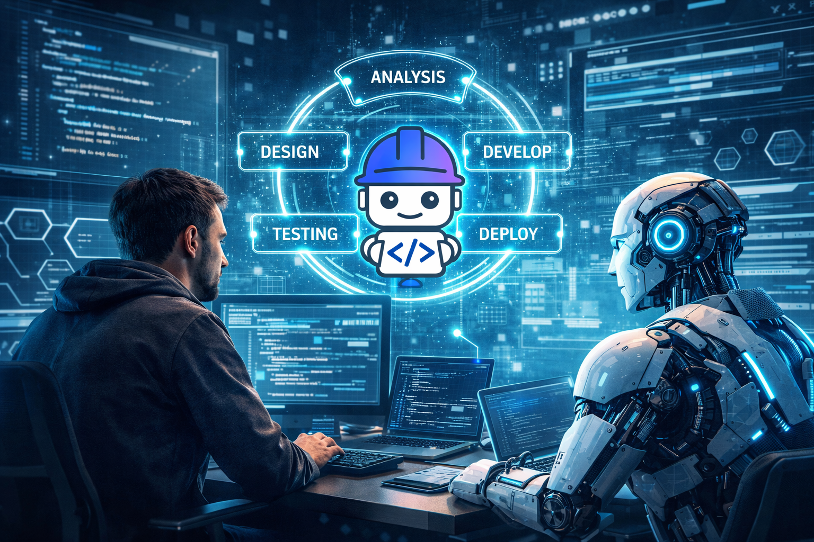
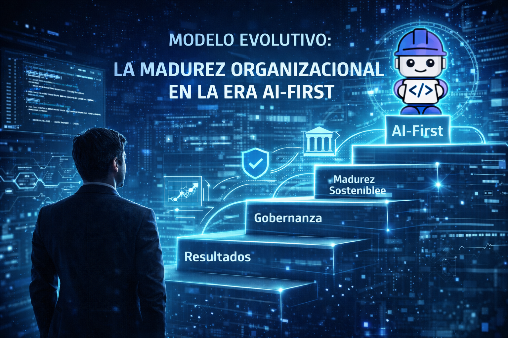

# 🧠 AI-First SDLC: del código a la orquestación y de la operación a la evolución organizacional

Cuando hablamos de inteligencia artificial en el desarrollo de software, la conversación suele quedarse en productividad.

En escribir código más rápido.
En automatizar tareas.
En "hacer más con menos".

Pero esa es solo la superficie.

Hoy estamos frente a un cambio mucho más profundo:

> **La transición hacia un SDLC impulsado por IA no es solo un cambio tecnológico... es un cambio operativo y organizacional.**

Y entender esto es clave para no caer en el error más común:

👉 adoptar IA sin una estrategia clara de cómo integrarla y gobernarla.

<figure>

<figcaption>Fig 1. Bob en todo el SDLC.</figcaption>
</figure>

## 🧠 AI-First no es solo velocidad... es responsabilidad

Cuando analizamos modelos como AI-Native SDLC o los modelos de madurez
en la adopción de IA, hay algo que se vuelve evidente:

> **Una IA sin el adecuado gobierno no es una ventaja competitiva... es un acelerador de riesgos y deuda técnica.**

Y esto cambia completamente la conversación.

No estamos hablando solo de herramientas, estamos hablando de cómo rediseñamos la forma en que construimos
software.

## ⚙️ El cambio no es técnico... es organizacional

Este no es un cambio exclusivo del equipo de desarrollo, es un cambio organizacional porque el impacto no está en las fases del SDLC, las fases siguen existiendo:
-   Análisis.
-   Diseño.
-   Desarrollo.
-   Testing.
-   Deploy.

Pero lo que cambia radicalmente son las actividades dentro de cada fase. Pasamos de:
-   Procesos lineales.
-   Ejecución manual.
-   Desarrollo centrado en humanos.

A:
-   Iteraciones continuas.
-   Procesos automatizados.
-   Desarrollo impulsado por agentes de IA.
-   Orquestación liderada por desarrolladores.

## 👨‍💻 El nuevo rol del desarrollador

El desarrollador deja de ser principalmente quien escribe código y pasa a ser quien:
-   Valida soluciones generadas por IA.
-   Analiza decisiones arquitectónicas.
-   Orquesta agentes.
-   Aprueba cambios.

Es un rol mucho más estratégico.

Y esto no es futuro...

👉 esto ya está pasando.

## ⚙️ Modelo Operativo: de escribir código a orquestar inteligencia

Aquí es donde muchas conversaciones se quedan cortas. Porque cuando se habla de IA en el desarrollo, todavía hay quienes lo
ven como un "copiloto que ayuda a escribir código más rápido". Pero eso ya quedó atrás.

> **El cambio real no es escribir código más rápido... es dejar de ser quien escribe código, para convertirse en quien orquesta la inteligencia que lo genera.**

**Esto no es una proyección a futuro. Estamos hablando de un cambio que ya comenzó a impactar la forma en que construimos software.**

### 👨‍💻 La evolución del desarrollador: de ejecutor a orquestador

Hoy la IA no es una herramienta más dentro del stack.

👉 Es un **miembro adicional del equipo de desarrollo**.

Pero aquí hay un punto crítico que no podemos ignorar:

> **Que la IA sea parte del equipo no significa que opere sin control.**

Todo lo contrario. Esto eleva la responsabilidad del desarrollador a otro nivel:
-   Definir cómo interactúa la IA.
-   Validar sus resultados.
-   Supervisar su comportamiento.
-   Asegurar que cumple con estándares.
-   Y, sobre todo, **gobernarla**.

Porque el éxito de la IA en una organización no depende de qué tan buena sea la herramienta, depende de qué tan bien esté **orquestada**.

<figure>

<figcaption>Fig 2. Modelo Operativo de Orquestación.</figcaption>
</figure>

### 🧩 No son nuevas fases... son nuevas actividades

No estamos creando un nuevo SDLC. Las fases siguen siendo las mismas. Pero dentro de ellas aparecen nuevas actividades que cambian completamente la dinámica del proceso:
-   Prompt Engineering.
-   Agent Orchestration.
-   Human-in-the-loop.
-   AI-driven QA.

### 🔄 Un sistema interconectado (no un checklist)

Un adecuado Prompt Engineering:

👉 Permite que la IA proponga soluciones más atinadas.

👉 Mejora la calidad del código generado

Pero esos resultados:

👉 deben ser validados constantemente por el factor humano (Human-in-the-loop)

Esa validación:

👉 es, en esencia, el gobierno de la IA

Ese gobierno:

👉 toma forma a través de la orquestación de agentes (Agent Orchestration)

Y todo esto:

👉 se potencia mediante procesos de calidad automatizados (AI-driven QA)

### ⚖️ La pieza crítica no es una... es el equilibrio

No hay una única pieza más importante. Porque:
-   Sin buen Prompt → la IA pierde precisión.
-   Sin validación → aumentan los riesgos.
-   Sin orquestación → no hay control.
-   Sin QA → no hay escalabilidad.

> **No es una cadena... es un engranaje.**

### 🧠 Insight clave

👉 No se trata de usar IA.

👉 Se trata de **diseñar cómo la IA trabaja dentro del SDLC**.

## 📈 Modelo Evolutivo: la madurez organizacional en la era AI-First

Hasta ahora hemos hablado del **cómo operar con IA dentro del SDLC**. Pero hay una pregunta mucho más importante:

👉 **¿Qué tan preparada está realmente la organización para sostener eso en el tiempo?**

### 🚧 No es falta de intención... es falta de aterrizaje
Hoy la mayoría de las organizaciones:
-   Saben que deben adoptar IA.
-   Están experimentando.
-   Están viendo resultados.

Pero no han logrado aterrizar un modelo claro. Están evolucionando, pero a una velocidad muy acelerada.

<figure>

<figcaption>Fig 2. Modelo Evolutivo de Organización.</figcaption>
</figure>

## ⚠️ El riesgo silencioso: avanzar sin gobierno

> **Si no tomamos decisiones estratégicas hoy, cuando queramos reaccionar... ya será demasiado tarde.**

Muchas organizaciones están adoptando IA sin:
-   Modelo de gobierno.
-   Estrategia sostenible.
-   Visión de largo plazo.

Y eso convierte a la IA en:

👉 Un acelerador de deuda técnica.

👉 Un multiplicador de riesgos.

### 😏 La brecha entre percepción y realidad

Muchas organizaciones creen que ya están aprovechando la IA. Pero la realidad es otra:

> **Aún no hemos visto el verdadero potencial de una IA completamente madura e integrada.**

### 🧠 El mayor desafío no es técnico

Sí, hay retos tecnológicos. Pero el verdadero desafío es:

> **La cultura organizacional.**

### 🧩 Cultura, talento y gobernanza
-   Cultura → el cambio más difícil.
-   Talento → se construye en el camino.
-   Gobernanza → el elemento fundamental.

### 🔥 Insight clave

👉 El modelo operativo define cómo usamos la IA.

👉 El modelo evolutivo define qué tan preparados estamos para sostenerla.

## 🤖 Project Bob: de herramienta a compañero cognitivo en el SDLC

👉 Pensar en asistentes como IBM Project Bob, concebido no como herramienta, sino como un compañero de desarrollo dentro del equipo.

Bob:
-   Entiende el sistema.
-   Analiza código.
-   Propone mejoras.
-   Automatiza procesos.

### 👥 Equipos híbridos

Humanos + IA trabajando como co-workers.

### 🔄 Evolución del developer
-   Orquestador.
-   Validador.
-   Arquitecto.
-   Responsable del gobierno.

## 🔥 Conclusión

La adopción de IA en el SDLC no es un tema de herramientas ni de productividad. Es una transformación que impacta cómo diseñamos, desarrollamos, validamos y gobernamos nuestros sistemas. El verdadero reto no está en usar IA, sino en integrarla con intención:
- Con un modelo operativo claro
- Y una madurez organizacional que permita sostenerla en el tiempo.

Porque sin gobierno, la velocidad se convierte en riesgo. Y sin estrategia, la innovación se convierte en deuda técnica. Al final, la diferencia no estará en quién adopte IA primero, sino en quién la integre mejor.

> **No se trata solo de modernizar el código, sino de modernizar la forma en que pensamos y trabajamos.**
