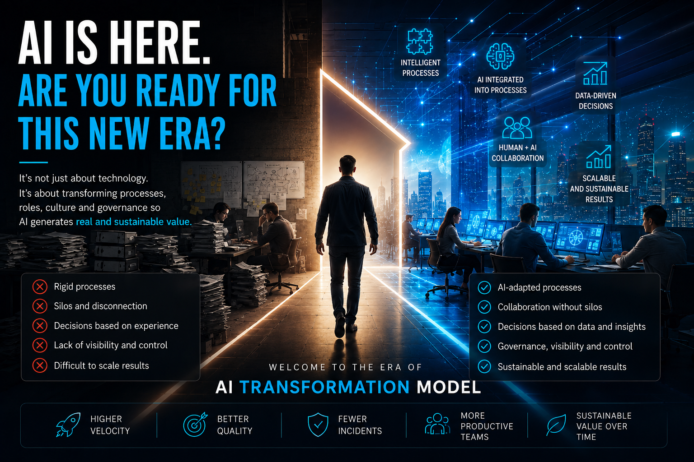
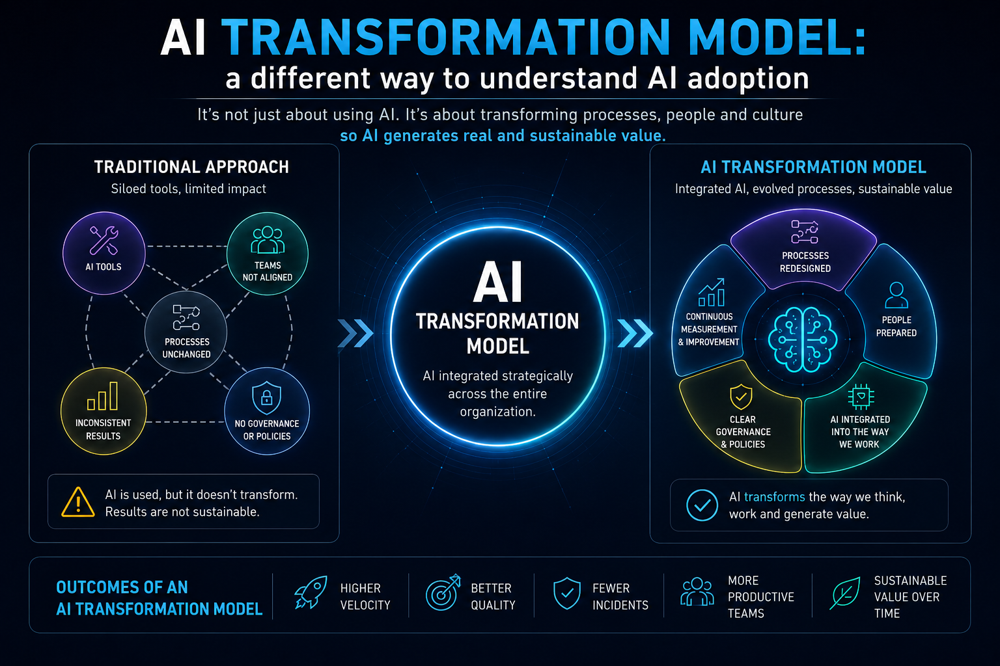

# The AI Era Has Arrived. Is Your Organization Ready for This New Era?

Over the last few years, we have spent countless hours talking about Artificial Intelligence. We have compared models, discussed which one generates better responses, which one codes better, which one costs less, or which one includes the most innovative features.

However, after participating in different AI adoption initiatives, I am increasingly convinced that this conversation is focused on the wrong place.

The real challenge is no longer acquiring an Artificial Intelligence platform. Today, practically any organization can gain access to truly powerful tools in a matter of minutes.

The real challenge is something else:

> **Is the organization prepared to work in a different way?**

<figure>

<figcaption>Fig 1. AI in action: are we ready for change?</figcaption>
</figure>

## The mistake of focusing only on the outcome

When a company talks about implementing AI, it usually imagines the final result. People talk about higher productivity, better quality, lower costs, more speed, or a better customer experience. And all of those goals are completely valid. The problem is that we rarely stop to analyze what must change internally for those results to be sustainable. We focus on the final metrics, but we rarely review whether our processes, our policies, our governance model, and even our culture have evolved at the same pace as the technology.

AI can accelerate a process. But it will hardly fix a process that was already poorly designed.

## Buying AI does not mean working with AI

Today, acquiring a license for an AI platform is relatively simple. It is even possible to run pilots with very small investments. But having access to an AI tool does not mean that an organization is truly working with AI.

From my perspective, that is one of the most common mistakes. Many companies believe that adopting AI means enabling a license so each employee can use it whenever they see fit. That can increase individual productivity. But it does not transform the organization. Real transformation happens when we are able to redesign our processes so AI becomes a natural part of them.

And that implies something much more complex than acquiring a tool:
1. It means questioning the way we have worked for years.
2. It means stepping out of our comfort zone.
3. It means redefining activities, responsibilities, and even professional profiles.
4. And above all, it means a cultural shift.

## AI Transformation Model: a different way to understand AI adoption

After participating in different Artificial Intelligence adoption projects, I reached a conclusion that has helped me explain this challenge more clearly. Over time, I have started using a concept of my own that I call:
> **AI Transformation Model**.

I am not referring to an industry standard or a formal methodology. It is simply the way I describe the process through which an organization transforms its processes, redefines its roles, adapts its culture, and establishes a governance model so that Artificial Intelligence stops being an isolated tool and becomes an integrated capability within its operation.

When a company implements AI without building an AI Transformation Model, it usually changes the technology, but not the way it works. And that is where frustration begins.

<figure>

<figcaption>Fig 2. AI Transformation Model.</figcaption>
</figure>

## A conversation that made me reflect

Some time ago, during a session with a client, they told me they had been working with an AI platform for several months, but the results were far from what they expected. They had scenarios like these:
- The time required to move changes into production was still practically the same.
- The number of incidents had not decreased.
- Productivity had barely improved.

Their conclusion was very clear:

> **"We need to switch AI providers."**

Before talking about technology, I decided to ask other questions:
- What KPIs had been defined to measure success?
- What usage policy had they established?
- Which process activities had changed?
- How had they prepared their teams to work with AI?
- What governance model had they implemented?

The answers were revealing. The problem was not the AI. The problem was that the organization had never built a real **AI Transformation Model**.

They expected different results while using exactly the same processes, the same activities, the same organizational structure, and the same work culture. At that moment, I confirmed something that I now consider a firm conviction:

> If processes, culture, guidelines, and ways of working do not evolve to adopt AI, it is very unlikely that any platform will meet the expectations we place on it.

## Adapting processes to AI, not AI to our processes

There is a very important difference between these two approaches. Many organizations try to adapt AI to the way they already work. But perhaps we should do exactly the opposite.

We should ask ourselves how our processes need to evolve to truly take advantage of the capabilities that AI puts at our disposal. When that happens, AI stops being an additional tool and starts becoming a natural participant within the business process. To me, that is exactly what a real **AI Transformation Model** represents.

## When I realized the problem was silos

In another project, I had a very similar experience. The client needed to speed up the implementation of a critical change that had to reach production as soon as possible. During the first meeting, they explained that there were several activities in which AI could not participate because certain approvals, internal controls, and dependencies across different areas did not allow it. The solution they proposed was to **evaluate another AI platform**.

They thought that perhaps another provider would be able to solve those limitations. But the problem was not technological. The problem was that silos existed within the process.

AI was trying to integrate into a workflow designed to operate without it. No matter how advanced it is, no model can eliminate organizational barriers that are still there. At that moment, I understood that what was really missing was not a new platform. What was missing was building an **AI Transformation Model** capable of removing those silos and redesigning the process from end to end.

## The SDLC still exists, but internally it changes completely

From my point of view, one of the best examples of an **AI Transformation Model** is the SDLC. The stages hardly change. We still have analysis, design, development, testing, deployment, and operations. What changes 100% is what we do inside each of those phases.
- During analysis, AI can summarize documentation, identify business rules, analyze legacy systems, and generate initial proposals.
- During development, the value no longer lies only in writing code. The real value lies in correctly understanding the business need, transforming it into clear requirements for AI, and then validating, approving, or discarding the generated solutions.
- During testing, AI can generate scenarios, identify risks, propose edge cases, and even detect possible impacts before they happen.

The phases remain the same. What changes completely are the activities that create value within them.

## Our roles also change

One of the most interesting changes happens in technical profiles. For many years, a developer's value was primarily associated with the ability to write code. Today, that is no longer enough. The ability to understand the business, transform a need into instructions AI can solve, and later orchestrate, validate, and approve the results is becoming increasingly important.

The same happens with architects and technical leaders. Before, our leadership focused mainly on people. Today, we must also learn to lead processes in which AI actively participates. Activities such as reviewing a Pull Request, evaluating an architecture proposal, or analyzing different alternatives no longer depend exclusively on our experience.

AI can contribute very valuable information. Our responsibility is to interpret it, challenge it when necessary, and make the best decision. Rather than losing relevance, our role evolves.

## How do we know if an organization is truly AI-First?

Not because it uses a chatbot, not because it has AI licenses, and not because it has developed a few agents. An organization starts becoming AI-First when AI stops depending on individual initiatives and becomes part of the end-to-end process.

When there are no longer silos within the SDLC or the business operating completely outside AI. When AI stops being optional and becomes an integrated capability within the normal way of working.

## The real challenge is called governance

If I had to summarize this entire article in a single word, I would choose one:

> **Governance.**

Because the success of an AI strategy does not depend only on the model we use. It depends on who makes decisions, who validates results, how processes evolve, how risks are managed, and how we ensure that the benefits we achieve today are still sustained tomorrow. Without a governance model, AI ends up becoming a collection of tools used differently by each person.

With good governance, AI stops being just another technology and becomes an organizational capability.

## Final reflection

The AI era has arrived. The question is no longer which model you are going to use, which provider you are going to hire, or which agent you are going to build. The real question is whether your organization is ready to build an **AI Transformation Model**. A model in which processes evolve, roles change, silos disappear, and governance exists to integrate Artificial Intelligence naturally into every activity that creates value.

Because the future will not belong to the organizations that buy more AI. It will belong to those that understand that the real transformation was never in the technology. It was always in the way we choose to work.

Because in the end,
> **it is not only about modernizing code, but about modernizing the way we think and work.**