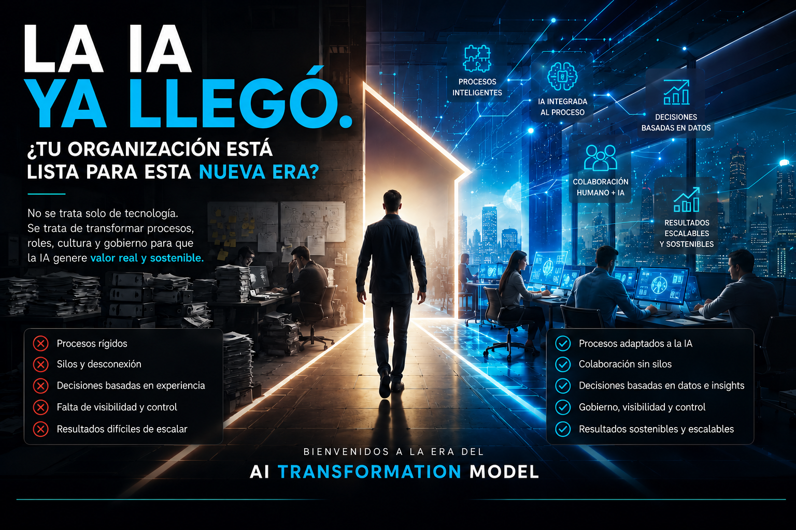
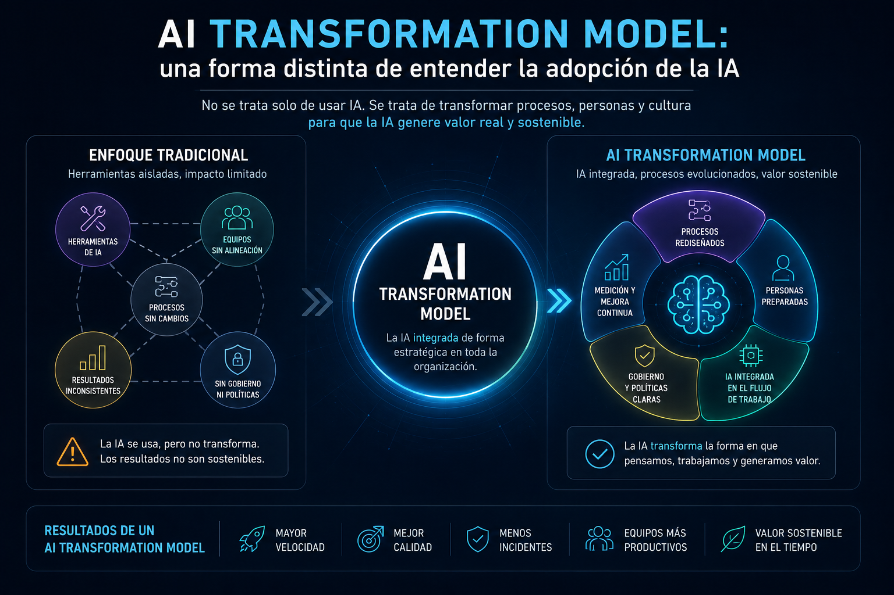

# La IA ya llegó. ¿Tu organización está lista para esta nueva era?

Durante los últimos años hemos dedicado incontables horas a hablar sobre Inteligencia Artificial. Hemos comparado modelos, discutido cuál genera mejores respuestas, cuál programa mejor, cuál tiene el menor costo o cuál incorpora las funcionalidades más innovadoras.

Sin embargo, después de participar en diferentes iniciativas relacionadas con la adopción de IA, cada vez estoy más convencido de que esa conversación está enfocada en el lugar equivocado.

El verdadero reto ya no consiste en adquirir una plataforma de Inteligencia Artificial. Hoy prácticamente cualquier organización puede acceder a herramientas realmente poderosas en cuestión de minutos.

El verdadero desafío es otro:

> **¿Está la organización preparada para trabajar de una manera diferente?**

<figure>

<figcaption>Fig 1. La IA en acción, estamos listos para el cambio.</figcaption>
</figure>

## El error de enfocarnos únicamente en el resultado

Cuando una empresa habla de implementar IA, normalmente visualiza el resultado final. Se habla de mayor productividad, mejor calidad, reducción de costos, más velocidad o una mejor experiencia para el cliente. Y todos esos objetivos son completamente válidos. El problema es que pocas veces nos detenemos a analizar qué debe cambiar internamente para que esos resultados sean sostenibles. Nos enfocamos en los indicadores finales, pero rara vez revisamos si nuestros procesos, nuestras políticas, nuestro modelo de gobierno e incluso nuestra cultura evolucionaron al mismo ritmo que la tecnología.

La IA puede acelerar un proceso. Pero difícilmente solucionará un proceso que ya estaba mal diseñado.

## Comprar IA no significa trabajar con IA

Hoy adquirir una licencia de una plataforma de IA es relativamente sencillo. Incluso es posible realizar pilotos con inversiones muy pequeñas. Pero tener acceso a una herramienta de IA no significa que una organización realmente esté trabajando con IA.

Ese es, desde mi punto de vista, uno de los errores más comunes. Muchas empresas creen que incorporar IA consiste en habilitar una licencia para que cada colaborador la utilice cuando lo considere conveniente. Eso puede aumentar la productividad individual. Pero no transforma la organización. La verdadera transformación ocurre cuando somos capaces de rediseñar nuestros procesos para que la IA forme parte natural de ellos.

Y eso implica algo mucho más complejo que adquirir una herramienta:
1. Implica cuestionar la forma en la que hemos trabajado durante años.
2. Implica salir de nuestra zona de confort.
3. Implica redefinir actividades, responsabilidades e incluso perfiles profesionales.
4. Y, sobre todo, implica un cambio cultural.

## AI Transformation Model: una forma distinta de entender la adopción de la IA

Después de participar en distintos proyectos de adopción de Inteligencia Artificial, llegué a una conclusión que me ha ayudado a explicar este reto con mayor claridad. Con el tiempo he comenzado a utilizar un concepto propio al que llamo:
> **AI Transformation Model**.

No me refiero a un estándar de la industria ni a una metodología formal. Es simplemente la forma en que describo el proceso mediante el cual una organización transforma sus procesos, redefine sus roles, adapta su cultura y establece un modelo de gobierno para que la Inteligencia Artificial deje de ser una herramienta aislada y se convierta en una capacidad integrada dentro de su operación.

Cuando una empresa implementa IA sin construir un AI Transformation Model, normalmente cambia la tecnología, pero no cambia la forma de trabajar. Y ahí es donde comienzan las frustraciones.

<figure>

<figcaption>Fig 2. AI Transformation Model.</figcaption>
</figure>

## Una conversación que me hizo reflexionar

Hace algún tiempo, durante una sesión con un cliente, me comentaban que llevaban varios meses trabajando con una plataforma de IA, pero que los resultados estaban muy lejos de lo que esperaban. Tenian escenarios como los siguientes:
- Los tiempos para llevar cambios a producción seguían siendo prácticamente los mismos.
- La cantidad de incidentes no había disminuido.
- La productividad apenas había mejorado.

Su conclusión era muy clara:

> **"Necesitamos cambiar de proveedor de IA."**

Antes de hablar de tecnología, decidí hacer otras preguntas:
- ¿Cuáles eran los KPIs definidos para medir el éxito?
- ¿Qué política de uso habían establecido?
- ¿Qué actividades del proceso habían cambiado?
- ¿Cómo habían preparado a sus equipos para trabajar con IA?
- ¿Qué modelo de gobierno habían implementado?

Las respuestas fueron reveladoras. El problema no era la IA. El problema era que la organización nunca había construido un verdadero **AI Transformation Model**.

Esperaban resultados diferentes utilizando exactamente los mismos procesos, las mismas actividades, la misma estructura organizacional y la misma cultura de trabajo. En ese momento confirmé algo que hoy considero una convicción:

> Si los procesos, la cultura, los lineamientos y la forma de trabajar no evolucionan para adoptar la IA, difícilmente cualquier plataforma logrará cumplir con las expectativas que depositamos sobre ella.

## Adaptar los procesos a la IA, no la IA a nuestros procesos

Existe una diferencia muy importante entre estos dos enfoques. Muchas organizaciones intentan adaptar la IA a la forma en la que ya trabajan. Pero quizá deberíamos hacer exactamente lo contrario.

Deberíamos preguntarnos cómo deben evolucionar nuestros procesos para aprovechar realmente las capacidades que la IA pone a nuestra disposición. Cuando eso ocurre, la IA deja de ser una herramienta adicional y comienza a convertirse en un participante natural dentro del proceso de negocio. Para mí, eso es precisamente lo que representa un verdadero **AI Transformation Model**.

## Cuando entendí que el problema eran los silos

En otro proyecto viví una experiencia muy similar. El cliente necesitaba acelerar la implementación de un cambio crítico que debía llegar cuanto antes al ambiente productivo. Durante la primera reunión me explicaban que había varias actividades donde la IA no podía participar porque determinadas aprobaciones, controles internos y dependencias entre diferentes áreas no lo permitían. La solución que proponían era **evaluar otra plataforma de IA**.

Pensaban que quizá otro proveedor sí sería capaz de resolver esas limitaciones. Pero el problema no era tecnológico. El problema era que existían silos dentro del proceso.

La IA intentaba integrarse en un flujo de trabajo diseñado para operar sin ella. Ningún modelo, por avanzado que sea, puede eliminar barreras organizacionales que siguen existiendo. En ese momento comprendí que lo que realmente faltaba no era una nueva plataforma. Lo que faltaba era construir un **AI Transformation Model** que permitiera eliminar esos silos y rediseñar el proceso de principio a fin.

## El SDLC sigue existiendo… pero por dentro cambia completamente

Desde mi punto de vista, uno de los mejores ejemplos de un **AI Transformation Model** es el SDLC. Las etapas prácticamente no cambian. Seguimos teniendo análisis, diseño, desarrollo, pruebas, despliegue y operación. Lo que cambia al 100% es lo que hacemos dentro de cada una de esas fases.
- Durante el análisis, la IA puede resumir documentación, identificar reglas de negocio, analizar sistemas legados y generar propuestas iniciales.
- Durante el desarrollo, el valor ya no está únicamente en escribir código. El verdadero valor consiste en comprender correctamente la necesidad del negocio, transformarla en requerimientos claros para la IA y posteriormente validar, aprobar o descartar las soluciones generadas.
- Durante las pruebas, la IA puede generar escenarios, identificar riesgos, proponer casos límite e incluso detectar posibles impactos antes de que ocurran.

Las fases siguen siendo las mismas. Lo que cambia completamente son las actividades que generan valor dentro de ellas.

## También cambian nuestros roles

Uno de los cambios más interesantes ocurre en los perfiles técnicos. Durante muchos años el valor de un desarrollador estuvo asociado principalmente a su capacidad para escribir código. Hoy eso ya no es suficiente. Cada vez cobra más importancia la capacidad para comprender el negocio, transformar una necesidad en instrucciones que la IA pueda resolver y, posteriormente, orquestar, validar y aprobar los resultados obtenidos.

Lo mismo sucede con arquitectos y líderes técnicos. Antes nuestro liderazgo se centraba principalmente en las personas. Hoy también debemos aprender a liderar procesos donde la IA participa activamente. Actividades como revisar un Pull Request, evaluar una propuesta de arquitectura o analizar diferentes alternativas ya no dependen exclusivamente de nuestra experiencia.

La IA puede aportar información muy valiosa. Nuestra responsabilidad consiste en interpretarla, cuestionarla cuando sea necesario y tomar la mejor decisión. Más que perder protagonismo, nuestro rol evoluciona.

## ¿Cómo saber si una organización realmente es AI-First?

No porque utilice un chatbot, no porque tenga licencias de IA, no porque haya desarrollado algunos agentes. Una organización comienza a ser AI-First cuando la IA deja de depender de iniciativas individuales y pasa a formar parte del proceso completo.

Cuando ya no existen silos dentro del SDLC o del negocio que operan completamente al margen de la IA. Cuando la IA deja de ser opcional y se convierte en una capacidad integrada dentro de la forma habitual de trabajar.

## El verdadero reto se llama gobierno

Si tuviera que resumir todo este artículo en una sola palabra, elegiría una:

> **Gobierno.**

Porque el éxito de una estrategia de IA no depende únicamente del modelo que utilicemos. Depende de quién toma las decisiones, quién valida los resultados, cómo evolucionan los procesos, cómo se gestionan los riesgos y cómo aseguramos que los beneficios obtenidos hoy también se mantengan mañana. Sin un modelo de gobierno, la IA termina convirtiéndose en una colección de herramientas utilizadas de manera distinta por cada persona.

Con un buen gobierno, la IA deja de ser una tecnología más y se convierte en una capacidad organizacional.

## Reflexión final

La IA ya llegó. La pregunta ya no es qué modelo vas a utilizar, qué proveedor vas a contratar o qué agente vas a desarrollar. La verdadera pregunta es si tu organización está preparada para construir un **AI Transformation Model**. Un modelo donde evolucionen los procesos, cambien los roles, desaparezcan los silos y exista un gobierno que permita integrar la Inteligencia Artificial de forma natural en cada actividad que genera valor.

Porque el futuro no pertenecerá a las organizaciones que compren más IA. Pertenecerá a aquellas que comprendan que la verdadera transformación nunca estuvo en la tecnología. Siempre estuvo en la forma en que decidimos trabajar.

Porque, al final,
> **no se trata solo de modernizar el código, sino de modernizar la forma en que pensamos y trabajamos.**