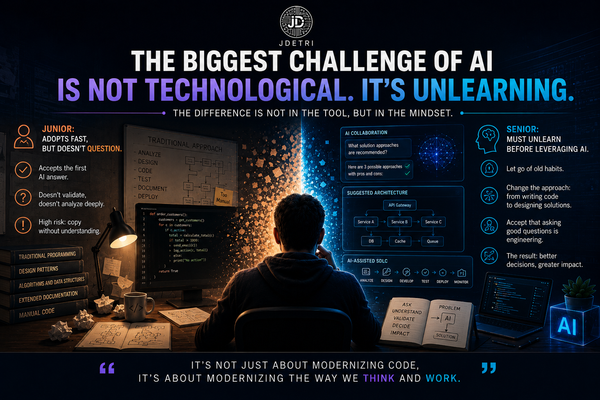

# The biggest challenge of AI is not technological. It is unlearning.

Every time I give a talk about Artificial Intelligence applied to software development, there is one idea that tends to surprise many people. It is generally assumed that senior developers are the ones who make the best use of AI. After years of working with tools like GitHub Copilot and Bob, my experience has been different.

Junior developers tend to adopt Artificial Intelligence much faster. Seniors, on the other hand, usually take longer. And, interestingly, the reasons have nothing to do with technical capability.

<figure>

<figcaption>Fig 1. The biggest challenge of AI is not technological. It is unlearning.</figcaption>
</figure>

## The junior developer is not afraid

When a junior developer joins a team, they usually do not carry ten or fifteen years of habits. They do not have only one way of solving problems. They do not feel they must prove they can write all the code by themselves. They simply incorporate AI as another work tool and begin exploring it:
- They consult it.
- They experiment.
- They ask.
- They test.

They adapt very quickly. From that point of view, juniors start with a huge advantage: they do not need to unlearn.

## But a new risk appears

That speed also has a cost. Many junior developers accept the first AI response as if it were correct, and this leads them to make some mistakes:
- They do not challenge.
- They do not validate.
- They do not analyze the why.

And that is probably the biggest risk of early adoption. AI explains very well, argues very well, and often appears completely confident in its responses, but it is still a tool that can be wrong.

That is why I always tell something to developers who are just starting.

> Do not ask it only **what** to do. Ask it **why**. And then challenge that explanation too.

Because that is where real learning happens.

## The senior developer has a different challenge

Developers with many years of experience face a completely different problem: they do not need to learn a new technology, they need to unlearn certain habits.

For many years, our profession taught us that a good engineer was the one who wrote more code, solved everything by themselves, and knew every implementation detail.

AI completely breaks that paradigm:
- Writing code is no longer the greatest value.
- The true value is in analyzing the problem better.
- Designing better solutions.
- Making better decisions.
- Accepting that some tasks that used to take hours can now be solved in minutes.

That change is hard, not because seniors cannot do it, but because it implies changing a way of working that was effective for many years.

## The real change happens when both evolve

I have seen junior developers learn much faster thanks to AI, and I have also seen architects with decades of experience discover new ways of designing solutions while working alongside intelligent agents.

In both cases, exactly the same thing happens: AI amplifies what already exists. If a person is curious, they will learn faster. If they have critical thinking, they will get better results. And if they understand architecture, they will be able to debate much more sophisticated solutions.

The tool does not replace those capabilities, it amplifies them.

## The question changed

A few years ago, we asked:

> **"Who codes better?"**

Today the question is beginning to change. Now I am much more interested in knowing:
- Who analyzes better?
- Who asks better questions?
- Who knows how to identify when AI is wrong?
- Who knows how to explain the right context?

Because those are the skills that are truly making the difference.

## What I look for in an engineer today

If I had to build a development team today, I would look for people who combine two characteristics:
- The curiosity of a junior developer.
- And the judgment of a senior developer.

Because that combination is extraordinary when working with Artificial Intelligence. Curiosity drives exploration. Judgment prevents mistakes.

And when both capabilities work together, AI stops being just a productivity tool. It becomes a learning accelerator.

## The real competitive advantage

I am often asked whether AI will eventually reduce the gap between a junior and a senior developer. I believe the exact opposite will happen. The difference will remain. But it will no longer be determined only by who writes better code; it will be determined by who knows how to think better alongside AI.

Because the future does not belong to those who code faster, it belongs to those who learn faster. And learning, many times, means doing something far more difficult than adopting a new technology. It means being willing to unlearn.

Because, in the end, as I always say:
> **"It's not only about modernizing code, but about modernizing the way we think and work."**
