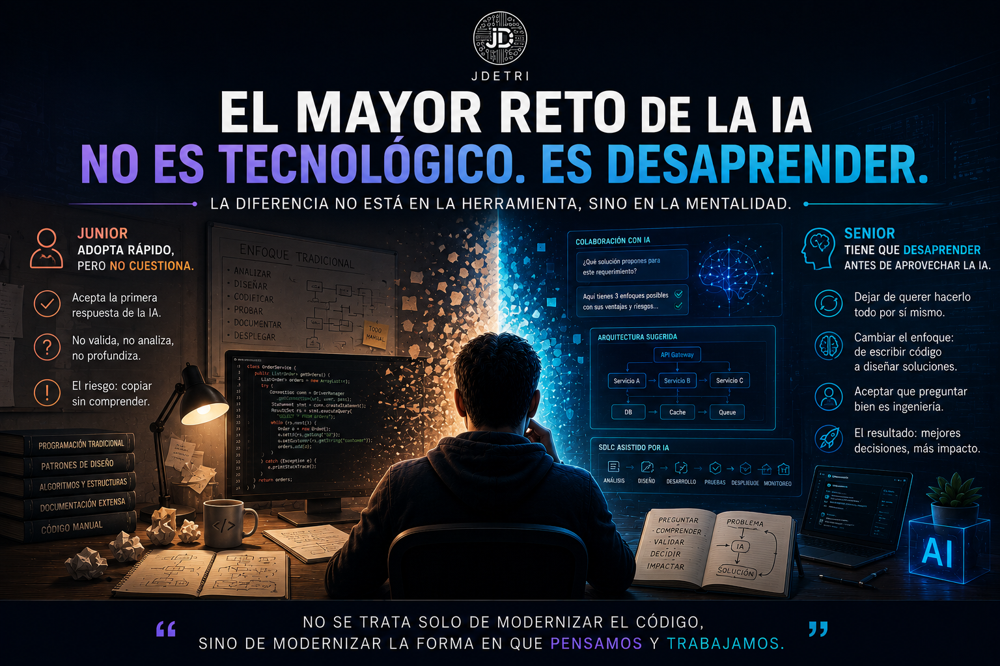

# El mayor reto de la IA no es tecnológico. Es desaprender.

Cada vez que doy una charla sobre Inteligencia Artificial aplicada al desarrollo de software, hay una idea que suele sorprender a muchas personas. Generalmente se piensa que los desarrolladores senior son quienes mejor aprovechan la IA. Después de trabajar durante años con herramientas como GitHub Copilot y Bob, mi experiencia ha sido diferente.

Los desarrolladores junior suelen adoptar la Inteligencia Artificial mucho más rápido. Los senior, en cambio, suelen tardar más. Y, curiosamente, las razones no tienen nada que ver con la capacidad técnica.

<figure>

<figcaption>Fig 1. El mayor reto de la IA no es tecnológico. Es desaprender.</figcaption>
</figure>

## El desarrollador junior no tiene miedo

Cuando un desarrollador junior llega a un equipo, normalmente no carga con diez o quince años de hábitos. No tiene una única forma de resolver los problemas. No siente que deba demostrar que puede escribir todo el código por sí mismo. Simplemente incorpora la IA como una herramienta más de trabajo y empieza a explorarla:
- La consulta.
- Experimenta.
- Pregunta.
- Prueba.

Se adapta con mucha rapidez. Desde ese punto de vista, los junior parten con una ventaja enorme, no tienen que desaprender.

## Pero aparece un nuevo riesgo

Esa rapidez también tiene un costo. Muchos desarrolladores junior aceptan la primera respuesta de la IA como si fuera correcta, y esto los lleva a cometer algunos errores:
- No cuestionan.
- No validan.
- No analizan el porqué.

Y ese es probablemente el mayor riesgo de la adopción temprana. La IA explica muy bien, argumenta muy bien y muchas veces parece completamente segura de sus respuestas, pero sigue siendo una herramienta que puede equivocarse.

Por eso siempre les digo algo a los desarrolladores que están comenzando.

> No le pregunten únicamente **qué** hacer. Pregúntenle **por qué**. Y después cuestionen también esa explicación.

Porque ahí ocurre el verdadero aprendizaje.

## El desarrollador senior tiene otro desafío

Los desarrolladores con muchos años de experiencia enfrentan un problema completamente distinto, no necesitan aprender una nueva tecnología, necesitan desaprender algunos hábitos.

Durante muchos años nuestra profesión nos enseñó que un buen ingeniero era quien escribía más código, quien resolvía todo por sí mismo, quien conocía cada detalle de la implementación.

La IA rompe completamente ese paradigma:
- Ahora escribir código ya no representa el mayor valor.
- El verdadero valor está en analizar mejor el problema.
- Diseñar mejores soluciones.
- Tomar mejores decisiones.
- Aceptar que algunas tareas que antes ocupaban horas, hoy pueden resolverse en minutos.

Ese cambio cuesta, no porque el senior no pueda hacerlo, sino porque implica cambiar una forma de trabajar que funcionó durante muchos años.

## El verdadero cambio ocurre cuando ambos evolucionan

He visto desarrolladores junior aprender muchísimo más rápido gracias a la IA y también he visto arquitectos con décadas de experiencia descubrir nuevas formas de diseñar soluciones trabajando junto con agentes inteligentes.

En ambos casos ocurre exactamente lo mismo: la IA potencia aquello que ya existe. Si una persona es curiosa, aprenderá más rápido. Si tiene pensamiento crítico, obtendrá mejores resultados. Y si comprende la arquitectura, podrá debatir soluciones mucho más sofisticadas.

La herramienta no sustituye esas capacidades, las amplifica.

## La pregunta cambió

Hace algunos años preguntábamos:

> **"¿Quién programa mejor?"**

Hoy la pregunta comienza a cambiar. Ahora me interesa mucho más saber:
- ¿Quién analiza mejor?
- ¿Quién formula mejores preguntas?
- ¿Quién sabe identificar cuándo la IA está equivocada?
- ¿Quién sabe explicar el contexto correcto?

Porque esas habilidades son las que realmente están marcando la diferencia.

## Lo que hoy busco en un ingeniero

Si hoy tuviera que formar un equipo de desarrollo, buscaría personas que combinaran dos características:
- La curiosidad de un desarrollador junior.
- Y el criterio de un desarrollador senior.

Porque esa combinación resulta extraordinaria cuando se trabaja con Inteligencia Artificial. La curiosidad impulsa la exploración. El criterio evita los errores.

Y cuando ambas capacidades trabajan juntas, la IA deja de ser simplemente una herramienta de productividad. Se convierte en un acelerador del aprendizaje.

## La verdadera ventaja competitiva

Con frecuencia me preguntan si la IA terminará reduciendo la diferencia entre un desarrollador junior y uno senior. Creo que ocurrirá exactamente lo contrario. La diferencia seguirá existiendo. Pero ya no estará determinada únicamente por quién escribe mejor código, estará determinada por quién sabe pensar mejor junto con la IA.

Porque el futuro no pertenece a quienes programen más rápido, pertenece a quienes aprendan más rápido. Y aprender, muchas veces, significa hacer algo que resulta mucho más difícil que incorporar una nueva tecnología. Significa estar dispuesto a desaprender.

Porque, al final, como siempre digo:
> **"No se trata solo de modernizar el código, sino de modernizar la forma en que pensamos y trabajamos."**
