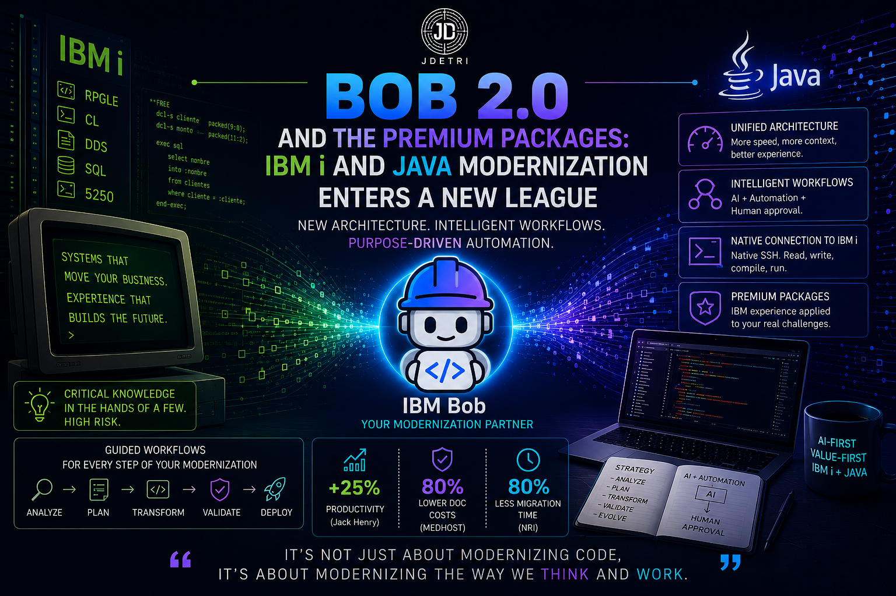

# 🧠 Bob 2.0 and Premium Packages: IBM i and Java modernization enters a new league

Every now and then, an update comes out that is not "just another version." It is a foundational shift. On June 24, that happened with **IBM Bob**: it was not a patch, it was a full architectural rebuild, and it came with something those of us who work with **IBM i** every day had been waiting for: **Premium Packages**.

Today I want to talk about three things that are really one story:

> **What happens when the agent stops being a generic assistant and becomes a specialist for your platform, with native connectivity, contextual memory, and repeatable workflows?**

Because that is exactly what separates "an AI that helps you code" from "a real modernization partner." And it is already here.

<figure>

<figcaption>Fig 1. Bob 2.0 and Premium Packages.</figcaption>
</figure>

## ⚙️ Bob 2.0: the foundation we needed

Bob 1.0 launched fast, and that had a cost: the IDE and the Shell ran on two different foundations. Every improvement had to be built twice. Bob 2.0 solves this at the root with a three-layer architecture:

| Component | Role |
|---|---|
| **The Agent** | The reasoning loop. All thinking and code generation happen here, the same across every client. |
| **The Harness** | Shared infrastructure: authentication, logging, feature flags, telemetry. |
| **Clients** | Interfaces such as IDE, Shell, and whatever comes next, without duplicated logic. |

From that foundation come the changes you actually feel day to day:

- **Parallel, native tool calling** - before, tool calls ran one by one; now they run simultaneously. A task that took ~30 seconds now drops to under 10.
- **Larger context window** - from 200k to 270k tokens, so long tasks can run longer before compaction.
- **Three modes, not five** - *Agent* (executes), *Plan* (thinks and builds the plan before touching anything), and *Ask* (read-only explanations). The usual recommendation still applies: with unfamiliar code, start in Ask or Plan and switch to Agent when the landscape is clear.
- **Subagents** - when Bob needs a self-contained investigation, like "understand how authentication works in this codebase," it spins up a subagent with its own context. Only the summary returns to the main thread, so the rest of the exploration does not pollute your context.
- **Background tasks** - you can leave multiple tasks running at the same time and keep working on something else, each with its own thread.
- **Redesigned rollback** - it no longer depends on git like V1 did. It now tracks file state by task, by conversation turn, or by individual tool call, and you can return to any of those points.
- **Native document reading** - `.docx`, `.pdf`, and `.xlsx` can be dropped directly into the conversation, no copy-paste or manual extraction needed. And at the end of an analysis, Bob can output a self-contained HTML report that anyone can open without installing anything.

None of this breaks what you already had configured: rules, MCP servers, and conventions migrate automatically.

## 🧩 Workflows: the concept that ties everything together

This is the piece that interests me most as an architect. AI is excellent at solving open-ended problems and fairly bad at repeating the exact same process twice. Ask it to "migrate this to Java 21" on two different days and you will likely get two different approaches. For a one-off task, that is fine. For modernizing a mission-critical application in phases, it matters a lot.

**Workflows** give that work a backbone, starting from a simple idea: not every step needs AI, and not every step should be fully automated.

- Some steps are pure automation - scanning dependencies, running tests.
- Some steps need AI - complex code transformations, pattern analysis.
- Some steps need a human - approving a strategy, reviewing a diff before commit.

A workflow defines where each step lives, keeps state, handles errors, and makes the whole process repeatable. And on top of that foundation, **Premium Packages** are built: curated workflow bundles backed by decades of IBM experience in each domain.

## 🏗️ IBM Bob Premium Package for i

This is the one closest to my day-to-day reality. The problem it solves is not new for those of us who have worked with RPGLE and Full Free for years:

> **What happens the day the senior developer who holds all the business logic in their head retires?**

Critical knowledge lives in documentation that disappeared long ago, or never existed at all. Every production change carries a real risk of breaking something that has run untouched for ten or twenty years. And the pressure to modernize grows at the same time as the maintenance backlog.

What Premium Package for i adds on top of base Bob:

- **Native SSH connectivity** to IBM i - read, write, compile, and run SQL directly from Bob, with no copy-paste between the editor and a 5250 session.
- **Specialized skills** for RPG, CL, DDS, SQL, and unit testing with RPGUNIT.
- **Guided workflows** for common transformations: fixed-format RPG to Free-Form, DDS to DDL, and extracting business rules from monoliths.
- **Database mode** - to analyze, optimize, and debug SQL queries and legacy DDS.
- **Built-in governance** - human approval at every critical step, plus traceability and auditability.

What convinces me most is the real-world evidence already documented. Jack Henry, provider of the SilverLake core banking platform, reported at least a 25% increase in developer productivity by using Bob to understand legacy RPG and auto-generate technical documentation. MEDHOST, in healthcare, reduced manual coding effort by up to 50% by using Bob for dependency analysis and Free-Form RPG conversion. And the case that impressed me most: at M.R. Williams, a report analysis that took a senior developer six hours was completed 18 times faster with Bob.

These are not isolated pilot projects. It is the same pattern we keep seeing in our own implementations: **the bottleneck is not writing code, it is understanding the code that already exists.**

## ☕ IBM Bob Premium Package for Java Modernization

The second Premium Package tackles a mirror problem, but in the Java world: massive application estates, outdated versions (many still on Java 8 or earlier), cross-cutting dependencies, and constant pressure to modernize without stopping production.

What this package provides:

- **Guided version upgrades**, from Java 8 to Java 25, with dependency analysis and incompatibility detection before touching a single line.
- **Java EE to Jakarta EE migration on Liberty**, combining AI workflows with deterministic migration plans from the IBM Application Modernization Accelerator.
- **Unit test generation and updates** as part of a closed build-test-diagnose-fix loop.
- **Integrated security remediation** - CVE checks, PR-ready outputs, and approval flows so modernization stays auditable end to end.
- Support for ecosystems such as Spring and IBM Enterprise Build of Quarkus.

The most striking data point from this package comes from Blue Pearl: they modernized a Java codebase from version 11 to 25 in three days, versus more than thirty days with their traditional approach.

## 🔄 What they have in common

Beyond language or platform, both Premium Packages share the same philosophy, and it is the same one we have been applying in our modernization projects at Novacomp:

| Before (generic AI) | Now (Premium Package) |
|---|---|
| Superficial understanding of platform architecture | Deep understanding of repository structure and dependencies |
| Developers retrain the agent on fundamentals every time | Prebuilt, domain-specific skills |
| No governance or clear traceability | Mandatory human approval at every critical step |
| Modernization as an isolated experiment | Repeatable, measurable, auditable workflows |
| Hard-to-measure impact on speed or adoption | Concrete metrics: effort reduction %, ramp-up time, test coverage |

👉 It is not just a smarter AI in the abstract. It is an AI that understands the rules of your platform, whether IBM i with RPG Full Free or a twenty-year-old Java estate with Spring and WebSphere.

## 🔥 Conclusion

If you look at Bob 2.0 and Premium Packages as just a list of new features, you miss what matters. The three-layer architecture, subagents, repeatable workflows, native IBM i connectivity, guided Java upgrades: none of that is the point. They are the vehicle.

The real point is that AI stopped being a generic assistant you have to retrain from scratch every time, and started behaving like a specialist that already understands your platform's rules, your RPG, your Java, your dependencies, your history. That changes the developer's role: no longer the person who writes the most code, but the one with the judgment to decide which agent output goes to production and which does not.

And that is exactly the same transformation we have been discussing with **Orchestrated Agility**: the team does not shrink, it gets redefined. The IBM i or Java orchestrator needs stronger architectural judgment than ever, because the agent handles the mechanical part, but responsibility for what reaches production remains, and will remain, human.

Bob 2.0 and its Premium Packages do not solve that problem for us. They finally give us tools that match the scale of the problem we already had.

Because at the end of the day, we should keep one thing in mind:

> **It is not only about modernizing code, but about modernizing the way we think and work.**