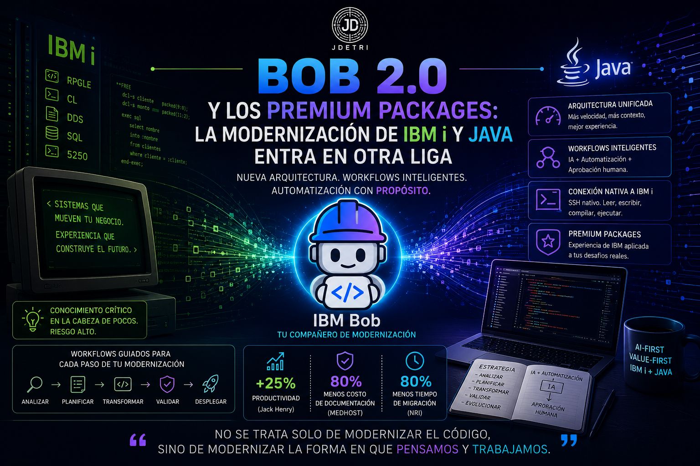

# 🧠 Bob 2.0 y los Premium Packages: la modernización de IBM i y Java entra en otra liga

Cada tanto sale una actualización que no es "una versión más". Es un cambio de fundación. El 24 de junio pasó eso con **IBM Bob**: no fue un parche, fue una reconstrucción completa de la arquitectura, y vino acompañada de algo que veníamos esperando quienes trabajamos todos los días con **IBM i**: los **Premium Packages**.

Hoy quiero hablar de tres cosas que en realidad son una sola historia:

> **¿Qué pasa cuando el agente deja de ser un asistente genérico y se convierte en un especialista de tu plataforma — con conexión nativa, memoria de contexto y flujos de trabajo repetibles?**

Porque eso es exactamente lo que separa a "una IA que ayuda a programar" de "un compañero de modernización real". Y ya está aquí.

<figure>

<figcaption>Fig 1. Bob 2.0 y los Premium Packages.</figcaption>
</figure>

## ⚙️ Bob 2.0: la base que hacía falta

Bob 1.0 nació rápido, y eso tuvo un costo: el IDE y el Shell corrían sobre dos cimientos distintos. Cada mejora había que construirla dos veces. Bob 2.0 resuelve esto de raíz con una arquitectura de tres capas:

| Componente | Rol |
|---|---|
| **El Agente** | El loop de razonamiento. Todo el pensamiento y la generación de código ocurre acá, igual en cualquier cliente. |
| **El Harness** | La infraestructura compartida: autenticación, logging, feature flags, telemetría. |
| **Los Clientes** | Las interfaces — IDE, Shell y lo que venga — sin lógica duplicada. |

De esa base salen los cambios que sí se sienten en el día a día:

- **Tool calling paralelo y nativo** — antes las llamadas a herramientas iban una por una; ahora corren en simultáneo. Una tarea que tomaba ~30 segundos ahora baja a menos de 10.
- **Contexto más grande** — de 200k a 270k tokens, así que las tareas largas aguantan más antes de compactarse.
- **Tres modos, no cinco** — *Agent* (ejecuta), *Plan* (piensa y arma el plan antes de tocar nada) y *Ask* (solo explica, de solo lectura). La recomendación de siempre sigue vigente: en código desconocido, arrancá en Ask o Plan y pasá a Agent cuando el panorama esté claro.
- **Subagentes** — cuando Bob necesita algo autocontenido, tipo "entendé cómo funciona la autenticación en este código", abre un subagente con contexto propio. Solo el resumen vuelve a la conversación principal; el resto de la exploración no ensucia tu contexto.
- **Tareas en segundo plano** — podés dejar varias tareas corriendo a la vez y seguir trabajando en otra cosa, cada una con su propio hilo.
- **Rollback rediseñado** — ya no depende de git como en V1. Ahora sigue el estado del archivo por tarea, por turno de conversación o por llamada individual a una herramienta, y podés volver a cualquiera de esos puntos.
- **Lectura nativa de documentos** — `.docx`, `.pdf`, `.xlsx` se sueltan directo en la conversación, sin copy-paste ni extracción manual. Y al cerrar un análisis, Bob puede entregar un HTML autocontenido que cualquiera abre sin instalar nada.

Nada de esto rompe lo que ya tenías configurado: reglas, MCP servers y convenciones se migran solas.

## 🧩 Workflows: el concepto que conecta todo

Acá está la pieza que más me interesa como arquitecto. La IA es excelente resolviendo problemas abiertos y bastante mala repitiendo exactamente el mismo proceso dos veces. Pedile "migrá esto a Java 21" dos días distintos y es probable que te devuelva dos enfoques distintos. Para una tarea puntual, no importa. Para modernizar una aplicación de misión crítica en fases, sí importa — y mucho.

Los **Workflows** le dan columna vertebral a ese trabajo, partiendo de una idea simple: no todos los pasos necesitan IA, y no todos los pasos deberían automatizarse por completo.

- Algunos pasos son automatización pura — escanear dependencias, correr pruebas.
- Algunos necesitan IA — transformaciones de código complejas, análisis de patrones.
- Algunos necesitan un humano — aprobar una estrategia, revisar un diff antes del commit.

Un workflow define dónde vive cada paso, mantiene el estado, maneja los errores y hace que el proceso completo sea repetible. Y sobre esa base es que nacen los **Premium Packages**: paquetes de workflows probados, construidos sobre décadas de experiencia de IBM en cada dominio.

## 🏗️ IBM Bob Premium Package for i

Este es el que más me toca de cerca. El problema que resuelve no es nuevo para quienes trabajamos con RPGLE y Full Free desde hace años:

> **¿Qué pasa el día que se jubila el desarrollador senior que tiene toda la lógica de negocio en la cabeza?**

El conocimiento crítico vive en documentación que desapareció hace tiempo, o directamente nunca existió. Cada cambio en producción carga un riesgo real de romper algo que lleva diez o veinte años corriendo sin tocarse. Y la presión de modernizar crece al mismo tiempo que el backlog de mantenimiento.

Lo que trae el Premium Package for i sobre el Bob base:

- **Conexión nativa vía SSH** al IBM i — leer, escribir, compilar y correr SQL directo desde Bob, sin copy-paste entre el editor y una sesión 5250.
- **Skills especializadas** en RPG, CL, DDS, SQL y unit testing con RPGUNIT.
- **Workflows guiados** para las transformaciones típicas: de RPG fijo a Free-Form, de DDS a DDL, extracción de reglas de negocio desde un monolito.
- **Modo Database** — para analizar, optimizar y depurar consultas SQL y DDS heredado.
- **Gobernanza incorporada** — aprobación humana en cada paso, trazabilidad y auditoría.

Lo que más me convence son los casos reales que ya están documentados. Jack Henry, el proveedor de core bancario SilverLake, reportó una mejora de al menos 25% en productividad de sus desarrolladores usando Bob para entender RPG heredado y generar documentación técnica automáticamente. MEDHOST, en el sector salud, logró reducir el esfuerzo de codificación manual hasta en un 50% aplicando Bob al análisis de dependencias y a la conversión hacia Free-Form RPG. Y el caso que más me impresionó: en M.R. Williams, un análisis de reporte que a un desarrollador senior le tomaba seis horas, con Bob se resolvió 18 veces más rápido.

No son proyectos piloto aislados. Es el mismo patrón que venimos viendo en nuestras propias implementaciones: **el cuello de botella no es escribir código, es entender el que ya existe.**

## ☕ IBM Bob Premium Package for Java Modernization

El segundo Premium Package ataca un problema espejo, pero en el mundo Java: estados enormes de aplicaciones, versiones atrasadas (muchas todavía en Java 8 o antes), dependencias cruzadas y presión constante para modernizar sin parar producción.

Lo que aporta este paquete:

- **Upgrades guiados de versión**, desde Java 8 hasta Java 25, con análisis de dependencias y detección de incompatibilidades antes de tocar una línea.
- **Migración de Java EE a Jakarta EE sobre Liberty**, combinando workflows de IA con planes de migración determinísticos del IBM Application Modernization Accelerator.
- **Generación y actualización de unit tests** como parte de un ciclo cerrado de build-test-diagnose-fix.
- **Remediación de seguridad integrada** — chequeos de CVE, salidas listas para PR y flujos de aprobación, para que la modernización quede auditable de punta a punta.
- Soporte para ecosistemas como Spring y el IBM Enterprise Build of Quarkus.

El dato que más llama la atención de este paquete viene de Blue Pearl: modernizaron una base de código Java de la versión 11 a la 25 en tres días, contra los más de treinta días que les tomaba con su enfoque tradicional.

## 🔄 Lo que tienen en común

Más allá del lenguaje o la plataforma, los dos Premium Packages comparten la misma filosofía, y es la misma que venimos aplicando en nuestros proyectos de modernización en Novacomp:

| Antes (IA genérica) | Ahora (Premium Package) |
|---|---|
| Conocimiento superficial de la arquitectura de la plataforma | Comprensión profunda de repositorio y dependencias |
| El desarrollador entrena al agente en lo básico cada vez | Skills pre-construidas y específicas del dominio |
| Sin gobernanza ni trazabilidad clara | Aprobación humana obligatoria en cada paso crítico |
| Modernización como experimento aislado | Workflows repetibles, medibles y auditables |
| Impacto difícil de medir en velocidad o adopción | Métricas concretas: % de reducción de esfuerzo, tiempo de ramp-up, cobertura de pruebas |

👉 No es una IA más inteligente en abstracto. Es una IA que conoce las reglas del juego de tu plataforma — sea IBM i con Full Free e IBM i, o un estado Java de veinte años con Spring y WebSphere.

## 🔥 Conclusión

Si uno mira Bob 2.0 y los Premium Packages solo como una lista de features nuevas, se pierde lo importante. La arquitectura de tres capas, los subagentes, los workflows repetibles, la conexión nativa a IBM i, los upgrades guiados de Java: nada de eso es el punto. Son el vehículo.

El punto real es que la IA dejó de ser un asistente genérico que hay que entrenar desde cero cada vez, y empezó a comportarse como un especialista que ya conoce las reglas de tu plataforma — tu RPG, tu Java, tus dependencias, tu historia. Eso cambia lo que le toca hacer al desarrollador: ya no es quien más código escribe, es quien tiene el criterio para decidir qué output del agente entra a producción y cuál no.

Y esa es exactamente la misma transformación de la que veníamos hablando con **Agilismo Orquestado**: el equipo no se reduce, se redefine. El orquestador de IBM i o de Java necesita hoy más criterio arquitectónico que nunca, porque el agente le resuelve la parte mecánica, pero la responsabilidad sobre lo que se libera a producción sigue siendo — y va a seguir siendo — humana.

Bob 2.0 y sus Premium Packages no vienen a resolver ese problema por nosotros. Vienen a darnos, por fin, herramientas a la altura del problema que ya teníamos.

Porque al final del día, tenemos que tener presente:

> **No se trata solo de modernizar el código, sino de modernizar la forma en que pensamos y trabajamos.**