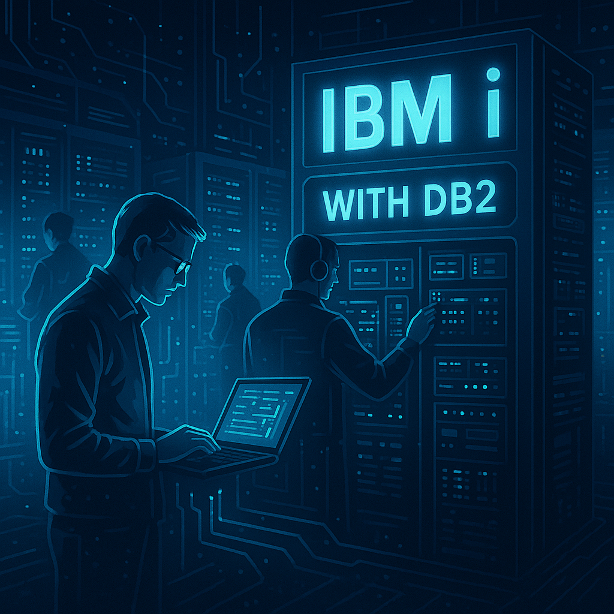
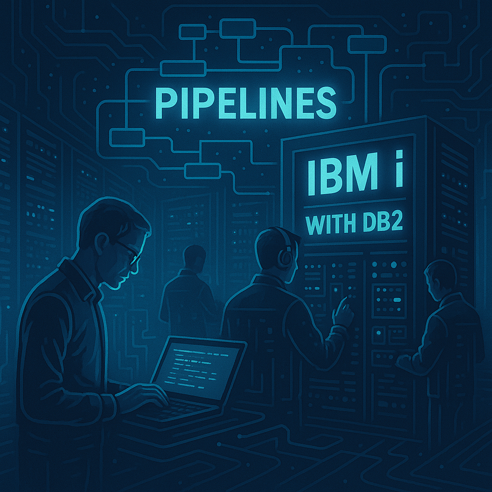

# 🚀 DB2 in the DevOps lifecycle: Automation and Best Practices

In the modern world of software development, talking about **DevOps** is not just about fast deployments, but about achieving a balance between **speed, quality, and security**. Applications have evolved and adopted agile practices, but very often the **database** is left in the shadows, treated as a rigid element that is hard to automate.

If you work with **DB2**, whether on **IBM i** or in distributed environments (LUW), you are surely well aware of this reality:
- Scripts applied manually in each environment.
- Differences between QA and Production that generate errors that are hard to trace.
- Rollbacks that require long nights of work.

Integrating **DB2 into DevOps** seeks to eliminate these pain points. It is not about reinventing the wheel, but about applying the same practices we already use in application code: **versioning, automation, testing, and monitoring**.

<figure>

<figcaption>Fig 1. Representation of DB2 integration in DevOps</figcaption>
</figure>

## 🔹 1. Integrating SQL scripts into pipelines (Azure DevOps / GitHub Actions)

The first step to modernizing DB2 management is to **automate the execution of SQL scripts**.

### Common problem
A developer creates a script to add a column. They apply it in their local environment, email it or share it on Teams, and someone else copies it into Production. This generates inconsistencies, human errors, and a lack of traceability.

### DevOps solution
Include the script in the **Git repository** and have it executed automatically by a **CI/CD pipeline**.

📌 **Example with GitHub Actions:**
```yaml
name: Deploy DB2 Scripts

on:
  push:
    branches: [ "main" ]

jobs:
  run-sql:
    runs-on: ubuntu-latest
    steps:
      - uses: actions/checkout@v3

      - name: Instalar cliente DB2
        run: |
          sudo apt-get update
          sudo apt-get install -y db2cli

      - name: Ejecutar script SQL en DB2
        run: db2 -tvf scripts/migracion.sql
        env:
          DB2USER: ${{ secrets.DB2_USER }}
          DB2PASS: ${{ secrets.DB2_PASS }}
          DB2HOST: ${{ secrets.DB2_HOST }}
```

✅ Benefits:
- Consistency across environments.
- Automatic execution on each *push*.
- Security thanks to encrypted secrets.


## 🔹 2. Version control for DB2 objects

In DevOps, anything that is not versioned **does not exist**.

### What to version?
- **DDL** for tables.
- **Indexes** and constraints.
- **Stored Procedures** and functions.
- **Triggers**.

### Recommended repository structure:
```
/db2
   /tables
      clientes.sql
      cuentas.sql
   /indexes
      idx_clientes_nombre.sql
   /procedures
      proc_valida_cliente.sql
   /migrations
      001_add_email_clientes.sql
      002_update_index_cuentas.sql
```

📌 **Example of a versioned table (`clientes.sql`):**
```sql
CREATE TABLE clientes (
    cliente_id INT NOT NULL PRIMARY KEY,
    nombre VARCHAR(100) NOT NULL,
    direccion VARCHAR(200),
    telefono VARCHAR(20)
);
```

📌 **Example of an index (`idx_clientes_nombre.sql`):**
```sql
CREATE INDEX idx_clientes_nombre
ON clientes (nombre);
```

✅ Advantages:
- Change history with `git log`.
- Peer review via *pull requests*.
- Ability to revert with `git revert`.


## 🔹 3. Liquibase: what it is, what it's for, and why it matters

So far we have seen version control and script execution. But what happens if something fails in the middle of a migration? This is where **Liquibase** comes in.

### 🔑 What is Liquibase?
It is a **database change management** tool that allows you to:
- Version migrations.
- Automate deployments.
- Define **rollbacks**.
- Audit changes across multiple environments.

### 📌 Why use it with DB2?
- It guarantees that all environments (DEV, QA, PROD) have the same state.
- It provides **consistency** and eliminates "drift" between schemas.
- It integrates perfectly into CI/CD pipelines.
- It makes the database treated just like code: controlled, traceable, and reliable.

In short: **Liquibase turns manual changes into automated and reversible processes**.


## 🔹 4. Safe migrations with automated rollback

A database change can fail. The important thing is not just to apply the change, but to be able to **revert it automatically**.

📌 **Example of a changelog with rollback (`changelog.xml`):**  
```xml
<databaseChangeLog>
  <changeSet id="001" author="jdetri">
    <addColumn tableName="clientes">
      <column name="email" type="VARCHAR(100)"/>
    </addColumn>
    <rollback>
      <dropColumn tableName="clientes" columnName="email"/>
    </rollback>
  </changeSet>
</databaseChangeLog>
```


📌 **Pipeline in Azure DevOps with Liquibase:**  

<figure>

<figcaption>Fig 2. Representation of DB2 pipelines in IBMi environments</figcaption>
</figure>

```yaml
- stage: Deploy
  jobs:
    - job: LiquibaseMigration
      steps:
        - task: Liquibase@1
          inputs:
            driver: 'com.ibm.db2.jcc.DB2Driver'
            changeLogFile: 'changelog.xml'
            url: 'jdbc:db2://$(DB2HOST):50000/MYDB'
            username: $(DB2USER)
            password: $(DB2PASS)
            command: 'update'
```

✅ Benefit: If the change fails → Liquibase runs the rollback.


## 🔹 5. Syntax validation before QA

Applying a script with errors in Production can be disastrous. That is why a **validation stage** is key.

📌 **Simple example in Azure DevOps:**
```yaml
- stage: Validate
  jobs:
    - job: SQLValidation
      steps:
        - script: db2 -tvf scripts/migracion.sql
```

👉 With this:
- The pipeline detects syntax errors.
- QA only receives valid scripts.
- Time lost on corrections is reduced.


## 🔹 6. Automated testing of critical queries

In DB2 there are queries that **cannot fail** (for example: bank balances, financial closings). These must have **automated tests**.

📌 **Example of an SQL test:**
```sql
-- Datos de prueba
INSERT INTO cuentas (cliente_id, saldo_total) VALUES (123, 1000);

-- Query crítico
SELECT saldo_total FROM cuentas WHERE cliente_id = 123;

-- Validación esperada
ASSERT resultado = 1000;
```

📌 **Example in Python with pyodbc:**
```python
import pyodbc

conn = pyodbc.connect("DRIVER={IBM DB2 ODBC DRIVER};DATABASE=MYDB;HOSTNAME=host;PORT=50000;UID=user;PWD=pass;")
cursor = conn.cursor()

cursor.execute("SELECT saldo_total FROM cuentas WHERE cliente_id = 123")
row = cursor.fetchone()

assert row[0] == 1000, "El saldo no coincide con el esperado"
```

✅ Integrating this test into a pipeline ensures that if the query fails, **the deployment stops**.


## 🔹 7. DB2 best practices in DevOps environments

- Never run scripts manually in Production.
- Keep **clear names** in migrations (`001_add_email.sql`, `002_fix_index.sql`).
- Align application and DB changes (branch → pull request → pipeline).
- Always test in a **sandbox/QA** environment before PROD.
- Use **monitoring** to detect slow queries after deployment.


## 🚀 Conclusion

The database can no longer be seen as a static block outside the development cycle. With DevOps practices and tools like **Liquibase**, DB2 becomes one more actor within the continuous delivery flow.

With these practices:
1. **SQL scripts** integrated into pipelines.
2. **Version control** with Git.
3. **Safe migrations** with rollback.
4. **Automatic validation** of syntax.
5. **Automated testing** of critical queries.
6. **Best practices** aligned with the agile lifecycle.
