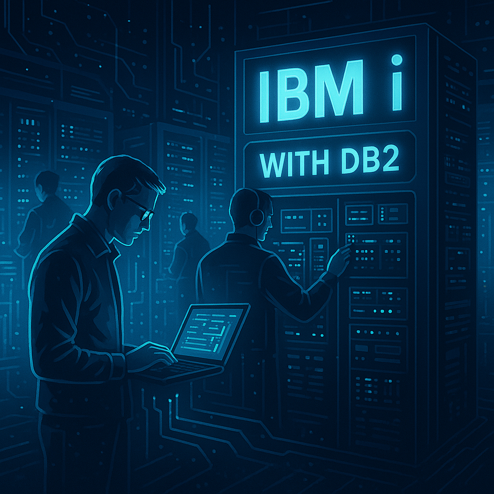
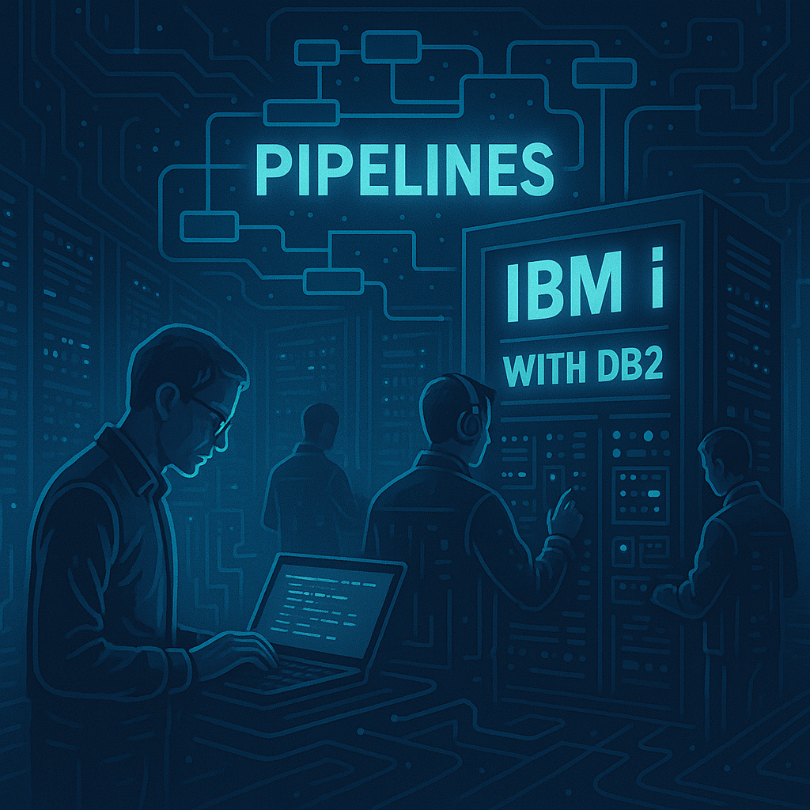

# 🚀 DB2 en el ciclo de vida DevOps: Automatización y Buenas Prácticas

En el mundo moderno del desarrollo de software, hablar de **DevOps** no es solo hablar de despliegues rápidos, sino de lograr un equilibrio entre **velocidad, calidad y seguridad**. Las aplicaciones han evolucionado y adoptado prácticas ágiles, pero muchas veces la **base de datos** queda relegada en la sombra, tratada como un elemento rígido y difícil de automatizar.

Si trabajas con **DB2**, ya sea en **IBM i** o en entornos distribuidos (LUW), seguramente conoces bien esta realidad:
- Scripts aplicados manualmente en cada ambiente.
- Diferencias entre QA y Producción que generan errores difíciles de rastrear.
- Rollbacks que requieren largas noches de trabajo.

La integración de **DB2 en DevOps** busca eliminar estos puntos de dolor. No se trata de reinventar la rueda, sino de aplicar las mismas prácticas que ya usamos en código de aplicación: **versionado, automatización, pruebas y monitoreo**.

<figure>

<figcaption>Fig 1. Representación de la integración de DB2 en DevOps</figcaption>
</figure>

## 🔹 1. Integración de scripts SQL en pipelines (Azure DevOps / GitHub Actions)

El primer paso para modernizar la gestión de DB2 es **automatizar la ejecución de scripts SQL**.

### Problema común
Un desarrollador crea un script para agregar una columna. Lo aplica en su ambiente local, lo manda por correo o lo comparte en Teams, y alguien más lo copia en Producción. Esto genera inconsistencias, errores humanos y falta de trazabilidad.

### Solución DevOps
Incluir el script en el **repositorio Git** y que sea ejecutado automáticamente por un **pipeline CI/CD**.

📌 **Ejemplo con GitHub Actions:**
```yaml
name: Deploy DB2 Scripts

on:
  push:
    branches: [ "main" ]

jobs:
  run-sql:
    runs-on: ubuntu-latest
    steps:
      - uses: actions/checkout@v3

      - name: Instalar cliente DB2
        run: |
          sudo apt-get update
          sudo apt-get install -y db2cli

      - name: Ejecutar script SQL en DB2
        run: db2 -tvf scripts/migracion.sql
        env:
          DB2USER: ${{ secrets.DB2_USER }}
          DB2PASS: ${{ secrets.DB2_PASS }}
          DB2HOST: ${{ secrets.DB2_HOST }}
```

✅ Beneficios:
- Consistencia entre ambientes.
- Ejecución automática en cada *push*.
- Seguridad gracias a secretos cifrados.


## 🔹 2. Control de versiones para objetos DB2

En DevOps, todo lo que no está versionado **no existe**.

### ¿Qué versionar?
- **DDL** de tablas.
- **Índices** y constraints.
- **Stored Procedures** y funciones.
- **Triggers**.

### Estructura recomendada del repositorio:
```
/db2
   /tables
      clientes.sql
      cuentas.sql
   /indexes
      idx_clientes_nombre.sql
   /procedures
      proc_valida_cliente.sql
   /migrations
      001_add_email_clientes.sql
      002_update_index_cuentas.sql
```

📌 **Ejemplo de tabla versionada (`clientes.sql`):**
```sql
CREATE TABLE clientes (
    cliente_id INT NOT NULL PRIMARY KEY,
    nombre VARCHAR(100) NOT NULL,
    direccion VARCHAR(200),
    telefono VARCHAR(20)
);
```

📌 **Ejemplo de índice (`idx_clientes_nombre.sql`):**
```sql
CREATE INDEX idx_clientes_nombre
ON clientes (nombre);
```

✅ Ventajas:
- Historial de cambios con `git log`.
- Revisión por pares vía *pull requests*.
- Posibilidad de revertir con `git revert`.


## 🔹 3. Liquibase: qué es, para qué sirve y por qué importa

Hasta aquí hemos visto control de versiones y ejecución de scripts. Pero, ¿qué pasa si algo falla en medio de una migración? Aquí entra **Liquibase**.

### 🔑 ¿Qué es Liquibase?
Es una herramienta de **gestión de cambios de base de datos** que permite:
- Versionar migraciones.
- Automatizar despliegues.
- Definir **rollbacks**.
- Auditar cambios en entornos múltiples.

### 📌 ¿Por qué usarlo con DB2?
- Garantiza que todos los ambientes (DEV, QA, PROD) tienen el mismo estado.
- Provee **consistencia** y elimina el “drift” entre esquemas.
- Se integra perfectamente en pipelines de CI/CD.
- Hace que la base de datos sea tratada igual que el código: controlada, trazable y confiable.

En resumen: **Liquibase convierte cambios manuales en procesos automatizados y reversibles**.


## 🔹 4. Migraciones seguras con rollback automatizado

Un cambio en base de datos puede fallar. Lo importante no es solo aplicar el cambio, sino poder **revertirlo de forma automática**.

📌 **Ejemplo de changelog con rollback (`changelog.xml`):**  
```xml
<databaseChangeLog>
  <changeSet id="001" author="jdetri">
    <addColumn tableName="clientes">
      <column name="email" type="VARCHAR(100)"/>
    </addColumn>
    <rollback>
      <dropColumn tableName="clientes" columnName="email"/>
    </rollback>
  </changeSet>
</databaseChangeLog>
```


📌 **Pipeline en Azure DevOps con Liquibase:**  

<figure>

<figcaption>Fig 2. Representación de los pipelines de DB2 en entornos IBMi</figcaption>
</figure>

```yaml
- stage: Deploy
  jobs:
    - job: LiquibaseMigration
      steps:
        - task: Liquibase@1
          inputs:
            driver: 'com.ibm.db2.jcc.DB2Driver'
            changeLogFile: 'changelog.xml'
            url: 'jdbc:db2://$(DB2HOST):50000/MYDB'
            username: $(DB2USER)
            password: $(DB2PASS)
            command: 'update'
```

✅ Beneficio: Si el cambio falla → Liquibase ejecuta el rollback.


## 🔹 5. Validación de sintaxis antes de QA

Aplicar un script con errores en Producción puede ser desastroso. Por eso, un **stage de validación** es clave.

📌 **Ejemplo simple en Azure DevOps:**
```yaml
- stage: Validate
  jobs:
    - job: SQLValidation
      steps:
        - script: db2 -tvf scripts/migracion.sql
```

👉 Con esto:
- El pipeline detecta errores sintácticos.
- QA recibe solo scripts válidos.
- Se reduce el tiempo perdido en correcciones.


## 🔹 6. Testing automatizado de queries críticos

En DB2 hay queries que **no pueden fallar** (ejemplo: balances bancarios, cierres financieros). Estos deben tener **pruebas automáticas**.

📌 **Ejemplo de prueba SQL:**
```sql
-- Datos de prueba
INSERT INTO cuentas (cliente_id, saldo_total) VALUES (123, 1000);

-- Query crítico
SELECT saldo_total FROM cuentas WHERE cliente_id = 123;

-- Validación esperada
ASSERT resultado = 1000;
```

📌 **Ejemplo en Python con pyodbc:**
```python
import pyodbc

conn = pyodbc.connect("DRIVER={IBM DB2 ODBC DRIVER};DATABASE=MYDB;HOSTNAME=host;PORT=50000;UID=user;PWD=pass;")
cursor = conn.cursor()

cursor.execute("SELECT saldo_total FROM cuentas WHERE cliente_id = 123")
row = cursor.fetchone()

assert row[0] == 1000, "El saldo no coincide con el esperado"
```

✅ Integrar este test en un pipeline asegura que si el query falla, **el despliegue se detiene**.


## 🔹 7. Buenas prácticas de DB2 en entornos DevOps

- Nunca ejecutar scripts manualmente en Producción.
- Mantener **nombres claros** en migraciones (`001_add_email.sql`, `002_fix_index.sql`).
- Alinear cambios de aplicación y DB (branch → pull request → pipeline).
- Siempre probar en un entorno **sandbox/QA** antes de PROD.
- Usar **monitorización** para detectar queries lentos post-despliegue.


## 🚀 Conclusión

La base de datos ya no puede ser vista como un bloque estático fuera del ciclo de desarrollo. Con las prácticas de DevOps y herramientas como **Liquibase**, DB2 se convierte en un actor más dentro del flujo de entrega continua.

Con estas prácticas:
1. **Scripts SQL** integrados en pipelines.
2. **Control de versiones** con Git.
3. **Migraciones seguras** con rollback.
4. **Validación automática** de sintaxis.
5. **Pruebas automatizadas** de queries críticos.
6. **Buenas prácticas** alineadas con el ciclo de vida ágil.
