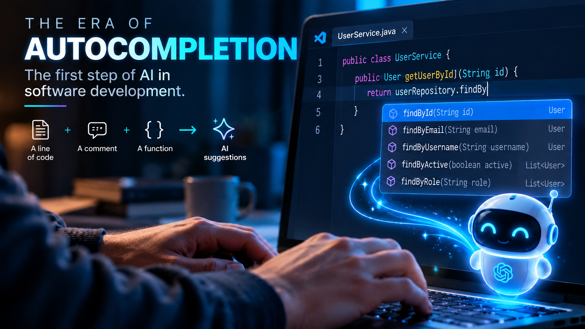
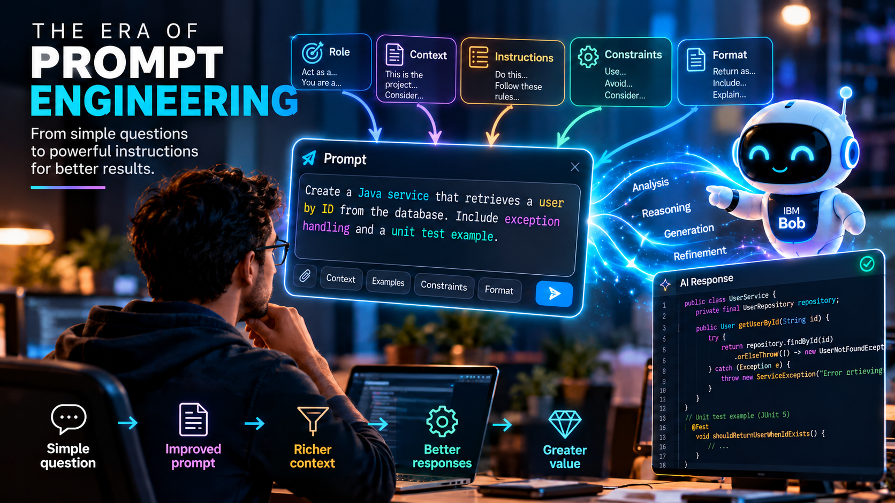
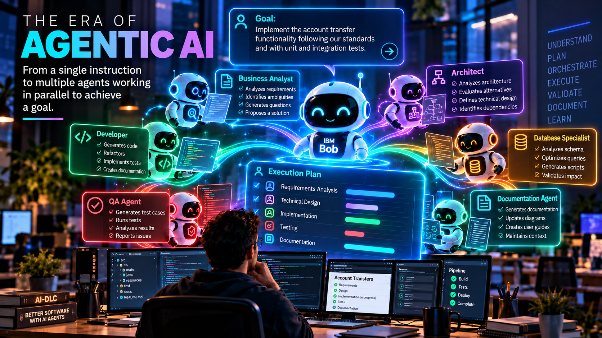
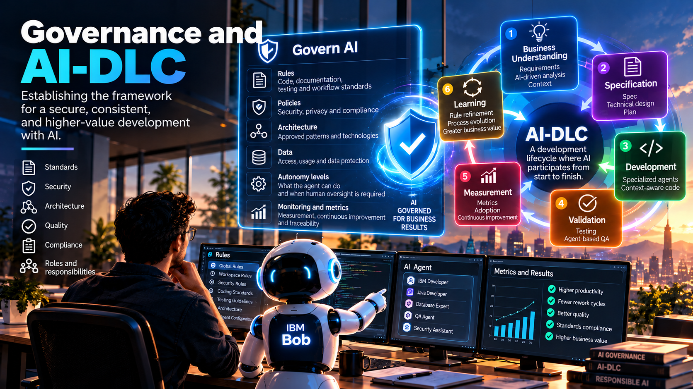

# From SDLC to AI-DLC: context changed everything

Over the last few years, we have talked a lot about Artificial Intelligence applied to software development.

First we talked about autocomplete. Then we learned about prompting. Later came coding assistants, and today we are entering the era of AI agents.

But, in my experience, the real shift did not happen simply because AI learned to generate better code.

**The real turning point happened when we began improving the form, quantity, and quality of the context that AI could handle and process.**

And this is changing not only the way we develop software, but the entire lifecycle through which we build it.

We are moving from the traditional SDLC to a new way of working where Artificial Intelligence participates actively throughout the cycle: **AI-DLC (AI-Driven Development Lifecycle).**

## It all started with autocomplete

The first experiences many of us had using AI to develop were closely related to autocomplete. The context was extremely limited:

- One line of code.
- One comment.
- One function.

From that small amount of information, the AI tried to predict what we wanted to do next. It was impressive for its time and quickly showed us that AI could become an important tool for increasing developer productivity.

Then came a different stage: we began learning about **Prompt Engineering**. We no longer expected AI to simply complete our code. We learned to talk to it, give it instructions, provide additional information, and use different prompting techniques to get better results.

Context began to grow, but another problem appeared.

<figcaption>Fig 1. The era of autocomplete in software development</figcaption>

## Prompting also put a limit on us

When we work exclusively through prompts, we are the ones who decide what to ask the AI, we are the ones who select what information to give it, and we are the ones who define the scope of the problem.

And without realizing it, we often end up **limiting AI's capabilities to our own analytical capabilities**. This leads to situations like:

- If we forget to provide important information, the AI does not necessarily know it.
- If we ask a question that is too generic, we will probably receive a generic answer.
- If our interpretation of the problem is incomplete, the context we provide will also be incomplete.

And then we begin to encounter ambiguous, inconsistent, and often simply incorrect answers.

For a while we tried to solve this by creating better prompts, but the real problem was not always in the prompt.

**It was in the context.**

<figcaption>Fig 2. The era of prompting in software development</figcaption>

## The agentic era changes the equation

With the arrival of agents, we began working differently. Now AI can analyze its environment, understand a repository, review code, connect information, use tools, identify dependencies, and build context before executing a task.

We no longer necessarily have to explain everything to it through a single prompt, and this unlocks enormous capability. AI is no longer limited exclusively to our specific request and can begin to **understand the environment in which that request exists**.

For me, this is one of the fundamental changes that moves us from AI-assisted development toward AI-DLC, because if the quality of our agents' work depends heavily on context, then a question emerges:

> **Why wait until the development stage to incorporate AI?**

<figcaption>Fig 3. The agentic era in software development</figcaption>

## AI should participate much earlier than writing the first line of code

We traditionally think of AI tools for development only when it is time to program. We visualize only the following stages:

1. We have a requirement.
2. We create a story.
3. We assign it to a developer.
4. And only then do we use AI to generate code.

But we are missing a great opportunity. If we incorporate AI from the earliest stages of the project, we can progressively enrich its context. AI can participate in understanding the business need, requirement analysis, comprehension of existing systems, repository analysis, architecture, documentation, planning, development, and later testing and validation.

Each stage can feed the next. When we finally reach development, the agent should no longer be starting from zero; it should know **what we need, why we need it, where we should implement it, and under what conditions we should do it**.

That is where our way of developing begins to change completely. But before doing all of this, there is an even more important step.

## AI-DLC does not begin with the requirement: it begins with governance

Before asking an AI to work for us, we must define **how we want it to work for us**. In my view, this is one of the mistakes we can make when we begin incorporating AI agents into our processes. We should not simply start by handing them tasks. First, we need to establish the rules:

1. What are our development standards?
2. What architectures do we allow?
3. What patterns do we use?
4. How do we document things?
5. What security standards must we comply with?
6. How should tests be built?
7. What constraints exist?
8. What decisions can the agent make?
9. Which ones require human intervention?

In other words, we need to **govern the way AI works within our organization**. And here, capabilities such as **Bob Rules** become enormously important within IBM Bob. The Rules allow us to define persistent instructions related to coding standards, documentation, testing, workflows, and team conventions. In addition, there can be global rules and rules specific to a workspace or project.

This means we do not have to repeat our standards in every prompt. We can begin converting the knowledge and guidelines of our organization into part of the permanent context under which our agent works.

> **Governing AI does not mean only telling it what it cannot do. It also means defining how we want it to do things.**

The first time an organization does this work, it can be an important process. We have to identify standards, document them, challenge them, and turn part of that knowledge—which often exists only in the experience of people—into explicit rules.

But there is an accumulative benefit: this means the next project does not begin from zero. We have a foundation, and that foundation must evolve continuously as we learn.

## So yes: let’s talk about the business need

Once we have a governance foundation, we can begin working on what we really need to solve, and here again AI can participate much earlier than development.

A functional requirement may contain subjective terms, ambiguities, invisible assumptions, contradictions, or risks that we do not identify initially. Instead of accepting that requirement as a static input to the process, we can work with IBM Bob to analyze and question it. We can apply requirement analysis frameworks, generate questions for the business, identify missing information, and remove ambiguities before moving forward.

AI then stops being merely the one who receives a requirement to generate code and begins to help us **better understand what problem we are trying to solve**. And once again, we are adding context.

## From functional requirement to technical understanding

Once we clearly understand the business need, we are still not ready to develop. We need to turn that functional requirement into something technically tangible:

1. What do we have today?
2. How does the application work?
3. What components are involved?
4. What architecture do we use?
5. What dependencies exist?
6. What code must change?
7. What technical constraints do we have?

Here, AI-based code and repository analysis can dramatically accelerate an activity that traditionally consumed a significant amount of time. IBM Bob can help us understand an existing codebase, analyze architecture, generate documentation, and gather information about how an application works. But the important part is not simply doing it faster.

> **Each analysis enriches context again.**

And with this, we help our agent acquire the following knowledge:

1. It knows the business need.
2. It knows the functional requirements.
3. It knows our organizational standards.
4. It knows our Rules.
5. It also begins to know our system, architecture, repository, and code.

We are progressively building a much more complete representation of the problem we want to solve.

## The speed of development begins before development

This is probably one of the most important ideas I have learned working with AI applied to software development. When we talk about productivity with AI, we often immediately think about code generation and ask questions like:

- How many lines can it generate?
- How much faster can it program?
- How much time can we reduce during development?

But I think we are asking the wrong question.

> **The speed we gain with AI during development begins long before we reach the development phase.**

It begins with good governance, continues with better requirements, strengthens with better documentation, grows with system analysis, and multiplies when all that knowledge becomes context available to our agents.

If we do that work correctly, we can reduce ambiguity, inconsistency, hallucinations, and, above all, rework. Each stage begins to accelerate the next. That is why AI-DLC should not be understood simply as using AI to execute the same activities faster than before. It implies starting to question **how the development lifecycle should work when AI is part of it from the beginning**.

## Buying a license does not mean adopting AI-DLC

This is where another challenge appears. An organization can buy an AI tool, assign licenses to its developers, and say:

> “Now we are developing with Artificial Intelligence.”

But that does not necessarily mean it has adopted AI-DLC. Adopting AI-DLC requires first looking inward. We have to analyze our processes, our activities, our flows, our roles, and our standards, and stop thinking of each stage as an independent silo.

The question should change. Instead of asking:

> **“Can AI do this?”**

we should begin asking:

> **“How can we incorporate AI here to make this process more efficient, improve its quality, and deliver greater value to the business?”**

Very often, we quickly conclude that an AI tool does not work for a given technology, does not understand our processes, or does not meet our standards. In some cases, there will certainly be real technology limitations, but in others we should ask whether the problem is really in AI's capability or in **how we are preparing our organization to work with it**.

We cannot deliver a new tool and expect different results while keeping the same processes, roles, and ways of thinking. AI-DLC is also a cultural transformation.

## From AI-assisted coding to AI-assisted delivery

This is precisely what I find interesting about IBM Bob. Bob is not positioned solely as an assistant for generating code. IBM presents it as an **AI SDLC partner**, designed to work on real codebases and participate in understanding, planning, implementation, and improvement activities throughout the development lifecycle.

That approach fits very well with the transformation we are living through. We come from an era in which the conversation was mainly:

> **How can AI help me program?**

We are entering another where the question starts to become:

> **How can humans and AI agents work together to build software?**

And the difference between those two questions is enormous, because the second forces us to talk about several points:

- Context.
- Governance.
- Processes.
- Architecture.
- Responsibilities.
- Documentation.
- Requirements.
- And, above all, how we transform human intention into something clear enough for humans and agents to work toward the same objective.

And that is where the next major challenge appears.

## If context is so important, we need a better way to express our intention

We already have a business need, we have analyzed it, removed ambiguities, have Rules that establish how our AI should work, analyzed our code, repository, and architecture, and understand technically what we have and what we need to build. Now we need to consolidate all of that knowledge into something tangible, something that can become the source of understanding between business, developers, and AI agents. We need to move from:

> **“This is what I want.”**

to:

> **“This is exactly what we need to build, these are its conditions, these are its constraints, and these are the criteria by which we will determine that it is correct.”**

This is where **Spec-Driven Development (SDD)** begins to gain enormous relevance within AI-DLC. And curiously, AI could be making something we have tried to minimize for years to accelerate development—detailed documentation and specification—become one of the mechanisms that helps us develop even faster. But that deserves a full conversation.

**To be continued...**

> **It is not just about modernizing the code, but about modernizing the way we think and work.**
