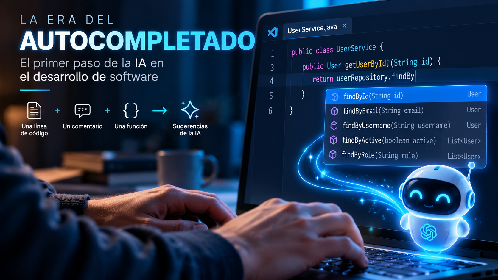
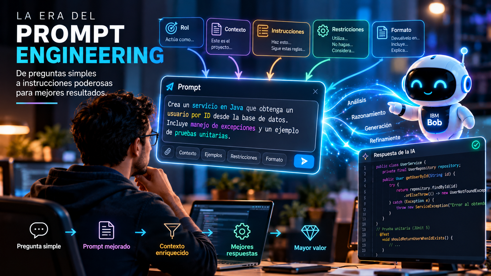
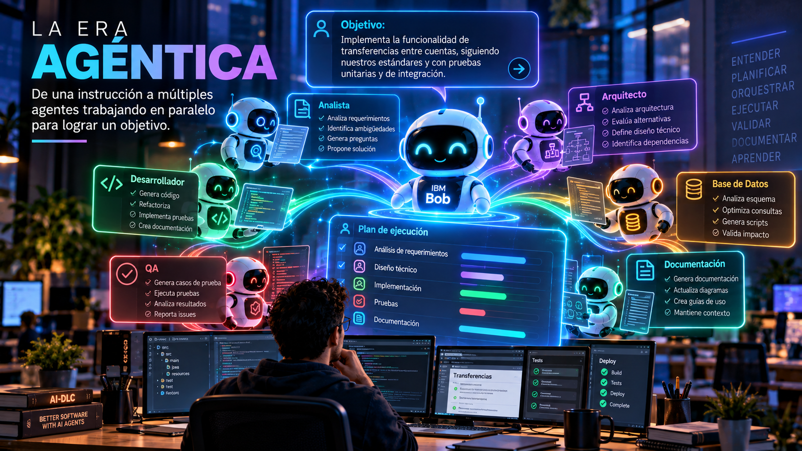
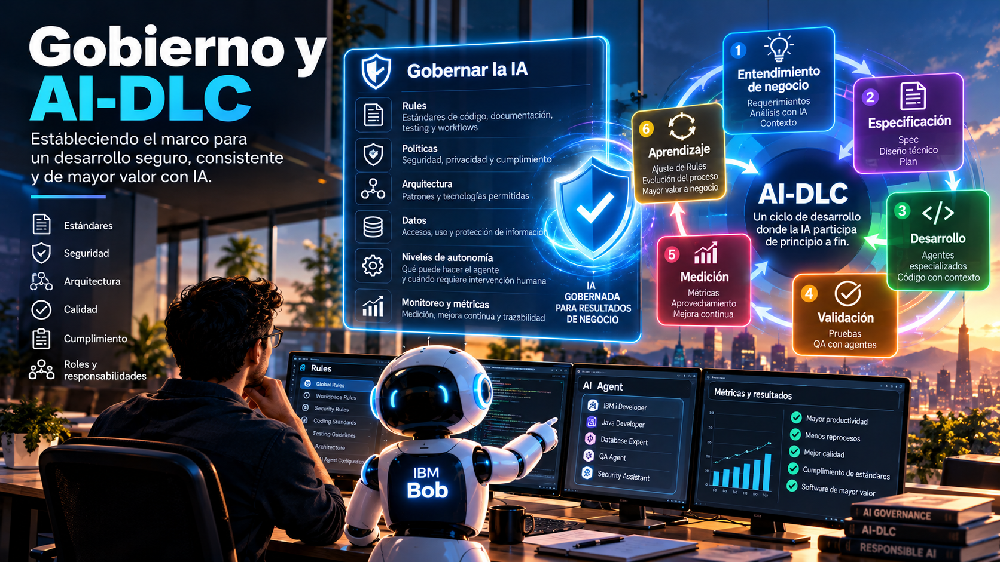

# Del SDLC al AI-DLC: el contexto lo cambió todo

Durante los últimos años hemos hablado muchísimo sobre Inteligencia Artificial aplicada al desarrollo de software.

Primero hablamos de autocompletado. Después aprendimos sobre prompting. Más adelante llegaron los asistentes de código y hoy estamos entrando de lleno en la era de los agentes de Inteligencia Artificial.

Pero, desde mi experiencia, el verdadero cambio no ocurrió simplemente porque la IA aprendiera a generar mejor código.

**El verdadero punto de inflexión ocurrió cuando comenzamos a mejorar la forma, la cantidad y la calidad del contexto que la IA podía manejar y procesar.**

Y esto está cambiando no solamente la forma en que desarrollamos software, sino el ciclo completo mediante el cual lo construimos.

Estamos pasando del SDLC tradicional a una nueva forma de trabajar donde la Inteligencia Artificial participa activamente a lo largo del ciclo: **AI-DLC (AI-Driven Development Lifecycle).**

## Todo comenzó con el autocompletado

Las primeras experiencias que muchos tuvimos utilizando IA para desarrollar estaban muy relacionadas con el autocompletado. El contexto era extremadamente limitado:

- Una línea de código.
- Un comentario.
- Una función.

Y a partir de esa pequeña cantidad de información, la IA intentaba predecir qué queríamos hacer a continuación. Fue impresionante para su momento y nos permitió descubrir rápidamente que la IA podía convertirse en una herramienta importante para aumentar nuestra productividad como desarrolladores.

Después llegó una etapa diferente, comenzamos a aprender sobre **Prompt Engineering**. Ya no esperábamos simplemente que la IA completara nuestro código. Aprendimos a conversar con ella, darle instrucciones, proporcionarle información adicional y utilizar diferentes técnicas de prompting para obtener mejores resultados.

El contexto comenzó a crecer, pero apareció otro problema.

<figcaption>Fig 1. La era del autocompletado en el desarrollo de software</figcaption>

## El prompting también nos puso un límite

Cuando trabajamos exclusivamente mediante prompts, somos nosotros quienes decidimos qué preguntarle a la IA, somos nosotros quienes seleccionamos qué información darle, somos nosotros quienes definimos el alcance del problema.

Y, sin darnos cuenta, muchas veces terminamos **limitando las capacidades de la IA a nuestras propias capacidades de análisis**. Dando lugar a situaciones como:

- Si olvidamos proporcionar una información importante, la IA no necesariamente la conoce.
- Si hacemos una pregunta demasiado genérica, probablemente recibiremos una respuesta genérica.
- Si nuestra interpretación del problema está incompleta, el contexto que proporcionamos también estará incompleto.

Y comenzamos entonces a encontrarnos con respuestas ambiguas, inconsistentes y, en muchas ocasiones, simplemente incorrectas.

Durante algún tiempo intentamos resolver esto creando mejores prompts, pero el verdadero problema no siempre estaba en el prompt.

**Estaba en el contexto.**

<figcaption>Fig 2. La era del prompting en el desarrollo de software</figcaption>

## La era agéntica cambia la ecuación

Con la llegada de los agentes comenzamos a trabajar de una manera diferente, ahora la IA puede analizar su entorno, entender un repositorio, revisar código, relacionar información, utilizar herramientas, identificar dependencias y construir contexto antes de ejecutar una tarea.

Ya no tenemos necesariamente que explicarle absolutamente todo mediante un único prompt y esto libera una capacidad enorme, la IA deja de estar limitada exclusivamente a nuestra petición puntual y puede comenzar a **entender el entorno en el que esa petición existe**.

Para mí, ahí está uno de los cambios fundamentales que nos lleva desde el desarrollo asistido por IA hacia AI-DLC, porque si la calidad del trabajo de nuestros agentes depende fuertemente del contexto, entonces surge una pregunta:

> **¿Por qué esperar hasta la etapa de desarrollo para incorporar la IA?**

<figcaption>Fig 3. La era agéntica en el desarrollo de software</figcaption>

## La IA debería participar mucho antes de escribir la primera línea de código

Tradicionalmente pensamos en herramientas de IA para desarrollo justo cuando llega el momento de programar, visualizamos únicamente las siguientes etapas:

1. Tenemos un requerimiento.
2. Creamos una historia.
3. La asignamos a un desarrollador.
4. Y entonces utilizamos IA para generar código.

Pero estamos desaprovechando una gran oportunidad, si incorporamos la IA desde las etapas más incipientes del proyecto, podemos ir enriqueciendo progresivamente su contexto, la IA puede participar en el entendimiento de la necesidad de negocio, en el análisis de requerimientos, en la comprensión de sistemas existentes, en el análisis del repositorio, en arquitectura, documentación, planificación, desarrollo y posteriormente en las pruebas y validación.

Cada etapa puede alimentar a la siguiente y cuando finalmente llegamos al desarrollo, el agente ya no debería estar comenzando desde cero, debería conocer **qué necesitamos, por qué lo necesitamos, dónde debemos implementarlo y bajo qué condiciones debemos hacerlo**.

Ahí comienza a cambiar completamente nuestra forma de desarrollar, pero antes de hacer todo esto existe un paso todavía más importante.

## AI-DLC no comienza con el requerimiento: comienza con Gobierno

Antes de pedirle a una IA que trabaje para nosotros, tenemos que definir **cómo queremos que trabaje para nosotros**. Este es, desde mi perspectiva, uno de los errores que podemos cometer cuando comenzamos a incorporar agentes de IA dentro de nuestros procesos, no deberíamos empezar simplemente entregándoles tareas, primero necesitamos establecer las reglas:

1. ¿Cuáles son nuestros estándares de desarrollo?
2. ¿Qué arquitecturas permitimos?
3. ¿Qué patrones utilizamos?
4. ¿Cómo documentamos?
5. ¿Qué estándares de seguridad debemos cumplir?
6. ¿Cómo deben construirse las pruebas?
7. ¿Qué restricciones existen?
8. ¿Qué decisiones puede tomar el agente?
9. ¿Cuáles requieren intervención humana?

En otras palabras, necesitamos **gobernar la forma en que la IA trabaja dentro de nuestra organización**. Y aquí capacidades como **Bob Rules** adquieren una importancia enorme dentro de IBM Bob. Las Rules nos permiten definir instrucciones persistentes relacionadas con estándares de código, documentación, testing, workflows y convenciones del equipo. Además, pueden existir reglas globales y reglas específicas para un workspace o proyecto.

Esto significa que no tenemos que repetir nuestros estándares en cada prompt, podemos empezar a convertir el conocimiento y los lineamientos de nuestra organización en parte del contexto permanente bajo el cual trabaja nuestro agente.

> **Gobernar la IA no significa solamente decirle qué no puede hacer. También significa definir cómo queremos que haga las cosas.**

La primera vez que una organización realiza este trabajo puede ser un proceso importante, tenemos que identificar estándares, documentarlos, cuestionarlos y convertir parte de ese conocimiento, que muchas veces existe solamente en la experiencia de las personas, en reglas explícitas.

Pero existe un beneficio acumulativo, lo que significa que el siguiente proyecto ya no comienza desde cero, tenemos una base y esa base debe evolucionar continuamente conforme aprendemos.

<figcaption>Fig 4. Gobernanza de la IA en el AI Driven Development</figcaption>

## Entonces sí: hablemos de la necesidad de negocio

Una vez que tenemos una base de gobierno, podemos comenzar a trabajar sobre lo que realmente necesitamos resolver y aquí nuevamente la IA puede participar mucho antes del desarrollo.

Un requerimiento funcional puede contener términos subjetivos, ambigüedades, supuestos invisibles, contradicciones o riesgos que no identificamos inicialmente, en lugar de aceptar ese requerimiento como una entrada estática al proceso, podemos trabajar junto con IBM Bob para analizarlo y cuestionarlo, podemos aplicar frameworks de análisis de requerimientos, generar preguntas para negocio, identificar información faltante y eliminar ambigüedades antes de avanzar.

La IA deja entonces de ser simplemente quien recibe un requerimiento para generar código, comienza a ayudarnos a **entender mejor qué problema estamos intentando resolver** y nuevamente estamos agregando contexto.

## Del requerimiento funcional al entendimiento técnico

Una vez que entendemos claramente la necesidad de negocio, todavía no estamos listos para desarrollar, necesitamos transformar ese requerimiento funcional en algo técnicamente tangible:

1. ¿Qué tenemos actualmente?
2. ¿Cómo funciona la aplicación?
3. ¿Qué componentes están involucrados?
4. ¿Qué arquitectura utilizamos?
5. ¿Qué dependencias existen?
6. ¿Qué código debe cambiar?
7. ¿Qué restricciones técnicas tenemos?

Aquí el análisis del código y del repositorio mediante IA puede acelerar enormemente una actividad que tradicionalmente podía consumir una cantidad considerable de tiempo, IBM Bob puede ayudarnos a comprender una base de código existente, analizar arquitectura, generar documentación y obtener información sobre cómo funciona una aplicación, pero lo importante no es solamente hacerlo más rápido.

> **Cada análisis enriquece nuevamente el contexto.**

Y con esto logramos que nuestro agente obtenga el siguiente conocimiento:

1. Conoce la necesidad de negocio.
2. Conoce los requerimientos funcionales.
3. Conoce nuestros estándares organizacionales.
4. Conoce nuestras Rules.
5. Comienza a conocer también nuestro sistema, nuestra arquitectura, nuestro repositorio y nuestro código.

Estamos construyendo progresivamente una representación mucho más completa del problema que queremos resolver.

## La velocidad del desarrollo comienza antes del desarrollo

Esta es probablemente una de las ideas más importantes que he aprendido trabajando con IA aplicada al desarrollo de software, cuando hablamos de productividad con IA normalmente pensamos inmediatamente en generación de código, haciendonos preguntas como:

- ¿Cuántas líneas puede generar?
- ¿Cuánto más rápido puede programar?
- ¿Cuánto tiempo podemos reducir durante el desarrollo?

Pero creo que estamos haciendo la pregunta equivocada.

> **La velocidad que obtenemos con IA durante el desarrollo comienza a construirse mucho antes de llegar al desarrollo.**

Comienza con un buen gobierno, continúa con mejores requerimientos y se fortalece con mejor documentación, crece con el análisis del sistema y se multiplica cuando todo ese conocimiento se convierte en contexto disponible para nuestros agentes.

Si hacemos correctamente ese trabajo, podemos reducir ambigüedades, inconsistencias, alucinaciones y, sobre todo, reprocesos, cada etapa comienza a acelerar a la siguiente. Por eso AI-DLC no debería entenderse simplemente como utilizar IA para ejecutar más rápido las mismas actividades que realizábamos anteriormente. Implica comenzar a cuestionar **cómo debería funcionar el ciclo de desarrollo cuando la IA forma parte de él desde el principio**.

## Comprar una licencia no significa adoptar AI-DLC

Aquí aparece otro desafío, una organización puede comprar una herramienta de IA, asignar licencias a sus desarrolladores y decir:

> “Ahora estamos desarrollando con Inteligencia Artificial”

Pero eso no significa necesariamente que haya adoptado AI-DLC, adoptar AI-DLC requiere primero mirar hacia adentro. Tenemos que analizar nuestros procesos, nuestras actividades, nuestros flujos, nuestros roles y nuestros estándares y dejar de pensar cada etapa como un silo independiente.

La pregunta debería cambiar, en lugar de preguntarnos:

> **“¿Puede la IA hacer esto?”**

deberíamos empezar a preguntarnos:

> **“¿Cómo sí podemos incorporar la IA aquí para hacer este proceso más eficiente, mejorar su calidad y entregar mayor valor a negocio?”**

Muchas veces concluimos rápidamente que una herramienta de IA no funciona para determinada tecnología, que no entiende nuestros procesos o que no cumple nuestros estándares. En algunos casos existirán, por supuesto, limitaciones reales de la tecnología pero en otros casos deberíamos preguntarnos si el problema está realmente en la capacidad de la IA o en **cómo estamos preparando nuestra organización para trabajar con ella**.

No podemos entregar una herramienta nueva y esperar resultados diferentes manteniendo exactamente los mismos procesos, roles y formas de pensar, AI-DLC es también una transformación cultural.

## De AI-assisted coding hacia AI-assisted delivery

Esto es precisamente lo que me resulta interesante de IBM Bob; Bob no está planteado únicamente como un asistente para generar código. IBM lo posiciona como un **AI SDLC partner**, diseñado para trabajar sobre bases de código reales y participar en actividades de entendimiento, planificación, implementación y mejora a lo largo del ciclo de desarrollo.

Ese enfoque encaja muy bien con la transformación que estamos viviendo, venimos de una época en la que la conversación era principalmente:

> **¿Cómo puede la IA ayudarme a programar?**

Estamos entrando en otra donde la pregunta comienza a ser:

> **¿Cómo podemos humanos y agentes de IA trabajar juntos para construir software?**

Y la diferencia entre ambas preguntas es enorme, porque la segunda nos obliga a hablar de varios puntos:

- De contexto.
- De gobierno.
- De procesos.
- De arquitectura.
- De responsabilidades.
- De documentación.
- De requerimientos.
- Y, sobre todo, de cómo transformamos la intención humana en algo suficientemente claro para que humanos y agentes podamos trabajar sobre el mismo objetivo.

Y ahí aparece el siguiente gran desafío.

## Si el contexto es tan importante, necesitamos una mejor forma de expresar nuestra intención

Ya tenemos una necesidad de negocio, la hemos analizado, hemos eliminado ambigüedades, tenemos Rules que establecen cómo debe trabajar nuestra IA, analizamos nuestro código, repositorio y arquitectura, entendemos técnicamente qué tenemos y comenzamos a tener claridad sobre qué necesitamos construir. Ahora necesitamos consolidar todo ese conocimiento en algo tangible, algo que pueda convertirse en la fuente de entendimiento entre negocio, desarrolladores y agentes de IA, necesitamos pasar de:

> **“Esto es lo que quiero”**

a:

> **“Esto es exactamente lo que necesitamos construir, estas son sus condiciones, estas son sus restricciones y estos son los criterios bajo los cuales determinaremos que está correcto”.**

Aquí es donde **Spec-Driven Development (SDD)** comienza a adquirir una relevancia enorme dentro de AI-DLC. Y curiosamente, la IA podría estar haciendo que algo que durante años intentamos minimizar para acelerar el desarrollo, la documentación y especificación detallada, se convierta ahora en uno de los mecanismos que puede ayudarnos a desarrollarlo todavía más rápido. Pero eso merece una conversación completa.

**Continuará...**

> **No se trata solo de modernizar el código, sino de modernizar la forma en que pensamos y trabajamos.**
