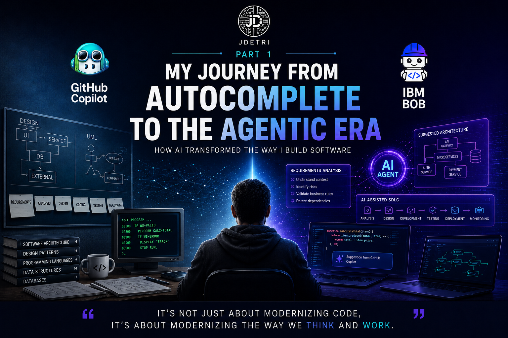

# My journey from autocomplete to the agentic era

There are generations of developers who remember the birth of the Internet. Others experienced the arrival of mobile devices and the rise of cloud computing.

I consider myself lucky to belong to a generation that has lived through one of the deepest transformations in software engineering: the birth of Artificial Intelligence applied to development.

And when I say lived through it, I don't mean reading about it or watching it from a distance. I mean going through each of its stages, from the first coding assistants to today, where AI agents are beginning to actively participate in the full software development lifecycle.

<figure>

<figcaption>Fig 1. Evolution of AI in development.</figcaption>
</figure>

## Before AI

When I started my career as a developer, writing software was a completely different experience.

We designed architectures on whiteboards or on paper. UML diagrams were part of everyday work. We spent hours consulting technical documentation, and many times we solved complex problems simply by reading manuals or analyzing legacy code.

Productivity depended mainly on our experience, our analytical skills, and the best practices we had acquired over the years.

Every line of code was written manually.

Every design came entirely from us.

And that was normal.

## The arrival of intelligent autocomplete

I remember perfectly the first time I used GitHub Copilot.

I had access to very early versions, when it was still a technology many watched with curiosity and others with considerable skepticism.

I admit that at first I was skeptical too. I thought it would simply be a "smarter" autocomplete. But it only took a few minutes to surprise me.

For the first time, I saw a tool capable of anticipating the line of code I was about to write. It wasn't just suggesting syntax. It was beginning to understand intent. And that completely changed the way I develop.

## Discovering a new development companion

Over time, I understood that GitHub Copilot was not just a code generator.

It became that companion with whom I grew inside the world of Artificial Intelligence. As the tool evolved, so did I. We lived through the transition together, from simple autocomplete to assistants capable of generating complete functions, explaining code, creating unit tests, and later incorporating agentic capabilities.

I remember one particularly interesting moment while working on a project with Spring Boot and TypeScript. I was designing a specific component and, almost before I finished describing what I needed, Copilot generated an implementation extremely close to the solution I had in mind.

It didn't just solve the problem.

It did so while preserving practically the same programming style I usually use: the code structure, indentation, and even the way I document it.

At that moment, I thought:

>**"Maybe I no longer need to spend so much time writing code. Now I can spend more time thinking about the solution."**

And that idea changed the way I work.

## The true evolution was not technological

I often hear conversations focused on which model generates more code or which tool responds faster.

I believe that discussion misses what truly matters.

The greatest revolution did not happen because tools wrote better code.

The real revolution happened because developers stopped thinking only about implementing solutions and began collaborating with Artificial Intelligence during the building process.

We moved from asking ourselves:

- **"How do I implement this?"**

To asking ourselves:

- **"What is the best solution to this problem?"**

It may seem like a small difference. In reality, it completely changes the way we build software.

## The arrival of the agentic era

Over the past few years, we have seen a new generation of tools emerge. We are no longer talking only about assistants that complete functions. Now we are beginning to work with agents capable of analyzing entire projects, understanding architecture, interpreting dependencies, reviewing implementations, and participating in technical decisions.

For the first time, I felt that the conversation was no longer just between a developer and a code editor. It was starting to feel more like a conversation between members of the same team. And that represents a huge change for our profession.

## What I really learned

After years of using Artificial Intelligence in software development, I reached a very simple conclusion.

>**AI never replaced my ability to think.**

What it did was free up time so I could devote more effort to analysis, design, architecture, and decision-making.

Today I spend less time writing code.

And much more time understanding problems.

Paradoxically, while AI writes more and more, the value of the software engineer lies less and less in writing lines of code and much more in asking the right questions, analyzing constraints, understanding the business, and making decisions that no tool can assume on its own.

## We are only just beginning

Many people ask me whether this is the greatest technological revolution I have experienced.

My answer is always the same.

> Yes. And I believe we are still only seeing the beginning.

We were a generation that learned to program without Artificial Intelligence. Then we learned to work with assistants. Now we are learning to collaborate with agents.

And the next generation will probably find it hard to believe that we once designed complete architectures on a whiteboard and wrote every line of code manually.

Perhaps that is our generation's greatest privilege. We did not just witness a technological transformation. We were part of it. We learned alongside AI. We trained it with our best practices. We questioned it. We helped it evolve.

And while it learned to generate code, we learned something even more important: a new way to build software.

Because in the end, as I always say:

> **"It's not only about modernizing code, but about modernizing the way we think and work."**