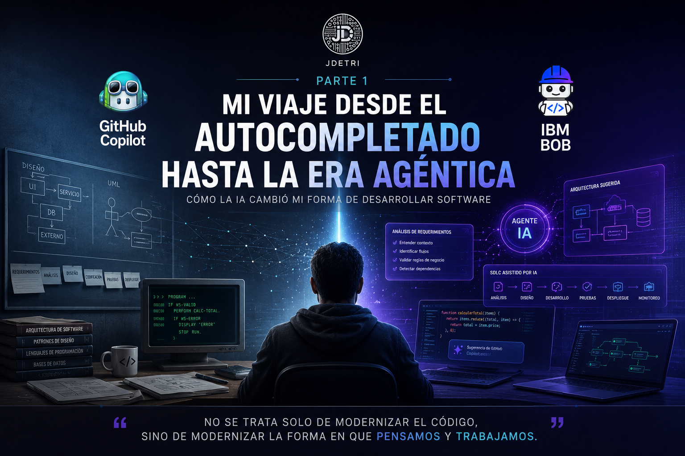

# Mi viaje desde el autocompletado hasta la era agéntica

Hay generaciones de desarrolladores que recuerdan el nacimiento de Internet. Otras vivieron la llegada de los dispositivos móviles y el auge de la computación en la nube.

Yo me considero afortunado de pertenecer a una generación que ha vivido una de las transformaciones más profundas de la ingeniería de software: el nacimiento de la Inteligencia Artificial aplicada al desarrollo.

Y cuando digo vivirla, no me refiero a leer sobre ella o verla desde la distancia. Me refiero a haber pasado por cada una de sus etapas, desde los primeros asistentes de código hasta la actualidad, donde los agentes de IA comienzan a participar activamente en el ciclo completo de desarrollo de software.

<figure>

<figcaption>Fig 1. Evolución de la IA en el desarrollo.</figcaption>
</figure>

## Antes de la IA

Cuando inicié mi carrera como desarrollador, escribir software era una experiencia completamente diferente.

Diseñábamos arquitecturas en pizarras o en papel. Los diagramas UML eran parte del día a día. Consultábamos documentación técnica durante horas y muchas veces resolvíamos problemas complejos simplemente leyendo manuales o analizando código legado.

La productividad dependía principalmente de nuestra experiencia, nuestra capacidad de análisis y las buenas prácticas que habíamos adquirido con los años.

Cada línea de código era escrita manualmente.

Cada diseño nacía completamente de nosotros.

Y eso era normal.

## La llegada del autocompletado inteligente

Recuerdo perfectamente la primera vez que utilicé GitHub Copilot.

Tuve acceso a versiones muy tempranas, cuando todavía era una tecnología que muchos observaban con curiosidad y otros con bastante escepticismo.

Confieso que al principio yo también era escéptico. Pensé que simplemente sería un autocompletado "más inteligente". Pero bastaron unos minutos para sorprenderme.

Por primera vez veía una herramienta capaz de anticipar la línea de código que estaba pensando escribir. No solo sugería sintaxis. Comenzaba a comprender intención. Y aquello cambió completamente mi forma de desarrollar.

## Descubriendo un nuevo compañero de desarrollo

Con el paso del tiempo entendí que GitHub Copilot no era únicamente un generador de código.

Se convirtió en ese compañero con el que crecí dentro del mundo de la Inteligencia Artificial. Mientras la herramienta evolucionaba, yo también lo hacía. Vivimos juntos la transición desde el simple autocompletado hasta asistentes capaces de generar funciones completas, explicar código, crear pruebas unitarias y, posteriormente, incorporar capacidades agénticas.

Recuerdo una ocasión particularmente interesante trabajando en un proyecto con Spring Boot y TypeScript. Estaba diseñando un componente específico y, prácticamente antes de terminar de describir lo que necesitaba, Copilot generó una implementación extremadamente cercana a la solución que tenía en mente.

No solo resolvió el problema.

Lo hizo respetando prácticamente el mismo estilo de programación que suelo utilizar: la estructura del código, la indentación e incluso la forma de documentarlo.

En ese momento pensé:

>**"Quizá ya no necesito invertir tanto tiempo escribiendo código. Ahora puedo dedicar más tiempo a pensar en la solución."**

Y esa idea cambió mi manera de trabajar.

## La verdadera evolución no fue tecnológica

Con frecuencia escucho conversaciones centradas en cuál modelo genera más código o cuál herramienta responde más rápido.

Creo que esa discusión pierde de vista lo realmente importante.

La mayor revolución no ocurrió porque las herramientas escribieran mejor código.

La verdadera revolución ocurrió porque los desarrolladores dejamos de pensar únicamente en implementar soluciones y comenzamos a colaborar con la Inteligencia Artificial durante el proceso de construcción.

Pasamos de preguntarnos:

- **"¿Cómo implemento esto?"**

A preguntarnos:

- **"¿Cuál es la mejor solución para este problema?"**

Puede parecer una diferencia pequeña. En realidad, cambia completamente la manera de desarrollar software.

## La llegada de la era agéntica

Durante los últimos años hemos visto aparecer una nueva generación de herramientas. Ya no hablamos únicamente de asistentes que completan funciones. Ahora comenzamos a trabajar con agentes capaces de analizar proyectos completos, comprender arquitectura, interpretar dependencias, revisar implementaciones y participar en decisiones técnicas.

Por primera vez sentí que la conversación ya no era únicamente entre un desarrollador y un editor de código. Comenzaba a parecerse más a una conversación entre miembros de un mismo equipo. Y eso representa un cambio enorme para nuestra profesión.

## Lo que realmente aprendí

Después de años utilizando Inteligencia Artificial en el desarrollo de software, llegué a una conclusión muy sencilla.

>**La IA nunca reemplazó mi capacidad para pensar.**

Lo que hizo fue liberar tiempo para dedicar más esfuerzo al análisis, al di seño, a la arquitectura y a la toma de decisiones.

Hoy paso menos tiempo escribiendo código.

Y mucho más tiempo entendiendo problemas.

Paradójicamente, mientras la IA escribe cada vez más, el valor del ingeniero de software se encuentra cada vez menos en escribir líneas de código y mucho más en formular las preguntas correctas, analizar restricciones, comprender el negocio y tomar decisiones que ninguna herramienta puede asumir por sí sola.

## Apenas estamos comenzando

Muchas personas me preguntan si esta es la mayor revolución tecnológica que he vivido.

Mi respuesta siempre es la misma.

> Sí. Y creo que todavía estamos viendo únicamente el comienzo.

Fuimos una generación que aprendió a programar sin Inteligencia Artificial.Después aprendimos a trabajar con asistentes. Ahora estamos aprendiendo a colaborar con agentes.

Y probablemente la próxima generación encuentre difícil creer que alguna vez diseñábamos arquitecturas completas en una pizarra y escribíamos cada línea de código manualmente.

Quizá ese sea el mayor privilegio de nuestra generación. No solo presenciamos una transformación tecnológica. Fuimos parte de ella. Aprendimos junto con la IA. La entrenamos con nuestras buenas prácticas. La cuestionamos. La ayudamos a evolucionar.

Y, mientras ella aprendía a generar código, nosotros aprendimos algo todavía más importante: una nueva forma de construir software.

Porque al final, como siempre digo:

> **"No se trata solo de modernizar el código, sino de modernizar la forma en que pensamos y trabajamos."**