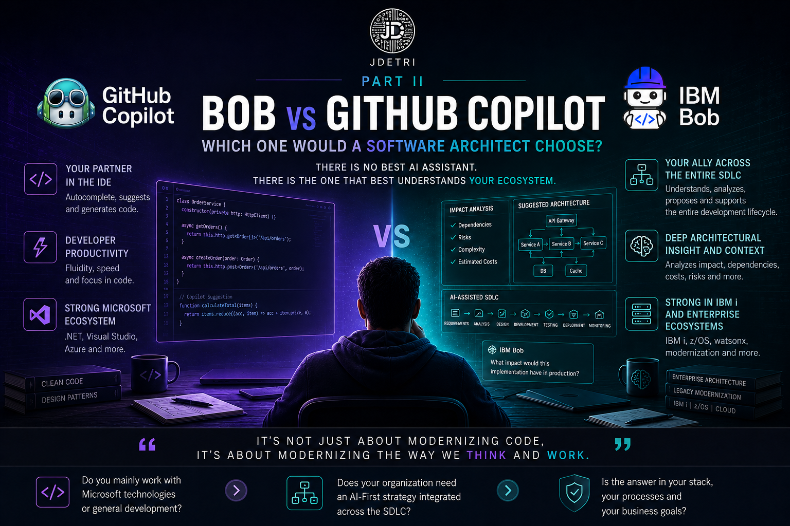

# Bob vs GitHub Copilot: Which one would a software architect choose?

**Second part of the series: "My journey from autocomplete to the agentic era"**

After publishing the first part of this series, several people asked me practically the same question:

> **"So... which one is better? Bob or GitHub Copilot?"**

And although many expect a quick answer, my first reaction is always to ask another question.

> **What is your technology stack?**

Because after using both tools for years, I came to a conclusion that is probably not the answer many expect.

There is no universally better tool. There is the right tool for the right context.

<figure>

<figcaption>Fig 1. Comparison between Bob and GitHub Copilot.</figcaption>
</figure>

## My story with both tools

I started using GitHub Copilot from its first early-access versions. At that time, it was a completely different technology from what we know today. Its goal was clear: to help developers while they wrote code. And it fulfilled that purpose very well.

Over time, it evolved from simple intelligent autocomplete into a true development companion. It learned new languages, improved its understanding of context, and today includes agentic capabilities that would have seemed like science fiction just a few years ago.

Bob came much later in my professional path. I had the opportunity to start using it in early access thanks to my participation as an IBM Champion and my previous experience with IBM Watsonx Code Assistant.

My initial expectation was to find another programming assistant. What I found was something different.

## The difference I noticed from day one

GitHub Copilot helped me write code. Bob wanted to understand the project. It may seem like a small difference. It is not.

While Copilot historically focused on increasing developer productivity inside the IDE, Bob was born with a much broader vision: to participate in the entire software development lifecycle (SDLC).

It does not only generate code. It also:
- Analyzes requirements.
- Understands architecture.
- Participates in application modernization.
- Proposes testing strategies.
- Helps with DevOps processes.
- Maintains a much more comprehensive view of the project.

In other words, I felt I had gone from working with a copilot to collaborating with another team member.

## Context changes everything

One of the questions I get most often is:

> **Which one understands project context better?**

My answer almost always surprises people.

> **It depends on the technology stack.**

If I am developing on IBM i, using RPG, modernizing legacy applications, or working in IBM ecosystems, Bob understands the context much better. It does not just recognize the language. It understands the architecture, terminology, dependencies, and the way these solutions are traditionally built.

On the other hand, when I work with .NET, .NET Framework, Visual Studio, or technologies deeply integrated into the Microsoft ecosystem, GitHub Copilot feels almost native. Its integration with Visual Studio is extraordinary, and the experience feels very natural for those of us who have spent years developing on that platform.

And that is exactly where an important conclusion appears:

> The tool with the most features does not always win. Many times, the one that best knows your ecosystem does.

## The story that made me see Bob differently

I remember a project related to cybersecurity. We needed to implement an encryption mechanism using SHA-256. While we were analyzing the solution, Bob made an observation I did not expect.

It pointed out that the implementation could present production issues because the corresponding field in the database was defined as **CHAR(50)**, while the algorithm's output would generate a considerably larger value.

That really caught my attention. It was not only suggesting a function. It was analyzing the impact of the implementation within the complete system. That day I understood that the conversation was no longer revolving only around code.

## When AI also gets it wrong

Now, it would be dishonest to say either of these tools is perfect. They both make mistakes. And that is precisely one of the most important lessons I have learned.

I remember one case where Bob designed a technically flawless cloud architecture. It was an elegant, scalable solution aligned with best practices. There was just one problem. The operating cost was so high that the application would have consumed, in barely one month, the equivalent of projected benefits for almost ten years of operation.

The architecture was correct. The business was not. This kind of situation reminds us of something fundamental. AI can analyze a huge number of variables. But business judgment remains the responsibility of people.

## What I value most in each one

If I had to summarize my experience, I would probably do it like this.

GitHub Copilot is still, for me, that companion with whom I grew inside AI-assisted development. Its integration with Visual Studio, its fluency while coding, and the way it practically anticipates my coding style often make it feel like it is reading my mind.

Bob, on the other hand, represents something different. It is the tool that has helped me most to think before programming. I often start a conversation by analyzing requirements, debating architecture alternatives, or validating implementation strategies before writing a single line of code.

And that shift in focus has tremendous value.

## So... which one would I choose?

My answer remains exactly the same.

> **It depends on the technology stack.**

If my organization develops mainly on IBM i, works with legacy applications, adopts AI-First processes, and seeks to integrate Artificial Intelligence across the entire SDLC, my choice would be Bob.

If the environment revolves mainly around Microsoft, Visual Studio, .NET, or .NET Framework, GitHub Copilot will probably offer a more natural and productive experience.

I do not believe there is a universal answer. And honestly, I do not think there should be one.

## My conclusion

For a long time, we thought Artificial Intelligence was only about writing code faster. Today I am convinced that view is already behind us. Current tools not only generate functions, they also:
- Analyze.
- Propose.
- Challenge.
- Participate.

And they force us to elevate our role as engineers. When someone asks me today which tool I recommend, I rarely begin by talking about Bob or GitHub Copilot. I begin by asking about architecture, the technology ecosystem, organizational culture, and business goals.

Because I have learned that the right decision does not depend only on the tool. It depends on the context in which that tool must create value. And that, perhaps, is the most important lesson this new era of software development has left me.

Because in the end, as I always say:
> **"It's not only about modernizing code, but about modernizing the way we think and work."**