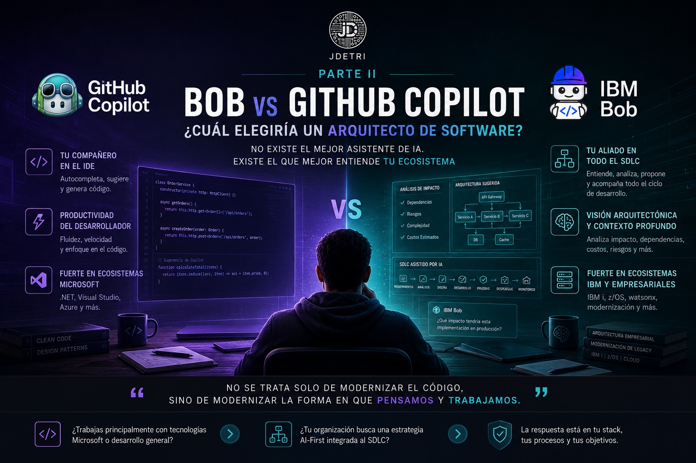

# Bob vs GitHub Copilot: ¿Cuál elegiría un arquitecto de software?

**Segunda parte de la serie: "Mi viaje desde el autocompletado hasta la era agéntica"**

Después de publicar la primera parte de esta serie, varias personas me hicieron prácticamente la misma pregunta:

> **"Entonces... ¿cuál es mejor? ¿Bob o GitHub Copilot?"**

Y, aunque muchos esperan una respuesta rápida, mi primera reacción siempre es hacer otra pregunta.

> **¿Cuál es tu stack tecnológico?**

Porque después de utilizar ambas herramientas durante años, llegué a una conclusión que probablemente no sea la respuesta que muchos esperan.

No existe una herramienta universalmente mejor. Existe la herramienta adecuada para el contexto adecuado.

<figure>

<figcaption>Fig 1. Comparación entre Bob y GitHub Copilot.</figcaption>
</figure>

## Mi historia con ambas herramientas

Comencé a utilizar GitHub Copilot desde sus primeras versiones de acceso anticipado. En aquel momento era una tecnología completamente distinta a la que conocemos hoy. Su objetivo era claro: ayudar al desarrollador mientras escribía código. Y cumplía muy bien ese propósito.

Con el tiempo evolucionó desde un simple autocompletado inteligente hasta convertirse en un verdadero compañero de desarrollo. Aprendió nuevos lenguajes, mejoró su comprensión del contexto y hoy incorpora capacidades agénticas que hace algunos años parecían ciencia ficción.

Bob llegó mucho después a mi camino profesional. Tuve la oportunidad de comenzar a utilizarlo en acceso anticipado gracias a mi participación como IBM Champion y a mi experiencia previa con IBM Watsonx Code Assistant.

Mi expectativa inicial era encontrar otro asistente de programación. Lo que encontré fue algo diferente.

## La diferencia que noté desde el primer día

GitHub Copilot me ayudaba a escribir código. Bob quería entender el proyecto. Puede parecer una diferencia pequeña. No lo es.

Mientras Copilot históricamente se enfocó en aumentar la productividad del desarrollador dentro del IDE, Bob nació con una visión mucho más amplia: participar en todo el ciclo de vida del desarrollo de software (SDLC).

No solamente genera código. Sino que también:
- Analiza requerimientos.
- Comprende arquitectura.
- Participa en la modernización de aplicaciones.
- Propone estrategias de pruebas.
- Ayuda en procesos DevOps.
- Mantiene una visión mucho más integral del proyecto.

En otras palabras, sentí que había pasado de trabajar con un copiloto a colaborar con un integrante más del equipo.

## El contexto lo cambia todo

Una de las preguntas que más me hacen es:

> **¿Cuál entiende mejor el contexto del proyecto?**

Mi respuesta casi siempre sorprende.

> **Depende del stack tecnológico.**

Si estoy desarrollando sobre IBM i, utilizando RPG, modernizando aplicaciones legacy o trabajando con ecosistemas IBM, Bob entiende muchísimo mejor el contexto. No solamente reconoce el lenguaje. Comprende la arquitectura, la terminología, las dependencias y la forma en que tradicionalmente se construyen estas soluciones.

Por otro lado, cuando trabajo con .NET, .NET Framework, Visual Studio o tecnologías profundamente integradas al ecosistema Microsoft, GitHub Copilot juega prácticamente de local. Su integración con Visual Studio es extraordinaria y la experiencia resulta muy natural para quienes llevamos años desarrollando sobre esa plataforma.

Y justamente ahí aparece una conclusión importante:

> No siempre gana la herramienta con más funciones. Muchas veces gana la que mejor conoce tu ecosistema.

## La historia que me hizo ver a Bob de otra manera

Recuerdo un proyecto relacionado con ciberseguridad. Necesitábamos implementar un mecanismo de cifrado utilizando SHA-256. Mientras analizábamos la solución, Bob me hizo una observación que no esperaba.

Me indicó que la implementación podía presentar problemas en producción porque el campo correspondiente en la base de datos estaba definido como un **CHAR(50)**, mientras que el resultado del algoritmo generaría un valor considerablemente mayor.

Aquello me llamó muchísimo la atención. No estaba sugiriendo únicamente una función. Estaba analizando el impacto de la implementación dentro del sistema completo. Ese día entendí que la conversación ya no giraba únicamente alrededor del código.

## Cuando la IA también se equivoca

Ahora bien, sería poco honesto decir que alguna de estas herramientas es perfecta. Ambas se equivocan. Y eso es precisamente una de las lecciones más importantes que he aprendido.

Recuerdo un caso donde Bob diseñó una arquitectura para la nube técnicamente impecable. Era una solución elegante, escalable y alineada con las mejores prácticas. Había un único problema. El costo operativo era tan elevado que la aplicación habría consumido, en apenas un mes, el equivalente a los beneficios proyectados para casi diez años de operación.

La arquitectura era correcta. El negocio no. Ese tipo de situaciones nos recuerda algo fundamental. La IA puede analizar muchísimas variables. Pero el criterio de negocio sigue siendo responsabilidad de las personas.

## Lo que más valoro de cada uno

Si tuviera que resumir mi experiencia, probablemente lo haría así.

GitHub Copilot sigue siendo, para mí, ese compañero con el que crecí dentro del desarrollo asistido por IA. Su integración con Visual Studio, su fluidez durante la programación y la forma en que prácticamente anticipa mi estilo de escribir código hacen que muchas veces parezca que está leyendo mi mente.

Bob, por otra parte, representa algo diferente. Es la herramienta que más me ha ayudado a pensar antes de programar. Con frecuencia comienzo una conversación analizando requerimientos, debatiendo alternativas de arquitectura o validando estrategias de implementación antes de escribir una sola línea de código.

Y ese cambio de enfoque tiene muchísimo valor.

## Entonces... ¿cuál escogería?

Mi respuesta sigue siendo exactamente la misma.

> **Depende del stack tecnológico.**

Si mi organización desarrolla principalmente sobre IBM i, trabaja con aplicaciones legacy, apuesta por procesos AI-First y busca integrar Inteligencia Artificial en todo el SDLC, mi elección sería Bob.

Si el entorno gira principalmente alrededor de Microsoft, Visual Studio, .NET o .NET Framework, GitHub Copilot probablemente ofrecerá una experiencia más natural y productiva.

No creo que exista una respuesta universal. Y, sinceramente, tampoco creo que deba existir.

## Mi conclusión

Durante mucho tiempo pensamos que la Inteligencia Artificial consistía únicamente en escribir código más rápido. Hoy estoy convencido de que esa visión ya quedó atrás. Las herramientas actuales no solamente generan funciones, sino que también:
- Analizan.
- Proponen.
- Cuestionan.
- Participan.

Y nos obligan a elevar nuestro rol como ingenieros. Cuando hoy alguien me pregunta cuál herramienta recomiendo, rara vez comienzo hablando de Bob o de GitHub Copilot. Comienzo preguntando por la arquitectura, el ecosistema tecnológico, la cultura de la organización y los objetivos del negocio.

Porque he aprendido que la decisión correcta no depende únicamente de la herramienta. Depende del contexto en el que esa herramienta deberá generar valor. Y esa, quizá, sea la lección más importante que me ha dejado esta nueva era del desarrollo de software.

Porque al final, como siempre digo:
> **"No se trata solo de modernizar el código, sino de modernizar la forma en que pensamos y trabajamos."**