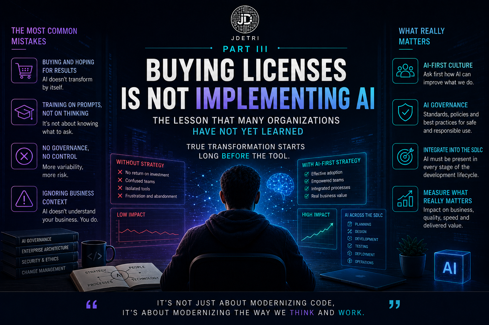

# Buying licenses is not implementing AI: the lesson many organizations still haven't learned

**Third part of the series: "My journey from autocomplete to the agentic era"**

Over the past few months, I have taken part in many conversations about Artificial Intelligence within organizations. And there is one question that comes up again and again.

> **Which tool should we buy?**

Some ask about GitHub Copilot. Others ask about Bob. Others ask about Claude, Gemini, or ChatGPT.

Curiously, very few companies start by asking the question that truly matters.

> **Are we ready to work with Artificial Intelligence?**

And that difference changes absolutely everything.

<figure>

<figcaption>Fig 1. Working with AI goes beyond buying licenses.</figcaption>
</figure>

## AI does not begin with a license

I have seen organizations invest thousands of dollars in AI licenses expecting productivity to increase from day one, almost as if by magic.

Three months later, the questions start to appear.
- **Why is nobody using them?**
- **Why did some developers go back to coding like before?**
- **Why did delivery speed barely change?**

The answer is usually not in the tool. It is in the strategy. Buying a license does not transform an organization. It also does not modernize a development team. All it does is enable a technological capability. Transformation starts much earlier.

## The real change is cultural

When we talk about AI-First, many people imagine an organization where every decision is made by Artificial Intelligence.

For me, it means exactly the opposite. It means that before solving a problem, the team asks:

> **How can AI help us solve this problem in a better way?**

It does not mean delegating thinking. It means enriching it. AI stops being an occasional tool and becomes part of the normal workflow. That shift seems small. In reality, it completely transforms development culture.

## The biggest mistake I see

There is something I see very often. Organizations train their developers to write better prompts. But very few teach them how to work with AI. And it is not the same thing. Writing a good prompt is a skill. Working with AI is a new form of engineering. It involves aspects such as:
- Learning to debate solutions.
- Challenging proposals.
- Validating architectures.
- Analyzing impact.
- Evaluating risks.
- Thinking about costs.
- Understanding when to accept a recommendation... and when to tell AI it is wrong. Because yes, AI also makes mistakes.

## AI needs governance

This is probably one of the least popular topics. And at the same time, one of the most important. Without governance, AI ends up becoming a collection of tools used in completely different ways by each developer. This creates an effect that is the exact opposite of what was expected, and we get results like these:
- Each team creates its own prompts.
- Each person documents differently.
- Each one validates code using different criteria.

And the result is exactly the opposite of what was expected.
- More variability.
- More inconsistency.
- More risk.

AI governance is not meant to limit creativity. It is meant to ensure that Artificial Intelligence helps build software with the same quality, security, and architecture standards the organization expects from its teams.

## AI does not replace experience

For years, I heard this phrase:

> **"AI will replace developers."**

I never agreed. I still do not. What I do believe is that AI is redefining what it means to be a good software engineer.

A few years ago, value was strongly associated with how fast we wrote code. Today, real value lies in the ability to understand the problem before solving it.

Paradoxically, the more powerful AI becomes, the more important human judgment becomes.

## The question I now ask in every organization

When a company asks me which tool I recommend, I rarely start by talking about products. I start by asking questions like these:
- How do you currently design your solutions?
- How do you document architecture?
- How do you validate quality?
- How do you govern AI usage?
- How do you share knowledge?
- How do you plan to incorporate agents into the SDLC?

And above all...

> Are you willing to change the way you work?

Because that is usually the hardest part. Not installing a tool. Changing habits.

## AI-First does not mean "AI for everything"

There is another very common mistake.

Thinking that AI-First means using AI for absolutely every task. It does not. There are times when the best decision is still human analysis. There are strategic decisions that require experience. There are conversations with clients where business context weighs more than any model. And there are architectures where cost, regulation, or risk force decisions that no AI can make on its own.

AI-First is not about replacing judgment. It is about first asking whether there is a better way to solve the problem by leveraging Artificial Intelligence.

## My vision for the coming years

I am convinced that in a few years we will stop talking about AI tools. Just as nobody today boasts about using a compiler or a version control system, the time will come when Artificial Intelligence will be a natural capability within the development process.

The conversation will no longer be:

> **"Do you use AI?"**

The real question will be:

> **"How well do you work alongside it?"**

And that difference will determine which organizations innovate faster, build better software, and deliver more value to the business. Because competitive advantage will never be only in technology. It will always be in the people who know how to leverage it.

## The real transformation

After all these years working with Artificial Intelligence applied to software development, I am increasingly convinced of one thing:

> Transformation does not happen when a company buys licenses.

It happens when **people change the way they analyze problems**, design solutions, and collaborate with one another.

Tools will continue evolving:
- Models will change.
- New agents will appear.
- New platforms will arrive.

But there is something that will continue to be our responsibility as engineers:
- **Think.**
- **Challenge.**
- **Design.**
- **Lead.**

Because the future of software development will not depend on who has the best Artificial Intelligence. It will depend on who learns first how to work intelligently alongside it.

And that is, for me, the essence of an AI-First organization. Because in the end, as I always say:

> **"It's not only about modernizing code, but about modernizing the way we think and work."**