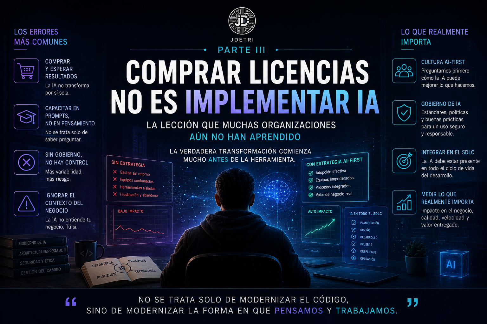

# Comprar licencias no es implementar IA: la lección que muchas organizaciones aún no han aprendido

**Tercera parte de la serie: "Mi viaje desde el autocompletado hasta la era agéntica"**

Durante los últimos meses he participado en muchas conversaciones sobre Inteligencia Artificial dentro de las organizaciones. Y hay una pregunta que aparece una y otra vez.

> **¿Qué herramienta deberíamos comprar?**

Algunos preguntan por GitHub Copilot. Otros por Bob. Otros por Claude, Gemini o ChatGPT.

Curiosamente, muy pocas empresas comienzan haciendo la pregunta que realmente importa.

> **¿Estamos preparados para trabajar con Inteligencia Artificial?**

Y esa diferencia cambia absolutamente todo.

<figure>

<figcaption>Fig 1. Trabajar con IA va más allá de comprar licencias.</figcaption>
</figure>

## La IA no comienza con una licencia

He visto organizaciones invertir miles de dólares en licencias de IA esperando que, casi por arte de magia, la productividad aumente desde el primer día.

Tres meses después aparecen las preguntas.
- **¿Por qué nadie las utiliza?**
- **¿Por qué algunos desarrolladores volvieron a programar como antes?**
- **¿Por qué la velocidad de entrega prácticamente no cambió?**

La respuesta normalmente no está en la herramienta. Está en la estrategia. Comprar una licencia no transforma una organización. Tampoco moderniza un equipo de desarrollo. Lo único que hace es habilitar una capacidad tecnológica. La transformación comienza mucho antes.

## El verdadero cambio es cultural

Cuando hablamos de AI-First, muchas personas imaginan una organización donde todas las decisiones las toma una Inteligencia Artificial.

Para mí significa exactamente lo contrario. Significa que, antes de resolver un problema, el equipo se pregunta:

> **¿Cómo puede ayudarnos la IA a resolver este problema de una mejor manera?**

No significa delegar el pensamiento. Significa enriquecerlo. La IA deja de ser una herramienta ocasional y pasa a formar parte del proceso normal de trabajo. Ese cambio parece pequeño. En realidad, transforma completamente la cultura de desarrollo.

## El mayor error que observo

Hay algo que veo con mucha frecuencia. Las organizaciones capacitan a sus desarrolladores para escribir mejores prompts. Pero muy pocas les enseñan a trabajar con la IA. Y no es lo mismo. Escribir un buen prompt es una habilidad. Trabajar con IA es una nueva forma de ingeniería. Implica aspectos como: 
- Aprender a debatir soluciones.
- Cuestionar propuestas.
- Validar arquitecturas.
- Analizar impacto.
- Evaluar riesgos.
- Pensar en costos.
- Comprender cuándo aceptar una recomendación... y cuándo decirle a la IA que está equivocada. Porque sí. La IA también se equivoca.

## La IA necesita gobierno

Este es probablemente uno de los temas menos populares. Y, al mismo tiempo, uno de los más importantes. Sin gobierno, la IA termina convirtiéndose en una colección de herramientas utilizadas de forma completamente distinta por cada desarrollador. Esto genera un efecto completamente contrario al esperado y tenemos resultados como estos:
- Cada equipo crea sus propios prompts.
- Cada persona documenta de manera diferente.
- Cada uno valida el código con criterios distintos.

Y el resultado es exactamente el contrario al esperado.
- Más variabilidad.
- Más inconsistencia.
- Más riesgo.

El gobierno de IA no busca limitar la creatividad. Busca asegurar que la Inteligencia Artificial ayude a construir software con los mismos estándares de calidad, seguridad y arquitectura que la organización espera de sus equipos.

## La IA no reemplaza la experiencia

Durante años escuché la frase:

> **"La IA va a reemplazar a los desarrolladores."**

Nunca estuve de acuerdo. Hoy sigo sin estarlo. Lo que sí creo es que la IA está redefiniendo qué significa ser un buen ingeniero de software.

Hace algunos años el valor estaba muy asociado a la velocidad con la que escribíamos código. Hoy el verdadero valor está en la capacidad para entender el problema antes de resolverlo.

Paradójicamente, mientras más poderosa se vuelve la IA, más importante se vuelve el criterio humano.

## La pregunta que ahora hago en cada organización

Cuando una empresa me pregunta qué herramienta recomiendo, rara vez comienzo hablando de productos. Comienzo haciendo preguntas como estas:
- ¿Cómo diseñan actualmente sus soluciones?
- ¿Cómo documentan arquitectura?
- ¿Cómo validan calidad?
- ¿Cómo gobiernan el uso de IA?
- ¿Cómo comparten conocimiento?
- ¿Cómo piensan incorporar agentes dentro del SDLC?

Y, sobre todo...

> ¿Están dispuestos a cambiar la forma en que trabajan?

Porque esa suele ser la parte más difícil. No instalar una herramienta. Está en cambiar hábitos.

## AI-First no significa "IA para todo"

Existe otro error muy común.

Pensar que AI-First significa utilizar IA absolutamente para cualquier tarea. No es así. Hay momentos donde la mejor decisión sigue siendo el análisis humano. Hay decisiones estratégicas que requieren experiencia. Hay conversaciones con clientes donde el contexto del negocio pesa más que cualquier modelo. Y hay arquitecturas donde el costo, la regulación o el riesgo obligan a tomar decisiones que ninguna IA puede asumir por sí sola.

AI-First no consiste en reemplazar el criterio. Consiste en preguntarnos primero si existe una mejor manera de resolver el problema aprovechando la Inteligencia Artificial.

## Mi visión para los próximos años

Estoy convencido de que dentro de algunos años dejaremos de hablar de herramientas de IA. Así como hoy nadie presume que utiliza un compilador o un sistema de control de versiones, llegará el momento en que la Inteligencia Artificial será una capacidad natural dentro del proceso de desarrollo.

La conversación ya no será:

> **"¿Usan IA?"**

La verdadera pregunta será:

> **"¿Qué tan bien trabajan junto con ella?"**

Y esa diferencia será la que determine qué organizaciones innovan más rápido, construyen mejor software y entregan mayor valor al negocio. Porque la ventaja competitiva nunca estará únicamente en la tecnología. Siempre estará en las personas que saben aprovecharla.

## La verdadera transformación

Después de todos estos años trabajando con Inteligencia Artificial aplicada al desarrollo de software, cada vez estoy más convencido de algo:

> La transformación no ocurre cuando una empresa compra licencias.

Ocurre cuando las **personas cambian su manera de analizar problemas**, diseñar soluciones y colaborar entre ellas.

Las herramientas seguirán evolucionando:
- Los modelos cambiarán.
- Aparecerán nuevos agentes.
- Llegarán nuevas plataformas.

Pero hay algo que seguirá siendo responsabilidad de nosotros como ingenieros:
- **Pensar.**
- **Cuestionar.**
- **Diseñar.**
- **Liderar.**

Porque el futuro del desarrollo de software no dependerá de quién tenga la mejor Inteligencia Artificial. Dependerá de quién aprenda primero a trabajar inteligentemente junto a ella.

Y esa es, para mí, la esencia de una organización AI-First. Porque, al final, como siempre digo:

> **"No se trata solo de modernizar el código, sino de modernizar la forma en que pensamos y trabajamos."**