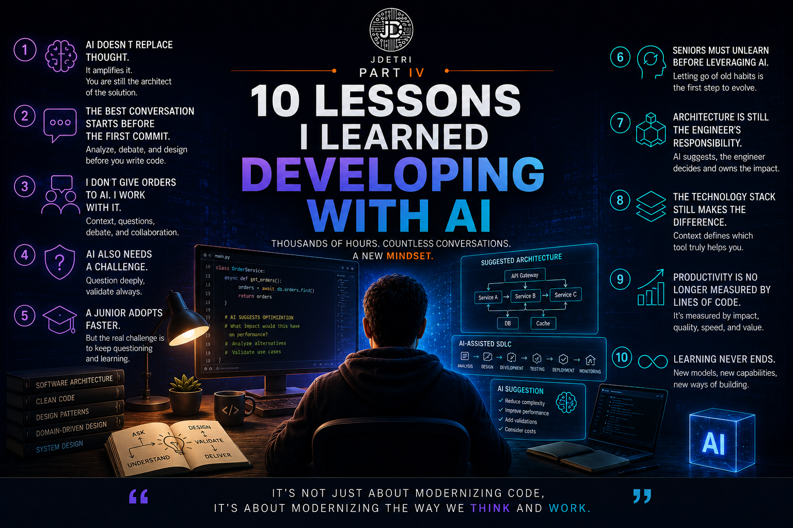

# 10 lessons I learned after thousands of hours building with Artificial Intelligence

**Fourth part of the series: "My journey from autocomplete to the agentic era"**

When I began using Artificial Intelligence to build software, I thought the biggest advantage would be writing code faster. After thousands of hours working with tools like GitHub Copilot and Bob, I can say I was wrong. Speed was only a consequence. The real change happened in the way I analyze problems, design solutions, and collaborate with technology. These are some of the most important lessons this journey has left me.

<figure>

<figcaption>Fig 1. Lessons learned building with AI.</figcaption>
</figure>

## 1. AI does not replace thinking. It amplifies it.

For a long time, there was a fear that Artificial Intelligence would replace developers. My experience has been completely different. The more I use AI, the more important it becomes to think before writing code. Today I spend more time on analysis, design, and understanding the problem than on implementing the solution.

AI writes more. I think more. And that combination produces better results.

## 2. The best conversation starts before the first commit

One of the biggest changes in how I work has been this. Before, I opened the IDE and started coding. Today I start a conversation with AI and do the activities I used to do alone:
- I explain the problem.
- We analyze alternatives.
- We debate approaches.
- We evaluate advantages and risks.

And only when both of us clearly understand the goal do I begin writing code. Interestingly, that greatly reduces rework.

## 3. I do not give orders to AI. I work with it.

Many people still use Artificial Intelligence as if it were a code generator. I prefer to see it as a technical teammate:
- I do not just tell it what to do.
- I explain the context.
- I ask it to challenge my ideas.
- I ask what risks it sees.
- I ask for alternatives.

The best conversations do not happen when AI answers. They happen when it forces me to rethink a decision.

## 4. AI also needs to be challenged

One of the most common mistakes is assuming that the first answer is always correct. It is not. The best solutions I have built appeared after saying several times:
- **"I am not convinced by that proposal."**
- **"Is there another alternative?"**
- **"What would happen if we changed this constraint?"**

AI improves when we improve our questions too.

## 5. A junior often adopts AI faster than a senior

This conclusion surprised even several colleagues. Very often, junior developers adopt AI much more naturally. They do not have as many habits to unlearn. The challenge appears later when they need to:
- Learn to question answers.
- Understand the reason behind each decision.
- Avoid accepting every suggestion as if it were absolute truth.

Seniors, on the other hand, often face a different challenge.

> **Accepting that some tasks no longer need to be done the way they were ten years ago.**

## 6. Architecture remains the engineer's responsibility

I remember one case where AI proposed a technically flawless architecture to deploy a cloud solution, and the proposal surprised me:
- It was elegant.
- Scalable.
- Very well designed.
- But it was also **economically unviable**.

That day I confirmed something I keep repeating in every project. The best architecture is not always the most sophisticated one. It is the one that balances technology, business, budget, maintenance, and evolution. That judgment still depends on us.

## 7. The technology stack still makes the difference

I am often asked which AI tool I recommend. My answer almost never starts by naming a brand. It starts by asking:

> **What is your technology stack?**

Each platform understands certain ecosystems better. And choosing the right tool can have a much greater impact than simply choosing the most popular one. AI needs context too.

## 8. Learning to ask is worth more than learning to code faster

A few years ago, technical knowledge was measured by how much code we could produce. Today I see something different.

The engineers who get the best results are not necessarily those who write the most code. They are the ones who:
- Ask better questions.
- Provide better context.
- Analyze constraints.
- Know how to turn a complex problem into an intelligent conversation with AI.

## 9. Productivity is no longer measured in lines of code

For a long time, we celebrated writing thousands of lines. Today, I often remove more code than I add:
- I automate processes.
- I simplify architectures.
- I refactor more frequently.

Productivity is no longer about writing more. Now it is about generating more value with less effort and higher quality.

## 10. Learning never ends

Perhaps this is the most important lesson of all. After so many years developing software, I thought I had already lived through the greatest technological transformations of our profession. Then Artificial Intelligence appeared. And I realized we are still learning.
- New models appear every week.
- New agents.
- New capabilities.
- New ways to collaborate.

The question is no longer whether we should learn. The question is whether we are willing to keep evolving alongside technology.

## The greatest lesson of all

If someone asked me what the biggest learning has been from all these years working with Artificial Intelligence, my answer would be very simple.

AI never made me a better developer on its own. What it did was force me to become a better engineer. It pushed me:
- To think more.
- To question more.
- To design better.
- To understand the business more deeply.

And perhaps that is the real change we are living through. We are not stopping coding. We are learning a new way to build software. A way where the best solutions are born from collaboration between human experience and Artificial Intelligence.

That balance, more than any model or tool, will define the best engineering teams over the next few years. Because in the end, as I always say:

> **"It's not only about modernizing code, but about modernizing the way we think and work."**