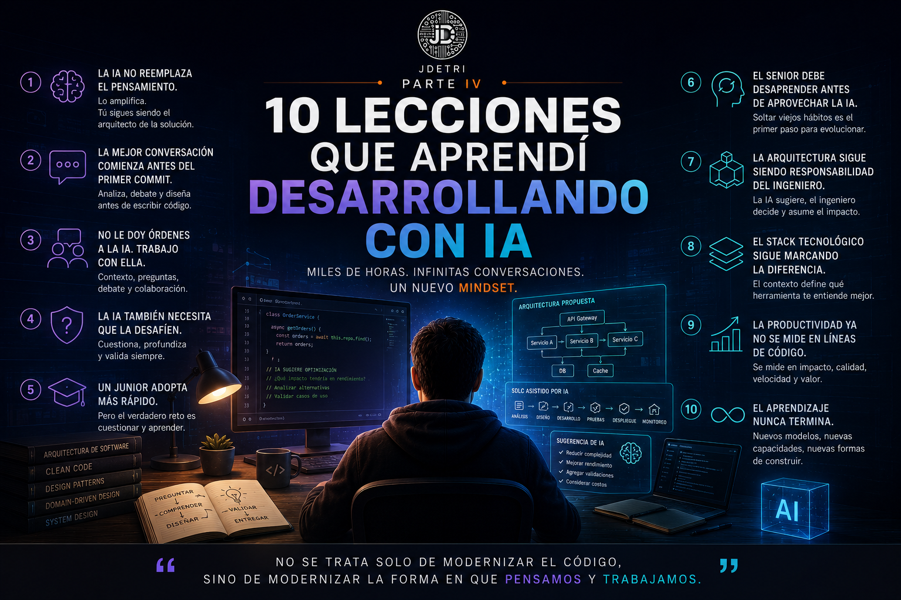

# 10 lecciones que aprendí después de miles de horas desarrollando con Inteligencia Artificial

**Cuarta parte de la serie: "Mi viaje desde el autocompletado hasta la era agéntica"**

Cuando comencé a utilizar Inteligencia Artificial para desarrollar software, pensaba que la mayor ventaja sería escribir código más rápido. Después de miles de horas trabajando con herramientas como GitHub Copilot y Bob, puedo decir que estaba equivocado. La velocidad fue apenas la consecuencia. El verdadero cambio ocurrió en mi manera de analizar problemas, diseñar soluciones y colaborar con la tecnología. Estas son algunas de las lecciones más importantes que me ha dejado este recorrido.

<figure>

<figcaption>Fig 1. Lecciones aprendidas desarrollando con IA.</figcaption>
</figure>

## 1. La IA no reemplaza el pensamiento. Lo amplifica.

Durante mucho tiempo existió el temor de que la Inteligencia Artificial reemplazara a los desarrolladores. Mi experiencia ha sido completamente distinta. Mientras más utilizo IA, más importante se vuelve pensar antes de escribir código. Hoy dedico más tiempo al análisis, al diseño y a comprender el problema que a implementar la solución.

La IA escribe más. Yo pienso más. Y esa combinación produce mejores resultados.

## 2. La mejor conversación comienza antes del primer commit

Uno de los mayores cambios en mi forma de trabajar ha sido este. Antes abría el IDE y comenzaba a programar. Hoy abro una conversación con la IA y realizo las actividades que antes hacia solo:
- Le explico el problema.
- Analizamos alternativas.
- Debatimos enfoques.
- Evaluamos ventajas y riesgos.

Y solamente cuando ambos entendemos claramente el objetivo, comienzo a escribir código. Curiosamente, eso reduce muchísimo el retrabajo.

## 3. No le doy órdenes a la IA. Trabajo con ella.

Muchas personas siguen utilizando la Inteligencia Artificial como si fuera un generador de código. Yo prefiero verla como un compañero técnico:
- No le digo únicamente qué hacer.
- Le explico el contexto.
- Le pido que cuestione mis ideas.
- Le pregunto qué riesgos observa.
- Le solicito alternativas.

Las mejores conversaciones no ocurren cuando la IA responde. Ocurren cuando me obliga a replantear una decisión.

## 4. La IA también necesita que la desafíen

Uno de los errores más comunes es asumir que la primera respuesta siempre es correcta. No lo es. Las mejores soluciones que he construido aparecieron después de decirle varias veces:
- **"No me convence esa propuesta."**
- **"¿Existe otra alternativa?"**
- **"¿Qué pasaría si cambiamos esta restricción?"**

La IA mejora cuando nosotros también mejoramos las preguntas.

## 5. Un junior suele adoptar la IA más rápido que un senior

Esta conclusión sorprendió incluso a varios compañeros. Muchas veces los desarrolladores junior incorporan la IA con mucha más naturalidad. No tienen tantos hábitos que desaprender. El reto aparece después cuando se necesita:
- Aprender a cuestionar las respuestas.
- Entender el porqué de cada decisión.
- No aceptar cada sugerencia como si fuera una verdad absoluta.

Los seniors, por el contrario, suelen enfrentarse a otro desafío.

> **Aceptar que algunas tareas ya no necesitan hacerse como hace diez años.**

## 6. La arquitectura sigue siendo responsabilidad del ingeniero

Recuerdo una ocasión donde la IA propuso una arquitectura técnicamente impecable para desplegar una solución en la nube y la propuesta me sorprendió:
- Era elegante.
- Escalable.
- Muy bien diseñada.
- Pero también era **económicamente inviable**.

Ese día confirmé algo que sigo repitiendo en cada proyecto. La mejor arquitectura no siempre es la más sofisticada. Es la que equilibra tecnología, negocio, presupuesto, mantenimiento y evolución. Ese criterio todavía depende de nosotros.

## 7. El stack tecnológico sigue marcando la diferencia

Con frecuencia me preguntan cuál herramienta de IA recomiendo. Mi respuesta casi nunca comienza mencionando una marca. Comienza preguntando:

> **¿Cuál es tu stack tecnológico?**

Cada plataforma entiende mejor determinados ecosistemas. Y escoger la herramienta adecuada puede tener un impacto mucho mayor que elegir simplemente la más popular. La IA también necesita contexto.

## 8. Aprender a preguntar vale más que aprender a programar más rápido

Hace algunos años el conocimiento técnico se medía por la cantidad de código que podíamos producir. Hoy observo algo diferente.

Los ingenieros que obtienen mejores resultados no necesariamente son quienes escriben más código. Son quienes:
- Formulan mejores preguntas.
- Proporcionan mejor contexto.
- Analizan restricciones.
- Saben convertir un problema complejo en una conversación inteligente con la IA.

## 9. La productividad ya no se mide en líneas de código

Durante mucho tiempo celebramos escribir miles de líneas. Hoy muchas veces elimino más código del que agrego:
- Automatizo procesos.
- Simplifico arquitecturas.
- Refactorizo con mayor frecuencia.

La productividad dejó de ser escribir más. Ahora consiste en generar mayor valor con menos esfuerzo y mayor calidad.

## 10. El aprendizaje nunca termina

Quizá esta sea la lección más importante de todas. Después de tantos años desarrollando software, pensaba que había vivido las mayores transformaciones tecnológicas de nuestra profesión. Entonces apareció la Inteligencia Artificial. Y entendí que todavía seguimos aprendiendo.
- Cada semana aparecen nuevos modelos.
- Nuevos agentes.
- Nuevas capacidades.
- Nuevas formas de colaborar.

La pregunta ya no es si debemos aprender. La pregunta es si estamos dispuestos a seguir evolucionando junto con la tecnología.

## La mayor lección de todas

Si alguien me preguntara cuál ha sido el mayor aprendizaje de todos estos años trabajando con Inteligencia Artificial, mi respuesta sería muy sencilla.

La IA nunca me convirtió en mejor desarrollador por sí sola. Lo que hizo fue obligarme a convertirme en un mejor ingeniero. Me impulsó:
- A pensar más.
- A cuestionar más.
- A diseñar mejor.
- A entender el negocio con mayor profundidad.

Y quizá ese sea el verdadero cambio que estamos viviendo. No estamos dejando de programar. Estamos aprendiendo una nueva manera de construir software. Una manera donde las mejores soluciones nacen de la colaboración entre la experiencia humana y la Inteligencia Artificial.

Ese equilibrio, más que cualquier modelo o herramienta, será el que defina a los mejores equipos de ingeniería durante los próximos años. Porque, al final, como siempre digo:

> **"No se trata solo de modernizar el código, sino de modernizar la forma en que pensamos y trabajamos."**