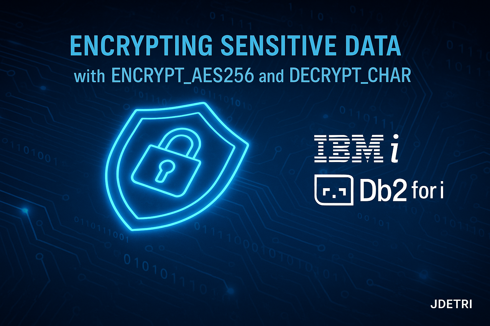

# 🛡️ Protegiendo datos sensibles en IBM i con ENCRYPT_AES256 y DECRYPT_CHAR
### Guía práctica y técnica para usar cifrado AES-256 directamente en Db2 for i

En muchos sistemas de misión crítica (banca, seguros, gobierno, retail, salud), **IBM i** sigue siendo el corazón del negocio. Eso significa que en **Db2 for i** conviven datos extremadamente sensibles: identificaciones, cuentas bancarias, tokens, contraseñas de integración, entre otros.

Proteger esa información ya no es “deseable”: es obligatorio, tanto por **riesgo real** como por **cumplimiento regulatorio** (PCI-DSS, GDPR, leyes de protección de datos, etc.).

Dentro de este contexto, Db2 for i nos ofrece un par de funciones muy potentes:

- `ENCRYPT_AES256` → cifra datos con **AES de 256 bits**.
- `DECRYPT_CHAR` → permite recuperar el valor en claro, usando la misma contraseña o la **ENCRYPTION PASSWORD** de sesión.

Con ellas puedes construir esquemas de seguridad robustos **sin salir de SQL** y sin depender de librerías externas en RPG, Java o .NET.

<figure>

<figcaption>Fig 1. Representación de cifrado AES-256 en IBM i.</figcaption>
</figure>

## 1. ¿Qué es ENCRYPT_AES256 en Db2 for i?

`ENCRYPT_AES256` es una **función escalar** de Db2 for i que devuelve un valor cifrado a partir de una cadena de entrada (`data-string`), usando el algoritmo AES con clave de 256 bits. Es un algoritmo de cifrado simétrico, lo que significa que la misma clave se utiliza tanto para cifrar como para descifrar los datos, es ampliamente reconocido por su seguridad y eficiencia. Los datos cifrados con AES-256 son altamente resistentes a ataques de fuerza bruta y son adecuados para proteger información sensible en entornos empresariales. Lo más importante es que esta función está integrada directamente en Db2 for i, lo que facilita su uso sin necesidad de componentes adicionales.

### 1.1. Firma de la función

```sql
ENCRYPT_AES256 ( data-string , password-string , hint-string )
```

- **data-string**: Cadena a cifrar.
- **password-string**: Contraseña de 6 a 127 bytes. Opcional.
- **hint-string**: Pista opcional de hasta 32 bytes.

### 1.2. Tipo de dato de salida

El tipo de resultado depende del tipo original del dato:

| data-string                           | Resultado             |
|---------------------------------------|------------------------|
| BINARY / VARBINARY                    | VARBINARY             |
| CHAR / VARCHAR / GRAPHIC / VARGRAPHIC | VARCHAR FOR BIT DATA  |
| BLOB / CLOB / DBCLOB                  | BLOB                  |

El valor cifrado siempre es **más largo** que el original por padding y overhead.


## 2. ¿Qué hace exactamente DECRYPT_CHAR?

`DECRYPT_CHAR` recupera el texto original a partir del dato cifrado generado con `ENCRYPT_AES256`. La función `DECRYPT_CHAR` es esencial para revertir el proceso de cifrado y obtener los datos en su forma original. Al utilizar la misma contraseña que se empleó durante el cifrado, esta función descifra los datos cifrados y devuelve el valor en claro. Es importante asegurarse de que la contraseña proporcionada coincida exactamente con la utilizada en el proceso de cifrado para garantizar una recuperación exitosa de los datos.

Firma:

```sql
DECRYPT_CHAR ( encrypted-data , password-string DEFAULT , integer )
```

- **encrypted-data**: dato cifrado.
- **password-string**: contraseña usada en el cifrado.
- **integer**: CCSID del resultado.


## 3. Diseño del esquema: cómo definir columnas para datos cifrados

Las columnas deben definirse como:

- `CHAR FOR BIT DATA`
- `VARCHAR FOR BIT DATA`
- `BINARY` / `VARBINARY`
- `BLOB`

El tamaño debe considerar:

- padding,
- overhead de 24 o 56 bytes,
- múltiplos de 16.

### Ejemplo:

```sql
CREATE TABLE CLIENTES_SENSIBLES (
    ID_CLIENTE      INT GENERATED ALWAYS AS IDENTITY,
    NOMBRE          VARCHAR(100),
    DOC_ENC         VARCHAR(80) FOR BIT DATA,
    FECHA_ALTA      DATE,
    CONSTRAINT PK_CLIENTES_SENSIBLES PRIMARY KEY (ID_CLIENTE)
);
```

## 4. Ejemplos prácticos

### 4.1. Cifrar usando ENCRYPTION PASSWORD de sesión

```sql
SET ENCRYPTION PASSWORD = 'Pwd_SuperSegura_2025';

INSERT INTO CLIENTES_SENSIBLES (NOMBRE, DOC_ENC, FECHA_ALTA)
VALUES (
    'Pedro Picapiedra',
    ENCRYPT_AES256('1-2345-6789'),
    CURRENT_DATE
);
```

### 4.2. Desencriptar

```sql
SET ENCRYPTION PASSWORD = 'Pwd_SuperSegura_2025';

SELECT 
    ID_CLIENTE,
    NOMBRE,
    DECRYPT_CHAR(DOC_ENC) AS DOCUMENTO
FROM CLIENTES_SENSIBLES
WHERE ID_CLIENTE = 1;
```

### 4.3. Cifrar con contraseña explícita

```sql
INSERT INTO CLIENTES_SENSIBLES (NOMBRE, DOC_ENC, FECHA_ALTA)
VALUES (
    'Cliente Prueba',
    ENCRYPT_AES256('9999-8888-7777', 'cl4ve_Pr0d!'),
    CURRENT_DATE
);
```

### 4.4. Usar hint-string

```sql
INSERT INTO CLIENTES_SENSIBLES (NOMBRE, DOC_ENC, FECHA_ALTA)
VALUES (
    'Cliente VIP',
    ENCRYPT_AES256('3-4567-8901', 'Pacific2025', 'Ocean'),
    CURRENT_DATE
);
```

### 4.5. Migrar columna en claro a cifrada

```sql
ALTER TABLE CLIENTES
ADD COLUMN DOCUMENTO_ENC VARCHAR(80) FOR BIT DATA;

SET ENCRYPTION PASSWORD = 'Pwd_Migracion_2025';

UPDATE CLIENTES
SET DOCUMENTO_ENC = ENCRYPT_AES256(DOCUMENTO);

ALTER TABLE CLIENTES DROP COLUMN DOCUMENTO;
```

### 4.6. Vista para exponer dato desencriptado

```sql
CREATE VIEW VW_CLIENTES_SENSIBLES AS
SELECT
    ID_CLIENTE,
    NOMBRE,
    DECRYPT_CHAR(DOC_ENC, DEFAULT) AS DOCUMENTO,
    FECHA_ALTA
FROM CLIENTES_SENSIBLES;
```

### 4.7. Búsquedas eficientes con hash auxiliar

```sql
ALTER TABLE CLIENTES_SENSIBLES
ADD COLUMN DOC_HASH CHAR(64);

INSERT INTO CLIENTES_SENSIBLES (NOMBRE, DOC_ENC, DOC_HASH, FECHA_ALTA)
VALUES (
    'Cliente Hash',
    ENCRYPT_AES256('1-2345-6789', 'Pwd2025!'),
    HEX(HASH_SHA256('1-2345-6789')),
    CURRENT_DATE
);

SELECT ID_CLIENTE, NOMBRE
FROM CLIENTES_SENSIBLES
WHERE DOC_HASH = HEX(HASH_SHA256('1-2345-6789'));
```

---

## 5. Buenas prácticas

### 5.1. No hardcodear contraseñas
Cargar desde un vault o variable segura. Evitar ponerlas directamente en el código SQL. Esto reduce el riesgo de exposición accidental y facilita la rotación periódica de contraseñas, lo cual es crucial para mantener la seguridad de los datos cifrados y cumplir con las políticas de seguridad de la organización.

### 5.2. Siempre usar TLS en conexiones remotas
La contraseña del cifrado podría viajar en claro si no tiene capa segura, exponiendo los datos a interceptaciones. Asegúrate de que todas las conexiones remotas a la base de datos utilicen TLS para proteger la confidencialidad e integridad de los datos transmitidos, incluyendo las contraseñas utilizadas para el cifrado y descifrado.

### 5.3. Definir bien el tipo y longitud de columnas
Evita truncamiento y errores de desencriptado, asegurándote de que las columnas destinadas a almacenar datos cifrados sean lo suficientemente grandes para acomodar el tamaño aumentado del dato cifrado. Considera el overhead y padding adicional que AES-256 introduce, y define las columnas como `VARCHAR FOR BIT DATA` o `BINARY` con un tamaño adecuado para evitar pérdidas de datos y garantizar la integridad durante el proceso de cifrado y descifrado.

### 5.4. Usar VARCHAR para contraseñas
Evita padding accidental en CHAR, recuerda que las contraseñas pueden variar en longitud. Usar `VARCHAR` permite almacenar contraseñas de diferentes longitudes sin agregar espacios adicionales que podrían afectar la precisión del cifrado y descifrado. Esto es especialmente importante para mantener la seguridad y funcionalidad de los datos cifrados.

### 5.5. Autoridades, RCAC y auditoría
Controlar quién puede ver datos desencriptados, implementando controles de acceso basados en roles (RCAC) y auditorías regulares. Asegúrate de que solo los usuarios autorizados tengan permisos para ejecutar funciones de desencriptado y acceder a datos sensibles. Mantén registros detallados de quién accede a los datos cifrados y cuándo, para cumplir con los requisitos de cumplimiento normativo y fortalecer la seguridad general del sistema.

### 5.6. Consideraciones de rendimiento
Evitar desencriptar millones de filas; usar hashes auxiliares. Desencriptar grandes volúmenes de datos puede impactar negativamente en el rendimiento del sistema. Para optimizar las consultas, considera almacenar hashes auxiliares de los datos sensibles que permitan búsquedas rápidas sin necesidad de desencriptar toda la información. Esto no solo mejora la eficiencia, sino que también reduce la exposición de datos sensibles durante las operaciones de búsqueda y filtrado.

### 5.7. Gestión y rotación de contraseñas
Si se pierde la contraseña, se pierden los datos. Implementa políticas de gestión de contraseñas que incluyan la rotación periódica y el almacenamiento seguro de las mismas. Utiliza herramientas de gestión de secretos o vaults para almacenar las contraseñas de cifrado, asegurando que estén protegidas contra accesos no autorizados. Además, establece procedimientos claros para la recuperación y actualización de contraseñas, minimizando el riesgo de pérdida de datos cifrados debido a contraseñas olvidadas o comprometidas.


## 6. Errores típicos

- Truncamiento de columnas cifradas.
- CCSID incorrecto al desencriptar.
- Hardcodear contraseñas.
- No usar TLS.
- Buscar sobre datos desencriptados masivamente.


## 7. Conclusiones

Implementar `ENCRYPT_AES256` y `DECRYPT_CHAR` en Db2 for i te permite:

- Asegurar datos sensibles sin salir del entorno IBM i.
- Cumplir requisitos regulatorios modernos.
- Integrar IBM i a arquitecturas modernas manteniendo el core seguro.
- Controlar el gobierno de datos desde SQL, con mínima fricción.

Es una herramienta crítica para modernización, seguridad y arquitectura empresarial. Una combinación perfecta entre simplicidad, potencia y cumplimiento, que fortalece la posición de IBM i como una plataforma segura y confiable en el panorama tecnológico actual.