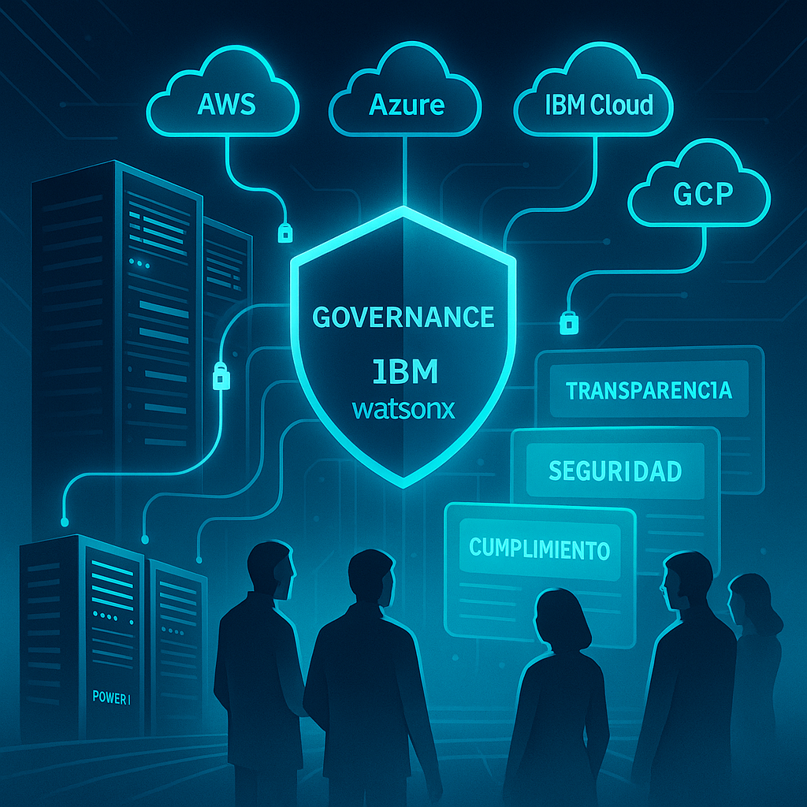
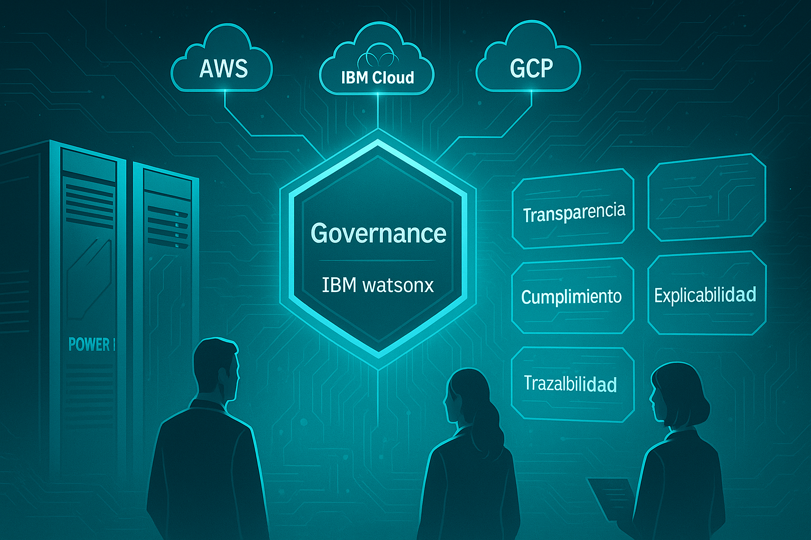

# Gobernanza como pilar de la IA confiable en entornos híbridos y multicloud 🌐🤖

### 📌 ¿Qué es la gobernanza en la IA?

La **gobernanza en la inteligencia artificial** es un marco integral de **políticas, procesos y controles tecnológicos** diseñado para garantizar que las soluciones de IA sean **seguras, éticas, transparentes y cumplidoras de normativas**. No se trata únicamente de vigilar los modelos o de proteger los datos: la gobernanza va más allá, y se convierte en la **columna vertebral que sostiene la confianza en los sistemas inteligentes**.

En términos prácticos, la gobernanza busca responder preguntas críticas como:
- ¿De dónde provienen los datos con los que entrenamos un modelo?
- ¿Podemos explicar cómo la IA llegó a una decisión?
- ¿Qué mecanismos existen para evitar sesgos o usos indebidos?
- ¿Cómo garantizamos que los datos y modelos cumplan con las regulaciones vigentes en cada país o industria?

Al abordar estas preguntas, la gobernanza permite que las organizaciones **innoven con IA sin perder control, seguridad ni credibilidad**.

### 🔑 Tres pilares fundamentales de la gobernanza en IA

-   **Transparencia y explicabilidad**
    La IA no debe ser una "caja negra". La transparencia asegura que podamos auditar cómo los modelos procesan los datos y entender las decisiones generadas. La explicabilidad, por su parte, permite que tanto técnicos como usuarios de negocio comprendan el razonamiento de un modelo.
    -   Ejemplo: En un banco, si un modelo rechaza un crédito, es crítico explicar qué variables influyeron en la decisión (historial de pagos, nivel de ingresos, etc.).
    -   Beneficio: Fortalece la confianza de clientes, usuarios y entes reguladores al demostrar que las decisiones no son arbitrarias ni opacas.
-   **Seguridad y cumplimiento normativo**
    La IA opera con datos sensibles: información financiera, de salud, personal y corporativa. La gobernanza establece los controles de **confidencialidad, integridad y disponibilidad** necesarios, alineados con estándares como **GDPR, HIPAA, ISO 27001 o NIST**.
    -   Se incluyen políticas de acceso basado en roles, cifrado de datos en tránsito y en reposo, y monitoreo de actividad sospechosa.
    -   Además, facilita el cumplimiento automático de normativas, reduciendo riesgos legales y sanciones.
-   **Gestión del ciclo de vida de datos y modelos**
    La gobernanza cubre todo el recorrido: desde la **recolección e ingesta de datos**, pasando por el **entrenamiento y validación de modelos**, hasta el **despliegue en producción y su monitoreo continuo**.
    -   Se asegura el linaje de datos (qué se usó, cuándo y cómo), la detección y corrección de sesgos, y la actualización periódica de modelos para evitar el "envejecimiento" de algoritmos.
    -   Esto evita que un modelo pierda precisión con el tiempo o que tome decisiones basadas en información obsoleta.

### 🌍 Gobernanza en entornos híbridos y multicloud

Las organizaciones modernas rara vez trabajan en un único entorno. Hoy es común que se combine infraestructura **on-premises** (centros de datos propios) con **nubes privadas y públicas**, además de servicios de **múltiples proveedores** como AWS, Azure, IBM Cloud o Google Cloud.

<figure>

<figcaption>Fig 1. Representación de entornos multicloud.</figcaption>
</figure>

En este contexto, la gobernanza enfrenta un desafío mayor:
- **Unificación de políticas**: lo que antes podía controlarse en un solo sistema, ahora debe aplicarse a ecosistemas distribuidos y heterogéneos.
- **Evitar la dependencia de un único proveedor**: en un mundo multicloud, las empresas deben mantener independencia y flexibilidad para elegir dónde desplegar cada carga de trabajo.
- **Cumplimiento global**: los datos en la nube pueden estar sujetos a regulaciones distintas según el país o sector, y la gobernanza debe adaptarse dinámicamente a esos marcos legales.

En resumen, la gobernanza en entornos híbridos y multicloud no es un lujo: es la única manera de mantener **control, coherencia y cumplimiento en medio de la complejidad tecnológica actual**.

### ⚠️ Principales retos en la gobernanza multicloud
  - **Fragmentación de políticas:** 
    Cada proveedor de nube tiene su propio conjunto de controles de seguridad, compliance y monitoreo. Sin un marco unificado, las organizaciones terminan con políticas dispersas, inconsistentes y difíciles de administrar.
  - **Complejidad en la trazabilidad:**
    Seguir el rastro de datos y modelos cuando viajan entre múltiples entornos es extremadamente complejo. Sin trazabilidad, no se puede responder con certeza a preguntas regulatorias ni detectar problemas de calidad o sesgo.
  - **Riesgos de seguridad y fuga de datos:**
    Cuantos más entornos participan, mayor es la **superficie de exposición**. Las fugas, accesos no autorizados y configuraciones erróneas aumentan si no existe una gobernanza centralizada.
  - **Sobrecarga operativa:**
    Sin herramientas adecuadas, los equipos de TI y Data Science deben duplicar esfuerzos para monitorear cada entorno, lo que ralentiza la innovación y eleva los costos operativos.

### ⚠️ Riesgos de una mala gobernanza en entornos híbridos y multicloud

Cuando la gobernanza es débil o inexistente, los riesgos aumentan exponencialmente. Estos son los más críticos:

1.  **Incumplimiento regulatorio** Sin una gobernanza adecuada, los datos sensibles pueden almacenarse o procesarse en regiones donde la legislación no lo permite.
    1. **Ejemplo:** Un banco multinacional alojó información de clientes europeos en servidores fuera de la Unión Europea sin aplicar las restricciones del **GDPR**. El resultado fue una multa millonaria y pérdida de confianza de sus clientes.
2.  **Fugas de datos y brechas de seguridad** La falta de control centralizado aumenta la probabilidad de accesos no autorizados o configuraciones erróneas en diferentes nubes.
    1. **Ejemplo:** En 2019, una aseguradora sufrió una filtración porque un bucket de almacenamiento en la nube estaba mal configurado. La exposición alcanzó millones de registros de clientes, generando pérdidas financieras y daño reputacional irreversible.
3.  **Sesgos no detectados en modelos de IA** Sin trazabilidad ni monitoreo, los modelos entrenados en distintos entornos pueden incorporar sesgos que pasan desapercibidos.
    1. **Ejemplo:** Un retailer usó IA para filtrar currículos en diferentes nubes, pero por falta de gobernanza, no controló el sesgo en los datos históricos. El sistema comenzó a favorecer perfiles masculinos sobre femeninos, generando un escándalo mediático y obligando a detener el proyecto.
4.  **Pérdida de productividad y sobrecostos** La duplicación de políticas, la falta de interoperabilidad y los procesos manuales generan ineficiencia.
    1. **Ejemplo:** Una empresa de telecomunicaciones gestionaba auditorías separadas para cada nube. Esto duplicó esfuerzos, elevó los costos de operación y retrasó en meses la salida a producción de un nuevo servicio basado en IA.

En síntesis, una mala gobernanza no solo trae **riesgos técnicos**, sino que impacta directamente en **la reputación, los costos y la continuidad de negocio**.

### ✅ Cómo afrontarlos (con ejemplos prácticos)

-   **Definir un marco centralizado de gobernanza**
    No basta con tener políticas aisladas en cada nube. Lo ideal es definir un **marco global**, aplicable en todos los entornos.
    -   **Ejemplo:** una empresa financiera crea un catálogo de datos centralizado que clasifica automáticamente la información sensible (como números de tarjetas o historiales médicos) sin importar si están en IBM Cloud, AWS o en servidores on-premises. Así, las reglas de uso y acceso se aplican de forma uniforme.

-   **Automatizar auditorías y cumplimiento**
    Automatizar es clave para reducir la carga manual y el riesgo de
    errores humanos.
    -   **Ejemplo:** en el sector salud, una clínica usa Watsonx.governance para generar reportes automáticos que muestran qué modelos accedieron a datos de pacientes, cuándo y con qué propósito. Estos reportes pueden presentarse directamente en auditorías de cumplimiento de **HIPAA** sin tener que armar evidencias manualmente.

-   **Controles de seguridad unificados**
    La seguridad debe ir más allá del cifrado básico. Se requiere un control consistente de identidades, accesos y protección de datos.
    -   **Ejemplo:** una empresa de retail aplica autenticación multifactor y cifrado en tránsito/reposo en todas sus nubes. Gracias a Watsonx.governance, puede detectar si un modelo en Azure intenta usar un dataset restringido que solo debería estar accesible en IBM Cloud, bloqueando automáticamente el acceso.

-   **Adoptar plataformas interoperables**
    La interoperabilidad evita el famoso *vendor lock-in* (encierro con un proveedor) y facilita mover cargas de trabajo entre nubes.
    -   **Ejemplo:** una compañía de telecomunicaciones entrena sus modelos de predicción de fallas en IBM Cloud, pero los despliega en Azure para integrarse con otros sistemas de monitoreo. Con Watsonx, mantiene la gobernanza centralizada sobre ambos entornos, asegurando trazabilidad y control sin importar dónde se ejecute el modelo.

### 🌟 ¿Por qué Watsonx es clave en la gobernanza de IA?

No todas las plataformas de IA ofrecen gobernanza de manera integrada. La mayoría de soluciones de mercado requieren añadir herramientas externas o procesos manuales para cubrir el ciclo completo de control. IBM, con Watsonx, adopta un enfoque distinto: **la gobernanza no es un accesorio, es un componente nativo y transversal**.

Los puntos diferenciales que fortalecen su propuesta:

1.  **Gobernanza como parte del ADN de la plataforma**
    1.   A diferencia de soluciones que ven la gobernanza como "adicional", Watsonx.governance se integra de forma nativa con Watsonx.ai y Watsonx.data, asegurando que cada modelo y cada dataset cuente con políticas aplicadas desde el inicio.

2.  **Gobernanza enfocada en IA responsable**
    1.   Watsonx no solo busca cumplir normas, sino garantizar una **IA ética, transparente y justa**.
    2.   Ofrece herramientas de **explicabilidad de modelos**, control de sesgos y generación de evidencias para auditores y reguladores, convirtiéndose en un habilitador de confianza.

3.  **Interoperabilidad real en entornos multicloud**
    1.   Muchas plataformas limitan la gobernanza a su propio ecosistema, pero Watsonx permite aplicar políticas y trazabilidad en datos y modelos desplegados en IBM Cloud, AWS, Azure, GCP o entornos on-premises.
    2.   Esto asegura independencia del proveedor y protege la inversión tecnológica de la organización.

4.  **Automatización avanzada y reducción de costos**
    1.   Watsonx automatiza reportes de auditoría, monitoreo de cumplimiento y actualización de políticas en tiempo real.
    2.   Esto libera a los equipos de TI y Data Science de tareas repetitivas, enfocándolos en la innovación, mientras reduce los costos operativos asociados a la gestión manual de la gobernanza.

### 🤝 El rol de IBM Watsonx en la gobernanza híbrida y multicloud

<figure>

<figcaption>Fig 2. Representación de entornos híbridos y multicloud.</figcaption>
</figure>

IBM Watsonx fue diseñado precisamente para este escenario de **complejidad híbrida y multicloud**. Sus capacidades en gobernanza permiten que las empresas no tengan que elegir entre innovación y control, porque ofrece ambos:

-   **Watsonx.governance** centraliza la creación y aplicación de políticas sobre datos y modelos, sin importar dónde residan.
-   Incluye funciones avanzadas de **trazabilidad de extremo a extremo**, permitiendo seguir el linaje de un dato desde su origen hasta la decisión generada por un modelo en producción.
-   Proporciona herramientas de **explicabilidad y detección de sesgos**, garantizando que las decisiones de IA sean transparentes y responsables.
-   Facilita la **interoperabilidad multicloud** al integrarse con proveedores líderes, evitando que las empresas queden atadas a un único ecosistema.
-   Ofrece automatización en auditorías y reportes, reduciendo drásticamente la carga operativa y el riesgo de incumplimientos.

En pocas palabras, Watsonx convierte la gobernanza en un **habilitador de la innovación** y no en una barrera.

### 🏁 Conclusión

La gobernanza ya no es un "complemento", sino el **pilar esencial para la IA confiable**. En entornos híbridos y multicloud, donde los datos y modelos viven en múltiples plataformas, se vuelve aún más estratégica para garantizar seguridad, cumplimiento y transparencia.

IBM, con **Watsonx.governance**, propone una visión clara: **gobernar la IA de forma centralizada, automatizada y responsable**, sin importar dónde se encuentren los activos tecnológicos. Esto significa que las organizaciones pueden innovar con IA generativa, machine learning y analítica avanzada, manteniendo la confianza de clientes, usuarios y reguladores.

En definitiva, la gobernanza es el puente entre la **innovación en IA** y la **confianza empresarial**. Y en la era multicloud, se convierte en el habilitador clave para escalar la inteligencia artificial de manera segura, abierta y sostenible. 🚀
