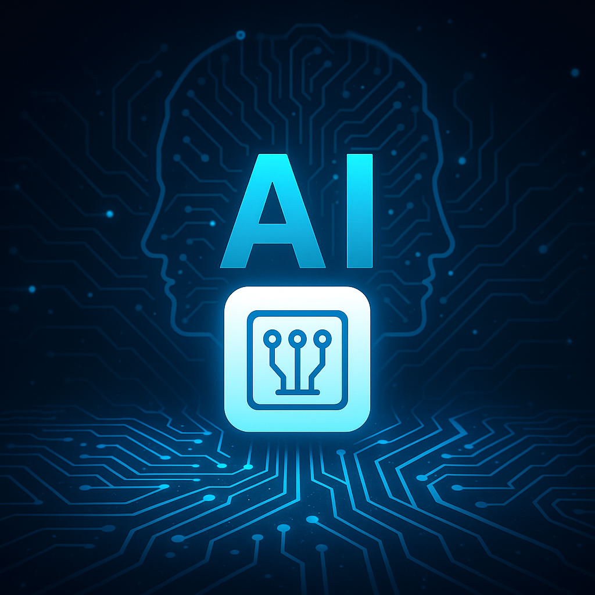
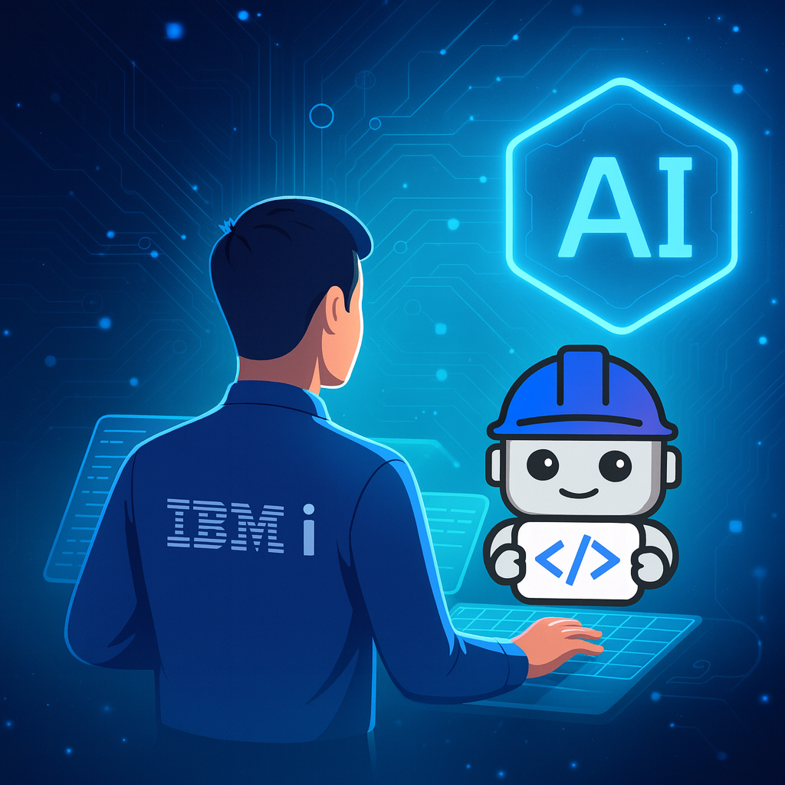

# From Watsonx Code Assistant to Project Bob: the leap toward an AI-first development companion

> **"A tool that not only suggests code, but accompanies you, understands your project, your intent, and your ecosystem."**

During IBM TechXchange 2025 I had the opportunity to see how IBM is not only going to evolve its code assistant, but redefine it: from the "AI assistant to the coder" paradigm to that of an "AI development companion." Here I share an expanded version of what I saw, what this means for developers, and how we should prepare.

## Background: what is Watsonx Code Assistant and what does it do today?

To fully understand the proposed change, it is worth starting from where we are now.

<figure>

<figcaption>Fig 1. Representation of AI applied to development.</figcaption>
</figure>

### Main capabilities of Watsonx Code Assistant

IBM defines Watsonx Code Assistant as a generative-intelligence service that "harnesses generative AI to augment developer skill sets, simplifying and automating your coding and modernization efforts."

These are some of its key features (and how they work in practice):

  |Feature                |What it does            |Usage context examples   |
  |-----------------------|-----------------------|-------------------------|
  |**Code suggestions (autocomplete / generation)**| From a natural-language prompt or comments, it generates code fragments that you can insert | "Create a REST endpoint in Java that queries a database with a filter by date range" → Watsonx generates the controller, services, DTOs, etc. |
  |**Explain existing code**| Given a block of code, generate a readable explanation of what it does, what inputs/outputs it has, conditions, etc. | Ideal when working with legacy code or onboarding to unfamiliar projects. |
  |**Document / automatic comments**| Generate comments or docblocks for functions, classes, and methods, describing purpose, parameters, and return value | Helps keep documentation consistent even when new functions are added quickly. |
  |**Generate unit tests**| Create test skeletons (for example, using common frameworks such as JUnit, pytest, etc.) | Reduces the manual effort in test coverage, especially for repetitive logic. |
  |**Translation between languages**| Convert a code fragment from one language to another | For example, translating a function from Python to Java and vice versa. |
  |**Java modernization**| Helps with migrating Java versions, updating libraries and frameworks | Makes it easier to update legacy applications to more recent versions of Java. |
  |**Security and license compliance**| Review code similarity (code similarity check) to detect potential license risks or vulnerabilities | Watsonx makes sure that the code it suggests does not violate any license or security standard. |

Watsonx Code Assistant can run in hybrid environments (cloud,
on-premises) to meet data-residency or
regulatory-compliance requirements.

## What is Project Bob and what does it promise to do?

IBM describes **Project Bob** as an "AI partner for faster, smarter software development." It is not just a "code assistant," but an AI-first development companion, with more autonomy, context, and orchestration.

### Bob's key promises

1.  **Architect Mode + Code Mode**
    You can switch between a design/architecture mode and an
    iterative implementation mode. Bob understands both levels.
2.  **Repository comprehension**
    It reads all the code in the repository and understands dependencies,
    standards, and relationships between layers.
3.  **Agentic flows / task orchestration**
    It breaks a complex task into subtasks and runs specialized
    agents.
4.  **Integrated security analysis and remediation**
    It detects vulnerabilities and regulatory compliance proactively.
5.  **Continuous code review "before the Pull Request"**
    It inspects changes in real time and detects errors or
    inconsistencies.
6.  **Built-in security and standards**
    Native compliance with HIPAA, PCI, FedRAMP.
7.  **Integration with the CI/CD pipeline and monitoring**
    Bob integrates with DevOps pipelines and automated tests.
8.  **Scalable modernization**
    Ideal for companies with large code bases or technical debt.
9.  **Continuous context across sessions**
    It remembers previous decisions and dependencies to maintain coherence.

<figure>

<figcaption>Fig 1. Representation of IBM's Project Bob in development.</figcaption>
</figure>

## Comparison: traditional code assistant vs AI-first development companion

  |Dimension               |Code assistant          |AI-first companion      |
  |-----------------------|-----------------------|-----------------------|
  | **Context scope**|Local functions | The entire repository base |
  | **Design / abstraction level**| Code generation | Architectural design and global refactoring |
  | **Security / compliance**| Patches or warnings | Integrated and automated |
  | **Code review**| Manual or on request | Continuous and preventive |
  | **Contextual memory**| Current session | Persistent across sessions |
  | **Autonomy**| Low | Medium-High |
  | **Autonomous intervention**| Reactive | Proactive |

## Bob's practical features

-   **Global refactoring**
-   **Version / runtime migrations**
-   **Early vulnerability detection**
-   **Orchestration of composite tasks**
-   **Integration with pipelines**
-   **Evolutionary maintenance**
-   **Management of corporate standards**
-   **Memory of decisions / project history**

## How the developer's role must evolve

1.  **From writing code to defining intent**
2.  **Review, auditing, and governance**
3.  **Ethics and traceability**
4.  **Prompts and specialized agents**
5.  **Continuous feedback**
6.  **New roles: AI auditor, AI flow designer, model engineer**

## Real use cases

1.  **Modernization of banking monoliths**
2.  **Distributed Java version migrations**
3.  **Continuous refactoring**
4.  **Secure integration with external APIs**
5.  **Evolutionary maintenance / technical-debt cleanup**

## Risks and challenges

-   Excessive trust
-   False sense of productivity
-   Hidden complexity
-   Licenses and intellectual property
-   Security
-   Alignment with the business
-   Resistance to change
-   Operating costs
-   Excessive automation

## Best practices for responsible use

1.  Start with small tasks
2.  Version and test everything
3.  Document AI decisions
4.  Define clear limits
5.  Human + AI pair programming
6.  Continuous feedback
7.  Shared training
8.  External audits

## Conclusion: a new era of human + AI collaboration

Code will not disappear, but the way we develop it will change. Bob represents the step from the **AI assistant** to the **AI collaborator**: a true team member that thinks, analyzes, and suggests. The developer of the future will have to be more of a strategist, more of an architect, and more ethical than ever.
