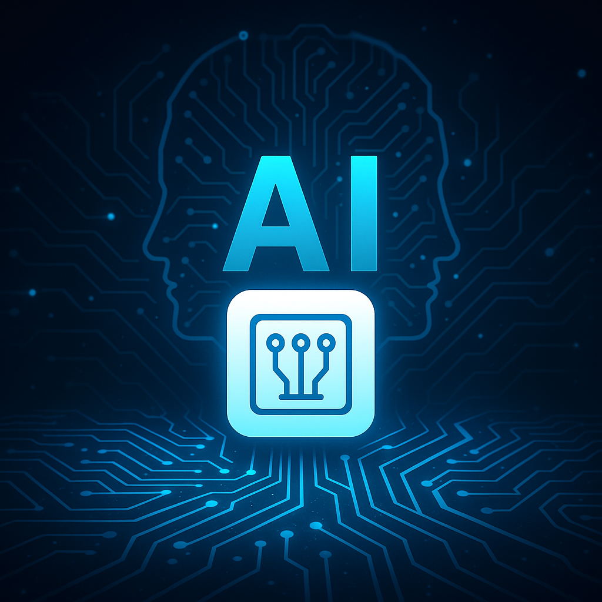
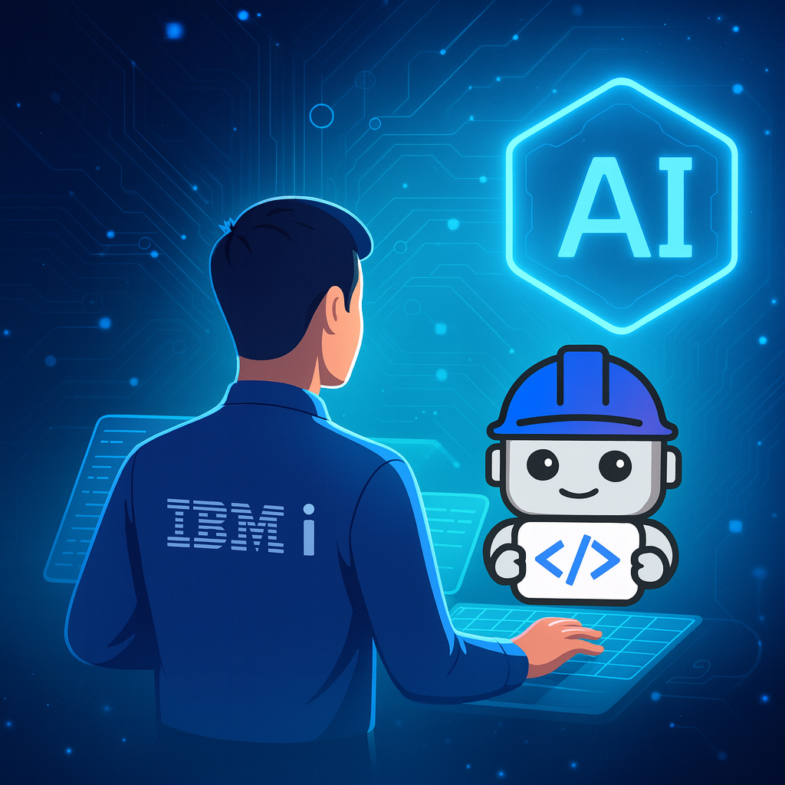

# De Watsonx Code Assistant a Project Bob: el salto hacia un compañero de desarrollo AI‑primario

> **"Una herramienta que no solo sugiere código, sino que te acompaña, entiende tu proyecto, tu intención y tu ecosistema."**

Durante el IBM TechXchange 2025 tuve la oportunidad de ver cómo IBM no solo va a evolucionar su asistente de código, sino a redefinirlo: del paradigma "AI asistente al codificador" al de "AI compañero de desarrollo". Aquí te comparto una versión ampliada de lo que vi, lo que esto significa para los desarrolladores y cómo deberíamos prepararnos.

## Antecedentes: ¿qué es Watsonx Code Assistant y qué hace hoy?

Para comprender bien el cambio propuesto, conviene partir por dónde estamos ahora.

<figure>

<figcaption>Fig 1. Representación de la AI aplicada al desarrollo.</figcaption>
</figure>

### Principales capacidades de Watsonx Code Assistant

IBM define Watsonx Code Assistant como un servicio de inteligencia generativa que "harnesses generative AI to augment developer skill sets, simplifying and automating your coding and modernization efforts."

Estas son algunas de sus funcionalidades clave (y cómo funcionan en la práctica):

  |Funcionalidad          |Qué hace               |Ejemplos de uso contexto |
  |-----------------------|-----------------------|-------------------------|
  |**Sugerencias de código (autocompletado / generación)**| A partir de un prompt en lenguaje natural o comentarios, genera fragmentos de código que puedes insertar | "Crea un endpoint REST en Java que consulte una base de datos con filtro por rango de fechas" → Watsonx genera el controlador, servicios, DTOs, etc. |
  |**Explicar código existente**| Dado un bloque de código, generar una explicación legible sobre qué hace, qué entradas sale, condiciones, etc. | Ideal al trabajar con código legacy o en onboarding de proyectos desconocidos. |
  |**Documentar / comentarios automáticos**| Generar comentarios o docblocks para funciones, clases, métodos, describiendo propósito, parámetros, retorno | Ayuda a mantener consistencia en documentación incluso cuando se añaden rápidamente nuevas funciones. |
  |**Generar pruebas unitarias**| Crear esqueletos de tests (por ejemplo, usando frameworks comunes como JUnit, pytest, etc.) | Reduce el esfuerzo manual en cobertura de pruebas, especialmente para lógica repetitiva. |
  |**Traducción entre lenguajes**| Convertir un fragmento de código de un lenguaje a otro | Por ejemplo, traducir una función de Python a Java y viceversa. |
  |**Modernización de Java**| Ayuda en la migración de versiones de Java, actualización de librerías y frameworks | Facilita la actualización de aplicaciones legadas a versiones más recientes de Java. |
  |**Seguridad y cumplimiento de licencias**| Revisar similitud de código (code similarity check) para detectar posibles riesgos de licencias o vulnerabilidades | Watsonx se asegura de que el código que sugiere no viola ninguna licencia o norma de seguridad. |

Watsonx Code Assistant puede funcionar en entornos híbridos (cloud,
on‑premises) para cumplir con requerimientos de residencia de datos o
cumplimiento normativo.

## ¿Qué es Project Bob y qué promete hacer?

IBM describe **Project Bob** como un "AI partner for faster, smarter software development." No es solo un "assistant de código", sino un compañero de desarrollo AI‑first, con más autonomía, contexto y orquestación.

### Las promesas clave de Bob

1.  **Modo Arquitecto + Modo Código**
    Puedes alternar entre un modo de diseño/arquitectura y un modo de
    implementación iterativa. Bob entiende ambos niveles.
2.  **Comprensión del repositorio**
    Lee todo el código del repositorio y entiende dependencias,
    estándares y relaciones entre capas.
3.  **Flujos agenticos / orquestación de tareas**
    Divide una tarea compleja en subtareas y ejecuta agentes
    especializados.
4.  **Análisis y corrección de seguridad integrados**
    Detecta vulnerabilidades y cumplimiento normativo proactivamente.
5.  **Revisión de código continua "antes del Pull Request"**
    Inspecciona cambios en tiempo real y detecta errores o
    inconsistencias.
6.  **Seguridad y estándares incorporados**
    Cumplimiento nativo con HIPAA, PCI, FedRAMP.
7.  **Integración con pipeline CI/CD y monitoreo**
    Bob se integra con pipelines DevOps y pruebas automatizadas.
8.  **Modernización escalable**
    Ideal para empresas con grandes bases de código o deuda técnica.
9.  **Contexto continuo entre sesiones**
    Recuerda decisiones previas y dependencias para mantener coherencia.

<figure>

<figcaption>Fig 1. Representación del Project Bob de IBM en el Desarrollo.</figcaption>
</figure>

## Comparativo: asistente de código tradicional vs compañero de desarrollo AI‑primario

  |Dimensión               |Asistente de código     |Compañero AI‑primario   |
  |-----------------------|-----------------------|-----------------------|
  | **Alcance del contexto**|Funciones locales | Toda la base del reporsitorio |
  | **Nivel de diseño abstracción**| Generación de código | Diseño arquitectónico y refactorización global |
  | **Seguridad / cumplimiento**| Parches o advertencias | Integrado y automatizado |
  | **Revisión de código**| Manual o por solicitud | Continua y preventiva |
  | **Memoria contextual**| Sesión actual | Persistente entre sesiones |
  | **Autonomía**| Baja | Media‑Alta |
  | **Intervención autónoma**| Reactiva | Proactiva |

## Funcionalidades prácticas de Bob

-   **Refactorización global**
-   **Migraciones de versión / runtime**
-   **Detección temprana de vulnerabilidades**
-   **Orquestación de tareas compuestas**
-   **Integración con pipelines**
-   **Mantenimiento evolutivo**
-   **Gestión de estándares corporativos**
-   **Memoria de decisiones / historial del proyecto**

## Cómo debe evolucionar el rol del desarrollador

1.  **De escribir código a definir intención**
2.  **Revisión, auditoría y gobernanza**
3.  **Ética y trazabilidad**
4.  **Prompts y agentes especializados**
5.  **Retroalimentación continua**
6.  **Nuevos roles: auditor de AI, diseñador de flujos AI, ingeniero de modelo**

## Casos de uso reales

1.  **Modernización de monolitos bancarios**
2.  **Migraciones de versiones Java distribuidas**
3.  **Refactorización continua**
4.  **Integración segura con APIs externas**
5.  **Mantenimiento evolutivo / limpieza de deuda técnica**

## Riesgos y desafíos

-   Confianza excesiva
-   Falsa sensación de productividad
-   Complejidad oculta
-   Licencias y propiedad intelectual
-   Seguridad
-   Alineación con negocio
-   Resistencia al cambio
-   Costos operativos
-   Automatización excesiva

## Buenas prácticas de uso responsable

1.  Empieza con tareas pequeñas
2.  Versiona y prueba todo
3.  Documenta decisiones AI
4.  Define límites claros
5.  Pair programming humano + AI
6.  Feedback continuo
7.  Entrenamiento compartido
8.  Auditorías externas

## Conclusión: una nueva era de colaboración humano + AI

El código no desaparecerá, pero el modo de desarrollarlo cambiará. Bob representa el paso del **AI asistente** al **AI colaborador**: un verdadero miembro del equipo que piensa, analiza y sugiere. El desarrollador del futuro deberá ser más estratega, más arquitecto y más ético que nunca.

