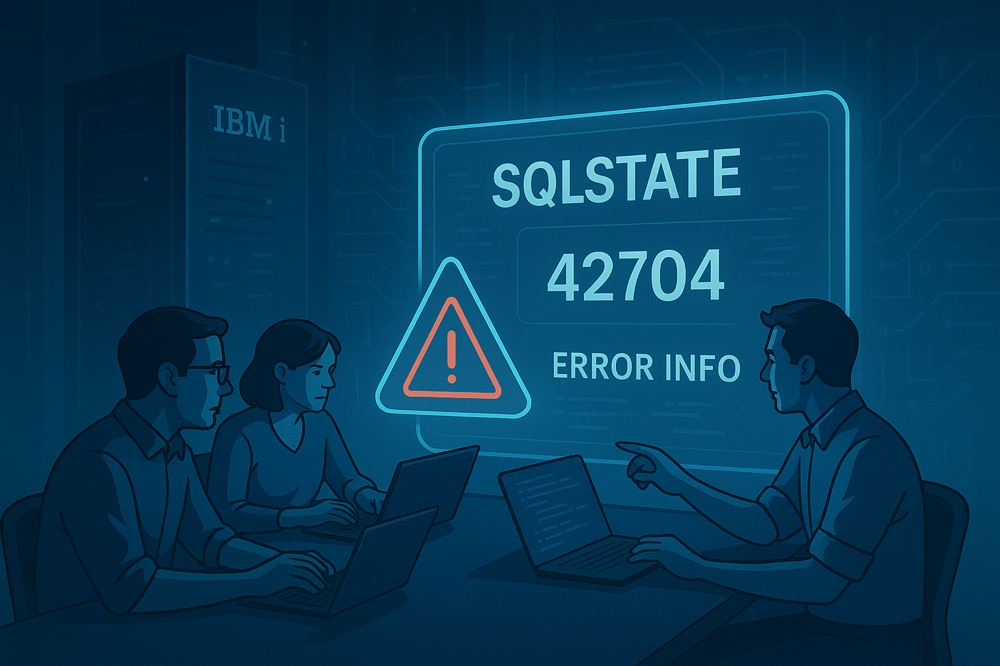

# Proper SQL error handling in RPGLE and Db2 for i (IBM i 7.6)
## Centralizing error management with QSYS2.SQLSTATE_INFO

In many legacy IBM i systems, SQL error handling still looks something like this:

- `IF SQLCOD < 0` and a couple of `DSPLY`.
- Magic codes (`-204`, `-305`, etc.) hardcoded into the code.
- No context: we don't know which statement failed, for which user, or from which program.

With **IBM i 7.6**, Db2 for i gives us a new tool to improve this: the **`QSYS2.SQLSTATE_INFO`** table, which lets us query the relationship between **SQLSTATE** and **SQLCODE** in a standard way. With this information, we can design a much more robust and professional error-handling system that makes auditing and problem diagnosis easier.

<figure>

<figcaption>Fig 1. SQL Error Handling in IBM i.</figcaption>
</figure>

In this blog we are going to:

1. Recall how SQL errors are handled in RPGLE, especially the fundamentals of `SQLCODE` and `SQLSTATE`. It is important to understand these variables for any effective error handling in embedded SQL.
2. See what `QSYS2.SQLSTATE_INFO` provides and how we can use it to enrich error information. This table lets us map SQLSTATE codes to their corresponding SQLCODE, making it easier to identify errors and their meaning.
3. Design an **error log table** where we will store detailed information about every SQL error that occurs in our applications. This table will include fields for the application, program, routine, SQL statement, SQLSTATE, SQLCODE, detailed message, user, and job.
4. Implement a **reusable logging procedure** that will insert records into the log table every time an SQL error occurs. This procedure will take parameters such as the application, program, routine, SQL statement, SQLSTATE, and SQLCODE, and will use `SQLCODE_INFO` to obtain the detailed error message.
5. Integrate it into any RPGLE program with embedded SQL, showing how to call the logging procedure when an SQL error is detected. This will allow us to centralize error handling and make traceability easier.


## 1. Fundamentals: SQLCODE and SQLSTATE in RPGLE

In RPGLE programs with embedded SQL we always have two special variables available:

- **`SQLCODE`**: an integer that indicates success, warning, or error. It is very useful for determining whether an SQL operation ran correctly or whether there was a problem.
- **`SQLSTATE`**: a standard 5-character code, portable across SQL engines. It provides a more detailed and standardized way to identify the type of error that occurred.

General rule:

- `SQLCODE = 0` → Everything ran fine, no complications.  
- `SQLCODE > 0` → There is a warning.
- `SQLCODE < 0` → An error occurred.

Classic example:

```rpg
exec sql
   insert into CLIENTES (ID, NOMBRE)
   values (:id :nombre);

if SQLCODE < 0;
   dsply ('Error SQL: ' + %char(SQLCODE));
endif;
```


## 2. What does QSYS2.SQLSTATE_INFO provide?

IBM i 7.6 introduces the **`QSYS2.SQLSTATE_INFO`** table, which is a native table in DB2 for i, located in the QSYS2 schema, and its purpose is:

> To map SQLSTATE values to their associated SQLCODE for Db2 for i.

Key points:

- One row per relevant **SQLSTATE / SQLCODE** combination. This lets us see which SQLCODE corresponds to a specific SQLSTATE and vice versa.
- It allows us to **query information about an error** just by knowing `SQLSTATE` and/or `SQLCODE`. With this information, we can obtain additional details about the error that occurred.
- It is in the **QSYS2** schema, available via SQL like any other table. Therefore, we can run direct queries to obtain the information we need.
- The `SQLSTATE_DETALLES` row contains detailed error descriptions, which makes it easier to understand the problem. It is worth noting that this description is always in English, but it can be translated if needed.

Typical queries:

```sql
SELECT *
  FROM QSYS2.SQLSTATE_INFO
 WHERE SQLSTATE_VALUE = '42704';
```

```sql
SELECT S.SQLSTATE_VALUE,
       S.SQLCODE_VALUE,
       C.MESSAGE_TEXT
  FROM QSYS2.SQLSTATE_INFO S
  JOIN TABLE(SYSTOOLS.SQLCODE_INFO(S.SQLCODE_VALUE)) C
       ON 1 = 1
 WHERE S.SQLSTATE_VALUE = '42704';
```


## 3. SQL error log table

The first piece of professional SQL error handling is having a table dedicated to storing the errors that occur in our applications. This table must capture relevant information to make diagnosis and auditing easier. Having a centralized log lets us analyze patterns, identify recurring problems, and improve software quality, as well as meet auditing and traceability requirements.

A sound proposal is to create the `LOG_ERRORES_SQL` table with the following structure:

```sql
CREATE TABLE SQL_ERROR_LOG (
    LOG_ID              BIGINT GENERATED ALWAYS AS IDENTITY,
    REGISTRATION_DATE   TIMESTAMP       NOT NULL
        DEFAULT CURRENT_TIMESTAMP,
    APPLICATION         VARCHAR(50)     NOT NULL,
    PROGRAM             VARCHAR(128)    NOT NULL,
    ROUTINE             VARCHAR(128)    NOT NULL,
    SQL_STATEMENT       CLOB(10K)       NOT NULL,
    SQLSTATE            CHAR(5)         NOT NULL,
    SQLCODE             INTEGER         NOT NULL,
    DETAIL_MESSAGE      VARCHAR(2000),
    JOB_USER            VARCHAR(10)     NOT NULL,
    JOB_NAME            VARCHAR(28)     NOT NULL
);
```

With this structure, every time an SQL error occurs, we will be able to record:
- **APPLICATION**: Name of the application where the error occurred.
- **PROGRAM**: Name of the RPGLE program.
- **ROUTINE**: Name of the specific routine or function.
- **SQL_STATEMENT**: The SQL statement that caused the error.
- **SQLSTATE** and **SQLCODE**: Codes that identify the error.
- **DETAIL_MESSAGE**: Detailed error message obtained from `SQLCODE_INFO`.
- **JOB_USER**: User of the job where the error occurred.
- **JOB_NAME**: Name of the job where the error occurred.


## 4. SQL procedure to log errors

Now, we will create a reusable SQL procedure called `LOG_SQL_ERROR` that will insert records into the `LOG_ERRORES_SQL` table every time an SQL error occurs. This procedure will take the relevant error information as parameters and will use `SQLCODE_INFO` to obtain the detailed message associated with the `SQLCODE`.

```sql
CREATE OR REPLACE PROCEDURE LOG_SQL_ERROR (
    IN  P_APPLICATION   VARCHAR(50),
    IN  P_PROGRAM       VARCHAR(128),
    IN  P_ROUTINE       VARCHAR(128),
    IN  P_STATEMENT     CLOB(10K),
    IN  P_SQLSTATE      CHAR(5),
    IN  P_SQLCODE       INTEGER
)
LANGUAGE SQL
SPECIFIC LOG_SQL_ERROR
BEGIN
    DECLARE V_MESSAGE   VARCHAR(2000);
    DECLARE V_USER      VARCHAR(10);
    DECLARE V_JOB       VARCHAR(28);

    SELECT MESSAGE_TEXT
      INTO V_MESSAGE
      FROM TABLE (SYSTOOLS.SQLCODE_INFO(P_SQLCODE))
     FETCH FIRST 1 ROW ONLY;

    SET V_USER = SESSION_USER;
    SET V_JOB  = JOB_NAME;

    INSERT INTO SQL_ERROR_LOG (
        APPLICATION, PROGRAM, ROUTINE,
        SQL_STATEMENT, SQLSTATE, SQLCODE,
        DETAIL_MESSAGE,
        JOB_USER, JOB_NAME
    )
    VALUES (
        P_APPLICATION, P_PROGRAM, P_ROUTINE,
        P_STATEMENT,   P_SQLSTATE, P_SQLCODE,
        V_MESSAGE,
        V_USER, V_JOB
    );
END;
```


## 5. Usage from RPGLE

Once we have the `LOG_SQL_ERROR` procedure, we can easily integrate it into any RPGLE program with embedded SQL. When we detect an SQL error (that is, when `SQLCODE < 0`), we simply call this procedure passing the necessary parameters. And so we can centralize the handling and logging of SQL errors.

Next, let's see how to define the procedure prototype and a practical example of its use.

### Prototype:

```rpg
dcl-pr LogSqlError extproc('LOG_SQL_ERROR');
   pApplication varchar(50)  const;
   pProgram     varchar(128) const;
   pRoutine     varchar(128) const;
   pStatement   clob(10000)  const;
   pSqlState    char(5)      const;
   pSqlCode     int(10)      const;
end-pr;
```

### Practical example:

```rpg
dcl-s sqlStmt varchar(2000);

sqlStmt = 'INSERT INTO CUSTOMERS (ID, NAME) VALUES (?, ?)';

exec sql
   insert into CUSTOMERS (ID, NAME)
   values (:id, :name);

if SQLCODE < 0;
   LogSqlError(
     'BANKING_APP' :
     'CUSTPROC' :
     'ProcessCustomer' :
     sqlStmt :
     SQLSTATE :
     SQLCODE
   );
endif;
```

With this approach, every time an SQL error occurs in the code block, it will be automatically logged in the `LOG_ERRORES_SQL` table with all the relevant information, thus making diagnosis and auditing easier. Developers can focus on the business logic, while error handling stays centralized and standardized.


## 6. Enriching with GET DIAGNOSTICS

```rpg
dcl-s vMsgText   varchar(2000);
dcl-s vRowCount  int(10);

exec sql
   get diagnostics
      :vRowCount = ROW_COUNT,
      :vMsgText  = MESSAGE_TEXT;
```

Currently, the `LOG_SQL_ERROR` procedure uses `SQLCODE_INFO` to obtain the detailed error message. However, in some cases, it can be useful to capture additional information about the error context using the `GET DIAGNOSTICS` statement in RPGLE. This statement lets us obtain additional details such as the number of affected rows, the message text, among others. By integrating `GET DIAGNOSTICS`, we can further enrich the information we record in the error log table.

## 7. Reports using SQLSTATE_INFO

```sql
SELECT L.SQLSTATE,
       I.SQLCODE_VALUE,
       COUNT(*) AS CANTIDAD
  FROM LOG_ERRORES_SQL L
  LEFT JOIN QSYS2.SQLSTATE_INFO I
         ON I.SQLSTATE_VALUE = L.SQLSTATE
        AND I.SQLCODE_VALUE  = L.SQLCODE
 GROUP BY L.SQLSTATE, I.SQLCODE_VALUE
 ORDER BY CANTIDAD DESC;
```

Having an SQL error log table, we can generate useful reports to analyze the errors that occur in our applications. Using the `QSYS2.SQLSTATE_INFO` table, we can enrich these reports with additional information about the errors. For example, we can create a report that shows the number of errors per combination of `SQLSTATE` and `SQLCODE`, which will help us identify patterns and problem areas in our applications.

## 8. Conclusion

With IBM i 7.6 and Db2 for i we can build a **professional, auditable, and centralized SQL error-handling system**, integrating:

- `SQLSTATE_INFO`: Detailed information about SQL states.
- `SQLCODE_INFO`: Detailed information about SQL codes.
- Structured logging: Centralized logging of SQL errors.
- Reusable RPGLE modules: Procedures to handle errors consistently.

This makes it possible to raise the quality, traceability, and diagnostic capability of any modern IBM i application. Of course, this is just a starting point. More features can be added, such as automatic notifications, trend analysis, and more. But the essential thing is to have a solid foundation for SQL error handling that makes maintaining and evolving applications easier. Modernization is not just a matter of technology, but also of practices and processes.

Remember:
> "It is not just about modernizing the code, but about modernizing the way we think and work."
