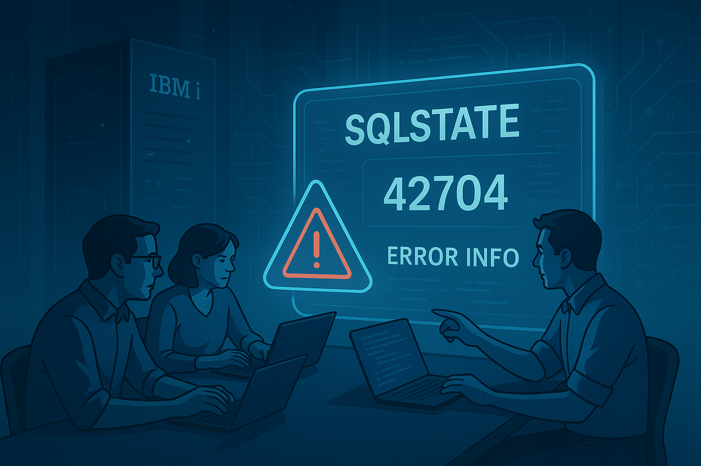

# Manejo adecuado de errores SQL en RPGLE y Db2 for i (IBM i 7.6)
## Centralizando la gestión de errores con QSYS2.SQLSTATE_INFO

En muchos sistemas IBM i heredados el manejo de errores SQL sigue siendo algo así como:

- `IF SQLCOD < 0` y un par de `DSPLY`.
- Códigos mágicos (`-204`, `-305`, etc.) quemados en el código.
- Nada de contexto: no sabemos qué sentencia falló, ni para qué usuario, ni desde qué programa.

Con **IBM i 7.6**, Db2 for i nos da una herramienta nueva para mejorar esto: la tabla **`QSYS2.SQLSTATE_INFO`**, que nos permite consultar de forma estándar la relación entre **SQLSTATE** y **SQLCODE**. Con esta información, podemos diseñar un sistema de manejo de errores mucho más robusto y profesional que facilite la auditoría y el diagnóstico de problemas.

<figure>

<figcaption>Fig 1. Manejo de Errores SQL en IBM i.</figcaption>
</figure>

En este blog vamos a:

1. Recordar cómo se manejan errores SQL en RPGLE, especialmente los fundamentos de `SQLCODE` y `SQLSTATE`. Es importante entender estas variables para cualquier manejo de errores efectivo en SQL embebido.
2. Ver qué aporta `QSYS2.SQLSTATE_INFO` y cómo podemos utilizarla para enriquecer la información de errores. Esta tabla nos permite mapear códigos SQLSTATE a sus correspondientes SQLCODE, facilitando la identificación de errores y su significado.
3. Diseñar una **tabla de log de errores** donde almacenaremos información detallada sobre cada error SQL que ocurra en nuestras aplicaciones. Esta tabla incluirá campos para la aplicación, programa, rutina, sentencia SQL, SQLSTATE, SQLCODE, mensaje detallado, usuario y job.
4. Implementar un **procedimiento de logging reutilizable** que insertará registros en la tabla de log cada vez que ocurra un error SQL. Este procedimiento tomará parámetros como la aplicación, programa, rutina, sentencia SQL, SQLSTATE y SQLCODE, y utilizará `SQLCODE_INFO` para obtener el mensaje detallado del error.
5. Integrarlo en cualquier programa RPGLE con SQL embebido, mostrando cómo llamar al procedimiento de logging cuando se detecta un error SQL. Esto permitirá centralizar el manejo de errores y facilitar la trazabilidad.


## 1. Fundamentos: SQLCODE y SQLSTATE en RPGLE

En programas RPGLE con SQL embebido siempre tenemos disponibles dos variables especiales:

- **`SQLCODE`**: entero que indica éxito, warning o error. Es muy útil para determinar si una operación SQL se ejecutó correctamente o si hubo un problema.
- **`SQLSTATE`**: código estándar de 5 caracteres, portable entre motores SQL. Proporciona una forma más detallada y estandarizada de identificar el tipo de error que ocurrió.

Regla general:

- `SQLCODE = 0` → Todo se ejecutó bien, sin complicaciones.  
- `SQLCODE > 0` → Existe una advertencia (warning).
- `SQLCODE < 0` → Ocurrió un error.

Ejemplo clásico:

```rpg
exec sql
   insert into CLIENTES (ID, NOMBRE)
   values (:id :nombre);

if SQLCODE < 0;
   dsply ('Error SQL: ' + %char(SQLCODE));
endif;
```


## 2. ¿Qué aporta QSYS2.SQLSTATE_INFO?

IBM i 7.6 incorpora la tabla **`QSYS2.SQLSTATE_INFO`**, la cual es una tabla nativa en DB2 for i y se encuentra en el esquema QSYS2 y su objetivo es:

> Mapear valores de SQLSTATE a sus SQLCODE asociados para Db2 for i.

Puntos clave:

- Una fila por combinación relevante **SQLSTATE / SQLCODE**. Esto nos permite ver qué SQLCODE corresponde a un SQLSTATE específico y viceversa.
- Nos permite **consultar información sobre un error** con solo conocer `SQLSTATE` y/o `SQLCODE`. Teniendo esta información, podemos obtener detalles adicionales sobre el error ocurrido.
- Está en esquema **QSYS2**, disponible vía SQL como cualquier otra tabla. Por lo tanto, podemos hacer consultas directas para obtener la información que necesitamos.
- La fila `SQLSTATE_DETALLES` contiene descripciones detalladas del error, lo que facilita la comprensión del problema. Es importante destacar que esta descripción siempre está en inglés, pero es posible traducirla si es necesario.

Consultas típicas:

```sql
SELECT *
  FROM QSYS2.SQLSTATE_INFO
 WHERE SQLSTATE_VALUE = '42704';
```

```sql
SELECT S.SQLSTATE_VALUE,
       S.SQLCODE_VALUE,
       C.MESSAGE_TEXT
  FROM QSYS2.SQLSTATE_INFO S
  JOIN TABLE(SYSTOOLS.SQLCODE_INFO(S.SQLCODE_VALUE)) C
       ON 1 = 1
 WHERE S.SQLSTATE_VALUE = '42704';
```


## 3. Tabla de log de errores SQL

La primera pieza para un manejo profesional de errores SQL es contar con una tabla dedicada a almacenar los errores que ocurren en nuestras aplicaciones. Esta tabla debe capturar información relevante para facilitar el diagnóstico y la auditoría. Contar con un registro centralizado nos permite analizar patrones, identificar problemas recurrentes y mejorar la calidad del software, así como cumplir con requisitos de auditoría y trazabilidad.

Una sana propuesta es crear la tabla `LOG_ERRORES_SQL` con la siguiente estructura:

```sql
CREATE TABLE SQL_ERROR_LOG (
    LOG_ID              BIGINT GENERATED ALWAYS AS IDENTITY,
    REGISTRATION_DATE   TIMESTAMP       NOT NULL
        DEFAULT CURRENT_TIMESTAMP,
    APPLICATION         VARCHAR(50)     NOT NULL,
    PROGRAM             VARCHAR(128)    NOT NULL,
    ROUTINE             VARCHAR(128)    NOT NULL,
    SQL_STATEMENT       CLOB(10K)       NOT NULL,
    SQLSTATE            CHAR(5)         NOT NULL,
    SQLCODE             INTEGER         NOT NULL,
    DETAIL_MESSAGE      VARCHAR(2000),
    JOB_USER            VARCHAR(10)     NOT NULL,
    JOB_NAME            VARCHAR(28)     NOT NULL
);
```

Con esta estructura, cada vez que ocurra un error SQL, podremos registrar:
- **APPLICATION**: Nombre de la aplicación donde ocurrió el error.
- **PROGRAM**: Nombre del programa RPGLE.
- **ROUTINE**: Nombre de la rutina o función específica.
- **SQL_STATEMENT**: La sentencia SQL que causó el error.
- **SQLSTATE** y **SQLCODE**: Códigos que identifican el error.
- **DETAIL_MESSAGE**: Mensaje detallado del error obtenido de `SQLCODE_INFO`.
- **JOB_USER**: Usuario del trabajo donde ocurrió el error.
- **JOB_NAME**: Nombre del trabajo donde ocurrió el error.


## 4. Procedimiento SQL para registrar errores

Ahora, crearemos un procedimiento SQL reutilizable llamado `LOG_SQL_ERROR` que insertará registros en la tabla `LOG_ERRORES_SQL` cada vez que ocurra un error SQL. Este procedimiento tomará como parámetros la información relevante del error y utilizará `SQLCODE_INFO` para obtener el mensaje detallado asociado al `SQLCODE`.

```sql
CREATE OR REPLACE PROCEDURE LOG_SQL_ERROR (
    IN  P_APPLICATION   VARCHAR(50),
    IN  P_PROGRAM       VARCHAR(128),
    IN  P_ROUTINE       VARCHAR(128),
    IN  P_STATEMENT     CLOB(10K),
    IN  P_SQLSTATE      CHAR(5),
    IN  P_SQLCODE       INTEGER
)
LANGUAGE SQL
SPECIFIC LOG_SQL_ERROR
BEGIN
    DECLARE V_MESSAGE   VARCHAR(2000);
    DECLARE V_USER      VARCHAR(10);
    DECLARE V_JOB       VARCHAR(28);

    SELECT MESSAGE_TEXT
      INTO V_MESSAGE
      FROM TABLE (SYSTOOLS.SQLCODE_INFO(P_SQLCODE))
     FETCH FIRST 1 ROW ONLY;

    SET V_USER = SESSION_USER;
    SET V_JOB  = JOB_NAME;

    INSERT INTO SQL_ERROR_LOG (
        APPLICATION, PROGRAM, ROUTINE,
        SQL_STATEMENT, SQLSTATE, SQLCODE,
        DETAIL_MESSAGE,
        JOB_USER, JOB_NAME
    )
    VALUES (
        P_APPLICATION, P_PROGRAM, P_ROUTINE,
        P_STATEMENT,   P_SQLSTATE, P_SQLCODE,
        V_MESSAGE,
        V_USER, V_JOB
    );
END;
```


## 5. Uso desde RPGLE

Una vez que tenemos el procedimiento `LOG_SQL_ERROR`, podemos integrarlo fácilmente en cualquier programa RPGLE con SQL embebido. Cuando detectemos un error SQL (es decir, cuando `SQLCODE < 0`), simplemente llamamos a este procedimiento pasando los parámetros necesarios. Y así podemos centralizar el manejo y registro de errores SQL.

A continuación, veamos cómo definir el prototipo del procedimiento y un ejemplo práctico de su uso.

### Prototipo:

```rpg
dcl-pr LogSqlError extproc('LOG_SQL_ERROR');
   pApplication varchar(50)  const;
   pProgram     varchar(128) const;
   pRoutine     varchar(128) const;
   pStatement   clob(10000)  const;
   pSqlState    char(5)      const;
   pSqlCode     int(10)      const;
end-pr;
```

### Ejemplo práctico:

```rpg
dcl-s sqlStmt varchar(2000);

sqlStmt = 'INSERT INTO CUSTOMERS (ID, NAME) VALUES (?, ?)';

exec sql
   insert into CUSTOMERS (ID, NAME)
   values (:id, :name);

if SQLCODE < 0;
   LogSqlError(
     'BANKING_APP' :
     'CUSTPROC' :
     'ProcessCustomer' :
     sqlStmt :
     SQLSTATE :
     SQLCODE
   );
endif;
```

Con este enfoque, cada vez que ocurra un error SQL en el bloque de código, se registrará automáticamente en la tabla `LOG_ERRORES_SQL` con toda la información relevante, facilitando así el diagnóstico y la auditoría. Los desarrolladores pueden centrarse en la lógica de negocio, mientras que el manejo de errores queda centralizado y estandarizado.


## 6. Enriqueciendo con GET DIAGNOSTICS

```rpg
dcl-s vMsgText   varchar(2000);
dcl-s vRowCount  int(10);

exec sql
   get diagnostics
      :vRowCount = ROW_COUNT,
      :vMsgText  = MESSAGE_TEXT;
```

Actualmente, el procedimiento `LOG_SQL_ERROR` utiliza `SQLCODE_INFO` para obtener el mensaje detallado del error. Sin embargo, en algunos casos, puede ser útil capturar información adicional sobre el contexto del error utilizando la sentencia `GET DIAGNOSTICS` en RPGLE. Esta sentencia nos permite obtener detalles adicionales como el número de filas afectadas, el texto del mensaje, entre otros. Al integrar `GET DIAGNOSTICS`, podemos enriquecer aún más la información que registramos en la tabla de log de errores.

## 7. Reportes usando SQLSTATE_INFO

```sql
SELECT L.SQLSTATE,
       I.SQLCODE_VALUE,
       COUNT(*) AS CANTIDAD
  FROM LOG_ERRORES_SQL L
  LEFT JOIN QSYS2.SQLSTATE_INFO I
         ON I.SQLSTATE_VALUE = L.SQLSTATE
        AND I.SQLCODE_VALUE  = L.SQLCODE
 GROUP BY L.SQLSTATE, I.SQLCODE_VALUE
 ORDER BY CANTIDAD DESC;
```

Al tener una tabla de log de errores SQL, podemos generar reportes útiles para analizar los errores que ocurren en nuestras aplicaciones. Utilizando la tabla `QSYS2.SQLSTATE_INFO`, podemos enriquecer estos reportes con información adicional sobre los errores. Por ejemplo, podemos crear un reporte que muestre la cantidad de errores por combinación de `SQLSTATE` y `SQLCODE`, lo que nos ayudará a identificar patrones y áreas problemáticas en nuestras aplicaciones.

## 8. Conclusión

Con IBM i 7.6 y Db2 for i podemos construir un **sistema profesional, auditable y centralizado de manejo de errores SQL**, integrando:

- `SQLSTATE_INFO`: Información detallada sobre los estados SQL.
- `SQLCODE_INFO`: Información detallada sobre los códigos SQL.
- Logging estructurado: Registro centralizado de errores SQL.
- Módulos RPGLE reutilizables: Procedimientos para manejar errores de manera consistente.

Esto permite elevar la calidad, trazabilidad y capacidad de diagnóstico de cualquier aplicación IBM i moderna. Por supuesto, este es solo un punto de partida. Se pueden agregar más funcionalidades, como notificaciones automáticas, análisis de tendencias y más. Pero lo esencial es tener una base sólida para el manejo de errores SQL que facilite el mantenimiento y la evolución de las aplicaciones. La modernización no es solo una cuestión de tecnología, sino también de prácticas y procesos.

Recuerda:
> “No se trata solo de modernizar el código, sino de modernizar la forma en que pensamos y trabajamos.”