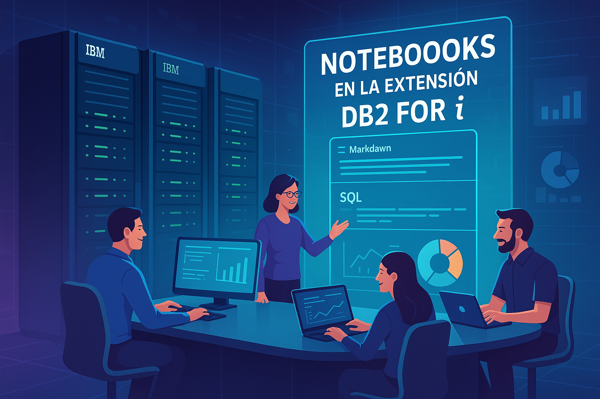
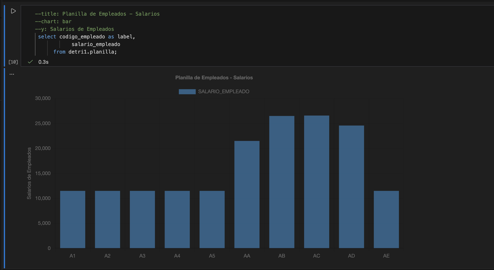

# 📘 De las Pantallas Verdes a los Notebooks:  
## La Evolución del Desarrollo en IBM i con VS Code y la Extensión Db2 for i

Durante muchos años, el día a día de quienes desarrollamos y administramos sistemas en IBM i comenzó siempre igual: **un logon en una pantalla verde, un menú con opciones numeradas, F4 para ayuda, F9 para repetir, F3 para salir**. 

Programábamos en editores **SEU o RDi**, corríamos comandos CL uno por uno, copiábamos consultas SQL en ventanas separadas y exportar resultados era un proceso manual, casi artesanal. Era un trabajo que requería paciencia y atención al detalle, pero también implicaba muchos pasos intermedios y cambios de contexto y la experiencia de usuario dejaba mucho que desear, ya que no existían interfaces gráficas ni herramientas integradas.

Esa etapa formó disciplina, precisión y una forma estructurada de trabajar, pero también significaba que **muchas tareas eran más complejas de lo que debían ser**.

Hoy, ese mundo está cambiando y muy rápido. Como desarrolladores y administradores de IBM i, estamos adoptando nuevas herramientas y metodologías que nos permiten ser más productivos y eficientes, y mejorar la experiencia de usuario en nuestro trabajo diario.

La modernización de IBM i ya no se trata solamente del RPG Full Free, APIs REST, SQL moderno o DevOps. Ahora, también hablamos de **entornos de desarrollo visuales, colaborativos y pensados para la productividad**, donde la documentación, el código y los resultados conviven en un mismo espacio.

Y en ese salto evolutivo, **VS Code** y la extensión **Db2 for i** están marcando una diferencia enorme.

<figure>

<figcaption>Fig 1. Notebooks en la extensión DB2 for i.</figcaption>
</figure>

# 🚀 La Revolución de los Notebooks en VS Code

Los **notebooks**, muy comunes en entornos como Python, Jupyter, Databricks o Google Colab, combinan tres elementos poderosos:

- **Markdown** para explicar y documentar, los cuales permiten crear textos enriquecidos con formato, imágenes y enlaces, con el fin de facilitar la comprensión y el seguimiento de los procesos realizados.
- **Código ejecutable** para realizar procesos de análisis de datos, consultas SQL, comandos CL u otros tipos de código, directamente desde el notebook, sin necesidad de cambiar de herramienta o ventana. Con esto, se logra una mayor integración entre la documentación y el código, lo que facilita la reproducción y validación de los resultados.  
- **Resultados visuales** (tablas, gráficos, logs u objetos interactivos) para mostrar los resultados de las ejecuciones de código de forma clara y atractiva, facilitando el análisis y la interpretación de los datos. Los resultados pueden incluir tablas con datos, gráficos estadísticos, logs de ejecución u otros objetos interactivos que enriquecen la experiencia del usuario.

**VS Code** adoptó este concepto y creó un estándar para que cualquier extensión pueda implementar su propio tipo de notebook. Esto abrió la puerta para que la comunidad de IBM i introdujera un nuevo formato que transforma cómo trabajamos: los **i Notebooks**. Con ellos, podemos combinar documentación, código y resultados en un solo archivo, lo que facilita la colaboración, el aprendizaje y la productividad en nuestro trabajo diario con IBM i.

📄 Documentación oficial del framework de notebooks:
<p>
    <a href="https://code.visualstudio.com/blogs/2021/11/08/custom-notebooks" target="_blank">Custom Notebooks in VS Code</a>.
</p>
  


# 🟦 Notebooks en Db2 for i: un cambio profundo en cómo trabajamos

La extensión **Db2 for i** (parte del ecosistema *Code for IBM i*) ahora permite crear notebooks que combinan:

- Celdas **Markdown** para documentar procesos, permitiendo escribir notas, conclusiones y objetivos junto al código que las respalda. Esto facilita la comprensión y el seguimiento de los procesos realizados.
- Celdas **SQL** para ejecutar consultas directamente en IBM i, lo que permite ejecutar consultas en la misma vista, sin necesidad de cambiar de ventana o herramienta. Esto mejora la integración entre la documentación y el código, facilitando la reproducción y validación de los resultados.
- Celdas **CL** para correr comandos del sistema. Esto permite ejecutar comandos CL directamente desde el notebook, integrando la administración del sistema con la documentación y el análisis de datos.
- Resultados en tabla, JSON o CSV. Esto permite mostrar los resultados de las ejecuciones de código en diferentes formatos, facilitando el análisis y la interpretación de los datos. Permitiendo mostrar los resultados en entornos tabulares, JSON o CSV, según las necesidades del usuario.
- Y lo más revolucionario: **¡gráficos generados directamente desde SQL!** Lo cual significa que las consultas SQL ahora pueden convertirse en **mini dashboards** dentro del mismo VS Code, generando gráficos de barras, líneas, pie, doughnut, radar y polar area con una simple regla: tener una columna “LABEL” y valores numéricos.

Esto convierte a un simple archivo en un **documento vivo**, donde:

- Documentas lo que haces, logrando una mayor integración entre la documentación y el código.
- Explicas por qué lo haces, facilitando la comprensión y el seguimiento de los procesos realizados.
- Ejecutas el código, sin necesidad de cambiar de ventana o herramienta.
- Visualizas el resultado, mostrando los resultados en diferentes formatos y gráficos atractivos.
- Compartes el notebook con tu equipo, facilitando la colaboración y el aprendizaje entre los miembros del equipo.
- Lo incluyes en Git con todo su histórico, permitiendo versionar los notebooks como cualquier otro código, facilitando el control de cambios y la colaboración en equipo.

📘 Documentación oficial de Db2 for i para notebooks y charting:
<p>
    <a href="https://codefori.github.io/docs/extensions/db2i/#charting-with-sql" target="_blank">Db2 for i - Charting with SQL</a>.
</p>


# ✨ ¿Por qué este enfoque es tan poderoso?

Porque combina lo mejor de tres mundos, ofreciendo una experiencia de desarrollo única y eficiente en IBM i:

### **1️⃣ Documentación que se mantiene sola**  
Markdown te permite escribir notas, conclusiones y objetivos junto al código que las respalda. Lo que facilita la comprensión y el seguimiento de los procesos realizados, eliminando la necesidad de mantener documentos separados que pueden quedar desactualizados. Al tener la documentación integrada con el código, se asegura que siempre esté alineada con lo que realmente se está ejecutando, mejorando la calidad y la claridad del trabajo realizado.

### **2️⃣ Código SQL/CL siempre probado**  
Las consultas se ejecutan en la misma vista, sin necesidad de cambiar de ventana o herramienta. Esto mejora la integración entre la documentación y el código, facilitando la reproducción y validación de los resultados. Al tener el código y los resultados en un solo lugar, se reduce la posibilidad de errores y se agiliza el proceso de desarrollo y análisis.

### **3️⃣ Visualización de datos integrada**  
Con una simple regla **tener una columna “LABEL” y valores numéricos** Db2 for i genera gráficos:

- Barras  
- Líneas  
- Pie y Doughnut  
- Radar  
- PolarArea  

Lo cual significa que tus consultas SQL ahora pueden convertirse en **mini dashboards** dentro del mismo VS Code. Permitiendo analizar y presentar datos de manera visual y atractiva, facilitando la interpretación y toma de decisiones basadas en los resultados obtenidos.

### **4️⃣ Colaboración real para equipos IBM i**  
Los notebooks pueden guardarse en GitHub o Azure DevOps y versionarse como cualquier otro código. Esto facilita la colaboración entre los miembros del equipo, permitiendo compartir conocimientos, revisar cambios y mantener un historial completo de las modificaciones realizadas. Al integrar los notebooks en flujos de trabajo DevOps, se mejora la eficiencia y la calidad del desarrollo en IBM i.

### **5️⃣ Capacitación y transferencia de conocimiento**  
Son ideales para explicar procesos de negocio, mostrar consultas a analistas o dar talleres internos. Los notebooks permiten crear materiales de capacitación interactivos y dinámicos, donde los participantes pueden ver la documentación, ejecutar el código y analizar los resultados en un solo lugar. Esto facilita la transferencia de conocimiento y mejora la comprensión de los conceptos y procesos relacionados con IBM i.


# 📊 Ejemplo simple de un Notebook con Gráfico SQL

### 📄 Markdown  
```markdown
## Ventas por Mes
En este análisis visualizamos el comportamiento de ventas por mes utilizando datos de la tabla SALES.
```

### 📈 SQL  
```sql
SELECT 
    MONTHNAME(date) AS LABEL,
    SUM(amount) AS TotalVentas
FROM SALES
GROUP BY MONTH(date), MONTHNAME(date)
ORDER BY MONTH(date);
```

El resultado se convierte automáticamente en un **gráfico de barras** o de **líneas**, dependiendo de lo que selecciones en la interfaz.

Para ver un ejemplo completo, puedes revisar este notebook de muestra que he creado:
<figure>

<figcaption>Fig 2. Gráfico de uso de Notebooks en IBM i.</figcaption>
</figure>

En este notebook, puedes ver que existen algunos tags como comentarios que nos permiten configurar aspectos del gráfico, como el título, las etiquetas de los ejes y el tipo de gráfico (barras, líneas, pie, etc.). Esto nos da un control adicional sobre cómo se presentan los datos visualmente. 

Los tags son:
```sql
-- chart: bar
-- title: Planilla de Empleados - Salarios
-- y: Salario de Empleados
-- hideStatement: true
select codigo_empleado as LABEL, 
       salario 
from detri1.planilla;
```
Donde cada tag tiene un propósito específico para personalizar la visualización del gráfico generado a partir de la consulta SQL:
- `-- chart: bar`  
  Define el tipo de gráfico a generar. En este caso, un gráfico de barras. Otros tipos pueden ser `line`, `pie`, `doughnut`, `polarArea` y `radar`.
- `-- title: Planilla de Empleados - Salarios`  
  Establece el título del gráfico, proporcionando contexto sobre los datos que se están visualizando.
- `-- y: Salario de Empleados`  
  Etiqueta para el eje Y del gráfico, indicando qué representa esa dimensión.
- `-- hideStatement: true`  
  Solo acepta `true`. Si se establece en `true`, la sentencia SQL no se mostrará en el notebook, dejando solo el gráfico visible. Esto es útil para presentaciones o informes donde solo se desea mostrar los resultados visuales.

# 🧠 Un nuevo estilo de trabajo para IBM i

Este tipo de herramientas rompe el paradigma de:

> “En IBM i las cosas se hacen así porque siempre ha sido así.”

Ahora trabajamos con:

- **Entornos visuales**  
- **Análisis de datos integrados**  
- **Interactividad**  
- **Documentación dinámica**  
- **Integración con DevOps**  
- **Productividad impulsada por herramientas modernas**

Para quienes venimos de pantallas verdes, esto significa una modernización profunda de la experiencia del desarrollador. Ya no solo escribimos código. Ahora **escribimos conocimiento**.

Y eso cambia todo, hoy en día podemos establecer un nuevo paradigma en IBM i:
> “En IBM i las cosas se hacen así porque es la forma más eficiente y productiva de trabajar.”


# 🔮 Conclusión  
Los *notebooks* en la extensión Db2 for i representan una evolución natural y necesaria:

- Brindan claridad
- Aumentan productividad
- Facilitan el análisis
- Mejoran la documentación
- Integran SQL, CL y Markdown en un solo flujo
- Modernizan la manera de entender, enseñar y compartir el trabajo en IBM i

Cada notebook es una historia completa:  
**lo que hiciste, cómo lo hiciste, por qué lo hiciste y qué resultado obtuviste.**

Y eso, para quienes amamos este sistema, es un salto histórico comparable a cuando migramos de SEU a RDi, o de RPG fijo a Full Free, **pero esta vez, con gráficos, visualizaciones y toda la potencia de VS Code.**

Si aún no los has probado, te invito a que lo hagas, porque estoy seguro de que cambiarán tu forma de trabajar con IBM i para siempre y te abrirán nuevas posibilidades que antes no imaginabas. Logrando que nuestro querido sistema evolucione junto con nosotros, hacia un futuro más brillante y productivo. 

Recuerda:
> “No se trata solo de modernizar el código, sino de modernizar la forma en que pensamos y trabajamos.”

# 📎 Recursos útiles

- VS Code — Custom Notebooks
  <p>
    <a href="https://code.visualstudio.com/blogs/2021/11/08/custom-notebooks" target="_blank">Custom Notebooks in VS Code</a>.
  </p>

- Extensión Db2 for i — Documentación
  <p>
    <a href="https://codefori.github.io/docs/extensions/db2i/" target="_blank">Db2 for i Documentation</a>.
  </p>

- Charting con SQL en Db2 for i  
  <p>
    <a href="https://codefori.github.io/docs/extensions/db2i/#charting-with-sql" target="_blank">Charting with SQL in Db2 for i</a>.
  </p>