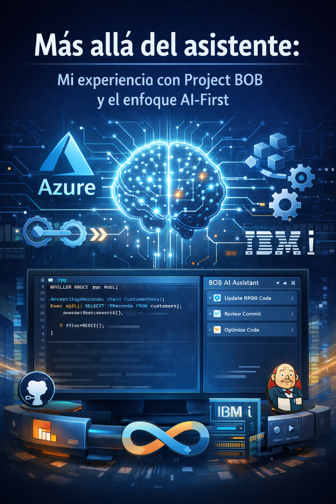
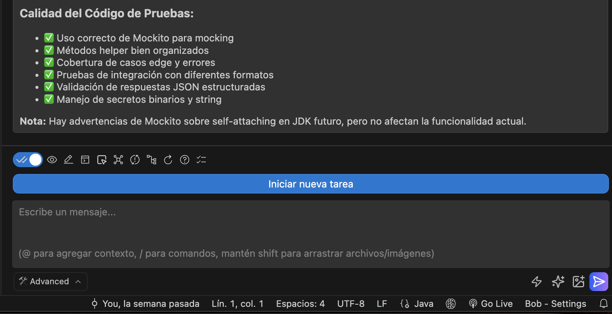
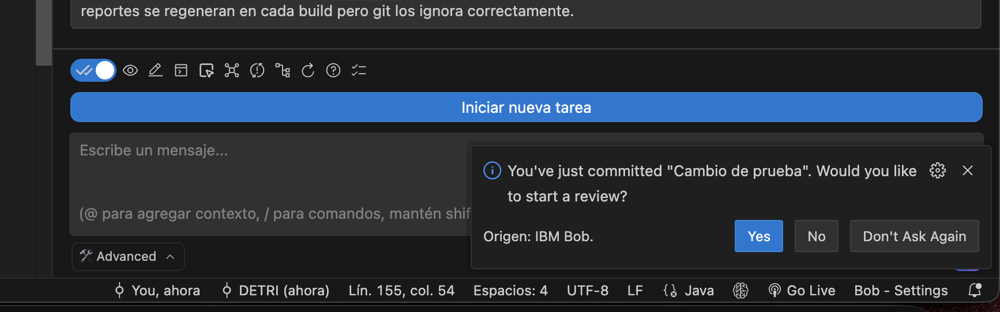
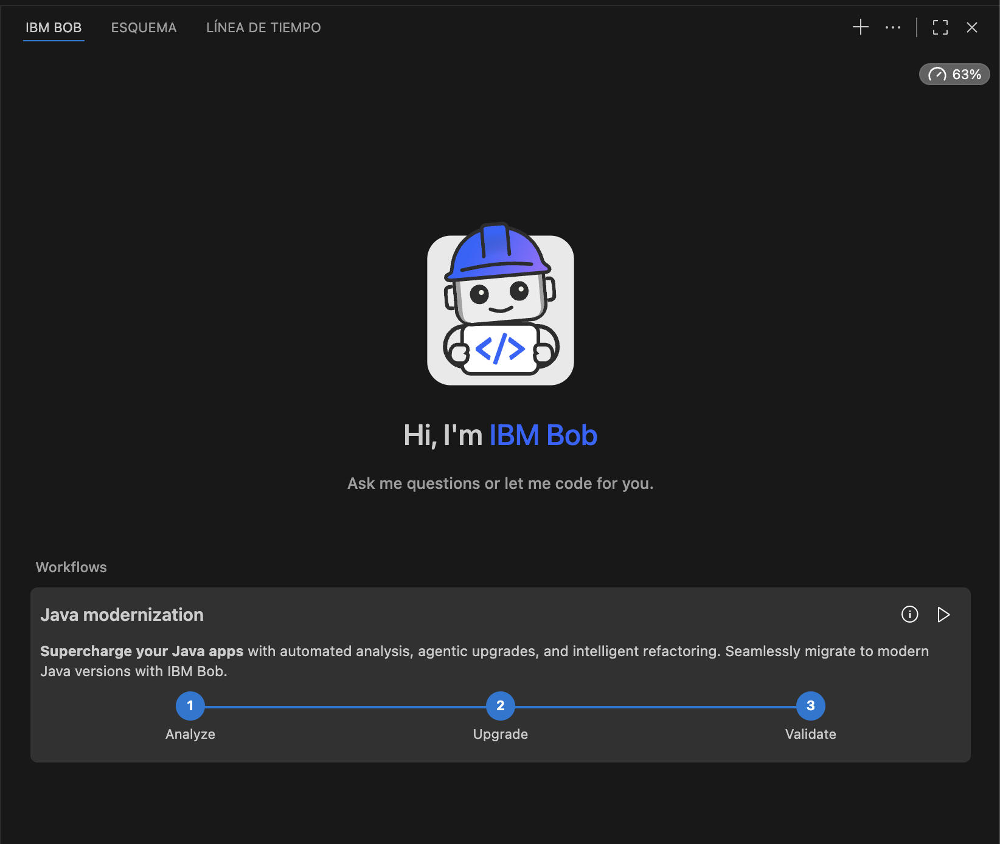

# Beyond the assistant: my experience with Project BOB and the AI-First approach

## Introduction

In recent months I have had the opportunity to evaluate **Project BOB**, not out of curiosity about a new tool, but from the daily reality of two roles that constantly intersect: **Solutions Architect and active developer**.

It was not a lab test or a controlled demo. I decided to use BOB in real-world scenarios:  
- development **from scratch**,  
- **modernization of existing code**,  
- daily work with version control,  
- and **DevOps**-oriented practices.

The question was not whether BOB could "help," but **how deeply it could integrate into the software development life cycle** and whether it truly represented an **AI-First** approach beyond the marketing.

<figure>

<figcaption>Fig 1. Project BOB in action.</figcaption>
</figure>

## My work context

My main focus has been **Java**, developing modern applications and evaluating modernization processes, particularly a migration from **Java 17 to Java 21**. In parallel, I have run tests on **IBM i**, working with **RPG Full Free, SQLRPGLE, and DB2 for i**.

All of this on **Git repositories on GitHub**, trying to maintain a clean and disciplined DevOps flow.

I came in with high expectations. I had seen BOB in action at **IBM TechXchange 2025** and the concept was clear: it was not just another assistant, but something different. The real test was to see how it behaved when the code, the dependencies, and the architectural decisions were real.

## Strength #1 — Real autonomy: working by *tasks*, not by *prompts*

The clearest strength I have identified in Project BOB is its **autonomy to execute complete tasks**. BOB does not limit itself to responding to isolated prompts; it understands a **task** as a functional unit that must be solved from start to finish.

<figure>

<figcaption>Fig 2. Project BOB handling a task.</figcaption>
</figure>

In practice, this means that BOB can:
- analyze the full context of the project,
- run console commands when necessary,
- adjust code,
- update configurations and components,
- and resolve dependencies without turning the flow into a fragmented conversation.

### Real example

While developing a **Java** application that communicated with **AWS** services, I defined clear, concrete tasks. BOB was able to develop those complete processes without creating excessive dependency or forcing me to guide every step.

This is key: **AI does not replace you as an analyst**, but it also doesn't turn you into someone who just "feeds prompts." The focus returns to validation and technical decision-making and, most importantly, to the final result.

## Strength #2 — Commit review: CI from the very first moment

Another point of enormous value is BOB's ability to **review the commits** you make in the project. Every time you commit changes, BOB can:

- analyze what was modified,
- assess the impact of the change,
- detect potential errors,
- and alert you to integration problems.

This approach promotes something fundamental in DevOps: **detecting problems as early as possible**.

In day-to-day work, this naturally encourages the use of **micro-commits**:
- easier to understand,
- easier to revert,
- and much healthier for a continuous integration flow.

Code quality improves not because processes impose it, but because feedback arrives at the right moment.

<figure>

<figcaption>Fig 3. Project BOB handling commits.</figcaption>
</figure>

## Strength #3 — Documentation and action plans, not just observations

BOB doesn't stop at merely pointing out problems. One of its most useful capabilities is **documentation accompanied by strategic improvement plans**.

### Real example

I had a project without a README and I asked BOB to document it. The result was a complete README that included:
- how the project should be managed,
- its structure and layers,
- the overall functionality,
- and recommendations for deployment in production environments.

This kind of documentation is not just there to "tick a box"; it **raises the project's quality standard** and makes maintenance, support, and onboarding easier.

## When I really felt it "works with me"

One of the most revealing moments was when, upon opening a project developed in **Java 17**, BOB automatically identified the context and **proposed modernizing it to Java 21**.

Afterward, it:
- reviewed the **POM** file,
- analyzed dependency versions,
- and began connecting technical decisions without me having to guide it step by step.

<figure>

<figcaption>Fig 4. Project BOB handling modernization.</figcaption>
</figure>

The same thing happened with commits: BOB gave me observations before the code reached a shared branch. This allowed problems to be caught **at the most basic point of development**, when fixing them is cheaper and less risky.

In a traditional flow, you usually have to explicitly ask: "review," "validate," "document." With BOB, that friction is noticeably reduced thanks to its autonomy. It's as if it truly "worked with me" and didn't just respond to my orders.

## AI-First: when AI stops being a tool

From my experience, **AI-First does not simply mean integrating AI into the IDE**. Nor is it just about automating tasks. To me, AI-First means that **AI stops being an additional tool and becomes the center of the project**.

When AI occupies that central role, it:
- orchestrates complete tasks,
- understands the global context,
- participates in every stage of the DevOps flow,
- and forces us to rethink how we work as developers.

I have always held an idea that makes even more sense here:  
**we don't just modernize the code, we also modernize the way we think and work**.

## What changed in the way I develop

Two aspects changed very clearly, which I can attribute directly to using BOB and to the AI-First approach.

The first was **documentation**. I had never documented my projects with this level of depth and consistency. Having an AI that understands the architecture and the intent of the code raises the standard almost without any extra effort.

The second was the **rhythm of commits and reviews**. By reviewing more and earlier:
- code quality improves,
- testing increases,
- the number of bugs is reduced,
- and development becomes more agile, but also more disciplined.

## From the detailed prompt to collaborative work

Before, much of the time went into **explaining context** and detailing prompts. With BOB, that model changes.

I no longer need to describe every step exhaustively. BOB knows the project, understands its state, and responds in a much more accurate way. My role now focuses on:
- reviewing,
- validating,
- and following up.

The time is invested in **thinking**, not in micro-instructing. And that, in my experience, makes a big difference in productivity and quality. The focus remains on decision-making, but with an AI that truly understands the context and acts autonomously to support development.

All of this leads me to reflect on which aspects remain exclusively human, and which can be further enhanced by AI.

## What I would never delegate, even in an AI-First approach

Although the AI-First approach is powerful, there are responsibilities that remain human. In my case, **architecture and deep technical analysis** are not delegated.

Business domain knowledge, long-term maintainability, and functional validation require specialized judgment. AI accelerates, accompanies, and suggests, but **the final responsibility remains human**.

While BOB can propose architectural or technical improvements, the decision to adopt those recommendations always rests with the developer or architect responsible for the project, ensuring that the solutions are solid and aligned with business objectives.

## Opportunities for improvement: taking AI-First to the next level

Despite the obvious strengths, there are areas where BOB and the AI-First approach can evolve even further, especially for complex enterprise environments and large teams. From my experience, I identify three key opportunities:

### Integration with agile boards

A clear improvement would be **direct integration with agile management tools** such as:
- GitHub Projects,
- Azure Boards,
- Jira.

Today, BOB can document stories and tasks, but creating them is still manual. Integrating it with the boards would close the cycle between **analysis, documentation, and execution**. Automating the creation and updating of tasks based on the analysis of code and commits would allow a smoother flow aligned with agile practices, reducing administrative load and improving the traceability of activities.

### Multi-repo and microservices scenarios

In modern architectures with **multiple repositories**, especially in Java microservices, a key question arises:  
how do you help when the context is distributed?

Exploring how BOB can understand relationships between repositories and cross-cutting impacts would be an important step for real enterprise environments. This would allow BOB to offer more holistic recommendations, considering dependencies between services and making coordination easier in teams working on multiple fronts simultaneously. It remains a challenge to ensure that the AI maintains a coherent view of the complete system when the code is fragmented across several repositories.

### Integrations, governance, and autonomy

The areas with the most room to evolve are:
- integrations,
- governance,
- and autonomy in large teams.

I am currently analyzing practices for **responsible adoption**, such as mandatory code reviews and clear controls over the use of AI. These improvements would make AI-First truly materialize across all processes. For example, establishing policies that define when and how BOB can be used in different stages of development, as well as audit mechanisms to ensure the quality and security of code generated or modified by the AI. In addition, fostering team autonomy to adapt the use of BOB to their specific needs, without losing control over the project's critical decisions. This is especially relevant in large organizations where coordination and governance are essential to success.

## Conclusion

Project BOB shows that **AI-First does not replace the developer or the architect**, but it does redefine their role.

When AI understands the context, orchestrates complete tasks, and accompanies the DevOps flow, development becomes **more agile, more disciplined, and of higher quality**.

The challenge is not only technical but cultural: learning to work with an AI that is no longer just another assistant, but a **central copilot of the process**, without losing the human judgment that guarantees solid and maintainable solutions.

That is where, from my experience, **AI-First truly makes sense**, and where I see the future of software development in the coming years. As these tools evolve, the collaboration between humans and AI will be the key to reaching new levels of productivity and quality in software development. It is up to us to take advantage of this potential without losing sight of what makes us unique as software professionals. Because at the end of the day, technology is only a means to enhance our creativity and our ability to solve complex problems. And in that sense, Project BOB is a significant step toward that collaborative future. 

In the end, as I always say:
> "It's not just about modernizing the code, but about modernizing the way we think and work."
