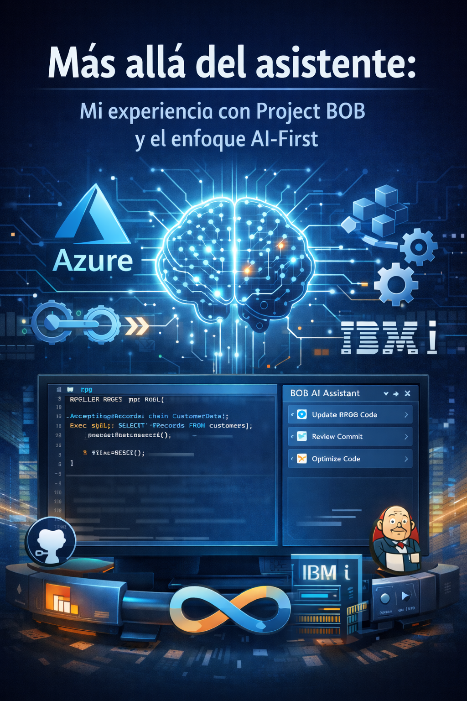
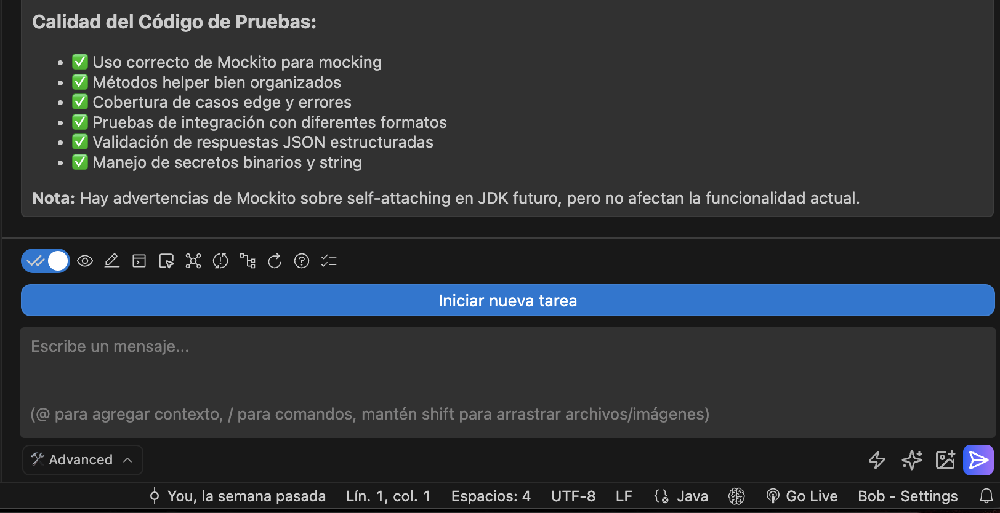
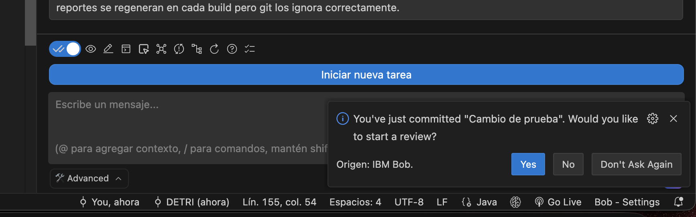
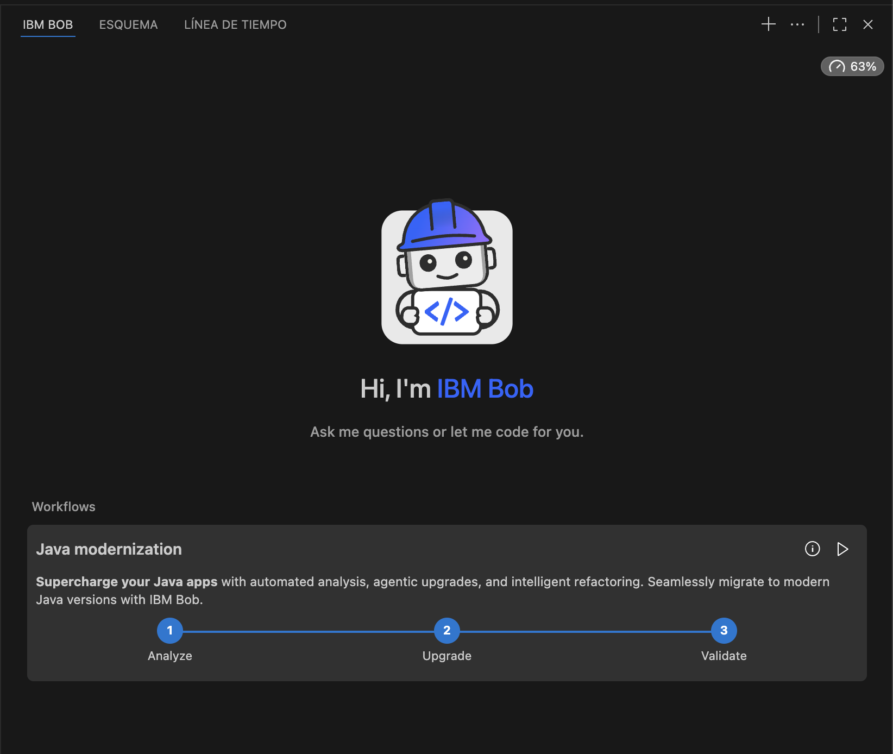

# Más allá del asistente: mi experiencia con Project BOB y el enfoque AI-First

## Introducción

En los últimos meses he tenido la oportunidad de evaluar **Project BOB** no desde la curiosidad por una nueva herramienta, sino desde la realidad diaria de dos roles que constantemente se cruzan: **Arquitecto de Soluciones y desarrollador activo**.

No fue una prueba de laboratorio ni una demo controlada. Decidí usar BOB en escenarios reales:  
- desarrollo **desde cero**,  
- **modernización de código existente**,  
- trabajo diario con control de versiones,  
- y prácticas orientadas a **DevOps**.

La pregunta no era si BOB podía “ayudar”, sino **qué tan profundo podía integrarse en el ciclo de vida del desarrollo** y si realmente representaba un enfoque **AI-First** más allá del marketing.

<figure>

<figcaption>Fig 1. Project BOB en acción.</figcaption>
</figure>

## Mi contexto de trabajo

Mi foco principal ha sido **Java**, desarrollando aplicaciones modernas y evaluando procesos de modernización, particularmente una migración de **Java 17 a Java 21**. Paralelamente, he realizado pruebas en **IBM i**, trabajando con **RPG Full Free, SQLRPGLE y DB2 for i**.

Todo esto sobre repositorios **Git en GitHub**, intentando mantener un flujo DevOps limpio y disciplinado.

Llegué con expectativas altas. Había visto a BOB en acción en **IBM TechXchange 2025** y el concepto era claro: no se trataba de otro asistente más, sino de algo distinto. La prueba real era ver cómo se comportaba cuando el código, las dependencias y las decisiones arquitectónicas eran reales.

## Fortaleza #1 — Autonomía real: trabajar por *tasks*, no por *prompts*

La fortaleza más clara que he identificado en Project BOB es su **autonomía para ejecutar tareas completas**. BOB no se limita a responder prompts aislados; entiende una **task** como una unidad funcional que debe resolverse de principio a fin.

<figure>

<figcaption>Fig 2. Project BOB manejo de Task.</figcaption>
</figure>

En la práctica, esto se traduce en que BOB puede:
- analizar el contexto completo del proyecto,
- ejecutar comandos en consola cuando es necesario,
- ajustar código,
- actualizar configuraciones y componentes,
- y resolver dependencias sin convertir el flujo en una conversación fragmentada.

### Ejemplo real

Mientras desarrollaba una aplicación en **Java** que se comunicaba con servicios de **AWS**, definí tareas claras y concretas. BOB fue capaz de desarrollar esos procesos completos sin generar una dependencia excesiva ni obligarme a guiar cada paso.

Esto es clave: **la IA no te reemplaza como analista**, pero tampoco te convierte en alguien que solo “alimenta prompts”. El foco vuelve a estar en la validación y la decisión técnica y lo más importante, en el resultado final.

## Fortaleza #2 — Revisión del commit: CI desde el primer momento

Otro punto de enorme valor es la capacidad de BOB para **revisar los commits** que realizas en el proyecto. Cada vez que confirmas cambios, BOB puede:

- analizar qué se modificó,
- evaluar el impacto del cambio,
- detectar posibles errores,
- y alertar sobre problemas de integración.

Este enfoque promueve algo fundamental en DevOps: **detectar problemas lo más temprano posible**.

En el día a día, esto fomenta naturalmente el uso de **micro-commits**:
- más fáciles de entender,
- más fáciles de revertir,
- y mucho más saludables para un flujo de integración continua.

La calidad del código mejora no por imposición de procesos, sino porque el feedback llega en el momento correcto.

<figure>

<figcaption>Fig 3. Project BOB manejo de Commits.</figcaption>
</figure>

## Fortaleza #3 — Documentación y planes de acción, no solo observaciones

BOB no se queda únicamente en señalar problemas. Una de sus capacidades más útiles es la **documentación acompañada de planes estratégicos de mejora**.

### Ejemplo real

Tenía un proyecto sin README y le pedí a BOB que lo documentara. El resultado fue un README completo que incluía:
- cómo se debe manejar el proyecto,
- su estructura y capas,
- la funcionalidad general,
- y recomendaciones para despliegue en ambientes productivos.

Este tipo de documentación no solo sirve para “cumplir”, sino que **eleva el estándar de calidad del proyecto** y facilita mantenimiento, soporte y onboarding.

## Cuando realmente sentí que “trabaja conmigo”

Uno de los momentos más reveladores fue cuando, al abrir un proyecto desarrollado en **Java 17**, BOB identificó automáticamente el contexto y **propuso modernizarlo a Java 21**.

Posteriormente:
- revisó el archivo **POM**,
- analizó versiones de dependencias,
- y comenzó a conectar decisiones técnicas sin que yo tuviera que guiarlo paso a paso.

<figure>

<figcaption>Fig 4. Project BOB manejo de Modernización.</figcaption>
</figure>

Lo mismo ocurrió con los commits: BOB me fue dando observaciones antes de que el código llegara a un branch compartido. Esto permitió capturar problemas **en el punto más básico del desarrollo**, cuando solucionarlos es más barato y menos riesgoso.

En un flujo tradicional, normalmente hay que pedir explícitamente: “revisa”, “valida”, “documenta”. Con BOB, esa fricción disminuye notablemente gracias a su autonomía. Es como si realmente “trabajara conmigo” y no solo respondiera a mis órdenes.

## AI-First: cuando la IA deja de ser una herramienta

Desde mi experiencia, **AI-First no significa simplemente integrar IA en el IDE**. Tampoco se trata solo de automatizar tareas. Para mí, AI-First implica que **la IA deja de ser una herramienta adicional y pasa a convertirse en el centro del proyecto**.

Cuando la IA ocupa ese rol central:
- orquesta tareas completas,
- entiende el contexto global,
- participa en todas las etapas del flujo DevOps,
- y obliga a replantear cómo trabajamos como desarrolladores.

Siempre he sostenido una idea que aquí cobra aún más sentido:  
**no solo modernizamos el código, también modernizamos la forma en la que pensamos y trabajamos**.

## Qué cambió en mi forma de desarrollar

Dos aspectos cambiaron de forma muy clara, que puedo atribuir directamente al uso de BOB y al enfoque AI-First.

El primero fue la **documentación**. Nunca había documentado mis proyectos con este nivel de profundidad y consistencia. Tener una IA que entiende la arquitectura y la intención del código eleva el estándar casi sin esfuerzo adicional.

El segundo fue el **ritmo de commits y revisiones**. Al revisar más y antes:
- mejora la calidad del código,
- se incrementan las pruebas,
- se reduce la cantidad de bugs,
- y el desarrollo se vuelve más ágil, pero también más disciplinado.

## Del prompt detallado al trabajo colaborativo

Antes, gran parte del tiempo se iba en **explicar contexto** y detallar prompts. Con BOB, ese modelo cambia.

Ya no necesito describir exhaustivamente cada paso. BOB conoce el proyecto, entiende su estado y responde de forma mucho más atinada. Mi rol se centra ahora en:
- revisar,
- validar,
- y dar seguimiento.

El tiempo se invierte en **pensar**, no en micro-instruir. Y eso, en mi experiencia, marca una gran diferencia en productividad y calidad. El foco sigue estando en la toma de decisiones, pero con una IA que realmente entiende el contexto y actúa de forma autónoma para apoyar el desarrollo.

Todo esto me lleva a reflexionar sobre qué aspectos siguen siendo exclusivamente humanos, y cuáles pueden ser potenciados aún más por la IA.

## Lo que nunca delegaría, incluso en un enfoque AI-First

Aunque el enfoque AI-First es potente, hay responsabilidades que siguen siendo humanas. En mi caso, **la arquitectura y el análisis técnico profundo** no se delegan.

El dominio del negocio, la mantenibilidad a largo plazo y la validación funcional requieren criterio especializado. La IA acelera, acompaña y sugiere, pero **la responsabilidad final sigue siendo humana**.

Si bien BOB puede proponer mejoras arquitectónicas o técnicas, la decisión de adoptar esas recomendaciones siempre recae en el desarrollador o arquitecto responsable del proyecto, asegurando que las soluciones sean sólidas y alineadas con los objetivos del negocio.

## Oportunidades de mejora: llevando AI-First al siguiente nivel

Pese a las fortalezas evidentes, hay áreas donde BOB y el enfoque AI-First pueden evolucionar aún más, especialmente para entornos empresariales complejos y equipos grandes. Desde mi experiencia, identifico tres oportunidades clave:

### Integración con Boards ágiles

Una mejora clara sería la **integración directa con herramientas de gestión ágil** como:
- GitHub Projects,
- Azure Boards,
- Jira.

Hoy, BOB puede documentar historias y tareas, pero la creación de estas sigue siendo manual. Integrarlo con las pizarras cerraría el ciclo entre **análisis, documentación y ejecución**. Automatizar la creación y actualización de tareas basadas en el análisis de código y commits permitiría un flujo más fluido y alineado con las prácticas ágiles, reduciendo la carga administrativa y mejorando la trazabilidad de las actividades.

### Escenarios multi-repo y microservicios

En arquitecturas modernas con **múltiples repositorios**, especialmente en microservicios Java, surge una pregunta clave:  
¿cómo ayudar cuando el contexto está distribuido?

Explorar cómo BOB puede entender relaciones entre repositorios e impactos cruzados sería un paso importante para entornos empresariales reales. Esto permitiría a BOB ofrecer recomendaciones más holísticas, considerando dependencias entre servicios y facilitando la coordinación en equipos que trabajan en múltiples frentes simultáneamente. Sigue siendo un desafío garantizar que la IA mantenga una visión coherente del sistema completo cuando el código está fragmentado en varios repositorios.

### Integraciones, gobernanza y autonomía

Las áreas con mayor espacio de evolución son:
- integraciones,
- gobernanza,
- y autonomía en equipos grandes.

Actualmente analizo prácticas para una **adopción responsable**, como revisiones de código obligatorias y controles claros sobre el uso de la IA. Estas mejoras harían que AI-First se materialice realmente en todos los procesos. Por ejemplo, establecer políticas que definan cuándo y cómo se puede utilizar BOB en diferentes etapas del desarrollo, así como mecanismos de auditoría para asegurar la calidad y seguridad del código generado o modificado por la IA. Además, fomentar la autonomía de los equipos para adaptar el uso de BOB según sus necesidades específicas, sin perder el control sobre las decisiones críticas del proyecto. Esto es especialmente relevante en organizaciones grandes donde la coordinación y la gobernanza son esenciales para el éxito.

## Conclusión

Project BOB demuestra que **AI-First no reemplaza al desarrollador ni al arquitecto**, pero sí redefine su rol.

Cuando la IA entiende el contexto, orquesta tareas completas y acompaña el flujo DevOps, el desarrollo se vuelve **más ágil, más disciplinado y de mayor calidad**.

El reto no es solo técnico, sino cultural: aprender a trabajar con una IA que ya no es un asistente más, sino un **copiloto central del proceso**, sin perder el criterio humano que garantiza soluciones sólidas y mantenibles.

Ahí es donde, desde mi experiencia, **AI-First realmente cobra sentido**, y donde veo el futuro del desarrollo de software en los próximos años. A medida que estas herramientas evolucionen, la colaboración entre humanos e IA será la clave para alcanzar nuevos niveles de productividad y calidad en el desarrollo de software. De nosotros depende aprovechar este potencial sin perder de vista lo que nos hace únicos como profesionales del software. Porque al final del día, la tecnología es solo un medio para potenciar nuestra creatividad y capacidad de resolver problemas complejos. Y en ese sentido, Project BOB es un paso significativo hacia ese futuro colaborativo. 

Al final, como siempre digo:
> “No se trata solo de modernizar el código, sino de modernizar la forma en que pensamos y trabajamos.”
