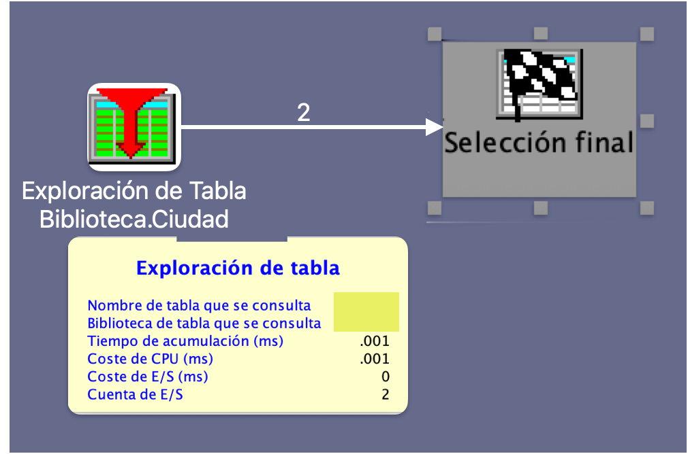
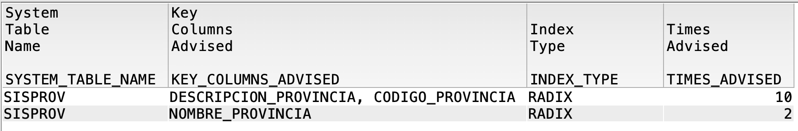

# Understand what your SQL is really doing: Visual Explain and Index Advisor in action

On IBM i, many times an SQL query “works”, but does not necessarily “work well”. That is where two fundamental tools for any developer or DBA come into play: **Visual Explain** and **Index Advisor**. With them you can understand **how** a query is being executed and **what you could do to improve it**.
These tools are essential to optimize the performance of your SQL queries and make sure that your code not only works, but is also efficient.

<figure>

<figcaption>Fig 1. Implementation of Visual Explain and Index Advisor.</figcaption>
</figure>

## Why is it important to understand the execution plan?
Understanding the execution plan of an SQL query is crucial because:
- **Bottleneck identification**: You can detect parts of the query that are inefficient and could slow down performance.
- **Resource optimization**: It helps you use system resources more efficiently, which can reduce operational costs.
- **Improved user experience**: An optimized SQL can reduce response times, improving the end-user experience.
- **Prevention of future problems**: By understanding how a query is executed, you can avoid performance problems before they occur.
- **Easier maintenance**: A well-optimized and documented SQL is easier to maintain and update in the future.
- **Improved scalability**: An efficient SQL can handle larger data volumes without degrading performance, which is crucial as databases grow.
- **Increased reliability**: An optimized SQL reduces the risk of errors and failures during execution, which increases the reliability of the system.
- **Easier collaboration**: A clear and well-structured SQL is easier for other developers to understand, which facilitates collaboration on joint projects.
- **Improved security**: An optimized SQL can help prevent security vulnerabilities, such as SQL injections, by properly validating and sanitizing input data.
- **Increased customer satisfaction**: An efficient SQL can improve customer satisfaction by providing faster and more accurate results, which is crucial in production environments.


## What is Visual Explain?

Visual Explain is a graphical tool available in IBM i Access Client Solutions (ACS) that lets you view the **execution plan** of an SQL query.
It helps you understand how a query is executed and what steps the database engine follows to obtain the results.

- It identifies bottlenecks (e.g. table scan).
- It compares execution approaches.
- It evaluates index usage.

**Example:**

```sql
SELECT * FROM CLIENTES WHERE CIUDAD = 'SAN JOSÉ';
```

<figure>

<figcaption>Fig 1. Visual Explain showing a Table Scan.</figcaption>
</figure>


## What is the Index Advisor?

The Index Advisor analyzes how queries are executed and suggests indexes that could improve performance.
- It helps you identify indexes that could be useful.
- It provides information about the usage of existing indexes.
- It suggests indexes based on the real usage of the queries.

```sql
SELECT SYSTEM_TABLE_NAME, KEY_COLUMNS_ADVISED, INDEX_TYPE, TIMES_ADVISED
FROM QSYS2.SYSIXADV
WHERE SYSTEM_TABLE_NAME = 'SISPROV';
```

<figure>

<figcaption>Fig 1. Index Advisor showing index suggestions.</figcaption>
</figure>


## Applying the Index Advisor suggestion

We create the suggested index:

```sql
CREATE INDEX IX_SISPROV_NOMBRE ON SISPROV (NOMBRE_PROVINCIA);
```

We run the query again and compare the execution plan:

```sql
SELECT * FROM CLIENTES WHERE CIUDAD = 'SAN JOSÉ';
```

<figure>

<figcaption>Fig 1. Visual Explain showing an optimized index.</figcaption>
</figure>

## Comparing results

- **Before**: Table Scan, high CPU cost.
- **After**: Index usage, low CPU cost.
- **Improvement**: Reduction of response time and resource usage.
- **Recommendation**: Review the execution plan after each change.
- **Validation**: Use Visual Explain to validate the impact of the changes.
- **Documentation**: Keep a record of the changes made and their impact on performance.


## Tips for developers

- Review the Index Advisor regularly.
- Do not create all the suggested indexes without analyzing:
  - Disk space
  - Maintenance
  - Impact on inserts/updates
- Validate with Visual Explain before implementing in production.
- Use Visual Explain to understand the impact of indexes on performance.
- Keep a record of the created indexes and their usage.
- Periodically review index usage and adjust as necessary.
- Consider using composite indexes for complex queries.
- Maintain a balance between the number of indexes and the overall performance of the system.
- Use monitoring tools to evaluate query performance in real time.

## Conclusion

**Visual Explain** and **Index Advisor** are your allies in SQL optimization on IBM i. Do not ignore them. Using them correctly makes the difference between code that just works and code that really performs.
Take the time to understand how your queries are executed and you will see significant improvements in the performance of your system, which translates into a better experience for end users and a more efficient use of system resources. In short, investing time in optimizing your SQL queries is a smart decision that will benefit both you and your organization.
