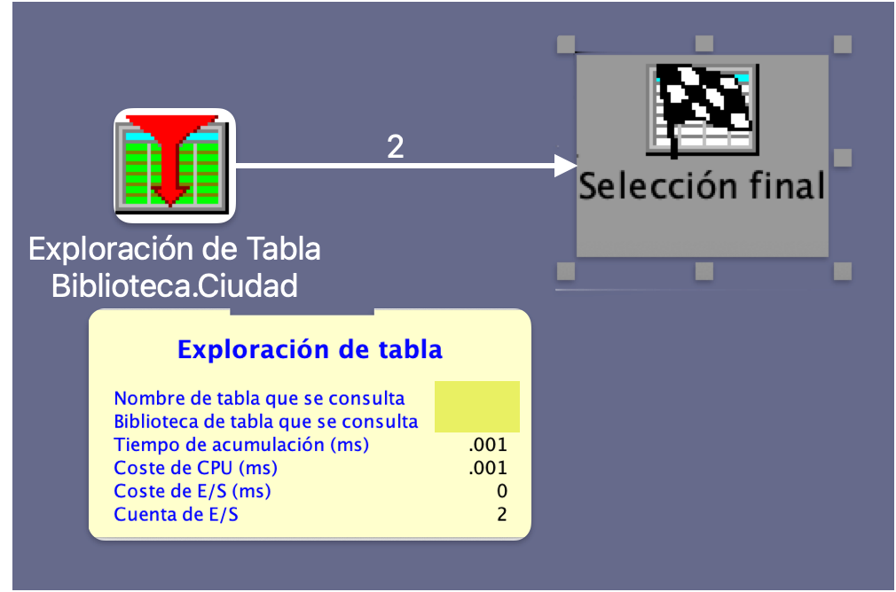
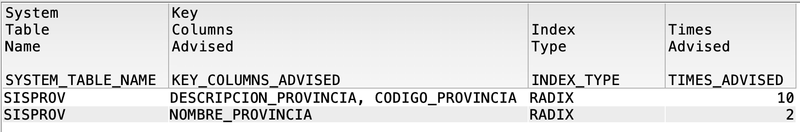

# Entiende lo que tu SQL realmente está haciendo: Visual Explain e Index Advisor en acción

En IBM i, muchas veces una consulta SQL “funciona”, pero no necesariamente “funciona bien”. Ahí es donde entran en juego dos herramientas fundamentales para cualquier desarrollador o DBA: **Visual Explain** e **Index Advisor**. Con ellas puedes entender **cómo** se está ejecutando una consulta y **qué podrías hacer para mejorarla**.
Estas herramientas son esenciales para optimizar el rendimiento de tus consultas SQL y asegurarte de que tu código no solo funcione, sino que también sea eficiente.

<figure>

<figcaption>Fig 1. Implementación de Visual Explain e Index Advisor.</figcaption>
</figure>

## ¿Por qué es importante entender el plan de ejecución?
Entender el plan de ejecución de una consulta SQL es crucial porque:
- **Identificación de cuellos de botella**: Puedes detectar partes de la consulta que son ineficientes y que podrían ralentizar el rendimiento.
- **Optimización de recursos**: Te ayuda a utilizar los recursos del sistema de manera más eficiente, lo que puede reducir costos operativos.
- **Mejora de la experiencia del usuario**: Un SQL optimizado puede reducir los tiempos de respuesta, mejorando la experiencia del usuario final.
- **Prevención de problemas futuros**: Al entender cómo se ejecuta una consulta, puedes evitar problemas de rendimiento antes de que ocurran.
- **Facilitación del mantenimiento**: Un SQL bien optimizado y documentado es más fácil de mantener y actualizar en el futuro.
- **Mejora de la escalabilidad**: Un SQL eficiente puede manejar volúmenes de datos más grandes sin degradar el rendimiento, lo que es crucial a medida que las bases de datos crecen.
- **Aumento de la confiabilidad**: Un SQL optimizado reduce el riesgo de errores y fallos en la ejecución, lo que aumenta la confiabilidad del sistema.
- **Facilitación de la colaboración**: Un SQL claro y bien estructurado es más fácil de entender para otros desarrolladores, lo que facilita la colaboración en proyectos conjuntos.
- **Mejora de la seguridad**: Un SQL optimizado puede ayudar a prevenir vulnerabilidades de seguridad, como inyecciones SQL, al validar y sanitizar adecuadamente los datos de entrada.
- **Aumento de la satisfacción del cliente**: Un SQL eficiente puede mejorar la satisfacción del cliente al proporcionar resultados más rápidos y precisos, lo que es crucial en entornos de producción.


## ¿Qué es Visual Explain?

Visual Explain es una herramienta gráfica disponible en IBM i Access Client Solutions (ACS) que permite ver el **plan de ejecución** de una consulta SQL.
Te ayuda a entender cómo se ejecuta una consulta y qué pasos sigue el motor de base de datos para obtener los resultados.

- Identifica cuellos de botella (ej. table scan).
- Compara enfoques de ejecución.
- Evalúa el uso de índices.

**Ejemplo:**

```sql
SELECT * FROM CLIENTES WHERE CIUDAD = 'SAN JOSÉ';
```

<figure>

<figcaption>Fig 1. Visual Explain mostrando un Table Scan.</figcaption>
</figure>


## ¿Qué es el Index Advisor?

El Index Advisor analiza cómo se ejecutan las consultas y sugiere índices que podrían mejorar el rendimiento.
- Te ayuda a identificar índices que podrían ser útiles.
- Proporciona información sobre el uso de índices existentes.
- Te sugiere índices basados en el uso real de las consultas.

```sql
SELECT SYSTEM_TABLE_NAME, KEY_COLUMNS_ADVISED, INDEX_TYPE, TIMES_ADVISED
FROM QSYS2.SYSIXADV
WHERE SYSTEM_TABLE_NAME = 'SISPROV';
```

<figure>

<figcaption>Fig 1. Index Advisor mostrando sugerencias de índices.</figcaption>
</figure>


## Aplicando la sugerencia del Index Advisor

Creamos el índice sugerido:

```sql
CREATE INDEX IX_SISPROV_NOMBRE ON SISPROV (NOMBRE_PROVINCIA);
```

Volvemos a ejecutar la consulta y comparamos el plan de ejecución:

```sql
SELECT * FROM CLIENTES WHERE CIUDAD = 'SAN JOSÉ';
```

<figure>

<figcaption>Fig 1. Visual Explain mostrando un índice optimizado.</figcaption>
</figure>

## Comparando resultados

- **Antes**: Table Scan, alto costo de CPU.
- **Después**: Uso de índice, bajo costo de CPU.
- **Mejora**: Reducción del tiempo de respuesta y uso de recursos.
- **Recomendación**: Revisa el plan de ejecución después de cada cambio.
- **Validación**: Usa Visual Explain para validar el impacto de los cambios.
- **Documentación**: Mantén un registro de los cambios realizados y su impacto en el rendimiento.


## Tips para desarrolladores

- Revisa el Index Advisor regularmente.
- No crees todos los índices sugeridos sin analizar:
  - Espacio en disco
  - Mantenimiento
  - Impacto en inserts/updates
- Valida con Visual Explain antes de implementar en producción.
- Usa Visual Explain para entender el impacto de los índices en el rendimiento.
- Mantén un registro de los índices creados y su uso.
- Revisa periódicamente el uso de índices y ajusta según sea necesario.
- Considera el uso de índices compuestos para consultas complejas.
- Mantén un equilibrio entre el número de índices y el rendimiento general del sistema.
- Usa herramientas de monitoreo para evaluar el rendimiento de las consultas en tiempo real.

## Conclusión

**Visual Explain** e **Index Advisor** son tus aliados en la optimización de SQL en IBM i. No los ignores. Usarlos correctamente marca la diferencia entre código que solo funciona y código que realmente rinde.
Dedica tiempo a entender cómo se ejecutan tus consultas y verás mejoras significativas en el rendimiento de tu sistema, lo que se traduce en una mejor experiencia para los usuarios finales y un uso más eficiente de los recursos del sistema. En resumen, invertir tiempo en optimizar tus consultas SQL es una decisión inteligente que beneficiará tanto a ti como a tu organización.
