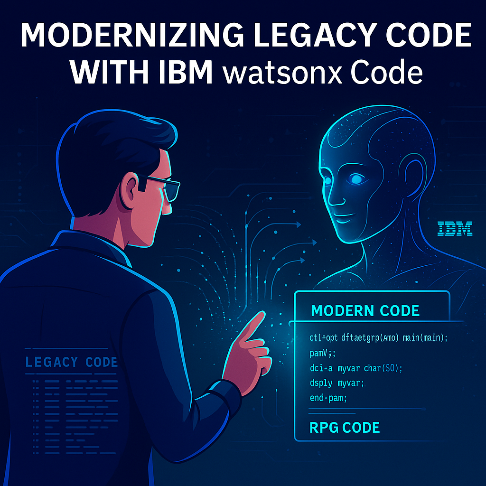
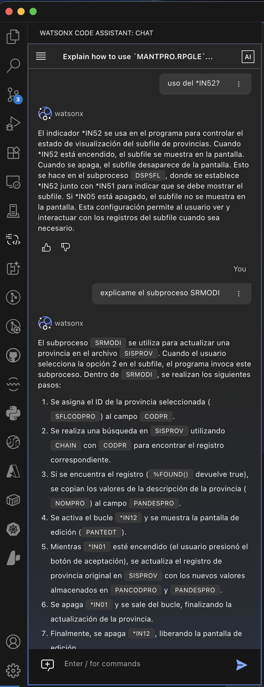
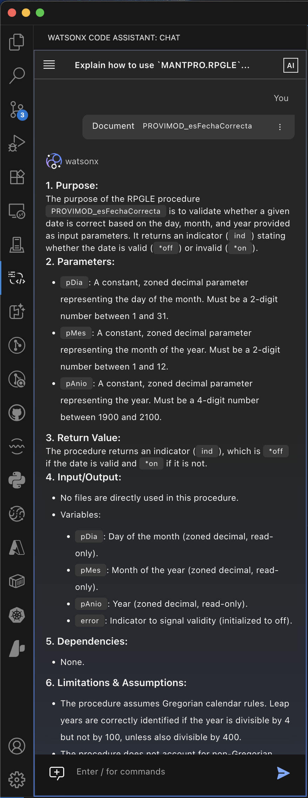

# Watsonx Code Assistant for i: The AI that understands the soul of RPG code

After almost a month testing **Watsonx Code Assistant for i** (WCA for i) as part of the pilot group, I can say it with confidence: this tool does not just autocomplete code, **it truly understands what we IBM i developers do**. And that, believe me, **is no small thing**. In this article, I share my first impressions, from the perspective of someone who has lived among columnar sources, RPG III sheets, and the sometimes cryptic logic of indicators. This is not a commercial review, it is a chat between colleagues who know what it means to work with code that has evolved over decades. That is why, here I tell you why I think WCA for i is a great advance for our community and how it can transform the way we work on IBM i, especially in legacy code environments.

In short, WCA for i is a tool that **understands the soul of RPG code** and helps us be more productive and efficient. Here I tell you why I think it is a great advance for our community and how it can transform the way we work on IBM i, especially in legacy code environments.

<figure>

<figcaption>Fig 1. Modernization of RPG code with Watsonx Code Assistant for i.</figcaption>
</figure>

## ✅ What I liked the most

### 🧠 1. It understands you as an IBM i developer  
Watsonx Code Assistant for i **understands our jargon, our technical terms, and our headaches**. It is not just a generic AI, but one that has been trained and fine-tuned to understand us, which reduces the adaptation curve and avoids misunderstandings. This **speeds up the workflow**, because we don't have to "teach it" what we are talking about; instead we interact in a language we already know and that the assistant also recognizes.

#### 🟢 Why is it important?
Many code assistants fall short when faced with specific contexts like IBM i. The fact that WCA for i understands concepts like **DTAARA**, **indicators**, **display files**, or **DDS** file structures allows for more fluid and natural communication with the developer. This **reduces the adaptation curve**, avoids misinterpretations, and **speeds up the workflow**, because we don't have to "teach it" what we are talking about. This is especially valuable in an environment where time is gold and tasks must be completed quickly and accurately, which translates into greater efficiency and productivity. It allows developers to focus on more complex and creative tasks, instead of wasting time explaining basic concepts. Prompting becomes more intuitive and direct, which improves the overall development experience and reduces frustration when interacting with the AI.

#### 🚀 Impact on productivity:
By interacting in a language we already know —and that the assistant also recognizes— friction and downtime spent explaining the obvious are eliminated. This **accelerates both maintenance and development tasks**, especially when working under pressure or with tight deadlines, and it allows developers to focus on more complex and creative tasks, instead of wasting time explaining basic concepts. Prompting becomes more intuitive and direct, which improves the overall development experience and reduces frustration when interacting with the AI. In the end, this translates into **delivering value to the business faster**, which is crucial in a competitive business environment.

<figure>

<figcaption>Fig 1. Watsonx Code Assistant for i in action with RPG indicators.</figcaption>
</figure>

### 📜 2. Understanding of Legacy code  
This is where WCA for i **shines in its own light**. It understands columnar structures, RPG III code, and the general context of programs developed decades ago. It can analyze and understand the logic behind indicators, data structures, and control flows that are common in IBM i applications. It is not just an autocomplete tool, but an assistant that **truly understands the soul of RPG code**, which allows for a deeper and more meaningful interaction with existing code. And this is something you don't see every day in development tools, especially in an environment as specific as IBM i.

#### 🟢 Why is it important?
In IBM i environments, legacy code is still the heart of many critical processes. Understanding it correctly is a challenge even for experienced developers. The fact that WCA for i can **correctly interpret indicators, old structures, non-modularized logic flows, and scarce or nonexistent comments** represents a **great advantage for analysis, migration, or modernization tasks**, since it allows developers to work with confidence and security, knowing that the AI understands the context and the logic behind the code. This not only improves code quality, but also facilitates collaboration between teams and knowledge transfer, which is essential in an environment where talent can be scarce or rotating. In the end, this translates into greater efficiency and effectiveness in the development and maintenance of applications, which is crucial for the long-term success of any project.

#### 🚀 Impact on productivity:
Instead of spending hours —or days— trying to deduce what an indicator does or how an old routine behaves, WCA for i can help you obtain that information in minutes. This frees up valuable time that can be used to design improvements, develop new features, or simply **deliver value to the business faster**. For example, if you need to understand how a specific indicator behaves in a legacy program, WCA for i can analyze the code and provide you with a clear and concise explanation of its function and logic. This not only accelerates the development process, but also reduces the risk of errors and misunderstandings, which is crucial in business environments where precision and reliability are essential. In addition, by facilitating the understanding of legacy code, WCA for i helps developers make more informed decisions about how to modernize or improve existing applications, which can have a significant impact on operational efficiency and customer satisfaction. Beyond simple autocompletion, WCA for i becomes a strategic ally for any developer working with legacy code, enabling greater agility and effectiveness in the development and maintenance of applications.

### 🧾 3. Automated documentation  
Documentation generation in WCA for i is another strong point. It can document procedures, programs, subroutines, among others, with clarity and good structure. This not only improves code readability, but also facilitates collaboration between teams and knowledge transfer. The generated documentation is consistent and follows a standardized format, which helps maintain a high level of quality in the project's documentation. In addition, by automating this process, the manual workload is reduced and human errors are minimized, which results in more accurate and reliable documentation.

<figure>

<figcaption>Fig 1. Watsonx Code Assistant for i in action generating documentation.</figcaption>
</figure>

#### 🟢 Why is it important?
The lack of documentation is one of the biggest problems in legacy systems. Many projects inherit applications without clear descriptions of what each part of the code does. By automating this documentation, WCA for i **reduces the dependence on tacit knowledge** and enables better knowledge transfer between teams and generations of developers. This is especially valuable in environments where talent can be scarce or rotating, since it allows new developers to get up to speed quickly and understand the context and the logic behind the existing code. In addition, good documentation is essential for the long-term maintenance of applications, since it facilitates the identification of problems, the implementation of improvements, and the adaptation to changes in business requirements. In the end, this translates into greater efficiency and effectiveness in the development and maintenance of applications, which is crucial for the long-term success of any project.

#### 🚀 Impact on productivity:
Automating this routine task **reduces the time we spend documenting by hand**, and at the same time **improves code quality by making it more readable and maintainable**. In addition, it allows new developers to integrate into projects more quickly, shortening onboarding time and facilitating support for existing applications. Documenting code effectively is essential for the long-term maintenance and evolution of applications, and WCA for i becomes a key ally in this process, allowing developers to focus on more critical and strategic tasks. For example, if a new developer joins a project and needs to quickly understand how a specific part of the code works, WCA for i can generate clear and concise documentation that explains the logic and purpose of that section of the code. This not only accelerates the integration process, but also improves the quality of the work done, since new developers can start contributing effectively from day one.

## 🔧 Good things, but that can keep improving

### 💡 1. Code suggestions  
The proposals it generates are useful, but there are details that can still be polished. I am sure the model will continue **learning patterns, styles, and conventions specific to the IBM i environment**, adjusting to our best practices over time. This is natural in the development of AI tools, and I am excited to see how WCA for i evolves in this respect. As more developers use it and provide feedback, the tool will become increasingly accurate and adapted to our specific needs. In addition, the ability to customize code suggestions according to the team's or project's preferences is a feature that could further improve the user experience and the effectiveness of the tool.

### 🌐 2. Default language  
Although it understands multiple languages (up to 13), **it tends to respond in English by default**, even if you speak to it in Spanish or another language. You can ask it to answer in the language you prefer and it will, but it would be great if it detected our preferred language from the start and worked with it natively. This would not only improve the user experience, but would also facilitate the adoption of the tool in multilingual teams or in environments where Spanish is the main language. The ability to interact in the user's native language is fundamental for effective communication and to maximize the tool's potential. In addition, this could open opportunities for WCA for i to be used in international markets where Spanish is a predominant language, which would expand its reach and usefulness.

## 🧪 Identified area for improvement

### ⏳ Response speed  
During use at this early stage, **we have identified that the response time when analyzing and processing code can be improved**. While it is understandable given that we are working with a preliminary version of the product, it does represent an important point to consider in development environments where agility is key.

The good news is that **IBM already has visibility into this behavior** and, knowing its track record in enterprise products, we are confident that **we will see significant improvements in the next iterations of the assistant**. 

In short, it is a detail to keep in mind, but also a natural opportunity for adjustment at this testing stage. Response speed is crucial to maintaining an agile and efficient workflow, and I am sure IBM is actively working to optimize this aspect as we move toward more mature versions of the product. This will not only improve the user experience, but will also allow developers to make the most of WCA for i's capabilities without unnecessary interruptions or delays. Response speed is a key factor for the adoption and success of any development tool, and I am excited to see how WCA for i evolves in this respect in the future.

## 🧩 Conclusion  
In this first month of use, **Watsonx Code Assistant for i has seemed like a great step forward to me**. The deep understanding of the IBM i context, the support for legacy code, and the automation of documentation free up time and energy for us to focus on what really matters: **adding value to the business and evolving our applications**.

Of course, there are things to improve. But if this is only a first version, **the potential this tool has to revolutionize development on IBM i is enormous**.

Are you also testing WCA for i? Are you interested in implementing it in your team? I would love to read your impressions.