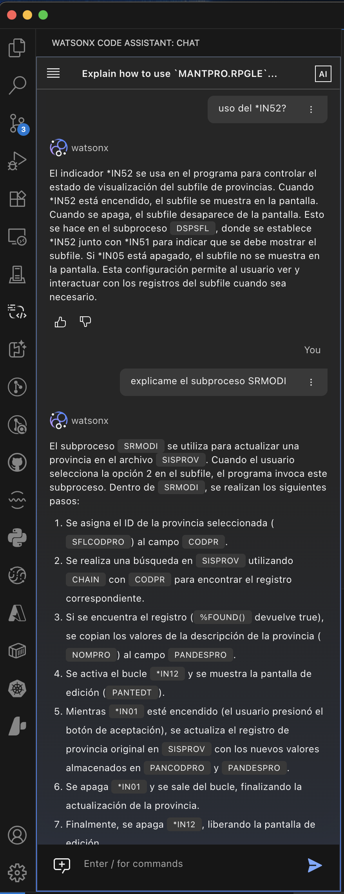
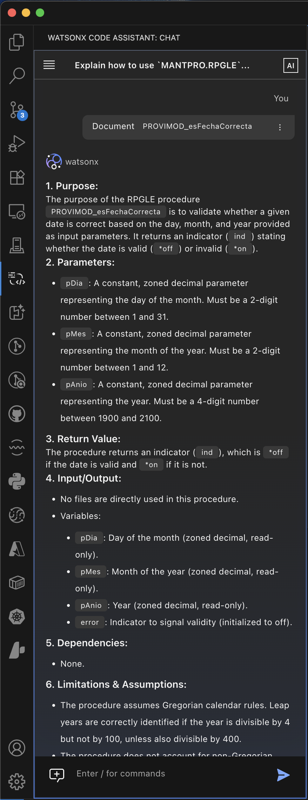

# Watsonx Code Assistant for i: La IA que entiende el alma del código RPG

Después de casi un mes probando **Watsonx Code Assistant for i** (WCA for i) como parte del grupo piloto, puedo decirlo con confianza: esta herramienta no solo autocompleta código, **realmente entiende lo que hacemos los desarrolladores IBM i**. Y eso, créanme, **no es poca cosa**. En este artículo, comparto mis primeras impresiones, desde la mirada de alguien que ha vivido entre fuentes columnar, hojas RPG III y la lógica a veces críptica de los indicadores. Este no es un review comercial, es una charla entre colegas que saben lo que implica trabajar con código que ha evolucionado durante décadas. Por eso, aquí te cuento por qué creo que WCA for i es un gran avance para nuestra comunidad y cómo puede transformar nuestra forma de trabajar en IBM i, especialmente en entornos de código legacy.

En resumen, WCA for i es una herramienta que **entiende el alma del código RPG** y nos ayuda a ser más productivos y eficientes. Aquí te cuento por qué creo que es un gran avance para nuestra comunidad y cómo puede transformar nuestra forma de trabajar en IBM i, especialmente en entornos de código legacy.

<figure>

<figcaption>Fig 1. Modernización del código RPG con Watsonx Code Assistant for i.</figcaption>
</figure>

## ✅ Lo que más me ha gustado

### 🧠 1. Te entiende como desarrollador IBM i  
Watsonx Code Assistant for i **comprende nuestra jerga, nuestros términos técnicos y nuestros dolores de cabeza**. No es solo una IA genérica, sino una que ha sido entrenada y afinada para entendernos, lo que reduce la curva de adaptación y evita malentendidos. Esto **agiliza el flujo de trabajo**, porque no tenemos que “enseñarle” de qué estamos hablando, sino que interactuamos en un lenguaje que ya conocemos y que el asistente también reconoce.

#### 🟢 ¿Por qué es importante?
Muchos asistentes de código se quedan cortos cuando se enfrentan a contextos específicos como IBM i. El hecho de que WCA for i entienda conceptos como **DTAARA**, **indicators**, **display files** o estructuras de archivos **DDS** permite una comunicación más fluida y natural con el desarrollador. Esto **reduce la curva de adaptación**, evita malinterpretaciones y **agiliza el flujo de trabajo**, porque no tenemos que “enseñarle” de qué estamos hablando. Esto es especialmente valioso en un entorno donde el tiempo es oro y las tareas deben completarse con rapidez y precisión, lo que se traduce en una mayor eficiencia y productividad. Permitiendo que los desarrolladores se concentren en tareas más complejas y creativas, en lugar de perder tiempo explicando conceptos básicos. El prompting se vuelve más intuitivo y directo, lo que mejora la experiencia general de desarrollo y reduce la frustración al interactuar con la IA.

#### 🚀 Impacto en la productividad:
Al interactuar en un lenguaje que ya conocemos —y que el asistente también reconoce— se eliminan fricciones y tiempos muertos explicando lo obvio. Esto **acelera tanto tareas de mantenimiento como de desarrollo**, especialmente cuando se trabaja bajo presión o con deadlines ajustados y permite que los desarrolladores se concentren en tareas más complejas y creativas, en lugar de perder tiempo explicando conceptos básicos. El prompting se vuelve más intuitivo y directo, lo que mejora la experiencia general de desarrollo y reduce la frustración al interactuar con la IA. Al final, esto se traduce en **entregar valor al negocio más rápido**, lo que es crucial en un entorno empresarial competitivo.

<figure>

<figcaption>Fig 1. Watsonx Code Assistant for i en acción con indicadores RPG.</figcaption>
</figure>

### 📜 2. Comprensión del código Legacy  
Aquí es donde WCA for i **brilla con luz propia**. Entiende estructuras columnar, código RPG III y el contexto general de programas desarrollados hace décadas. Puede analizar y comprender la lógica detrás de indicadores, estructuras de datos y flujos de control que son comunes en aplicaciones IBM i. No es solo una herramienta de autocompletado, sino un asistente que **realmente entiende el alma del código RPG**, lo que permite una interacción más profunda y significativa con el código existente. Y esto es algo que no se ve todos los días en herramientas de desarrollo, especialmente en un entorno tan específico como el de IBM i.

#### 🟢 ¿Por qué es importante?
En entornos IBM i, el código legacy sigue siendo el corazón de muchos procesos críticos. Comprenderlo correctamente es un reto incluso para desarrolladores experimentados. El hecho de que WCA for i pueda **interpretar correctamente indicadores, estructuras antiguas, flujos de lógica no modularizada y comentarios escasos o inexistentes** representa una **gran ventaja para tareas de análisis, migración o modernización**, ya que permite a los desarrolladores trabajar con confianza y seguridad, sabiendo que la IA entiende el contexto y la lógica detrás del código. Esto no solo mejora la calidad del código, sino que también facilita la colaboración entre equipos y la transferencia de conocimiento, lo que es esencial en un entorno donde el talento puede ser escaso o rotativo. Al final, esto se traduce en una mayor eficiencia y efectividad en el desarrollo y mantenimiento de aplicaciones, lo que es crucial para el éxito a largo plazo de cualquier proyecto.

#### 🚀 Impacto en la productividad:
En lugar de pasar horas —o días— intentando deducir qué hace un indicador o cómo se comporta una rutina antigua, WCA for i puede ayudarte a obtener esa información en minutos. Esto libera tiempo valioso que puede usarse para diseñar mejoras, desarrollar nuevas funcionalidades o simplemente **entregar valor al negocio más rápido**. Por ejemplo, si necesitas entender cómo se comporta un indicador específico en un programa legacy, WCA for i puede analizar el código y proporcionarte una explicación clara y concisa de su función y lógica. Esto no solo acelera el proceso de desarrollo, sino que también reduce el riesgo de errores y malentendidos, lo que es crucial en entornos empresariales donde la precisión y la fiabilidad son esenciales. Además, al facilitar la comprensión del código legacy, WCA for i ayuda a los desarrolladores a tomar decisiones más informadas sobre cómo modernizar o mejorar aplicaciones existentes, lo que puede tener un impacto significativo en la eficiencia operativa y la satisfacción del cliente. Más allá de la simple autocompletación, WCA for i se convierte en un aliado estratégico para cualquier desarrollador que trabaje con código legacy, permitiendo una mayor agilidad y efectividad en el desarrollo y mantenimiento de aplicaciones.

### 🧾 3. Documentación automatizada  
La generación de documentación en WCA for i es otro punto fuerte. Puede documentar procedimientos, programas, subrutinas, entre otros, con claridad y buena estructura. Esto no solo mejora la legibilidad del código, sino que también facilita la colaboración entre equipos y la transferencia de conocimiento. La documentación generada es coherente y sigue un formato estandarizado, lo que ayuda a mantener un alto nivel de calidad en la documentación del proyecto. Además, al automatizar este proceso, se reduce la carga de trabajo manual y se minimizan los errores humanos, lo que resulta en una documentación más precisa y confiable.

<figure>

<figcaption>Fig 1. Watsonx Code Assistant for i en acción generando documentación.</figcaption>
</figure>

#### 🟢 ¿Por qué es importante?
La falta de documentación es uno de los mayores problemas en sistemas legacy. Muchos proyectos heredan aplicaciones sin descripciones claras de lo que hace cada parte del código. Al automatizar esta documentación, WCA for i **reduce la dependencia del conocimiento tácito** y permite una mejor transferencia de conocimiento entre equipos y generaciones de desarrolladores. Esto es especialmente valioso en entornos donde el talento puede ser escaso o rotativo, ya que permite a los nuevos desarrolladores ponerse al día rápidamente y comprender el contexto y la lógica detrás del código existente. Además, una buena documentación es esencial para el mantenimiento a largo plazo de las aplicaciones, ya que facilita la identificación de problemas, la implementación de mejoras y la adaptación a cambios en los requisitos del negocio. Al final, esto se traduce en una mayor eficiencia y efectividad en el desarrollo y mantenimiento de aplicaciones, lo que es crucial para el éxito a largo plazo de cualquier proyecto.

#### 🚀 Impacto en la productividad:
Automatizar esta tarea rutinaria **reduce el tiempo que gastamos documentando a mano**, y al mismo tiempo **mejora la calidad del código al hacerlo más legible y mantenible**. Además, permite que nuevos desarrolladores se integren más rápidamente a los proyectos, acortando el tiempo de onboarding y facilitando el soporte a aplicaciones existentes. Documentar el código de manera efectiva es esencial para el mantenimiento a largo plazo y la evolución de las aplicaciones, y WCA for i se convierte en un aliado clave en este proceso, permitiendo a los desarrolladores centrarse en tareas más críticas y estratégicas. Por ejemplo, si un nuevo desarrollador se une a un proyecto y necesita entender rápidamente cómo funciona una parte específica del código, WCA for i puede generar documentación clara y concisa que explique la lógica y el propósito de esa sección del código. Esto no solo acelera el proceso de integración, sino que también mejora la calidad del trabajo realizado, ya que los nuevos desarrolladores pueden comenzar a contribuir de manera efectiva desde el primer día.

## 🔧 Cosas buenas, pero que pueden seguir mejorando

### 💡 1. Sugerencias de código  
Las propuestas que genera son útiles, pero hay detalles que todavía pueden pulirse. Estoy segura de que el modelo seguirá **aprendiendo patrones, estilos y convenciones propias del entorno IBM i**, ajustándose a nuestras mejores prácticas con el tiempo. Esto es algo natural en el desarrollo de herramientas de IA, y estoy emocionada por ver cómo evoluciona WCA for i en este aspecto. A medida que más desarrolladores lo utilicen y proporcionen retroalimentación, la herramienta se volverá cada vez más precisa y adaptada a nuestras necesidades específicas. Además, la capacidad de personalizar las sugerencias de código según las preferencias del equipo o del proyecto es una característica que podría mejorar aún más la experiencia del usuario y la efectividad de la herramienta.

### 🌐 2. Idioma por defecto  
Aunque entiende múltiples idiomas (hasta 13), **tiende a responder en inglés por defecto**, incluso si tú le hablas en español u otro idioma. Puedes pedirle que te conteste en el idioma que prefieras y lo hará, pero sería genial que detectara nuestro idioma de preferencia desde el inicio y trabajara con él de forma nativa. Esto no solo mejoraría la experiencia del usuario, sino que también facilitaría la adopción de la herramienta en equipos multilingües o en entornos donde el español es el idioma principal. La capacidad de interactuar en el idioma nativo del usuario es fundamental para una comunicación efectiva y para maximizar el potencial de la herramienta. Además, esto podría abrir oportunidades para que WCA for i se utilice en mercados internacionales donde el español es un idioma predominante, lo que ampliaría su alcance y utilidad.

## 🧪 Área de mejora identificada

### ⏳ Velocidad de respuesta  
Durante el uso en esta etapa temprana, **hemos identificado que el tiempo de respuesta al analizar y procesar código puede ser mejorable**. Si bien es comprensible dado que estamos trabajando con una versión preliminar del producto, sí representa un punto importante a considerar en entornos de desarrollo donde la agilidad es clave.

La buena noticia es que **IBM ya tiene visibilidad sobre este comportamiento** y, conociendo su historial en productos empresariales, confiamos en que **veremos mejoras significativas en las siguientes iteraciones del asistente**. 

En resumen, es un detalle a tener en cuenta, pero también una oportunidad natural de ajuste en esta etapa de prueba. La velocidad de respuesta es crucial para mantener un flujo de trabajo ágil y eficiente, y estoy segura de que IBM está trabajando activamente para optimizar este aspecto a medida que avanzamos hacia versiones más maduras del producto. Esto no solo mejorará la experiencia del usuario, sino que también permitirá a los desarrolladores aprovechar al máximo las capacidades de WCA for i sin interrupciones ni retrasos innecesarios. La velocidad de respuesta es un factor clave para la adopción y el éxito de cualquier herramienta de desarrollo, y estoy emocionada por ver cómo evoluciona WCA for i en este aspecto en el futuro.

## 🧩 Conclusión  
En este primer mes de uso, **Watsonx Code Assistant for i me ha parecido un gran paso adelante**. La comprensión profunda del contexto IBM i, el soporte para código legacy y la automatización de documentación nos liberan tiempo y energía para enfocarnos en lo que realmente importa: **agregar valor al negocio y evolucionar nuestras aplicaciones**.

Claro, hay cosas por mejorar. Pero si esta es apenas una primera versión, **el potencial que tiene esta herramienta para revolucionar el desarrollo en IBM i es enorme**.

¿Tú también estás probando WCA for i? ¿Te interesa implementarlo en tu equipo? Me encantaría leer tus impresiones.