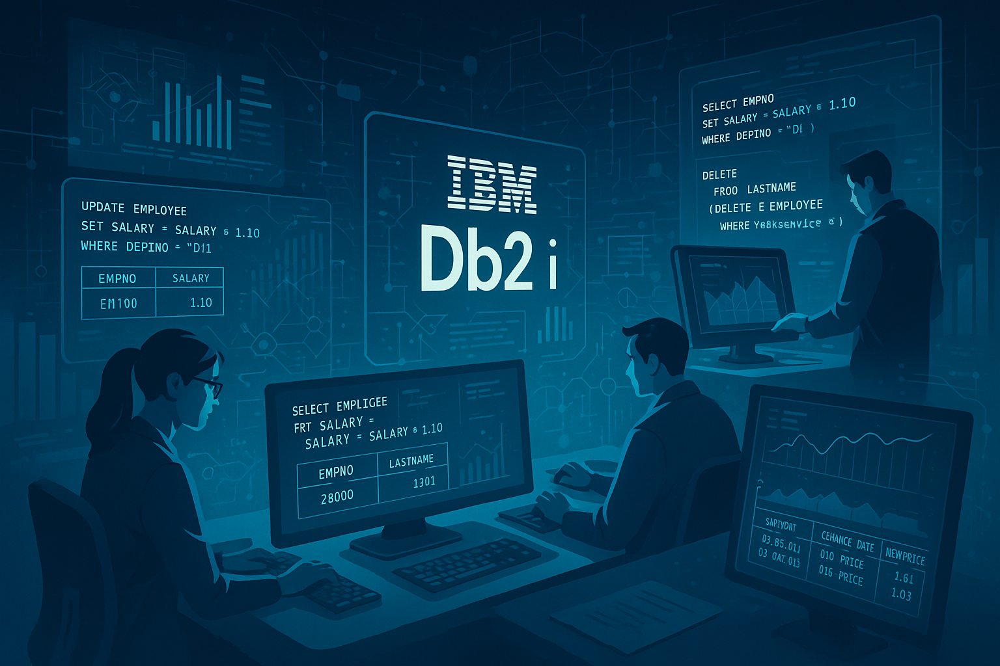

# Db2 for IBM i V7R6: smarter and more transparent SQL with new built-in functions

IBM i 7.6 brings one of the most anticipated improvements for those of us who work intensively with **Db2 for i**: support for using **`UPDATE`** and **`DELETE`** inside a **`data-change-table-reference`**. 
This opens the door to more compact, efficient queries with fewer intermediate steps. Below, we will explore in detail what this means, how it is used, and what benefits it brings to our development work.

<figure>

<figcaption>Fig 1. Enhanced Db2 for i features in 7.6.</figcaption>
</figure>

## What is a `data-change-table-reference`?
In SQL, a **data-change-table-reference** is a feature that **allows you to return the set of rows affected by a data-modification statement (`INSERT`, `UPDATE`, or `DELETE`) within the same statement**, without needing to run an additional query.

On IBM i, this capability already existed for `INSERT` for years, but **starting with version 7.6 it is also extended to `UPDATE` and `DELETE`**, which makes it much more powerful.

It is used together with the constructs:
- `FINAL TABLE` → Returns the values **after** the modification.
- `OLD TABLE` → Returns the values **before** the modification.

This is especially useful when we need to:
- **Audit changes**.
- **Feed another table** with the modified/deleted data.
- **Integrate processes** in real time that depend on those changes.
- **Reduce query execution rounds** (improving performance).

## 👨‍💻 Basic syntax
The syntax for using `UPDATE` and `DELETE` with a data-change-table-reference is similar to that of `INSERT`, but with the appropriate keywords:

**`UPDATE` clause with `FINAL TABLE`**
```sql
SELECT column1, column2
FROM FINAL TABLE (
    UPDATE table_name
       SET column1 = value1, column2 = value2
     WHERE condition
)
```

**`DELETE` clause with `OLD TABLE`**
```sql
SELECT column1, column2
FROM OLD TABLE (
    DELETE FROM table_name
     WHERE condition
)
```

## 💻 Practical examples

### Example 1 – UPDATE returning data
```sql
SELECT EMPNO, SALARY
FROM FINAL TABLE (
    UPDATE EMPLOYEE
       SET SALARY = SALARY * 1.10
     WHERE DEPTNO = 'D11'
)
```
- Increases the salary of all employees in department D11 by 10%.
- Immediately returns the employee number and their new salary.
- Ideal for notifying the user or logging changes in real time.


### Example 2 – DELETE with a log of deleted data
```sql
SELECT EMPNO, LASTNAME
FROM OLD TABLE (
    DELETE FROM EMPLOYEE
     WHERE YEARSERVICE < 1
)
```
- Deletes employees with less than one year at the company.
- Returns their number and identifier for auditing or logging.
- Useful for keeping a record of who was deleted without additional steps.
- Lets you easily record the deleted data into an audit table if desired.


### Example 3 – UPDATE with automatic auditing
```sql
INSERT INTO PRICE_LOG (PRODUCT_ID, OLD_PRICE, NEW_PRICE, CHANGE_DATE)
SELECT PRODUCT_ID, OLD_PRICE, PRICE, CURRENT_DATE
FROM FINAL TABLE (
    UPDATE PRODUCTS
       SET OLD_PRICE = PRICE,
           PRICE = PRICE * 1.05
     WHERE CATEGORY = 'ELECTRONICS'
)
```
- Raises the price of electronics products by 5%.
- Saves the old price, the new price, and the date in `PRICE_LOG`.
- Enables auditing of price changes without additional queries.
- Makes it easier to track price changes over time.
- Ideal for complying with price transparency regulations.


### Example 4 – DELETE with archiving
```sql
INSERT INTO SALES_ARCHIVE (ORDER_ID, CUSTOMER_ID, SALE_DATE, AMOUNT)
SELECT ORDER_ID, CUSTOMER_ID, SALE_DATE, AMOUNT
FROM OLD TABLE (
    DELETE FROM SALES
     WHERE SALE_DATE < CURRENT_DATE - 2 YEARS
)
```
- Deletes sales older than 2 years.
- Saves that data in `SALES_ARCHIVE` before deleting it.
- Lets you keep a sales history without taking up space in the main table.
- Makes it easier to comply with data retention policies.
- Ideal for keeping the database clean and optimized without losing historical information.


### Example 5 – UPDATE with personalized promotions
```sql
SELECT CUSTOMER_ID, POINTS
FROM FINAL TABLE (
    UPDATE CUSTOMERS
       SET POINTS = POINTS + 100
     WHERE LAST_PURCHASE_DATE >= CURRENT_DATE - 30 DAYS
)
```
- Adds 100 points to customers who were active in the last month.
- Returns their data for follow-up or marketing campaigns.
- Lets you adjust promotions in real time without additional queries.
- Makes it easier to personalize offers and rewards for active customers.
- Ideal for loyalty programs that require frequent updates.


## 👍 Key benefits of this improvement

The ability to use **`UPDATE`** and **`DELETE`** inside a **data-change-table-reference** in IBM i 7.6 is not just a cosmetic improvement in SQL; it is a **functional and performance optimization** that directly impacts how we develop, integrate, and audit data.

### 1. Fewer round trips to the server and less latency
- Before: you needed two queries (modification + reading of results).  
- Now: a single statement performs both tasks.
- Benefit: fewer client-server trips, lower latency, and better performance, especially in batch.

### 2. Simplified auditing and traceability
- You can capture data **before** (`OLD TABLE`) and **after** (`FINAL TABLE`) the change.
- Ideal for regulated sectors such as banking or healthcare.
- Makes change logs easier without intermediate steps.

### 3. Direct integration with other processes or APIs
- Useful for REST APIs and ETL that need to return modified results in real time.
- Avoids additional queries in integrations.
- Improves the efficiency of applications that depend on immediately updated data.

### 4. Cleaner and more maintainable code
- Fewer queries → fewer lines of code → less complexity.
- Reduces the risk of inconsistencies and errors.
- Makes SQL code easier to read and maintain.

### 5. Better performance and fewer locks
- Everything happens within the same SQL operation.
- Reduces lock-retention time and improves concurrency.
- Ideal for bulk operations where locking can be a problem.

### 6. Ideal for batch and bulk processes
- Lets you modify data and generate reports in a single operation.
- Eliminates the need for auxiliary temporary tables.
- Makes data cleanup and database maintenance easier.

### 7. Flexibility for complex operations
- You can combine multiple modifications and reads in a single statement.
- Allows more advanced logic without complicating the code.


## 💡 Real-world use ideas
### - **Accounting close processes**  
  Adjust balances and automatically record the movements in a single step.
  Helps avoid inconsistencies between update and query steps.
  Better organizes accounting data and improves traceability.

### - **Integrations with third-party APIs**  
  Return the just-modified data in the response, avoiding additional queries.
  Speeds up data synchronization between systems.
  Improves the efficiency of integrations by reducing latency.

### - **Bulk data cleanup with traceability**  
  Delete obsolete records while automatically saving what was deleted in an archive table.
  Lets you keep a data history without taking up space in the main table.
  Makes audits and regulatory compliance easier.

### - **Data migrations or loads**  
  Update fields and return details for immediate validations.
  Lets you verify results without additional steps.
  Reduces the risk of errors in migrations by keeping everything in a single operation.

### - **Batch programs with automatic reporting**  
  Adjust inventories, recalculate points, or correct inconsistencies and generate an instant report.
  Lets you generate change reports without additional queries.
  Provides a clear view of the affected data in real time.

### - **Internal audits and regulatory compliance**  
  Record values before and after each change for full traceability.
  Makes audits and compliance reviews easier.
  Improves transparency in data-change processes.


## ⚠️ Usage precautions and aspects to consider
Although this feature is very powerful, improper use can cause performance problems or unexpected results. Keep the following in mind:

### 1. **Filter the affected rows properly**  
   ✅ An `UPDATE` or `DELETE` without a `WHERE` clause or with non-specific filters can impact large volumes of data and generate extensive locks.  
   ✅ Always review the set of records that will be affected before running it.

### 2. **Monitor the impact on the network and the client**  
   ✅ Returning too many modified rows can overload the network or the application consuming the result.  
   ✅ If the set is very large, consider paging it or exporting it to a work table.

### 3. **Evaluate the execution cost**  
   ✅ The engine must process both the modification and the generation of the result.  
   ✅ In bulk operations, this can be more expensive than modifying and reading in separate steps if you do not need all the affected data.
   ✅ Use `EXPLAIN` to analyze the execution plan and optimize the query.

### 4. **Locks and concurrency**  
   ✅ Although the locking is shorter than with two separate queries, a bulk `UPDATE` or `DELETE` still holds locks that can affect other processes.  
   ✅ Schedule these operations in low-concurrency windows or in batch.
   ✅ Consider using appropriate isolation levels to minimize conflicts.

### 5. **Resource consumption in audit tables**  
   ✅ If you insert the results directly into log or archive tables, check indexes and maintenance strategies to avoid long-term performance degradation.

### 6. **Testing before production**  
   ✅ In critical environments, test the query in a controlled environment to validate that it returns exactly the expected data and that the execution plan is optimal.


## 🏁 Conclusion
The extension of **`data-change-table-reference`** to `UPDATE` and `DELETE` in IBM i 7.6 represents much more than a technical improvement: it is a change in the way we think about and write SQL in Db2 for i environments.

From the **developer's** perspective, this feature:
- Drastically reduces the amount of SQL code and logic in the application.
- Allows you to write more expressive, readable, and maintainable queries.
- Makes it easier to implement audits, integrations, and reports without additional temporary structures.

For the **database administrator (DBA)**:
- Reduces the need to monitor complex scripts that combine multiple statements.
- Makes it easier to guarantee traceability and comply with data retention regulations.
- Allows running maintenance and data-cleanup processes with full control over what is affected.

On the **business** side:
- Speeds up execution times in critical processes such as accounting closes, API integrations, data migrations, or bulk loads.
- Reduces the risk of errors in production environments by avoiding inconsistencies between separate execution steps.
- Optimizes infrastructure resources by minimizing client-server trips and redundant operations.

📌 **In summary**:  
This improvement is a clear example of how IBM continues to evolve the **IBM i** ecosystem with modern features, while maintaining its focus on performance, security, and reliability.  
Adopting these new capabilities in real projects means **less complexity, faster development, and greater robustness in processes**.

That said, like any powerful tool, **its use must be strategic**, following good practices for filtering, auditing, and performance monitoring to avoid negative impacts.  

In the hands of a team that understands its potential and limitations, this improvement becomes a **key enabler for modernizing applications and optimizing operations** on IBM i.
