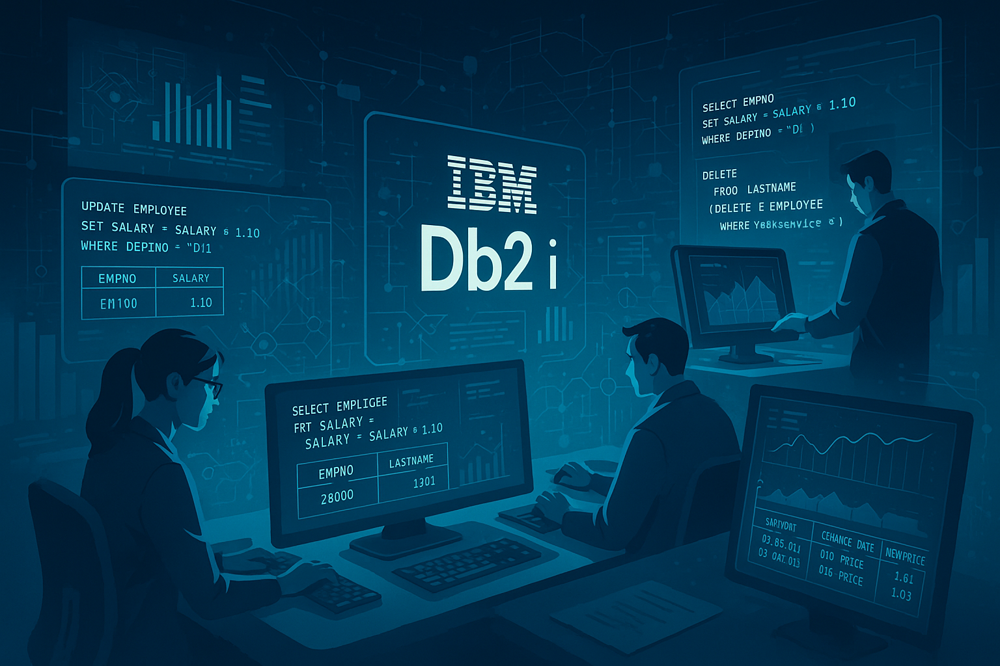

# Db2 for IBM i V7R6: SQL más inteligente y transparente con nuevas funciones incorporadas

IBM i 7.6 trae una de las mejoras más esperadas para quienes trabajamos intensamente con **Db2 for i**, el soporte para usar **`UPDATE`** y **`DELETE`** dentro de una **`data-change-table-reference`**. 
Esto abre la puerta a consultas más compactas, eficientes y con menos pasos intermedios. A continuación, exploraremos en detalle qué significa esto, cómo se usa y qué beneficios aporta a nuestros desarrollos.

<figure>

<figcaption>Fig 1. Funcionalidades mejoradas de Db2 for i en 7.6.</figcaption>
</figure>

## ¿Qué es una `data-change-table-reference`?
En SQL, una **data-change-table-reference** es una funcionalidad que **permite devolver el conjunto de filas afectadas por una sentencia de modificación de datos (`INSERT`, `UPDATE` o `DELETE`) en la misma instrucción**, sin necesidad de ejecutar una consulta adicional.

En IBM i, esta capacidad ya existía para `INSERT` desde hace años, pero **a partir de la versión 7.6 también se extiende a `UPDATE` y `DELETE`**, lo que la hace mucho más poderosa.

Se utiliza junto con las construcciones:
- `FINAL TABLE` → Devuelve los valores **después** de la modificación.
- `OLD TABLE` → Devuelve los valores **antes** de la modificación.

Esto es especialmente útil cuando necesitamos:
- **Auditar cambios**.
- **Alimentar otra tabla** con los datos modificados/eliminados.
- **Integrar procesos** en tiempo real que dependan de esos cambios.
- **Reducir rondas** de ejecución de consultas (mejorando rendimiento).

## 👨‍💻 Sintaxis básica
La sintaxis para usar `UPDATE` y `DELETE` con una data-change-table-reference es similar a la de `INSERT`, pero con las palabras clave adecuadas:

**Cláusula `UPDATE` con `FINAL TABLE`**
```sql
SELECT column1, column2
FROM FINAL TABLE (
    UPDATE table_name
       SET column1 = value1, column2 = value2
     WHERE condition
)
```

**Cláusula `DELETE` con `OLD TABLE`**
```sql
SELECT column1, column2
FROM OLD TABLE (
    DELETE FROM table_name
     WHERE condition
)
```

## 💻 Ejemplos prácticos

### Ejemplo 1 – UPDATE con retorno de datos
```sql
SELECT EMPNO, SALARY
FROM FINAL TABLE (
    UPDATE EMPLOYEE
       SET SALARY = SALARY * 1.10
     WHERE DEPTNO = 'D11'
)
```
- Aumenta un 10% el salario de todos los empleados del departamento D11.
- Devuelve inmediatamente el número de empleado y su nuevo salario.
- Ideal para notificar al usuario o registrar cambios en tiempo real.


### Ejemplo 2 – DELETE con log de datos eliminados
```sql
SELECT EMPNO, LASTNAME
FROM OLD TABLE (
    DELETE FROM EMPLOYEE
     WHERE YEARSERVICE < 1
)
```
- Borra a los empleados con menos de un año en la empresa.
- Devuelve su número e identificador para auditoría o log.
- Útil para mantener un registro de quién fue eliminado sin pasos adicionales.
- Permite registrar fácilmente los datos eliminados en una tabla de auditoría si se desea.


### Ejemplo 3 – UPDATE con auditoría automática
```sql
INSERT INTO PRICE_LOG (PRODUCT_ID, OLD_PRICE, NEW_PRICE, CHANGE_DATE)
SELECT PRODUCT_ID, OLD_PRICE, PRICE, CURRENT_DATE
FROM FINAL TABLE (
    UPDATE PRODUCTS
       SET OLD_PRICE = PRICE,
           PRICE = PRICE * 1.05
     WHERE CATEGORY = 'ELECTRONICS'
)
```
- Sube en un 5% el precio de productos electrónicos.
- Guarda el precio viejo, el nuevo y la fecha en `PRICE_LOG`.
- Permite auditoría de cambios de precios sin consultas adicionales.
- Facilita el seguimiento de cambios de precios a lo largo del tiempo.
- Ideal para cumplir con normativas de transparencia en precios.


### Ejemplo 4 – DELETE con archivado
```sql
INSERT INTO SALES_ARCHIVE (ORDER_ID, CUSTOMER_ID, SALE_DATE, AMOUNT)
SELECT ORDER_ID, CUSTOMER_ID, SALE_DATE, AMOUNT
FROM OLD TABLE (
    DELETE FROM SALES
     WHERE SALE_DATE < CURRENT_DATE - 2 YEARS
)
```
- Borra ventas de más de 2 años.
- Guarda esos datos en `SALES_ARCHIVE` antes de eliminarlos.
- Permite mantener un historial de ventas sin ocupar espacio en la tabla principal.
- Facilita el cumplimiento de políticas de retención de datos.
- Ideal para mantener la base de datos limpia y optimizada sin perder información histórica.


### Ejemplo 5 – UPDATE con promociones personalizadas
```sql
SELECT CUSTOMER_ID, POINTS
FROM FINAL TABLE (
    UPDATE CUSTOMERS
       SET POINTS = POINTS + 100
     WHERE LAST_PURCHASE_DATE >= CURRENT_DATE - 30 DAYS
)
```
- Agrega 100 puntos a clientes activos en el último mes.
- Devuelve sus datos para seguimiento o campañas de marketing.
- Permite ajustar promociones en tiempo real sin consultas adicionales.
- Facilita la personalización de ofertas y recompensas para clientes activos.
- Ideal para programas de fidelización que requieren actualizaciones frecuentes.


## 👍 Beneficios clave de esta mejora

La posibilidad de usar **`UPDATE`** y **`DELETE`** dentro de una **data-change-table-reference** en IBM i 7.6 no es solo una mejora estética en SQL; es una **optimización funcional y de rendimiento** que impacta directamente en cómo desarrollamos, integramos y auditamos datos.

### 1. Menos rondas al servidor y menos latencia
- Antes: requerías dos consultas (modificación + lectura de resultados).  
- Ahora: una sola sentencia realiza ambas tareas.
- Beneficio: menos viajes cliente-servidor, menor latencia y mejor rendimiento, sobre todo en batch.

### 2. Auditoría y trazabilidad simplificadas
- Puedes capturar datos **antes** (`OLD TABLE`) y **después** (`FINAL TABLE`) del cambio.
- Ideal para sectores regulados como banca o salud.
- Facilita logs de cambios sin pasos intermedios.

### 3. Integración directa con otros procesos o APIs
- Útil para REST APIs y ETL que necesitan devolver resultados modificados en tiempo real.
- Evita consultas adicionales en integraciones.
- Mejora la eficiencia de las aplicaciones que dependen de datos actualizados inmediatamente.

### 4. Código más limpio y mantenible
- Menos consultas → menos líneas de código → menor complejidad.
- Reduce riesgo de inconsistencias y errores.
- Facilita la lectura y mantenimiento del código SQL.

### 5. Mejor rendimiento y menos bloqueos
- Todo ocurre dentro de la misma operación SQL.
- Reduce el tiempo de retención de locks y mejora la concurrencia.
- Ideal para operaciones masivas donde el bloqueo puede ser un problema.

### 6. Ideal para procesos batch y masivos
- Permite modificar datos y generar reportes en una sola operación.
- Elimina la necesidad de tablas temporales auxiliares.
- Facilita la limpieza de datos y mantenimiento de bases de datos.

### 7. Flexibilidad para operaciones complejas
- Puedes combinar múltiples modificaciones y lecturas en una sola sentencia.
- Permite lógica más avanzada sin complicar el código.


## 💡 Ideas de uso real
### - **Procesos de cierre contable**  
  Ajustar saldos y registrar automáticamente los movimientos en un solo paso.
  Ayuda a evitar inconsistencias entre pasos de actualización y consulta.
  Organiza mejor los datos contables y mejora la trazabilidad.

### - **Integraciones con APIs de terceros**  
  Devolver en la respuesta los datos recién modificados, evitando consultas adicionales.
  Acelera la sincronización de datos entre sistemas.
  Mejora la eficiencia de las integraciones al reducir latencia.

### - **Limpieza de datos masiva con trazabilidad**  
  Eliminar registros obsoletos guardando automáticamente lo borrado en una tabla de archivo.
  Permite mantener un historial de datos sin ocupar espacio en la tabla principal.
  Facilita auditorías y cumplimiento normativo.

### - **Migraciones o cargas de datos**  
  Actualizar campos y devolver detalles para validaciones inmediatas.
  Permite verificar resultados sin pasos adicionales.
  Reduce el riesgo de errores en migraciones al mantener todo en una sola operación.

### - **Programas batch con reporting automático**  
  Ajustar inventarios, recalcular puntos o corregir inconsistencias y generar reporte instantáneo.
  Permite generar informes de cambios sin consultas adicionales.
  Permite una visión clara de los datos afectados en tiempo real.

### - **Auditorías internas y cumplimiento normativo**  
  Registrar valores antes y después de cada cambio para trazabilidad total.
  Facilita auditorías y revisiones de cumplimiento normativo.
  Mejora la transparencia en los procesos de cambio de datos.


## ⚠️ Precauciones de uso y aspectos a considerar
Aunque esta funcionalidad es muy potente, su uso inadecuado puede generar problemas de rendimiento o resultados inesperados. Ten en cuenta lo siguiente:

### 1. **Filtra adecuadamente las filas afectadas**  
   ✅ Un `UPDATE` o `DELETE` sin `WHERE` o con filtros poco específicos puede impactar grandes volúmenes de datos y generar bloqueos extensos.  
   ✅ Siempre revisa el conjunto de registros que será afectado antes de ejecutar.

### 2. **Monitorea el impacto en la red y el cliente**  
   ✅ Devolver demasiadas filas modificadas puede sobrecargar la red o la aplicación que consume el resultado.  
   ✅ Si el conjunto es muy grande, evalúa paginar o exportar a una tabla de trabajo.

### 3. **Evalúa el costo de ejecución**  
   ✅ El motor debe procesar tanto la modificación como la generación del resultado.  
   ✅ En operaciones masivas, esto puede ser más costoso que modificar y leer en pasos separados si no necesitas todos los datos afectados.
   ✅ Usa `EXPLAIN` para analizar el plan de ejecución y optimizar la consulta.

### 4. **Bloqueos y concurrencia**  
   ✅ Aunque el bloqueo es más corto que en dos consultas separadas, un `UPDATE` o `DELETE` masivo sigue reteniendo locks que pueden afectar a otros procesos.  
   ✅ Planifica estas operaciones en ventanas de baja concurrencia o en batch.
   ✅ Considera el uso de niveles de aislamiento adecuados para minimizar conflictos.

### 5. **Consumo de recursos en tablas de auditoría**  
   ✅ Si insertas directamente los resultados en tablas de log o archivo, verifica índices y estrategias de mantenimiento para evitar degradación del rendimiento a largo plazo.

### 6. **Pruebas antes de producción**  
   ✅ En entornos críticos, prueba la consulta en un ambiente controlado para validar que devuelve exactamente los datos esperados y que el plan de ejecución es óptimo.


## 🏁 Conclusión
La ampliación de **`data-change-table-reference`** a `UPDATE` y `DELETE` en IBM i 7.6 representa mucho más que una mejora técnica: es un cambio en la forma de pensar y escribir SQL en entornos Db2 for i.

Desde la perspectiva del **desarrollador**, esta funcionalidad:
- Reduce drásticamente la cantidad de código SQL y lógica en la aplicación.
- Permite escribir consultas más expresivas, legibles y mantenibles.
- Facilita implementar auditorías, integraciones y reportes sin estructuras temporales adicionales.

Para el **administrador de bases de datos (DBA)**:
- Disminuye la necesidad de monitorear scripts complejos que combinan múltiples sentencias.
- Facilita garantizar trazabilidad y cumplir con regulaciones de retención de datos.
- Permite ejecutar procesos de mantenimiento y limpieza de datos con control total sobre lo afectado.

En el plano **de negocio**:
- Acelera tiempos de ejecución en procesos críticos como cierres contables, integraciones con APIs, migraciones de datos o cargas masivas.
- Reduce riesgos de errores en entornos productivos al evitar inconsistencias entre pasos de ejecución separados.
- Optimiza recursos de infraestructura al minimizar viajes cliente-servidor y operaciones redundantes.

📌 **En resumen**:  
Esta mejora es un ejemplo claro de cómo IBM sigue evolucionando el ecosistema **IBM i** con funcionalidades modernas, manteniendo su enfoque en rendimiento, seguridad y fiabilidad.  
Adoptar estas nuevas capacidades en proyectos reales significa **menos complejidad, más velocidad de desarrollo, y mayor robustez en los procesos**.

Eso sí, como toda herramienta poderosa, **su uso debe ser estratégico**, siguiendo buenas prácticas de filtrado, auditoría y monitoreo de rendimiento para evitar impactos negativos.  

En manos de un equipo que entiende su potencial y limitaciones, esta mejora se convierte en un **habilitador clave para modernizar aplicaciones y optimizar operaciones** en IBM i.