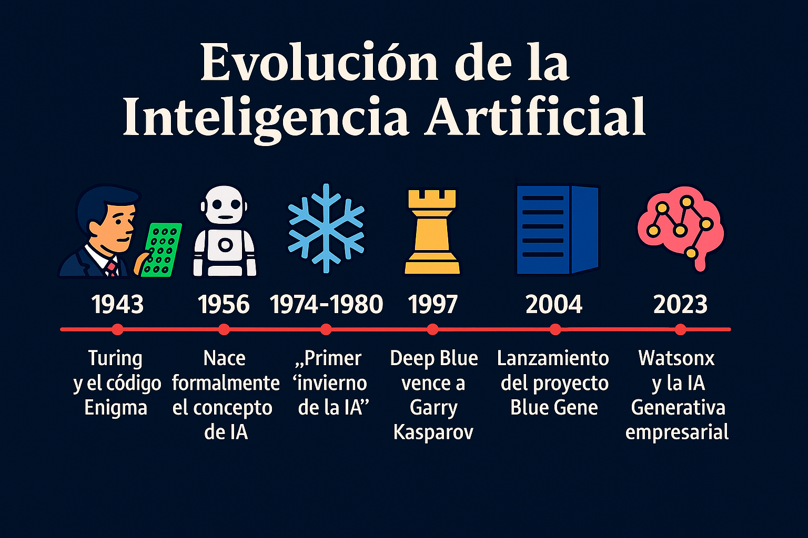
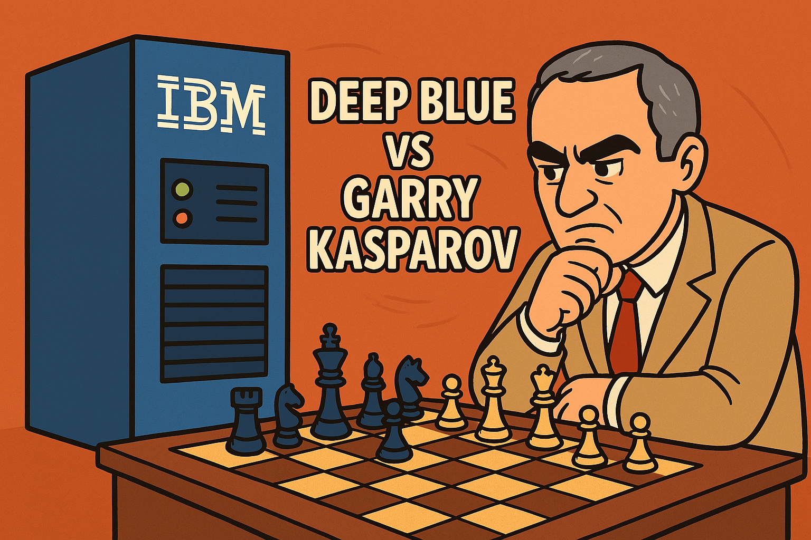
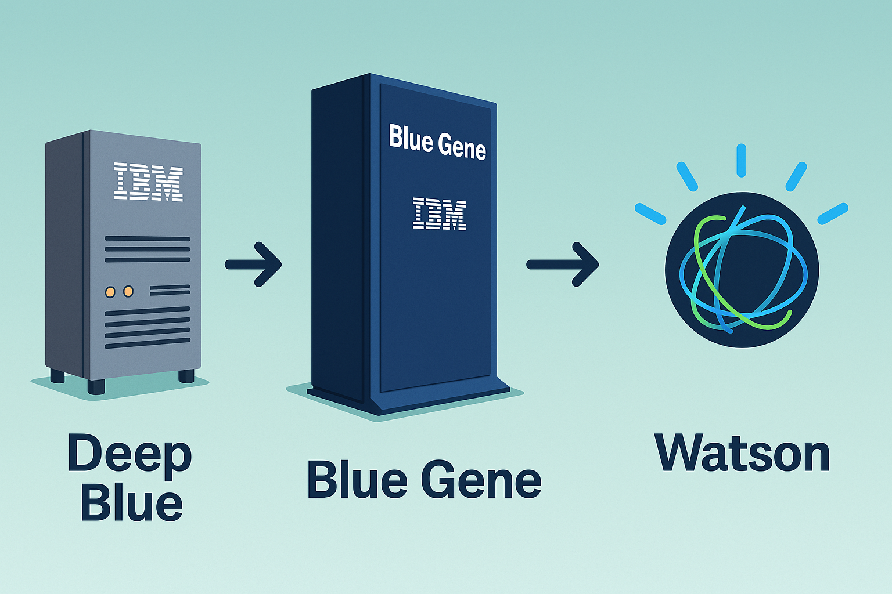

# The evolution of Artificial Intelligence: From the Enigma code to the era of Generative AI

The history of artificial intelligence is marked by milestones that transformed not only technology, but also the way we relate to machines.

<figure>

<figcaption>Fig 1. Timeline of the evolution of AI.</figcaption>
</figure>

It all began in the 1940s, when in 1943 **Warren McCulloch and Walter Pitts** proposed the first mathematical model of an artificial neural network called **MCP**. Which is a mathematical model of a biological neuron. The MCP model is also known as a threshold logic unit. Later, between the years 1945 and 1946, **Alan Turing** led the deciphering of the **Enigma** code during World War II. This was the first major step toward what we understand today as computational thinking and automated intelligence.

Decades later, and after a long period of slow progress and lack of investment known as the **"AI winter"**, **IBM** revolutionized the field with a moment that would mark a before and after.

## Deep Blue vs. Garry Kasparov: The moment that changed history

In May 1997, the world witnessed an unprecedented event: a machine defeated a world chess champion for the first time in an official series. The protagonist was **Deep Blue**, the supercomputer developed by IBM, which defeated the Russian grandmaster **Garry Kasparov**, considered one of the best chess players of all time.

<figure>

<figcaption>Fig 2. Deep Blue vs Garry Kasparov.</figcaption>
</figure>

The series consisted of **six games**. Deep Blue won **two**, Kasparov won **one**, and they tied **three**. The victory was decisive in the sixth game, when Deep Blue played with an aggressiveness that even made Kasparov think the machine must have received human help.

What was revolutionary was that Deep Blue did not use machine learning like modern AIs; it used **computational brute force**, evaluating up to **200 million positions per second**, based on a vast database of historical games and advanced heuristics.

This event was a turning point: for the first time, a machine defeated the human intellect in a terrain considered the pinnacle of logic and strategic reasoning.

Deep Blue demonstrated that machines could surpass humans in specific domains, opening the way to new generations of intelligent systems such as **Blue Gene**, **Watson**, and more recently **Watsonx**.

## From Deep Blue to Blue Gene

From **Deep Blue** a new vision was born: not just machines that play, but ones that help solve complex real-world problems. Thus the **Blue Gene** project was born, an initiative that drove supercomputing to unprecedented levels.

Unlike Deep Blue, designed for a specific task, Blue Gene was conceived to research topics such as:
- Molecular biology
- Protein simulation
- Disease modeling

**Blue Gene not only raised processing capacity, but paved the way for something even more ambitious: IBM Watson.**

<figure>

<figcaption>Fig 3. From Deep Blue to Blue Gene ending in Watson.</figcaption>
</figure>

## The birth of Watson

In 2011, **Watson** surprised the world by defeating the human champions of the **Jeopardy!** program. This time not with computational brute force, but with something much more human:
- Understanding of **natural language**
- Semantic analysis
- Interpretation of ambiguous questions and cultural references

Watson represented the birth of **cognitive AI**.

Later, Watson adapted to industries such as health, banking, and government, helping in complex decision-making, analysis of unstructured data, and improvement of customer service.

## Microsoft launches Azure Machine Learning
In 2015, **Microsoft** launched **Azure Machine Learning**, a platform that democratized access to artificial intelligence. Azure Machine Learning allowed companies of all sizes to create, train, and deploy machine learning models in the cloud, facilitating the adoption of AI across various industries. 

Later, in 2016 **Microsoft** launched **Azure Cognitive Services**, a collection of APIs and services that allowed developers to integrate artificial intelligence capabilities into their applications without needing to be machine learning experts. This marked a milestone in the accessibility of AI, allowing companies of all sizes to harness the power of machine learning and artificial intelligence in their daily operations. And in 2019, **Microsoft** announced an alliance with **OpenAI**, with an investment of $1 billion to drive **responsible AI** and with this take AI to a new level, integrating advanced language models into its products and services.

With this, in 2021, **Microsoft** launched **Azure OpenAI Service**, allowing developers to access advanced language models such as **GPT-3 and DALL-E** through the **Azure** platform. This marked a milestone in the democratization of generative AI, allowing companies to create innovative and personalized applications using state-of-the-art language models.

By 2023, **Microsoft** launched **Copilot**, a tool that integrates **generative AI** into productivity applications such as **Word and Excel**, allowing users to generate content, automate tasks, and improve efficiency in their daily work. This represents a significant advance in the way people interact with technology, making AI an integral part of their daily workflow. And in the same year **Microsoft** launched **GitHub Copilot**, a tool that uses generative AI to help developers write code more efficiently, suggesting code fragments and completing repetitive tasks. This marks a significant advance in the way developers interact with technology, making AI an integral part of their daily workflow.

## Oracle Cloud Infrastructure: AI optimized for enterprise performance

With the advances outlined above, **Oracle** could not stay behind; however, it has approached artificial intelligence from a different perspective, centered on the integration of AI into critical enterprise applications and the optimization of performance in the cloud. With **Oracle Cloud Infrastructure (OCI)**, the company has developed a high-performance computing environment that facilitates the training and inference of AI models in a cost-effective and scalable way.

OCI includes services such as **OCI Data Science**, which allows data scientists to create and deploy machine learning models, and **OCI AI Services**, which provides pre-trained models for computer vision, text analysis, speech recognition, and more. These services are aimed at solving specific real-world problems in **areas such as finance, logistics, human resources, and health**.

One of Oracle's key differentiators is its **focus on cost/performance and interoperability** with open-source tools such as **TensorFlow, PyTorch, and scikit-learn**. In addition, it has incorporated AI within its **Oracle Autonomous Database**, allowing automatic optimizations without human intervention.

By 2023, Oracle launched **Oracle Database 23ai**, a version that integrates generative AI and machine learning capabilities directly into the database, allowing developers and data scientists to create smarter and more efficient applications. This version includes improvements in task automation, query optimization, and predictive analysis, which facilitates data-driven decision-making in real time. With this, Oracle introduces **AI Select**, which allows users to perform queries in natural language and obtain precise and relevant results, improving the user experience and facilitating access to information.

## The era of Generative AI and the arrival of Watsonx

Today we are living a new stage: that of **Generative AI** and **foundation models**. In this context, **IBM launches Watsonx**, an enterprise platform designed to create, scale, and govern artificial intelligence solutions in a responsible and efficient manner.

### What is Watsonx?

Watsonx is a suite that combines:
- **watsonx.ai**: the development studio for foundation models and generative AI.
- **watsonx.data**: a data platform prepared for AI, optimized for analytics and governance.
- **watsonx.governance**: tools to govern the use of AI models, focused on compliance and trust.

## IBM Watsonx Assistant

Within this evolution, **Watsonx Assistant** stands out, an enterprise solution that allows building virtual assistants and intelligent chatbots with advanced capabilities for understanding and responding in natural language.

Watsonx Assistant allows:
- Integrating multichannel conversations (web, mobile, messaging, voice).
- Training with business-specific data.
- Delivering more natural, precise, and contextualized experiences.
- Scaling securely under principles of privacy and traceability.

All of this backed by models trained with enterprise data, robust governance, and adaptability to multiple industries.

## Conclusion

From **Enigma to Watsonx**, passing through **Deep Blue**, **Blue Gene**, **Azure OpenAI Service**, **Microsoft Copilot and GitHub Copilot**, **OCI AI Services**, **Oracle AI Select**, and **Watson**, the history of artificial intelligence is not just a line of code, it is a line of evolution.

An evolution that does not seek to replace the human being, but rather to **enhance their thinking, decisions, and creativity**.

AI has ceased to be a promise of the future, to become a strategic ally of the present.
